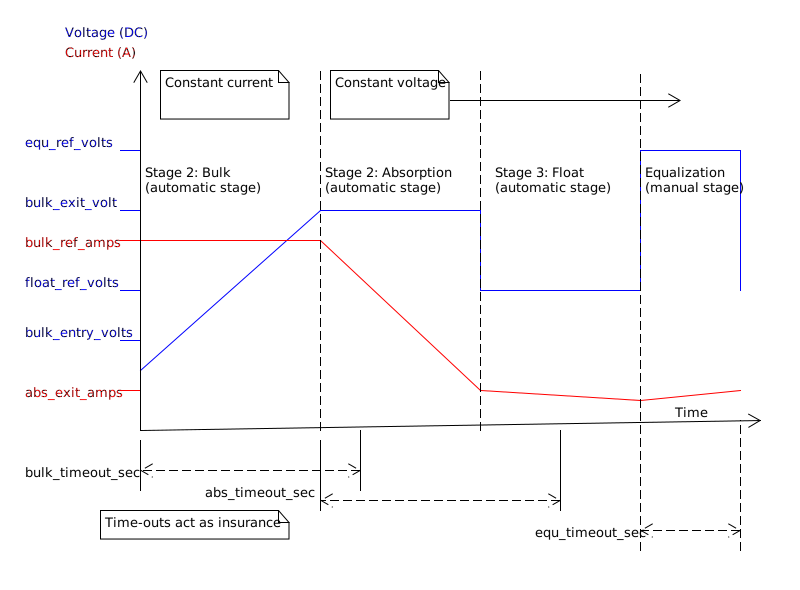
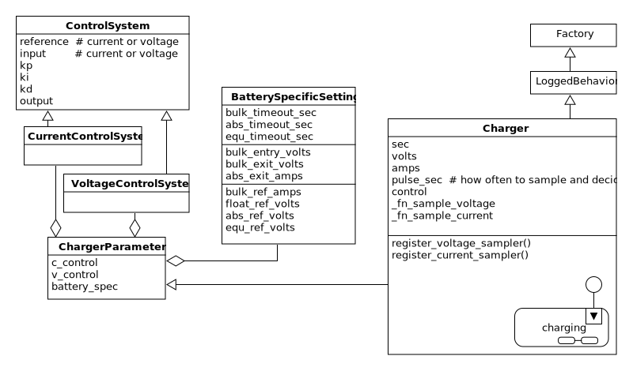

.. _batterychargingexample-battery-charging-example:

.. role:: new_spec
  :class: new_spec

Distributed Battery Charging Example
====================================
Lead acid batteries are very heavy.  But they are cheaper than lithium ion
batteries and this is why they are used in a lot of off-grid electrical systems.

.. image:: https://krisdedecker.typepad.com/.a/6a00e0099229e8883301bb0820445e970d-pi
    :target: https://www.lowtechmagazine.com/2015/05/sustainability-off-grid-solar-power.html
    :align: center

A large lead-acid battery is made up of a set of smaller lead-acid batteries
connected together in series.  These smaller batteries are called cells.

.. image:: _static/cells_in_series.PNG
    :target: https://chargetek.com/images/pdfs/equal.pdf
    :align: center

Each cell contains two terminals, and each terminal is connected to a plate that
reaches down into a bath of sulphuric acid (H2SO4) and water (H2O).  There is a
positive and a negative terminal.  The positive terminal of a cell is made up of
lead dioxide (PbO2) and the negative terminal is made out of lead (Pb).

A battery is a chemical reaction that wants to happen, but can't until there is
a path for electrons to flow from one material to another.  As a result, there
is a voltage potential expressed across the positive and negative terminals of
the battery.  If an electrical device is connected across these terminals an
electron path is made, the battery can begin its chemical reaction.  As a side
effect the electrical device is powered on.  The flow of current leaves the
positive terminal and enters the negative terminal.  When this happens the
battery is said to discharge.

.. image:: https://circuitglobe.com/wp-content/uploads/2017/01/lead-acid-cell-112.jpg
    :target: https://circuitglobe.com/lead-acid-battery.html
    :align: center

Charging of a battery occurs when current is forced to flow in the opposite
direction: current leaves the negative terminal and enters the positive
terminal. This causes the chemical reaction to reverse, sequestering the
electrons back into the various materials of the battery.  You can charge a
battery with a battery charger.

.. image:: https://circuitglobe.com/wp-content/uploads/2017/01/recharging-of-lead-acid-battery.jpg
    :target: https://circuitglobe.com/lead-acid-battery.html
    :align: center

.. note::
  
   If you aren't familiar with the terminology of electricity, imagine a water
   tower.  The water is trying to get to the ground, due to gravity,
   but it is held in place by the walls of the tower.  This means that there is a
   potential for the water to flow, the height of the tower determines how much
   energy is stored within it.  The higher the tower, the higher the potential
   energy.  Voltage is analogous to height of the held water in the tower.

   .. image:: https://encrypted-tbn0.gstatic.com/images?q=tbn:ANd9GcTtYw4fJS9o3meW9yv5ZGJ5enzVpyJ0sfw5L45UifmATQERiArD
       :target: https://encrypted-tbn0.gstatic.com/images?q=tbn:ANd9GcTtYw4fJS9o3meW9yv5ZGJ5enzVpyJ0sfw5L45UifmATQERiArD
       :align: center

   Now imagine connecting a pipe from the tower to the ground, and letting the
   water flow through it.  This flow is like current in an electrical system, and
   the pipe width would limit that flow, so that would be like an electrical load.

   Our battery is like a water tower; if no pipe is connected, current can't flow.
   If a pipe is connected, it can, and the energy of the battery reduces just like
   the potential energy of our water tower would reduce as it's water leaves it
   through a pipe.  If you were to push the current back into the pipe, by
   connecting a higher water tower, or by just driving the current back up the
   tube with a pump, you would cause the potential of the water tower to increase.
   We would be charging the tower.

   As mentioned before, a battery is made up of stacking cells in series.  Think of
   that as a very tall water tower made up of stacked shorter water towers.  You
   can increase their potential energy by stacking them this way.

As a lead acid battery is discharged, a crust of lead sulphate (PbSO4) forms on the
plates.  This crust reduces the surface area of the lead plates exposed to the
acid, reducing its ability to react and drive current.  

.. image:: https://stevedmarineconsulting.com/wp-content/uploads/2019/06/082504179.jpg
    :target: https://stevedmarineconsulting.com/sulfation-too-many-batteries-die-an-unnecessarily-early-death-from-this-phenomenon/
    :align: center

There are electrical charging techniques which can remove this lead sulphate
(PbSO4), by reversing the chemical reaction, and even sometimes bubbling the
acid.  These bubbles physically massage away the lead sulphate crystals,
dislodging them from the plate, dropping them into the acid bath where they can
break down, crystallizing their lead atoms back onto the plates.

An electrical charger can control one of two things, it can act to control
current flow or it can control the voltage across the terminals of the
battery.  If it holds the current constant, electrons are pushed back into the
battery, which will cause the voltage of the battery to slowly rise over time.

If the charger holds the voltage at a higher potential than the battery voltage,
current will flow into the battery.  At first it will flow quickly, but over
time the battery's ability to accept electrons will be limited by the amount of
material within it, causing the current flow to subside.

.. note::
   
   Thinking back to the water tower.  If we re-filled our water tower using a
   pump to push a constant amount of water, this would be like controlling the
   current being pushed into the battery.  If we connected a higher water tower,
   and let it passively drain some of its water into the lower tower, this would
   be like controlling the voltage of our charger.  Together the two towers
   would have the potential energy of the taller tower, so it's voltage would be
   set to this.

When you hear people talk about the stages of charging of a battery, they are
talking about either a constant current or a constant voltage charging
technique.  In two stage charging, a constant current technique starts the
charging process, then once the battery voltage rises to a high enough level, a
constant voltage technique takes over.  In three stage charging, the third stage
is a constant voltage technique, but held at a lower value than the second
stage.  A forth stage of charging can be applied very infrequently, it's called
equalization.  It is a constant voltage technique that applies such a high
voltage across the battery terminals, that the acid boils, and explosive
hydrogen is expelled from the batteries (this is why battery rooms need to be
well vented).

There are arbitrary naming conventions that have been applied to these stages of
charging:

+---------------------+----------+----------+----------------------------------+
| Name of Stage       | Constant | Constant | Notes                            |
|                     | Current? | Voltage? |                                  |
+=====================+==========+==========+==================================+
| *bulk stage*        |  yes     | no       | 80 percent of charge put back    |
+---------------------+----------+----------+----------------------------------+
| *absorption stage*  |  no      | yes      |                                  |
+---------------------+----------+----------+----------------------------------+
| *float stage*       |  no      | yes      | voltage is lower than absorption |
+---------------------+----------+----------+----------------------------------+
| *equalization*      |  no      | yes      | voltage is very high             |
+---------------------+----------+----------+----------------------------------+

A charger is typically called one of these:

+-----------------------+--------------------------------------------------------+
| Name of Charger       |  Meaning                                               |
+=======================+========================================================+
| *trickle charger*     |  float stage only                                      |
+-----------------------+--------------------------------------------------------+
| *two stage charger*   |  bulk followed by the float stage                      |
+-----------------------+--------------------------------------------------------+
| *three stage charger* |  bulk followed by absorption, followed by float        |
+-----------------------+--------------------------------------------------------+

The *equalization* stage is so dangerous that it doesn't happen automatically,
it has to be manually set by the user.

It has been found that when you charge batteries with three stage chargers, the
process of plate sulphation is slower than it would be with a two stage charger.
If such a charger is also equipped with the equalization feature, a knowledgeable
user can keep their battery's healthy for a long time.

Let's look at the three stage charging electrical profile:

.. image:: _static/three_stage_charging_all.svg
    :target: _static/three_stage_charging_all.pdf
    :align: center

That diagram is not going to win any graphic design awards, but it shows you
everything you need to know about building a charger.  We need two control
systems, one that can hold current to a constant level and one that can hold the
voltage to a constant level.  We need to track time, so that we can exit a stage
if the charger has been in it too long.  And we need to be able to set some
parameters based on the kind of battery we are attached too.

The bulk stage is where the battery is charged quickly.  Charging the battery is
what our customer's care about the most, but battery maintenance is very
important too.  

The charger will have a rated current, the more money we put into its hardware,
the higher this current can be.  The problem is if we over-build this, our
charger will be too big for a lot of systems and these customers will buy
someone else's product because it is cheaper than ours.

A way to solve this problem is to build a charger that can be ganged together
with more versions of itself.  That way we can keep the costs low, and if a
customer needs a lot of current, they can buy as many of our products as they
need and gang them together in parallel. 

The added benefit of this approach is that if one of their chargers fails, there
batteries can still be charged by the others in their system.  It offers them
some resilience.  If they felt so inclined, they could actually over-build their
charging system to increase their system's reliability (think military
contracts).  Batteries are expensive, heavy and dangerous, and chargers are
relatively cheap and easy to work with and install.

Another problem our customers have is with the parameters.  We can't expect them
to figure out what all of the values and time-outs mean.  They really don't
care, we need to eat this complexity on their behalf, especially if we are
expecting them to buy a bunch of our products for a single installation.

----

Often the hardest thing to do on a project is to pack knowledge into a
specification (spec).  The specification should be simple and full of pictures,
if it isn't nobody will look a it, and nobody will change it to match what the
system actually does.  Engineers talk with pictures, because pictures transmit
more information than writing.  Pictures also illicit conversation which moves
relevant personal knowledge into project knowledge:  When you are talking to
technical people they often forget that they know a lot of things you don't
know. If you are both pointing to and talking about a picture, you will both
learn more about each others contribution and thinking in regards to the
project.  Once things are discovered from one another they should be packed into
a couple of notes and pictures and added to the spec.

The spec should be short enough that it can be read and understood by everyone
involved.  If specific drawings are too technical for some members, efforts
should be made to explain what they mean so everyone can participate in the
conversation.  Here is an example of such a conversation to discover how to
build a single three stage battery charger.  But if you want to skip the
conversation and just jump to the design, click :ref:`here <batterychargingexample-single-unit-three-stage-battery-charger-design>`.

----

.. note::

  New knowledge and things said by other imagined people will be
  :new_spec:`highlighted.`

Specification (1):

* :new_spec:`A charger has two control systems: constant current and constant voltage.`
* :new_spec:`The bulk stage is a constant current control technique.`
* :new_spec:`The absorption, float and equalization stages are constant voltage control
  techniques.`

.. image:: _static/three_stage_charging_chart_1.svg
    :target: _static/three_stage_charging_chart_1.pdf
    :align: center

I show the above diagram to the :new_spec:`electrical engineer` I'm working with, and he says,
:new_spec:`Yeah, it looks good, but can you make sure the two control systems are
generalizeable?`  What do you mean?  :new_spec:`Well, I want to just give the current
control system a reference current and it will drive the device to output that
current.  The same idea applies to the voltage controller.`  He continues,
:new_spec:`A control system is just some math, you give it a goal called a "reference".
then you give it the value of the thing it is trying to control, call this the
"input" and the math will drive the "output" towards the goal.  We connect
this output value to our hardware and it will behave as expected.  I want to use
the same math to solve the current and voltage control problems, so give me a
reference and give me the input and I'll make it work.`  

You turn to leave and he says, :new_spec:`Oh, one more thing, I need to tune the
two control systems differently, so make sure I can set some variables "ki",
"kp" and "kd".  That should be good`.

So now we have to start thinking about all of the parameters, each can be
changed for a different battery type.  We change the language on the diagram to
match how our electrical engineer talks about things.

After we update the image we show our electrical engineer the new picture.  He
looks at it and asks, :new_spec:`What are these arrows connecting the boxes
together?` You answer, it's just a way of saying that the ``reference``,
``input``, ``kp``, ``ki`` and ``kd`` values will be in both of the current and
voltage control classes.  It's just a drawing short hand.   He says,
:new_spec:`Ok, it looks good.`

----

Specification (2):

* A charger has two control systems: constant current and constant voltage.
* The bulk stage is a constant current control technique.
* The absorption, float and equalization stages are constant voltage control
  techniques.
* :new_spec:`The electrical profile of the system will look like this:`

* :new_spec:`The behavior of the system will look like this:`

.. image:: _static/three_stage_charging_chart_1.svg
    :target: _static/three_stage_charging_chart_1.pdf
    :align: center

----

We still haven't solved the parameter issue.  I need to create a data structure
that has the control system information and the battery stuff in one place.  How
about this:

So we make a ``ChargerParameter`` class that "has a" (black diamond arrow)
``CurrentControlSystem``, a ``VoltageControlSystem`` and some
``BatterySpecificInformation``.

OK, we know how our data is structured, now we need to go back to our behavioral
diagram and figure out how to get information from the world.

We go back to the electrical engineer and ask him, "How fast to I need to read
the voltage and the current?"  He says, :new_spec:`Well, I have to read these
values very quickly in the embedded device's interrupt service routines, the
control systems will be running at 20 Khz, but you don't have to worry about
that.  Changing between the various stages can happen slowly.  I'll be reading
the input, I'll use raw ADC readings to keep my code fast and I'll use the PWM
peripherals on the part to set the output current and voltage via an H-bridge.
But I will need you to determine which control system to run and I'll need you
to set it's reference.  Make it so I can tune these values later if I need to,
but for now you can sample the current, voltage and make decisions at 2 Hz".
(every 0.5 seconds)`

You say, "Wait, I'm not controlling the current or voltage?".  He laughs and
says, :new_spec:`Not with Python you aren't, but you control which control
system will run, and you will control that controllers reference and tuning
parameters, think meta, man!`

Here we are seeing some of the power of statecharts.  They allow us to wrap deep
expertise inside of a system with a rich set of other features.  The electrical
engineer will manage the control system and the circuits needed to make the
device work, but that is where his expertise stops.  We need to manage which of
the control strategies are applied, and what their goals are.

Let's pack this new knowledge into our pictures.  Let's start with the data
model.  We want to attach it to our statechart so that our statechart can use
it:

.. image:: _static/three_stage_charging_chart_2_data.svg
    :target: _static/three_stage_charging_chart_2_data.pdf
    :align: center

We talk to the electrical engineer again and he says, :new_spec:`What are those
diamond arrows?`  You answer, it's just a way of saying one class has an
attribute of another class.  For instance the ``battery_spec`` in the
``ChargerParameter`` class is a ``BatterySpecificInformation`` class.  You leave
the ``BatterySpecificInformation`` class on the picture so you can see what it's
attribute names are.

:new_spec:`It seems kind of complicated, can you just show me in code?`

.. code-block:: python
  
  class ControlSystem:
    def __init__(self):
      self.reference = 0
      # ..

   class CurrentControlSystem(ControlSystem):
     def __init__(self):
       super().__init__(self)

   class VoltageControlSystem(ControlSystem):
     def __init__(self):
       super().__init__(self)
    
   class BatterySpecificSettings:
     def __init__(self):
       self.bulk_timeout_sec = 700
       # ..

   class ChargerParameters:
      def __init__(self):
        self.controller = None
        self.c_control = CurrentControlSystem()
        self.v_control = VoltageControlSystem()
        self.battery_spec = BatterySpecificSettings()

   class Charger(ChargerParameters, CustomFactory):
      def __init__(self):
         # ..

   if __name__ = '__main__':
      charger = Charger()
      charge.c_control.reference = 40.0
      charge.battery_spec.bulk_timeout_sec = 600
      # ..

He looks at the picture and the code for a while, then says, :new_spec:`OK, I
see how it works, but why are the diamond arrows backwards?`  You answer, "The
head of the diamond describes who owns the other thing.  If you want to know why
it was set that way you will have to ask the committee that decided this in the
1990's"

Then he asks, :new_spec:`What's the ball and the stick?`  That's where the data will
connect to the software that drives the charger's behavior.  The behavior will need the
data, and if you see the ``Charger`` class inherits from the ``CustomFactory``
class which contains all of the code that can drive behavior.  Inheritance is
just programming by difference, that arrow is like a copy and paste, it's as if
I have copied and pasted all of that ``CustomFactory`` and ``ChargerParameters``
code into the ``Charger`` class.  The ball is just short hand for saying the
data attaches to the behavior here.  The "here" in this case is the "charging
state" which will be described somewhere else.  He looks confused, and says,
:new_spec:`I guess you will have to show me when you make it.`

----

The data model seems good enough so let's start designing the system behavior.
We need to start programming time, so we will construct three heart beats,
something that will sample the current, something that will sample the voltage
and something that will drive the statechart's decisions.  To make current and
voltage readings, we create two hooks in the charging state.  Finally, we make
sure that these heart beats are turned off when we leave the state; we can't
remember why this is important, but we know it is.

.. image:: _static/three_stage_charging_chart_2_chart.svg
    :target: _static/three_stage_charging_chart_2_chart.pdf
    :align: center

We also adjust the chart so that the correct control system is selected when we
enter a charging stage, and then we use our data model and our behavior to
select which current or voltage reference will be set in each stage.

Now we want to talk to our electrical engineer about behavior, but we know we
should accompany the statechart diagram with the electrical profile, or it might
be a bit much for him.

.. image:: _static/three_stage_charging_chart_2_graph.svg
    :target: _static/three_stage_charging_chart_2_graph.pdf
    :align: center

We show him the diagram, and say, "Listen, some stuff is missing on this, but I
just want you to look at how the current and voltage are sampled, and how the
control systems are set up."  He says, :new_spec:`Ok, show me.`

You say, "In the entry stage we create three different named pulses that repeat
forever, or until the charging state is exited. The chart can react to these
named pulses and change state, or just run some code." I pause and look at him,
he says, :new_spec:`Keep going.`

"Alright, see that ``Sample_Current`` pulse, it will fire forever with a period of
``cur_in_sec`` which we will probably just set to 0.5 seconds, but we can tune
it, we can make this something else if we need to."

"The ``Sample_Current`` and ``Sample_Voltage`` events will be sent at the chart
and the chart will react to them, but in our case, we just hook these signals
to sample the current and voltage.  The chart won't actually change state when
these events are seen by it, it will just use the events to update a ``curr``
and ``volt`` attribute in it's data structure so these values can be kept fresh
enough that the chart can make good decisions with the information."

"Does that make sense?"  :new_spec:`Yeah, it's just a timer right?`  You answer,
"Yeah, but look there is another one, called ``Pulse``, it's not wired up yet,
but soon it will be the thing that drives the chart's decisions"

"Now I'll show you how the controllers are set up.  After the charging state is
entered, it will set up these pulses, then it will enter the bulk state.  When
it enters the ``constant_current_state``, it sets the control system to use the
``CurrentControlSystem`` and then when it enters the bulk state, it sets the
reference of this control system to be ``battery_spec.ref_amps`` from our data
model."

He looks at it for a while, and says, :new_spec:`Yeah, this is what I wanted, ok,
yeah, I get it.  How do I get into the other states?`  "I haven't set that up
yet, but suppose we were to enter the ``absorption`` state, we would first have
to enter the ``constant_voltage_state``.  This would cause our control system to
change, we would detach the current control system, and attach the voltage
control system.  We would then use all of that control system's ``kp``, ``ki``
and ``kd`` parameters."  :new_spec:`Yeah, ok, good, this is what I wanted.`

Things seem to be coming together, so we go back and work on our spec, teasing
apart our high level descriptions from our technical design.

----

Specification iteration 3:

**High level Specification (3)**

* This product will be a three stage charger with an equalization feature.
* The charger has two control systems: constant current and constant voltage.
* The bulk stage is a constant current control technique.
* The absorption, float and equalization stages are constant voltage control
  techniques.
* :new_spec:`The charging electrical profile can be seen here`

.. image:: _static/three_stage_charging_chart_2_graph.svg
    :target: _static/three_stage_charging_chart_2_graph.pdf
    :align: center

**Sofware Functional Specification (3)**

* :new_spec:`The software system will be broken into two parts, fast running c code and slower running Python code`
* :new_spec:`The c code will run in ISRs at a frequency of 20 Khz and will control the charger in either a constant current or
  constant voltage mode. (see separate doc)`
* :new_spec:`The Python code will determine which control strategy the c code is
  using, it will also set the c code's control system parameters.  The Python code will not directly control the electrical output of the unit`
* :new_spec:`The Python code will sample the current and voltage and make decisions every 0.5 seconds`
* :new_spec:`The Python data architecture can be seen here.`

.. image:: _static/three_stage_charging_chart_2_data.svg
    :target: _static/three_stage_charging_chart_2_data.pdf
    :align: center

* :new_spec:`The Python behavioral architecture can be seen here.`

.. image:: _static/three_stage_charging_chart_2_chart.svg
    :target: _static/three_stage_charging_chart_2_chart.pdf
    :align: center

----

Let's wire up the ``Pulse`` event and add more functionality to our chart.  We
want the charger to:

   * change it's charging state to match our electrical/time profile
   * be able to be forced into any of the charge states

Here is a new design that does these things:

Since there is a need for timeouts in various states, we invent a new signal
called ``Tick``.  ``Tick`` is driven by our ``Pulse`` event, and it is given a payload
which is the time in seconds since the charging state was entered.

Time to show our electrical engineer.  

We approach him with the diagrams and he says, :new_spec:`Ok walk me through
it`.  "When the ``charging`` state is entered the ``sec`` is set to 0, then the
three heart beats are initiated.  Two of the heart beats drive the current and
voltage readings, but the third heart beat, ``Pulse``, will fire every
``pulse_sec`` seconds.  We will probably set ``pulse_sec`` to 0.5.  The key
thing to notice on this picture is that Pulse drives another event called
``Tick`` which is given a payload of ``sec`` which is how much time has passed
since the charging state was entered."

:new_spec:`Wait, how does this tick thing work?`.  "When system turns on the
first thing that will happen is it will enter the ``charging`` state. When the
``charging`` state is entered a bunch of heart beats are setup, these are
basically named timers, ``Sample_Current``, ``Sample_Voltage`` and ``Pulse``.
Then the charging state initializes, causing a transition into the ``bulk``
state.  While this happens, the ``constant_current_state`` is entered, setting
the control system to use your current control system, then it enters the
``bulk`` state, which sets the reference of your current control system."  He
looks at the diagram and after some time says, :new_spec:`Ok, yeah, I see that,
but how does this pulse stuff work?`  

"The Pulse event will fire every, say 0.5 seconds, but it is caught by a hook,
which invents another signal called ``Tick`` which has a payload, ``sec``.  The
``sec`` payload of the Tick signal will have the time in seconds since the
charging state was entered.  It's this ``Tick`` event, which can make stuff
happen.  Do you see it?"  :new_spec:`I see it.  So how do these charging stage
time outs work?  Can you show me the electrical profile and the statechart
timing mechanisms together?`

"Ok, so first of all we enter the bulk state, then we start getting ``Tick``
events with ``sec`` payloads representing the amount of time in seconds since
the beginning of ``charging``.  Notice that when the ``bulk`` state is entered,
the time at which this happened is squirreled away in the ``start_sec``
attribute.  From then on, every ``pulse_sec`` a ``Tick`` signal will be seen by
the bulk state.  Your current control system will charge the battery.  While this
is happening the ``bulk`` state will see a whole lot of ``Tick`` events which it
will ignore.  But once the time in bulk is equal to or greater than
``abs_timeout_sec`` or if the battery voltage is equal to or greater than
``bulk_exit_volt``, the ``bulk`` state will post a ``To_Abs`` event to the chart."

"The ``To_Abs`` event, will cause an exit from the ``bulk`` state, then an exit
from the ``constant_current_control`` state.  Then it will enter into the
``constant_voltage_control`` state, which will switch the control system to use
a voltage controller, then enter the ``absorption`` state which will set the
voltage reference to ``abs_ref_volts``".  :new_spec:`I see how it works and I
see how the same thing happens for transitions to float from absorption.  Also,
I see that you can only force your way into the equalize state, that's good eh.`  

He looks a bit longer and says, :new_spec:`So the charger will try and spend
most of its time in float eh? But how to we get back into bulk if there is a big
draw on the batteries? Say our customer has a big DC load that draws the voltage
down below the bulk_entry_volts.  What happens then?`

You look at the chart and see that you can't get back into bulk, "Right now you
can't, I missed that, but let me fix it"  You spend a moment adjusting the
chart, "Look at this:"

.. image:: _static/three_stage_charging_chart_3_chart_1.svg
    :target: _static/three_stage_charging_chart_3_chart_1.pdf
    :align: center

"See how I adjusted the ``Sample_Voltage`` hook to post a ``To_Bulk`` signal when
the voltage is below the ``bulk_entry_volts``.  I have added a ``To_Bulk`` hook
in the ``bulk`` state which blocks this event from causing a transition from
``charging`` to ``bulk`` while the unit is in bulk but the voltage is still
lower than the ``bulk_exit_volts``."  He asks, :new_spec:`Why would that happen?`.  "The
charger would probably need some time to get the voltage above the
``bulk_entry_volts`` once it fell below this threshold, maybe because of a big
DC draw on the battery."  He says, :new_spec:`Yeah, that will probably happen in
some situations`.

You ask him, "Do we need to separate the timing of our current, voltage and
decision pulses?"  He says, :new_spec:`No, it's not that important, what's the
cost of having extra timers anyway?`  "It's not a big deal, just each heart beat
will have it's own thread, and when I'm looking at the logs it could get kind of
cluttered having all of those signals firing at the same time.  So, maybe I could
simplify the design by just having one heart beat."  :new_spec:`Yeah, simple is
good, we probably won't need separate timers.`

You spend a moment adjusting the chart.  "Here, it's less cluttered now":

.. image:: _static/three_stage_charging_chart_3_chart_2.svg
    :target: _static/three_stage_charging_chart_3_chart_2.pdf
    :align: center

Do you see anything else we could pull out of there?  :new_spec:`No, it seems
pretty compact, how are you going to test this thing anyway?  I'm not going to
have hardware for you for a couple of weeks, can you test it before that?`.
"I will run it on a PC and feed it fake electrical profiles, I also plan
to squeeze time so I can run it through all of it's states quickly".

Things seem to be coming together, so we go back and work on our spec, teasing
apart our high level descriptions from our technical design.

.. _batterychargingexample-single-unit-three-stage-battery-charger-design:

Single Unit Three Stage Battery Charger Design
^^^^^^^^^^^^^^^^^^^^^^^^^^^^^^^^^^^^^^^^^^^^^^

**High level Specification (4)**

* This product will be a three stage charger with an equalization feature.
* The charger has two control systems: constant current and constant voltage.
* The bulk stage is a constant current control technique.
* The absorption, float and equalization stages are constant voltage control
  techniques.
* The charging electrical profile can be seen here

.. image:: _static/three_stage_charging_chart_2_graph.svg
    :target: _static/three_stage_charging_chart_2_graph.pdf
    :align: center

**Sofware Functional Specification (4)**

* The software system will be broken into two parts, fast running c code and slower running Python code
* The c code will run in ISRs at a frequency of 20 Khz and will control the charger in either a constant current or
  constant voltage mode. (see separate doc)
* The Python code will determine which control strategy the c code is
  using, it will also set the c code's control system parameters.  The Python code will not directly control the electrical output of the unit
* The Python code will sample the current and voltage and make decisions every 0.5 seconds
* The Python data architecture can be seen here.

* The Python behavioral architecture can be seen here.

.. image:: _static/three_stage_charging_chart_4_chart.svg
    :target: _static/three_stage_charging_chart_4_chart.pdf
    :align: center

----

We have enough knowledge now to build something.  Let's start with the data
model:

The code to make this model can be found `here
<https://github.com/aleph2c/miros/blob/master/examples/single_unit_three_stage_charger_1.py>`_

It would be simple enough to adjust our code to use a SQL database, or an
object-relational-mapper, like `SQLAlchemy <https://www.sqlalchemy.org>`_ to
track the different types of battery specifications.  For now we will leave our
model as Python code, but if you had a lot of different battery types, you might
want to keep them in a database.

Next, let's write the statechart:

.. image:: _static/three_stage_charging_chart_4_chart.svg
    :target: _static/three_stage_charging_chart_4_chart.pdf
    :align: center

.. code-block:: python
  
   class Charger(ChargerParameters, LoggedBehavior, ThreadSafeAttributes):

     # The charger will be multithreaded, provide simple locks around data
     # accesses to these attributes
     _attributes = [
       'amps',
       'volts',
       'sec',
       'control',
     ]

     def __init__(self, name=None, charger_params=None, live_trace=None,
         live_spy=None, pulse_sec=None):
       '''Three stage battery charger feature management

       This class will manage the data and the behavior of our three stage
       battery charger.  The control systems used by the charge will be
       written in c, but the reference and turning parameters of these
       controllers will be accessible to this python code via SWIG.

       To understand this class reference:
       
         1) the three stage charging electrical profile drawing:

         2) the three stage charging data architecture drawing:

         3) the three stage charging state chart drawing:

       **Args**:
          | ``name`` (str): name of the charging state chart
          | ``charger_params=None`` (ChargerParameters):
          |                           parameters/controller
          |                           needed by charger
          | ``live_trace=None(bool)``: enable live_trace feature?
          | ``live_spy=None(bool)``: enable live_spy feature?
          | ``pulse_sec=None``(float): how often to same current/voltage
          |                            and make decisions about
          |                            state changes

       **Example(s)**:
         
       .. code-block:: python
        
         ccs = CurrentControlSystem(# ...)
         vcs = VoltageControlSystem(# ...)
         battery_spec = BatterySpecificationSettings(# ...)
         charge_params = ChargerParameters(
           c_control=ccs,
           v_control=vcs,
           battery_spec=battery_spec)

         three_stage_charger = Charger(
           'charger',
           charger_params=charger_params,
           live_trace=True)

       '''
       self.pulse_sec = 0.5 if pulse_sec is None else pulse_sec
       c_control = charger_params.c_control
       v_control = charger_params.v_control
       battery_spec = charger_params.battery_spec

       super().__init__(
         name=name, 
         live_trace=live_trace,
         live_spy=live_spy,
         c_control=c_control, 
         v_control=v_control,
         battery_spec=battery_spec,
       )

       self.charging = self.create(state="charging"). \
         catch(signal=signals.ENTRY_SIGNAL,
           handler=self.charging_entry_signal). \
         catch(signal=signals.INIT_SIGNAL,
           handler=self.charging_init_signal). \
         catch(signal=signals.Pulse,
           handler=self.charging_pulse). \
         catch(signal=signals.To_Bulk,
           handler=self.charging_to_bulk). \
         catch(signal=signals.Force_Bulk,
           handler=self.charging_force_bulk). \
         catch(signal=signals.To_Abs,
           handler=self.charging_to_abs). \
         catch(signal=signals.Force_Abs,
           handler=self.charging_force_abs). \
         catch(signal=signals.To_Float,
           handler=self.charging_to_float). \
         catch(signal=signals.Force_Float,
           handler=self.charging_force_float). \
         catch(signal=signals.Force_Equ,
           handler=self.charging_force_equ). \
         catch(signal=signals.EXIT_SIGNAL,
           handler=self.charging_exit_signal). \
         to_method()

       self.constant_current_control = \
         self.create(state="constant_current_control"). \
           catch(signal=signals.ENTRY_SIGNAL,
             handler=self.constant_current_control_entry_signal). \
         to_method()

       self.constant_voltage_control = \
         self.create(state="constant_voltage_control"). \
           catch(signal=signals.ENTRY,
             handler=self.contant_voltage_control_entry). \
         to_method()

       self.bulk = self.create(state="bulk"). \
         catch(signal=signals.ENTRY_SIGNAL,
           handler=self.bulk_entry_signal). \
         catch(signal=signals.To_Bulk,
           handler=self.bulk_to_bulk). \
         catch(signal=signals.Tick,
           handler=self.bulk_tick). \
         to_method()

       self.absorption = self.create(state="absorption"). \
         catch(signal=signals.ENTRY_SIGNAL,
           handler=self.absorption_entry_signal). \
         catch(signal=signals.Tick,
           handler=self.absorption_tick). \
         to_method()

       self.float = self.create(state="float"). \
         catch(signal=signals.ENTRY,
           handler=self.float_entry). \
         to_method()

       self.equalize = self.create(state="equalize"). \
         catch(signal=signals.ENTRY_SIGNAL,
           handler=self.equalize_entry_signal). \
         catch(signal=signals.Tick,
           handler=self.equalize_tick). \
         to_method()

       self.nest(self.charging, parent=None). \
         nest(self.constant_current_control, parent=self.charging). \
         nest(self.constant_voltage_control, parent=self.charging). \
         nest(self.bulk, parent=self.constant_current_control). \
         nest(self.absorption, parent=self.constant_voltage_control). \
         nest(self.float, parent=self.constant_voltage_control). \
         nest(self.equalize, parent=self.constant_voltage_control)

       self.start_at(self.charging)

     def charging_entry_signal(self, e):
       status = return_status.HANDLED
       self.sec = 0
       self.post_fifo(Event(signal=signals.Pulse),
         deferred=True,
         period=self.pulse_sec,
         times=0)
       return status

     def charging_init_signal(self, e):
       status = self.trans(self.constant_current_control)
       return status

     def charging_pulse(self, e):
       status = return_status.HANDLED
       self.amps = self.sample_current()
       self.volts = self.sample_voltage()
       if(self.volts < self.battery_spec.bulk_entry_volts):
         self.post_fifo(Event(signal=signals.To_Bulk))
       self.sec += self.pulse_sec
       self.post_fifo(Event(signal=signals.Tick,
         payload=SecInCharge(sec=self.sec)))
       return status

     def charging_to_bulk(self, e):
       status = self.trans(self.bulk)
       return status

     def charging_force_bulk(self, e):
       status = self.trans(self.bulk)
       return status

     def charging_to_abs(self, e):
       status = self.trans(self.absorption)
       return status

     def charging_force_abs(self, e):
       status = self.trans(self.absorption)
       return status

     def charging_to_float(self, e):
       status = self.trans(self.float)
       return status

     def charging_force_float(self, e):
       status = self.trans(self.float)
       return status

     def charging_force_equ(self, e):
       status = self.trans(self.equalize)
       return status

     def charging_exit_signal(self, e):
       status = return_status.HANDLED
       self.cancel_events(Event(signal=signals.Pulse))
       return status

     def constant_current_control_entry_signal(self, e):
       status = return_status.HANDLED
       self.control = self.c_control
       return status

     def contant_voltage_control_entry(self, e):
       status = return_status.HANDLED
       self.control = self.c_voltage
       return status

     def bulk_entry_signal(self, e):
       status = return_status.HANDLED
       self.control.referece = self.battery_spec.bulk_ref_amps
       self.start_sec = self.sec
       return status

     def bulk_to_bulk(self, e):
       status = return_status.HANDLED
       return status

     def bulk_tick(self, e):
       status = return_status.HANDLED
       if(e.payload.sec - self.start_sec >
         self.battery_spec.bulk_timeout_sec or 
         self.volts > self.battery_spec.bulk_exit_volts):
         self.post_fifo(Event(signal=signals.To_Abs))
       return status

     def absorption_entry_signal(self, e):
       status = return_status.HANDLED
       self.control.reference = \
         self.battery_spec.abs_ref_volts
       self.start_sec = self.sec
       return status

     def absorption_tick(self, e):
       status = return_status.HANDLED
       if(e.payload.sec - self.start_sec > 
         self.battery_spec.abs_timeout_sec or
         self.amps > self.battery_spec.abs_exit_amps):
         self.post_fifo(Event(signal=signals.To_Float))
       return status

     def float_entry(self, e):
       status = return_status.HANDLED
       self.control.reference = self.battery_spec.float_ref_volts
       return status

     def equalize_entry_signal(self, e):
       status = return_status.HANDLED
       self.control.reference = \
         self.battery_spec.equ_ref_volts
       self.start_sec = self.sec
       return status

     def equalize_tick(self, e):
       status = return_status.HANDLED
       if(e.payload.sec - self.start_sec > 
         self.battery_spec.equ_timeout_sec):
         self.post_fifo(Event(signal=signals.To_Float))
       return status

     def sample_current(self):
       '''return 20 amps'''
       return 20

     def sample_voltage(self):
       '''return 12 volts'''
       return 12

You can see the full code listing `here
<https://github.com/aleph2c/miros/blob/master/examples/single_unit_three_stage_charger_2.py>`_.

Before we continue, let's tune the trace and spy instrumentation to write to a
log file.  We will do this by writing a ``LoggedBehavior`` class which forces
the trace and spy to write to a log file called "single_unit_three_stage_charger.log".

.. code-block:: python
  
   class LoggedBehavior(Factory):
     def __init__(self, 
       name,
       log_file=None,
       live_trace=None, 
       live_spy=None, 
       **kwargs):

       super().__init__(name, *kwargs)

       self.live_trace = False if live_trace == None \
         else live_trace

       self.live_spy = False if live_spy == None \
         else live_spy

       self.log_file = 'single_unit_three_stage_charger.log' \
         if log_file == None else log_file

       # clear our old log file
       with open(self.log_file, "w") as fp:
         fp.write("")

       logging.basicConfig(
         format='%(asctime)s %(levelname)s:%(message)s',
         filename=self.log_file,
         level=logging.DEBUG)

       self.register_live_spy_callback(
         partial(self.spy_callback)
       )
       self.register_live_trace_callback(
         partial(self.trace_callback)
       )

     def trace_callback(self, trace):
       '''trace without datetimestamp'''
       trace_without_datetime = re.search(r'(\[.+\]) (\[.+\].+)', trace).group(2)
       logging.debug("T: " + trace_without_datetime)

     def spy_callback(self, spy):
       '''spy with machine name pre-pending'''
       logging.debug("S: [{}] {}".format(self.name, spy))

To see the behavior of the chart we need to setup a data model, then create
the statechart.  We will do this at the bottom of the `file
<https://github.com/aleph2c/miros/blob/master/examples/single_unit_three_stage_charger_2.py>`_
so it's easy to test.

.. code-block:: python

   if __name__ == '__main__':
    
     # current control system
     ccs = CurrentControlSystem(
       reference=50.0,  # 50 amps
       kp=0.5,
       ki=0.03,
       kd=0.04
     )

     # voltage control system
     vcs = VoltageControlSystem(
       reference=12.0, # 12 volts
       kp=0.4,
       ki=0.02,
       kd=0.005
     )

     # battery specification
     battery_spec = BatterySpecificationSettings(
       bulk_timeout_sec=700,
       abs_timeout_sec=900,
       equ_timeout_sec=86400,
       bulk_entry_volts=18.0,
       bulk_exit_volts=28.0,
       abs_exit_amps=12,
       bulk_ref_amps=240,
       float_ref_volts=24.0,
       abs_ref_volts=28.0,
       equ_ref_volts=30.0
     )

     # aggregated charger paramters
     charger_params = ChargerParameters(
       c_control=ccs,
       v_control=vcs,
       battery_spec=battery_spec
     )

     # the charger data and behavior
     three_stage_charger = Charger(
       name='charger',
       charger_params=charger_params,
       live_trace=True,
       live_spy=True,
     )

     time.sleep(10)

When we run this `code
<https://github.com/aleph2c/miros/blob/master/examples/single_unit_three_stage_charger_2.py>`_
it will write our custom ``spy`` and ``trace`` output to the log file.
  
To view the results, you can `cat` and grep for the ``trace`` log:

.. code-block:: bash
  
  cat 'single_unit_three_stage_charger.log' | grep T:
  19:54:21,801 DEBUG:T: [charger] e->start_at() top->constant_current_control
  19:54:22,304 DEBUG:T: [charger] e->To_Bulk() constant_current_control->bulk

Or view the ``spy``:

.. code-block:: bash
  
  cat 'single_unit_three_stage_charger.log' | grep S:
  .
  .
  .
  19:56:38,706 DEBUG:S: [charger] <- Queued:(0) Deferred:(0)
  19:56:39,204 DEBUG:S: [charger] Pulse:bulk
  19:56:39,204 DEBUG:S: [charger] Pulse:constant_current_control
  19:56:39,205 DEBUG:S: [charger] Pulse:charging
  19:56:39,205 DEBUG:S: [charger] POST_FIFO:To_Bulk
  19:56:39,205 DEBUG:S: [charger] POST_FIFO:Tick
  19:56:39,205 DEBUG:S: [charger] Pulse:charging:HOOK
  19:56:39,205 DEBUG:S: [charger] <- Queued:(2) Deferred:(0)
  19:56:39,206 DEBUG:S: [charger] To_Bulk:bulk
  19:56:39,206 DEBUG:S: [charger] To_Bulk:bulk:HOOK
  19:56:39,206 DEBUG:S: [charger] <- Queued:(1) Deferred:(0)
  19:56:39,207 DEBUG:S: [charger] Tick:bulk
  19:56:39,207 DEBUG:S: [charger] Tick:bulk:HOOK
  19:56:39,207 DEBUG:S: [charger] <- Queued:(0) Deferred:(0)

----

Our electrical engineer comes up to us, :new_spec:`How is it going?`, you
answer, "No plan ever survives first contact with the enemy."

:new_spec:`That well hey?` "It's going well enough, I have the data model
and statechart written, I can see that it might be working, and I only had
to change a few things in the design do get it there.  Now I have to figure
out how to test it."

:new_spec:`Any ideas?`.  "I would like to feed in a graph or a CSV file,
and have the statechart respond to the graph.  I would have to instrument
it in such a way that the statechart's log output would be easy to
interpret next to the graph."

:new_spec:`If you figure that out, I would like to use it too.  That's the
nice thing about software, it's so gullible, it's so easy to lie to
software eh?`  You look at him for a while, and say, "yeah, I guess you are
right, maybe I could mock it out using dependency injection via subclassing
or something like that".  :new_spec:`Why do you software guys always invent
these complicated names for things?`  You think for a while and surprise
him with an answer, "I think it happens because we try to keep everything
as general as possible, and we aren't that creative about naming, because
naming isn't the thing we think is important at the time, we are usually
trying to solve a specific problem when we come up with the name.  So you
think of something, and the first idea is usually bad, but you don't care
and you move on.  Then that name sticks and everyone else has to endure
your shitty name.  Nobody has control of the language once it is released
to the public, so the language just lingers around like a bad smell." He
laughs and says, :new_spec:`Well at least you aren't using Latin.`

:new_spec:`Why don't you just add your testing design into the spec, this
stuff you have written needs to work, or you could burn down someone's
house eh?  No pressure, eh?  Just add it to the spec, then make it happen.`

----

..
   I don't know about you, but I'm starting to feel like I have been drinking from
   a fire hose.  To simplify what I have learned about how one charger should
   behave I'll write some stuff down, then from this, I'll draw a picture.
   (engineers talk with pictures)

   Now it's time to talk about the details of our design.  We need to know, how
   will two or more products work together?

   We talk to a battery expert, and she gives us some simple rules.  "All of the
   chargers should all enter the bulk stage at the same time.  They should all
   enter absorption at the same time.  They should stay in absorption until the
   last of them has determined it is time to leave.  Any charger should be able to
   push it's settings out to any other charger in the system.  Any charger can
   issue an equalization request which will turn on equalization in all of the
   chargers.  The equalization stage will stop after a time out or when the user
   turns it off.  If the charger is connected, and not in any of the other states
   it should be in float mode."  Then she says, "Oh yeah, don't forget about the DC
   loads".  "What do you mean?"  "Well, the batteries could be drained while the
   charger is charging it.  The customer might have a DC fridge or something, so if
   the battery voltage falls below the 'bulk entry voltage' you need to transition
   out of whatever stage you are in and enter bulk." 

:ref:`back to examples <examples>`
