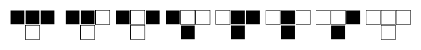
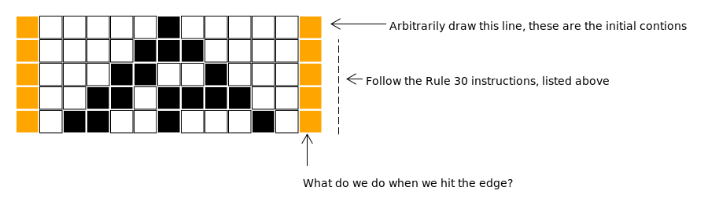
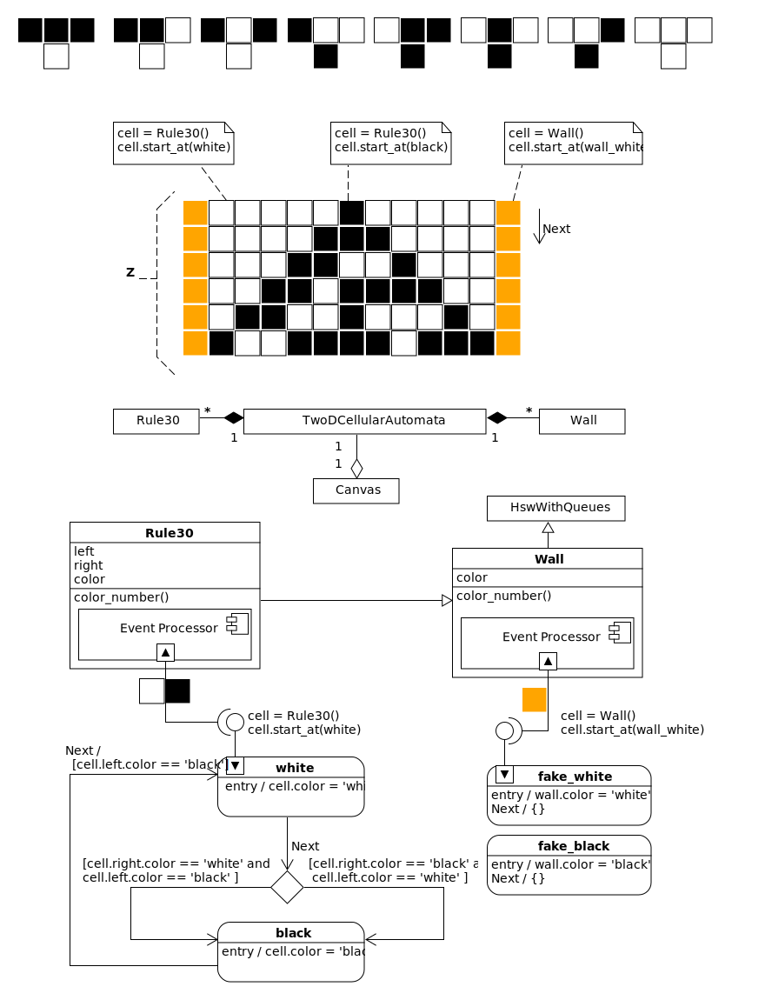

   *Making the simple complicated is commonplace; making the complicated simple, awesomely simple, that's creativity.*

   -- Charlie Mingus

Cellular Automata
=================
Here is a picture of the predatory snail, `conus textile <https://www.youtube.com/watch?v=JjHMGSI_h0Q>`_:

.. image:: _static/Conus_textile.JPG
    :target: https://en\.wikipedia\.org/wiki/Cellular_automaton#/media/File:Textile_cone\.JPG
    :align: center

.. raw:: html

   By Richard Ling - Own work; Location: Cod Hole, Great Barrier Reef, Australia, <a href="http://creativecommons.org/licenses/by-sa/3.0/" title="Creative Commons Attribution-Share Alike 3.0">CC BY-SA 3.0</a>, <a href="https://commons.wikimedia.org/w/index.php?curid=293495">Link</a>

The pattern on its shell is an example of a 2D cellular automata.  The shell is
grown by a kind of organic line of printer heads along the shell's lip.  These
printer heads, called pigment cells, can extrude colored calcium cement.  The
color choice of a pigment cell is dependent upon the color choice of it's two
adjacent pigment cells.  The rules governing this process are simple, yet a very
complex shell color pattern emerges.

A 2D cellular automata exists on a 2D grid of cells; like graphing paper, and it
is governed by a simple set of rules.  How you color in a square is dependent
upon the coloring of the three squares above it.  If we decided to only use 
black and white coloring, a square's color would be dependent upon eight
different permutations of the three squares above it.  The governing rules of a
2D cellular automata could be described by drawing out these eight pictures.

But before we begin to fill in our drawings we would have to decide how to start
them.  Typically you color the middle square of the top line on your graphing
paper black, then begin coloring the squares of the second line using the rules.
Of course you don't have to do this, you can start however you like.  But how
you start is called the initial condition, and as you will see, the initial
conditions have a huge effect on the overall emergent pattern of your drawing.

In 1983 Stephen Wolfram discovered a 2D cellular automata which created patterns
that look like the shell of the conus textile snail.  He called this program,
`Rule 30 <https://en.wikipedia.org/wiki/Rule_30>`_.  

Let's explore how to make a Rule 30, 2D cellular automata, by looking at the
instructions which govern it:

   *"First, look at each cell and it's right-hand neighbor.  If both of these were
   white on the previous step, then take the new color of the cell to be whatever
   the previous color of its left-hand neighbor was.  Otherwise, take the new
   color to be the opposite of that."* [#]_

Here are these instructions as a picture:

Now let's start a drawing: we will place a black square in the middle of the
first line then follow the rules to fill in the 4 lines below it.

If you look at the diagram and compare it to the rules described as a paragraph,
then to the pictures describing this same rule, you will see how it works.

Now what do we do about the edges of our graphing paper?  We could just pretend
they aren't there, making the automata infinite.  Or, we could wrap the paper
into a tube so that there is no edge.  I have seen that both of these things
have been done before, but I haven't seen anyone just force a color onto the
edge, like a wall.  The guys that invented and played with automata are really
smart, and they follow a disciplined mathematical aesthetic.  So let's do
something they wouldn't, do let's take their beautiful little program and run it
into something completely arbitrary, let's build that wall and try to make
something new.

This will give us a chance to have two state machines interact in the same
cellular automata.  We need two different machines, a rule 30 machine and a wall
machine.  The wall machine should be able to be white or black.  Here is a basic
design diagram including two finite state machines (FSMs) that will do the job:

At the top of the diagram is our automata which provides some context and
describes our design goal.  Below that is a small UML diagram showing how some
classes relate to each other.  We see that a ``Canvas`` class *has a*
``TwoDCellularAutomata`` class.  This ``TwoDCellularAutomata`` class *has many*
``Rule30`` and ``Wall`` classes.  The ``Canvas`` class will draw our diagrams
and animations, the ``TwoDCellularAutomata`` will be responsible for creating
any automata given a ``Wall`` class and a ``Rule`` class.

The ``Rule30`` class will have three attributes describing the machine on the
left and right and its color.  The ``Rule30`` machine will be inherited from the
``Wall`` class, so we only have to write our color worker method,
``color_number``, in one spot (the ``Wall`` class).  The ``Wall`` class is
inherited from the ``HsmWithQueues``, which means that these statemachines won't
be running in their own threads (like they would be if they were derived from
the ``ActiveObject`` class).  To have them react to events, we will have to use
their ``dispatch`` method and they will have to run within the thread of some
sort of governing program.

The statemachine under the ``Rule30`` class will provide the behavior described
by the squares at the top of the page.  The statemachine under the ``Wall``
class consists of two states which can only be gotten to using the ``start_at``
method, no event will cause a transition between these states.  The ``Wall``
objects are intended to interface with the ``Rule30`` objects so that a
``Rule30`` cell can't tell if it is working with an actual machine or
just a wall.

How do we build a ``Canvas`` class to get the feedback needed to see what is
going on with our program?

If we were using Stephen Wolfram's Mathematica this work would be trivial; but
we are using Python, so we will have to stitch some things together before we
can visualize our work.

To make the ``Canvas`` class provide animations and graphics ability, I will use
the matplotlib library.  ``Canvas`` will act as a wrapper to the
``matplotlib.FuncAnimation`` class which can be used to make ``mp4`` videos and
the ``matplotlib.savefig`` which can make the ``SVG`` and ``PDF`` diagrams
needed for this document.  The main thing to know about the
``matplolib.FuncAnimation`` class is that it takes an ``init_func`` and a
``func`` argument which can be filled with functions that initialize the
animation and that will be called for every frame of the animation.  So if we
can make functions that initialize some data and change it in every frame,
then we can make our movie.  But what do we want to show in each frame?  We want a
grid with colors.  This can be displayed with something called the
``pcolormesh`` which accepts a 2D array and some color codes to map onto the 2D
array.  Let's try an draw these broad strokes into a diagram:

Random Number Generation
==========================

.. [#] Stephen Wolfram (2002). `A New Kind of Science.  <https://www.wolframscience.com/>`_ (p27)
