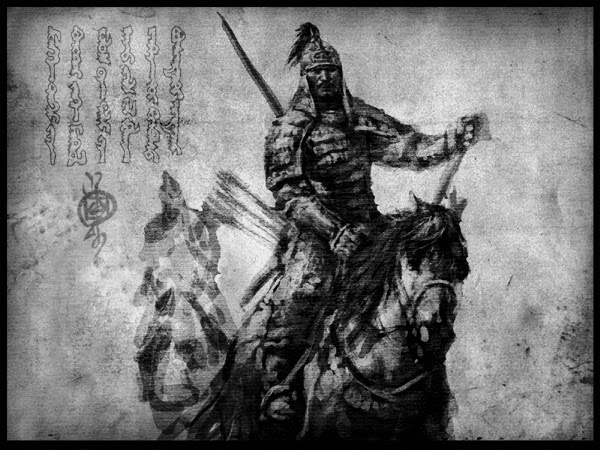
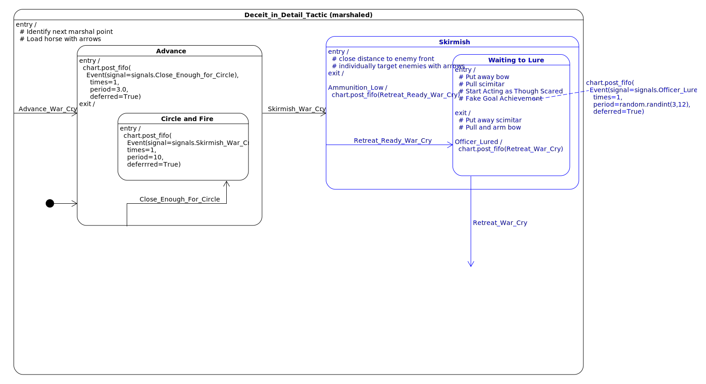
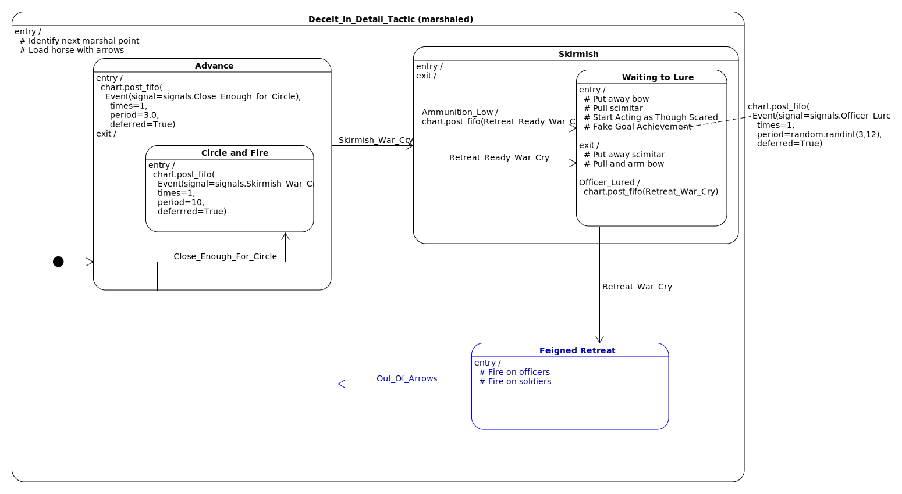
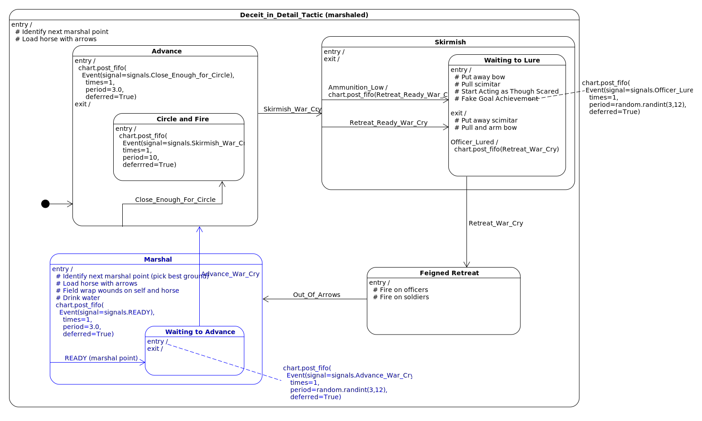
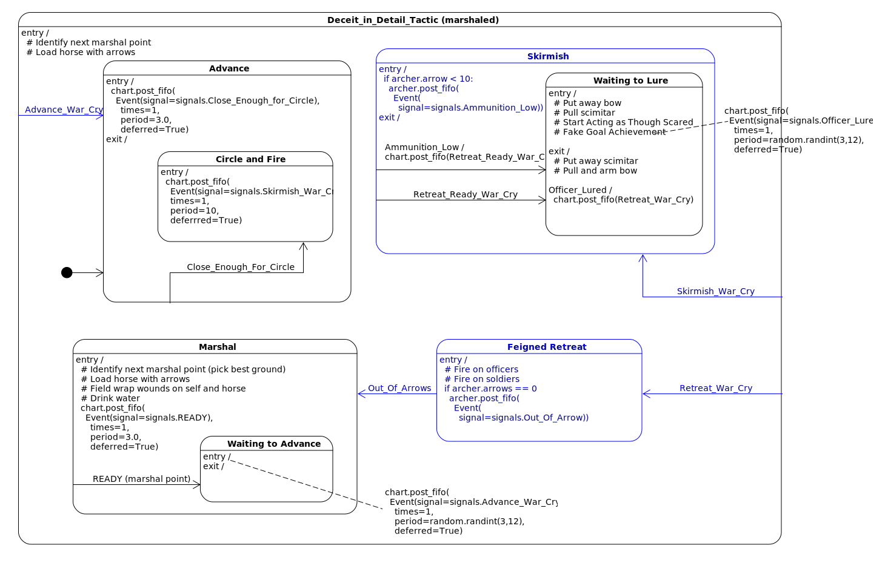
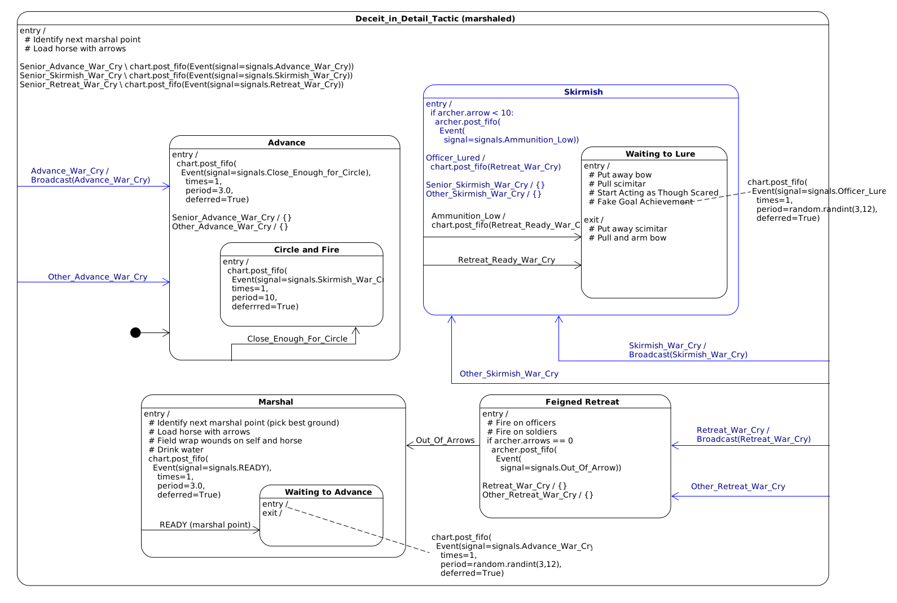
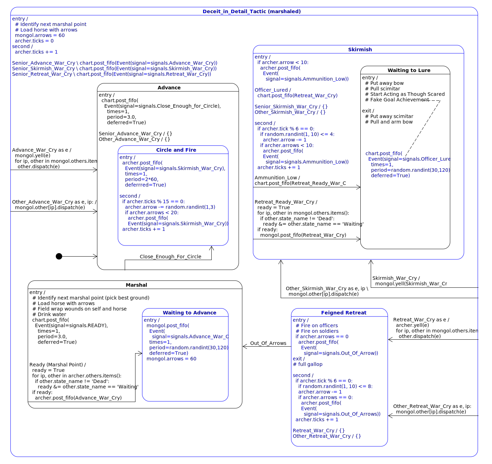
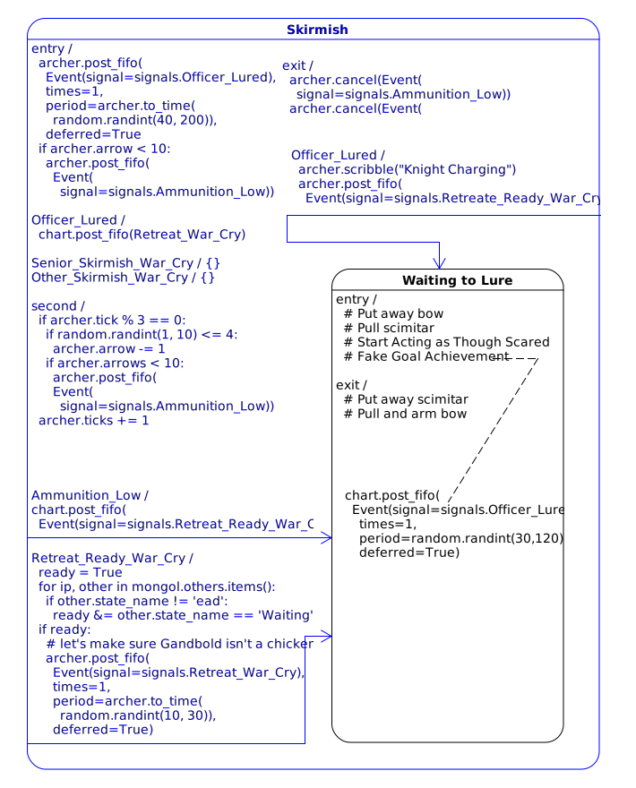
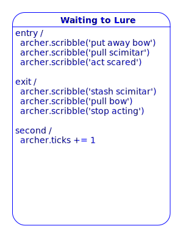
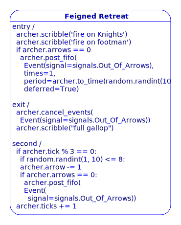

.. _i_mongol_example-mongol-horsemen:

  *It ain't what you don't know that gets you into trouble.  It's what you know
  for sure that just ain't so.* 
  
  -- Mark Twain (fake quote)

Mongol Horse Archer
===================
In this example, I will demonstrate how to write a type of tactical botnet.  I
will base it on something from history, the Mongol Horsemen.

The example will demonstrate how to design `emergent order
<https://en.wikipedia.org/wiki/Self-organization>`_ using multiple nodes across
a network, which have limited information about one another. Each node will have
the ability to link up with another node and act in unison and then unlink and
act independently. The overall unit tactic will continue to work even if only
one node remains.

**Example Background:**

* :ref:`Historical Context<i_mongol_example-historical-context>`
* :ref:`Deceit in Detail<i_mongol_example-distributed-officers>`
* :ref:`Modelling the Mongol Mind<i_mongol_example-modelling-the-mongol-mind>`

**Example Software:**

* :ref:`Technical Overview<i_mongol_example-technical-oveview>`
* :ref:`Designing the Mongol in its Tactic<i_mongol_example-designing-the-mongol-in-its-tactic>`
* :ref:`Encrypted Commnications<i_mongol_example-encrypted-communications>`
* :ref:`The First Horseman<i_mongol_example-the-first-horseman>`
* :ref:`Instrumenting to Debug a Horse Archer<i_mongol_example-instrumenting-to-debug-the-botnet>`
* :ref:`Implementing the Mogol in miros<i_mongol_example-implementing-the-mongol-in-miros>`

.. _i_mongol_example-historical-context:

Some Historical Context For the Example
---------------------------------------
An officer must exert their plan onto an army of men who would rather be at
home, feeding their families. When an officer exercises their power over a
soldier, they reduce that soldier’s ability to think for themselves.

But each soldier in battle consumes tremendous amounts of information; far too
much to send up the chain of command.  If they could act upon it independently,
it could be to the significant advantage of their army.  This is the
paradox of leadership: when a leader exerts too much control over their
subordinates, they limit the effective-intelligence of the group to their own mental
ability and the limited information they are receiving.

The chain of command is like an extremely slow nervous system. Limited and
bottle-necked by the cognitive load and cognitive biases of each officer as they
transmit orders to their soldiers and the results of those orders back up to
their own ranking officer.

But without officers providing decisions in battle, the group would break down
into a set of unorganized individuals who at best, would default to their
training and at the worst would run from the enemy exposing themselves to
slaughter. Group cohesion is the key.

In war, there are hard points and weak points to armies. Ideally, you would
attack your opponent's weak point with your hard point. An example of this is a
flanking maneuver. If you can hit your enemy at the side (flank), rather than at
their front, you would minimize your losses while maximizing theirs.

But the chain of command itself is a weak point in an army. If you could kill
the officer’s of your opposing force, you would turn the army into a group of
scared men all acting alone. A micromanaging general who is exerting absolute
control can be attacked directly with confusion and mental over-taxation. Such a
general becomes a weak point because of the paradox of leadership. As confusion
diminishes their mental ability, their whole army acts dumber, making ever worse
collective decisions.

In the 13th Century, western armies typically organized their officers into
hierarchical structures, using command and control architectures. The officers
would be on the front line, mounted on horseback, wearing heavy armour, easy to
identify.

The Mongols organized their forces differently, each horse archer could act as a
local officer to control the overall efforts of their local unit. Each unit was
made up of no more than ten horse archers. The cognitive load required to
control the whole system was limited because each unit could act independently
from their whole.

There was still a hierarchy of leadership in the Mongol army with different
ranking officers controlling the actions of the groups of units under their
command; but orders were issued as intentions, rather than a specific set of
individual instructions. Today we call this, “commander’s intent”. If such
orders are used, the military force under their command becomes smarter than the
officer issuing them. Each officer at each level can innovate and react to their
local battles as they unfold. Officer-ship itself is pushed down into the
individual soldiers.

The Mongol strategy and tactics were intended to harm the state of mind of the
opposing military commander. They would not stay put; they would not act in a
way that could be fathomed by theory or previous experience. They would snare
their opponents in an ever-changing conundrum -- if their enemy closed ranks the
Mongols would fire arrows on the mass of men, if they spread out, the Mongols
would attack and pick off the individuals.

Any opposing micro-manager would quickly become overwhelmed, leaving their
forces lobotomized; breaking down group cohesion.

So confusion was the great weapon of the Mongols, and it was blasted directly
into the minds of the military commanders controlling their opposing force. When
a Mongol army came upon a larger army using traditional-command-and-control
cognition, it was a simple matter to destroy them at their leisure – since this
opposing force lacked to mobility to catch or surround the Mongols.

The Mongols would engage, feign a retreat, then move into more favourable
terrain. The opposing force would be lead away from their strong point, exposing
a supply line and become small enough that the Mongols could attack them en
masse with numerical superiority.

This tactic is called “Defeat in Detail”.
.. _i_mongol_example-distributed-officers:

Deceit in Detail
----------------
Now let’s talk about a specific “Defeat in Detail” set of tactics used by an
individual group of Mongol horse archers.

Their commander’s intent: lure the enemy away from its protecting mass and kill
as many officers as possible.

Each horse archer started a fight with 60 arrows and a scimitar.  The arrows
could be used to damage the enemy from a distance while avoiding personal risk.

They would only pull their scimitar while close to their prey. But the point of
the scimitar wasn’t to kill or maim their enemy, but to protect themselves while
they got close enough to present a lie.

In close quarters the Mongol would pretend that they were scared. They would act
as if their unit’s will was broken when it wasn’t. This bating behaviour would
be especially alluring to anyone wanting to prove their valour.  An opposing
soldier, enraged and frustrated with their inability to take action, would have
been more willing to see this fake weakness as truth, to break ranks and attack.

The Mongol units had to attack as a unit and retreat as a unit. To do otherwise
would have had them executed by their senior officers for lack of cohesion.

But the retreat requirement of this cohesion-directive was often broken by the
fog of war. They couldn’t always know if another horse archer had been killed
and to wait around and get killed themselves would have been stupid; so a
compromise was reached. When a horse archer saw that their enemy was
re-organized enough to put up real resistance, or better yet, they had
successfully lured an officer, they could issue a retreat war cry and all other
horse archers within earshot would follow them to a predetermined marshal point.

While retreating, the horse archers would turn and use their last arrows on the
enemies chasing them; placing the highest priority on officers.

It is possible that modern Western military theory has still not caught up to
medieval Mongol thinking. The tactic name, “defeat in detail” might have been
called “deceit in detail” had it been written down by a 13th century Mongol,
instead of by a despotic Frenchman.

.. _i_mongol_example-modelling-the-mongol-mind:

Modelling the Mongol Mind
-------------------------
A group of Mongol horse archers needed to protect their mental flanks while
doing the most to harm their opponents. The key to this is to make the group
tactic simple from the inside and bafflingly complex from the outside.

Each soldier needed independent thought and action but in a moment to be able to
snap back into a collective dance with the rest of their unit. The calls between
the members of a unit needed to be encrypted, simple and loud.

The amount of memory needed to track their brethren also needed to be limited.
Unlike the general trying to remember and track everything all at once, our
distributed officer only needed to remember a few crucial things.

To make things mentally easier, the Mongol soldier relied on the idea of
sameness. The ergodic mirror metaphor is useful here. If you were surrounded by
an ergodic mirror, anywhere you turn, you would be looking into your own eyes.
So the Mongol horse archers were ergodic; they were surrounded by themselves.
Every member of their unit would act as they would, so there was no concern or
doubt about what to do.

The tactics used by a unit of horse archers needed to work even if some of its
members got killed. The hologram provides another useful metaphor. A holographic
sheet is a two-dimensional thing, yet as its parts work together, it produces
something in the third dimension. If you scratch the holographic sheet, the
three-dimensional image remains, only slightly fuzzier than it was before. To be
effective the Mongol tactics needed to have this same property. As a unit they
express complexity beyond the sum of their parts, and this complexity would not
break down with losses, but only lose its fidelity.

Let’s weave these metaphors into the specifics of battle.  To begin with, a
Mongol unit would meet, fill their quivers with arrows and decide where they
would meet again after their first encounter. This next place, call it a marshal
point, would be on ground which would give them some advantage and access to
more ammunition.

They would wait for an advance-war-cry. Any member of their unit could issue
this call, and all members would immediately advance.

At a certain distance from the enemy, the horse archers would have their horses
follow each other to form a circle. The closest horse archer to the enemy front
lines would shoot an arrow, then reload as their horse took them around the
circle again. This would create a kind of sustained machine gun effect on their
opponent’s mass; causing them to loosen their ranks as to avoid the constant
barrage of arrows.

The next stage of battle would have the horse archers get close enough to their
enemy to skirmish. While skirmishing, a horse archer would aim their arrows
directly at individual opponents. Any of the horse archers could issue a
skirmish-war-cry, and all other units would follow them into the skirmish
manoeuvre, riding their horse out of their circle-and-fire formation to gallop
closer to the now disordered front of their enemy. 

At some point one of the horse archers would become low on ammunition; then they
would begin the most dangerous and effective movement in their ‘deceit in
detail’ tactic, they would pull their scimitar; saving the last of their arrows
for their luring retreat.

While swinging their scimitar, they would do precisely the opposite of what you
would expect a terrible horse archer to do. They would appear scared and
confused. It is not easy to charge into the heart of your enemy only to put on a
play for them, but this deceit was necessary to lure their enemy into real
danger.

So as a horse archer was fighting, they would have to remember enough about
their unit to know if they were the last to pull their scimitar. If they were,
it meant that as a unit they were low on ammunition, and they were ready for
their next collective action.

This would mean that a horse archer would have to call out when they were
pulling their scimitar, and each other horse archer would have to track this
information. But if a horse archer got killed; they wouldn't be able to call
out; so there had to be another way for the unit to communicate to itself that
it was time to go. So any horse archer could issue a retreat war cry.   They
could do this when they had successfully lured an officer are when enough time
had passed that the enemy was becoming reorganized enough to put up a real
opposition.

The retreat war cry would occur when the last horse archer pulled his scimitar,
or when an officer got lured or when enough time had passed for the enemy to
re-organize. 

A retreating horse archer is extremely dangerous; since they would pretend to be
slow when they were fast. The closer you got to them, the more comfortable you
would make their shot on you. As you charge, there would be no flanking soldier
to protect your sides, or you're back, but there would be another horse archer
there, intent on hunting you from a blind spot.

Retreating horse archers were mainly dangerous to officers since an officer
would often be on horseback to increase their mobility and express their rank.
The speed of the chasing officer would pull him away from his protecting mass;
leaving him alone and flanked by his enemies, his helmet blinding his peripheral
vision. He had no real chance of catching his prey; all of his training and his
ideas about the world working against him.

From the outside the Mongols would appear like an angry swarm of hornets;
Incomprehensible, always out of reach. Any engagement with them reducing the
leadership and cohesion within your own force.

But if you were an individual Mongol horseman, you would only have to follow a
few simple rules. Advance if you heard an Advance war cry. Create a circle when
close enough to the enemy. Skirmish when you heard a Skirmish war cry. Track
your unit’s Retreat Ready War cries; so you can know if it is up to you to issue
the Retreat. When you heard a Retreat War cry, turn your horse around and start
firing arrows at the sides of attacking enemy Knights.

As an individual horseman, you could issue your own commands to your group. You
could give an Advance War Cry, to start the circle. When you were low enough on
arrows you could make the Skirmish war cry, and your brethren would close the
distance to the enemy with you. If your ammunition were running low, you would
issue the Ammunition Low war cry, and the other members of your unit would know
you are ready to go. If you had successfully lured an officer, you could issue
the Retreat war cry and leave knowing that your brethren would follow and flank
the officer chasing you.

Most of your concentration would be used to make your shots or to put on the
deceitful-play while close enough to the enemy. The only exception to this being
your need to track who in your unit was ready to go.

If you were the last horseman, the rules would still apply: You would advance;
you would circle and shoot; you would skirmish and lure and retreat-to-fire when
followed.

.. image:: _static/backwards.jpg
    :align: center

Now that we have an understanding of what we are trying to model let's build it
in software using 'miros'.

.. _i_mongol_example-technical-oveview:

Technical Overview
------------------
To build the horse archer botnet, we need at least two different computers. I’ll
be using a windows machine and a raspberry pi.

First, we’ll design a set of statecharts that will model an individual horse
archer and its understanding of its brethren.

Any communication between our horse archer bots will be encrypted since we don’t
want our enemy to learn about what we are doing.

We will adjust how our instrumentation works; we will make it so that it can
stream its output to any computer of our choosing. We will do this so we can
debug our entire botnet from one location.

Finally, We’ll write the software; run it on two or more computers and
demonstrate that it is working.

Here are the steps:

* :ref:`Designing the Mongol in its Tactic<i_mongol_example-designing-the-mongol-in-its-tactic>`
* :ref:`Encrypted Commnications<i_mongol_example-encrypted-communications>`
* :ref:`Instrumenting to Debug the Mongol Botnet<i_mongol_example-instrumenting-to-debug-the-botnet>`
* :ref:`Implementing the Mogol in miros<i_mongol_example-implementing-the-mongol-in-miros>`

.. _i_mongol_example-designing-the-mongol-in-its-tactic:

Designing the Mongol in its Tactic
----------------------------------
We already understand the tactic, so I’ll draw and describe how I think it might
work in an HSM several times over; adding complexity and technical improvements
with each iteration. When we have a design that can sufficiently sketch out our
botnet, I’ll move to the next step.

While working on the example, we will introduce different events that cause
changes in the horse archer’s behaviour.

When is an event a war cry, who exactly is yelling it out? Any war cry can come
from one of two places. It can come from the horse archer himself, or a senior
officer. We do this so that the unit tactic can be autonomous yet flexible
enough to receive outside direction.

Let’s think about a single horse archer and the actions he would take. He would
meet up with his brethren (marshal), then they would determine where they would
like to meet after their first maneuver, then they would fill their quivers with
arrows.

So, I have to first figure out what to call the outer state. For now, I’ll call
it, Deceit_in_Detail_Tactic (marshalled), because I want to express that the
horse archers are meeting and that this is one tactic of many.

.. image:: _static/ergotic_mongol_11.svg
    :align: center

`ergotic_mongol_11`_

Immediately after filling their arrows, they attack.  This action may not be
historically accurate, but let's have our botnet just attack right away.

Once the horse archers advance close enough to the mass of their enemy, they
would circle and fire.  How do we express this in software?  If we were building
a botnet to fight the North Koreans or a malevolent AI or something, we could
have each node in our botnet read a transducer or take a reading.  For now, we
will fake out this information with a
:ref:`one-shot<recipes-create-a-one-shot-state>` so that we can frame in our
design.  Three seconds after advancing they will issue the
Close_Enough_For_Circle event.

So our horse archers circle and fire; creating an intangible rain of arrows down
upon the enemy's front line. So far so good.  To save themselves, the enemy
loosens their ranks allowing enough space and safety for our horse archers to
charge in for their next play.

Notice that the Circle and Fire state is within the Advance state.  Why do this?
I did this in case an individual horse archer decided that the enemies front was
sufficiently disorganized enough not to waste arrows on an imprecise
bombardment; To skip the circle and fire step and just advance into a skirmish.
To do this, they would issue a Skirmish_War_Cry and charge into the enemy's
disorganized front to make individual attacks.

`ergotic_mongol_12`_

Upon making the Skirmish_War_Cry are horse archer charges into close enough
range to make individual attacks with their arrows.  This type of fighting is
called a skirmish to show that we do not want them to stick around.

Our war bot would have some client code connected to the entry condition of the
skirmish state.  It might be the initialization of a specific targeting and
attack control system, whatever it is it would have to issue the Ammunition_Low
event when it was done firing upon specific targets.  This Ammunition_Low event
would be caught by the skirmish state as a :ref:`hook<patterns-ultimate-hook>`.
This hook would, in turn, trigger a Retreat_Ready_War_Cry event.

I could have just used a single Ammunition_Low event to cause the transition
from the Skirmish state into the "Waiting To Lure" state.  But, I often use two
distinct events like this to make the debugging and reflection processes easier
on myself, so that I can debug a statechart faster than I could with only one
event that expresses two different semantic meanings.  (This will also give our
design more flexibility, which we will see later in this example).

After a horse archer issues the Retreat_Ready_War_Cry they enter the "Waiting to
Lure" state.  He would expertly attach his bow to his mount and pull his
scimitar, then he would do something really brave.  He draws the attention of an
enemy officer and somehow convinces him that he was scared and incompetent, that
his unit's will was broken.  While in the waiting to lure state, he would act
like a father who is being chased by his children.  He would pretend that they
could actually catch him if they only just tried a little bit harder.

The western Knight would be spoiling for a fight, feeling enraged, yet
incompetent, he would want to do something other than watch his footmen die.  He
might look down at his massive warhorse and compare it to the strange little
ponies these horse archers are riding.

.. image:: _static/horsearcher.jpg
    :align: center

What he doesn't know is that he is the quarry.  They are on a hunting trip; not
every arrow carries the same value; the whole point of their attack was to find
him.  They have something to give him.

The Knight see's his chance and attacks!

Once again we find ourselves needing real input from the world.   This is where
our bot would need another transducer or reading to determine if the officer had
been lured.  For now, we will fake out the reading with another one-shot so that
we can frame the design.  To make things interesting we will pick a random
integer between 3 and 12 and then count down in seconds before we trigger our
fake Officer_Lured event.

The horse archer has been paying careful attention to the Knight even though he
has been pretending not to see him.  When he sees him begin his attack, he
issues the Officer_Lured event.

The Officer_Lured event is caught by a hook, which triggers the Retreat_War_Cry.
The Retreat_Ready_War_Cry causes an exit transition from the "Waiting to Lure"
state.  This will have the horse archer put away his scimitar and arm his bow
with an arrow.

`ergotic_mongol_13`_

The Retreat_War_Cry causes the horse to enter the "Feigned Retreat" state.  In
this state, a different control system would come into play.  The horse archer
would let the Knight close the distance to him so that he can comfortably make
his shot.

He might even veer and dodge to place bodies and soldiers between him and the
charging Knight, or lure him closer toward other horse archers who could flank
the knight; taking advantage of how his helmet has cut off his peripheral
vision.  It doesn't really matter; once the knight attacks, stupidly charging
into a group of organized horse archers with unprotected flanks, he is doomed.

What to do next?  The unit goal has been achieved, yet they still have arrows.
So they leave them in any other pursuing soldiers, then ride full gallop back to
the marshal point.

The final stage of our tactic would have the horse archers meet at their marshal
point.  Their they would decide upon where to meet again after their next
attack.  Load their horses with arrows, tell some jokes and field wrap their
wounds.  Drink and water their horses and mentally prepare themselves for the
next advance.

The requirement for group cohesion still applies.  Any horse archer would be
limited on the battlefield if he had to advance with an empty quiver; so every
horse archer would want to wait for the last horse archer to finish reloading
before advancing.

Therefore like the "Waiting to Lure" state, there must be a "Waiting to Advance"
state.  In this first pass at a design, we setup a one shot that will trigger
the READY event after three seconds.

In the "Waiting to Advance" state we place a randomized one-shot that will
trigger the Advance_War_Cry at some time between 3 and 12 seconds.

But this overall tactic, as it is currently designed is completely fragile.
What happens if a horse archer is issued an Advance_War_Cry while in the
"Marshal" state?  Well, he would just sit there.  What would happen if a
Skirmish_War_Cry was issued while the horse archer was in the "Feigned Retreat"
state?  They would ignore the command.  This is not flexible.

There will be situations where a senior officer issues an Advance_War_Cry when
the horse archer is not ready; no matter, it is time to attack, even without
arrows.  Group cohesion is of paramount importance to the Mongols.

So, as a map, it is easy to see what is going on, but it tells a very specific
and inflexible story.  With a few light adjustments, we could make the horse
archer much more seasoned and responsive in the face of unexpected events.

For instance, we could make the Advance_War_Cry cause an advance on the enemy
while the horse archer is in any of its maneuvers.  Suppose a horse archer is
in the "Feigned Retreat" stage and a senior officer sees some sort of global
opportunity and bangs on a war drum, issuing a global Advance_War_Cry.  Our
horse archer would turn around and advance.

In this way, the control at a higher leadership level of the Mongol army could
reach into this unit, tweak its behaviour, then let it run autonomously again.

Let's improve the design:

As a statechart designer, you might look at the Advance_War_Cry event connecting
the outer state to the advance state and become confused.  Where does this
Advance_War_Cry come from?  Oh, there it is, in the "Waiting to Advance" state.  

I have seen junior developers destroy designs by adjusting arrows to make the
"story easier to read" off of the map.  It is tempting to put the arrow source
back to the "Waiting to Advance" state so that the map makes immediate sense
upon looking at it. But think about what this has done to our design.  When an
arrow is connected from the outer state to the "Advance" state, it is shorthand
for connecting *all of the states* to the "Advance" state with an
Advance_War_Cry arrow.  When the junior developer mistakenly adjusts the tactic
to make the map "make more sense", they would break 7 different behavioural
pathways in this design; causing our horse archer unit to lose cohesion and thereby
guarantee its execution by a senior officer.  Statecharts are
extremely powerful at packing tactical complexity onto a map; so you really have
to be careful moving the arrows around.

Now let's adjust the Skirmish_War_Cry and the Retreat_Ready_War_Cry from the
outer state to their respective states.  We just added 14 different behavioural
paths.

Suppose that in the future, a new developer decides to adjust the deceit-in-detail
tactic by adding another state to it.  If they do not change how our
war-cry event arrows are attached, they will automatically get the behaviour of
the old tactic without knowing that they did.  Statecharts are robust against
state additions made by future programmers.  So statecharts can quickly act like
a culture, they become smarter than the individual programming them.

Notice that the Out_Of_Arrows event was not globalized.  We do not want our
horse archer to just leave when he's out of arrows.  Furthermore, because of our
adjustments to globalize the Advance_War_Cry, Skirmish_War_Cry and the
Retreat_War_Cry we have to ensure we don't accidentally leave our horse archer
stranded in a state when he is out of arrows.

So what happens if an empty horse archer is asked to advance?  Well, he
uselessly circles and then will issue a Skirmish_War_Cry.  Good, he can escape
the "Advance" state.

Notice that some code was added to the entry state of the "Skirmish" state.  Now
if a horse archer has less than 10 arrows or no arrows, he will end up in the
"Waiting to Lure" state.  This is good, he is no longer just uselessly riding
around because he can start to bait knights and he can escape the "Skirmish"
state event if he doesn't have arrows.

Likewise, entry code was added to the "Feigned Retreat" state.  When he enters
this state with no arrows, he will just ride back to the marshal point.

Now that we have a decent sketch of a horse archer acting alone, let's have
him react to the behavior of other horse archers.

A horse archer is a distributed officer.  This means that any horse archer can
issue commands to, or obey commands from, any other horse archer in his unit.
For this unit tactic, there are two types of commands.  There is a "Let's do
this thing right now!" and a "Track that I am ready in your head!" kind of
command.

To see what I mean consider the Advance_War_Cry.  That is a "Let's do this thing
right now" command.  All horse archers will immediately advance and circle if
they issued the command themselves or if they hear it come from another horse
archer or a senior officer.  In the deceit in detail there are three different
war cries that have this type of characteristic: Advance_War_Cry,
Skirmish_War_Cry and Retreat_War_Cry.

.. note::

  The "Let's do this thing right now!" variety of signaling between different
  statechart can be generalized into the "multi-chart race pattern", since each
  of the statecharts can be thought of racing each other to be the first to give
  the command to another chart.  If given all of the statecharts will race to
  the state indicated on their map.

.. image:: _static/ergotic_mongol_31.svg
    :align: center

Let's turn each of these commands into three distinct events so that we can tell
if it was issued by a senior officer, the horse archer themselves or another
horse archer.  By doing this our statechart will be easier to debug, it's
instrumentation will be clear and the sequence tool will tell a better story.

We construct three new events, Senior_Advance_War_Cry, Senior_Skirmish_War_Cry
and Senior_Retreat_War_Cry.  Imagine that these commands can be issued at a high
vantage point by war drums near the back of the Mongol horde.

When a horse archer hears a command from a senior officer, they will give the
cry themselves and then perform the action.  We implement this using the
reminder pattern.  A hook is placed at the outer state for these commands; and
it re-issues a new event as a response.  

When a horse archer calls out, it can be heard by other horse archers through a
mechanism we haven't programmed yet, but that doesn't mean we can't name these new
events: Other_Advance_War_Cry, Other_Skirmish_War_Cry and Other_Retreat_War_Cry.

There will be situations where a horse archer wants to ignore a command coming
from a senior officer or from his brethren.  This is when he is already engaged
in a complicated maneuver that would be initiated by that command.  For instance
while the horse archer is baiting a knight in the "Waiting to Lure" state, they
would ignore the Senior_Skirmish_War_Cry and the Other_Skirmish_War_Cry since
they are already engaged in that activity.

Likewise, a horse archer would ignore any order to advance, coming from someone
else, if they are already advancing or engaged in the circle and fire maneuver.

Battle is a noisy affair.  There is a good chance that one horse archer might
not hear a war cry issued by another one far away from him (due to network
issues); so anytime a horse archer hears a war cry coming from another horse
archer, they yell out the command again so as to re-transmit it to any other unit
member within earshot.

Notice also that I moved the Officer_Lured hook from the "Waiting to Lure" state
into the "Skirmish" state.  This will give us the same behavior as before, with
the option of short circuiting the dangerous "Waiting to Lure" state in the case
that a Knight stupidly charges at the moment the Mongols start to Skirmish.

Our design so far, has encompassed the "Let's do this thing right now!" part of
it's collaboration.  Senior officers can issue messages, any horse archer can
hear messages from other horse archers and the horse archer can yell out
messages to other horse archers.  When an action is taken by one Mongol, it will
be immediately taken by the others in its unit.  So, in a way they are racing
each other to get to the next state.  For this reason I call this a "multi-chart
race pattern".

Now let's talk about the "Track that I am ready in your head!" set of commands.
These types of commands are issued when the unit is waiting for the last of it's
members to do something before they can all continue onto the next collective
behavior.  We have two such moments in this "deceit in detail" tactic.  The
first occurs when a horse archer puts away is bow and tries to lure a knight.
He yells his Retreat_Ready_War_Cry, hoping that all of the members in his unit
will hear him.  When the last horse archer issues the Retreat_Ready_War_Cry he
will know that it is up to him to issue the Retreat_War_Cry so his entire unit
can escape this dangerous luring maneuver.

The second "Track that I'm ready in your head!" command happens when the units
are marshaled.  It is up to the last horse archer to tell the others that he is
ready so they can get back into the fray.  He does this by issuing the
Advance_War_Cry.

So, a horse archer has to track what is happening with his brethren.  He has to
know what state they are in.  Thankfully he doesn't have to know *precisely*
what they are doing but only a small subset of what they are doing.  For this
reason I call this unit empathy and it could be tracked by a second statechart.

Here is a first shot at it's design:

A horse archer will have one of these statecharts for each member of his unit.
It is a simplification of how another horse archer is conducting themselves.

Another horse archer's "Advance", "Circle and Fire" and "Skirmish" states are
rendered down in the "Other Attacking" empathetic state.  The "Marshal" and
"Feigned Retreat" states are rendered down into the "Other Marshaling" state.
The "Waiting to Lure" and "Waiting to Advance" states are left intact.  There is
something new added to the empathy statechart; the "Other [is] Dead" state.

If you wait for a dead man, you will be waiting a long time -- unless you are
waiting for a dead man on a battlefield, then you will not be waiting long.

It almost goes without saying that a horse archer will only wait for another
horse archer if he thinks he's alive.

There really isn't perfect knowledge in battle.  So, the idea that a horse archer
has about another horse archer will often be wrong, until that belief is updated
by more evidence and it snaps back to the truth.

But how would a horse archer come to the conclusion that someone else in their
unit is dead?  Well if that other horse archer is breaking the rules of their
collective tactic, it is safe to assume he is doing so because he has been killed.

We see this when a horse archer thinks that another member is attacking but
finds himself issuing a Retreat_War_Cry.  The other member should have been in
the waiting to lure state, but they weren't, so he just assumes they are dead
and continues to fight.

Of course this will often be wrong.  If the first horse archer to enter the
"Waiting to Lure" state lures a knight right away; he would issue a
Retreat_War_Cry and with this design, he would think everyone else is dead.
This is OK, because he will immediately hear the other members of his unit yell
out; which will quickly change his beliefs back into a more truthful state of
empathy.

So here we are talking about a kind of belief lag.  The thing that the horse
archer needs to know is if the person is dead while they are waiting around.  If
they have incorrectly concluded their entire unit is dead while retreating,
there is plenty of time to fix this erroneous belief with the truth.  The next
wait state doesn't happen until after they have finished their false retreat and
equipped their horse for another attack.  So, they can be wrong about things for
a while without any consequence to the over all group tactic.

A symmetrical logic applies to the "Other Marshaling" part of the design.

The important thing to notice here is that in many situations the group's
cohesion will actually be broken by what happens to them in battle.  

But what about the draconian requirement placed on this unit by it's senior
officers, "maintain your group cohesion or we will kill every member in your
unit".  If the Mongol horde adhered to this command with autistic compliance, all
the way up their leadership hierarchy, there would only be one horse archer left
and his name would be Genghis Khan.

.. image:: _static/Genghis_Khan.jpg
    :align: center

So the group cohesion requirement has to be some kind of hand waving thing.  "We
want you to follow each other around or re-synchronize in unusual situations, if
you don't we will kill you."

Basically the design has to be such that when cohesion is lost across the nodes
in our botnet that they snap back into the desired group dynamic when given the
opportunity to do so.

Here we are talking about attractors.  The idea was first introduced by Edward
Lorenz when he was studying chaotic systems.  His equations would never follow
the same path, but they would follow the same path-ish-ness:

.. image:: _static/lorenz1.png

We aren't going to delve into any mathematical rigor, but instead lean heavily
on our intuition and our design sensibilities.  A set of statecharts could be
explained using a stick in some mud in the 13th century.   This would be harder
to do with calculus, differential equations and linear algebra, so let's stay
away from that.

Which brings us back to the idea of cognitive load.  We are expecting these
horse archers to remember a lot of things while in the heat of battle.  If I
were an officer explaining *this* empathy tactic, I would be complicit in
weakening the unit by filling their head with over complicated maps.

So let's make things easier on them:

Now they are less precise in how they model the other members of their unit; yet
the same kind of states appear.  They know who is waiting, who is not waiting and
who is dead.

Let's layer in a Mongol's empathy into his tactical statechart:

.. image:: _static/ergotic_mongol_41.svg
    :align: center

The point of this design iteration is to add the two different unit-wait states.

If you were a horse archer, you would know the names and the voices of every
member of your unit.  Maybe you wouldn't be able to do multiplication in your
head, or count cards, but you certainly would know what your brothers were doing
in battle.  It would be a basic skill, like riding your horse, like operating
your bow, like knowing where your arm is.

Our botnet is running on a computer, so tracking things in memory is trivial for
it.  Yet, we want to ensure the code is maintainable; legible.  So, we organize
our unit empathy into a data dictionary where the keys are just the IP addresses
of the other nodes.  The name of this collection would be called "others".

The mental operation of tracking another horse archer in battle would involve
hearing his war cry, recognizing his voice and updating your notion of what he
is doing.

In our botnet, another's war cry, is just an event with the "Other" as a prefix.
This event will carry with it a name and the node's IP address as its payload.

So anytime we hear another make a war cry, we have to feed this information into
his empathy statechart.  We can see this logic placed on all of the "Other" war
cry events in the chart.

We also have to feed all of our empathy charts with information anytime we issue
the Advance_War_Cry or the Retreat_Ready_War_Cry.  This is done using an
iterator on the ``other`` object.

Now we get to the meat of the multichart pending pattern.  The horse archers
have to wait until the last of their members have entered the "waiting to lure"
state before they can all perform the false retreat.  So in plain English, when
a horse archer yells that they are ready to retreat, they mentally check to see
if they are the last living member of their unit to give the call.  If so, they
issue the Retreat_War_Cry.

Very similar logic appears in the marshal state.  A horse archer will yell the
Advance_War_Cry if they are the last living member who has entered the "Waiting
to Advance" state.

I was trying to avoid it to save space on our diagram, but there is no way to
avoid it anymore, a horse archer needs to experience time and they need to fire
arrows:

To track time a horse archer will have a tick attribute which will increment
every second.  We see this implemented as a hook in the outer state.

In the circle and fire state we see that the horse archer rotates in his war
circle every 15 seconds; and depending on his preference he fires 1 to 3 arrows
per shot.  When he has less than 20 arrows he yells out the Skirmish_War_Cry and
together with his unit, they break their circle formation and charge into the
enemy front.

.. image:: _static/mongol-warrior.jpg
    :align: center

While skirmishing the horse archer is given a chance to make a shot every 3
seconds but only 40 percent of the time does he feel it is worth while to loose
an arrow.  It becomes easier to make a shot during the feigned retreat, so we
say that there is an 80 percent chance to take the shot, every 3 seconds.

Of course these numbers are arbitrary.  Your war bot would be hooked into a set
of sensors and controllers and the feedback would be based on a greater
semblance of reality.  I am putting in these times and probabilities to inject a
bit of chaos into our group tactic, to see if it can hold together in its
path-ish-ness, but it's just a sketch.

It seems possible for this design to complete a loop; but I can not say for sure
that I have removed all of its accidental oscillations. Once it is written in
code and run a few times we will remove the remaining design bugs.

There are no technical miracles on this page.  The simple snippets of Python in
the map could have been explained to a horse archer using their language.  Their
enemy-lobotomizing swarm behavior can be rendered down into a number of
rectangles, some arrows and a few sentences.  The individual actions required at
each step are also unexceptional.  They are simple things that a horse archer
already knows how to do.  Once we explain Harel formalism and this basic tactic
to our troops and their junior officers, watch out; they will innovate and
improve it until we get something truly remarkable.

.. _i_mongol_example-encrypted-communications:
Encrypted Communications
------------------------
The ergodic nature of are war-bot has a downside.  Once you know how to defeat
one node, you know how to defeat all of them.  Furthermore, the communications
between the bots are fundamental to its system design; if you can inject your
own messaging between them, you will *PWN* this bot net.

A 13th century European would have not spoken Mongolian, so a Mongol horse
archer would have no problem with intercepted communications.  But, what would
have happened if they had to fight another unit of horse archers?  They would
know what the other side was up to and vise versa.

So it would make sense if each Mongol unit had their own set of war cries.  This
way they could act on an instruction without doubt or hesitation.

The horse archer communications need to be encrypted.  There are many different
ways to do this; it can happen at the communications layer using SSL, or it can
be handled within our war bot directly.

I have opted to use a symmetric encryption scheme with the Fernet library within
our war bot.  I did this after investigating pycryto; which does not
have windows support and has been largely abandon by it's maintainer.  Don't use
pycrypt.

Let's just use Fernet.

Fernet takes a lot of pain out of encryption, but you still need a key.
Encryption is really about key management; how do you keep your key hidden from
your opponent?  Well for now we will hide our key as highlighted plain text on
this website so that everyone on the Internet can see it:

.. code-block:: python
  :emphasize-lines: 17
  
  from cryptography.fernet import Fernet 

  class Connection():
    @staticmethod
    def key():
      '''
      Get the encryption key for this connection.  This key is used for encryption
      and decryption.
    
      Example:
        key = Connection.key()
    
      Note:
      To generate a new key: Fernet.generate_key()
      A better way to do this is to get the key from your connected flash-drive.
      '''
      return b'u3Uc-qAi9iiCv3fkBfRUAKrM1gH8w51-nVU8M8A73Jg='

Feeling better already.

To encrypt our data we will use a Python decorator:

.. code-block:: python
  :emphasize-lines: 35,36, 40, 42

  from cryptography.fernet import Fernet 

  class Connection():
    # ..
    # ..
    @staticmethod
    def encrypt(fn):
      '''
      A decorator which will encrypt a byte stream prior to transmission:
    
      Example:
        @Connection.serialize
        @Connection.encrypt   # <- HERE: 'message' (encrypted bytestream)
        def message_to_other_channels(self, message):
          for channel in self.channels:
            ip = channel.extension.ip_address
            channel.basic_publish(exchange='mirror',
                routing_key=ip, body=message)
            print(" [x] Sent \"{}\" to {}".format(message, ip))
    
      '''
      @wraps(fn)
      def _encrypt(*args):
        '''
        encrypt a byte stream
        '''

        # To get around the 'self-as-the-first-argument' issue
        if len(args) == 1:
          plain_text = args[0]
        elif len(args) == 2:
          plain_text = args[1]
        else:
          assert(False)
        f = Fernet(Connection.key())
        cyphertext = f.encrypt(plain_text)

        # To get around the 'self-as-the-first-argument' issue
        if len(args) == 1:
          fn(cyphertext)
        else:
          fn(args[0], cyphertext)
      return _encrypt

To decrypt we make another decorator:

.. code-block:: python
  :emphasize-lines: 21-23

  from cryptography.fernet import Fernet 

  class Connection():
    # ..
    # ..
    @staticmethod
    def decrypt(fn):
      '''
      A decorator which will decrypt a received message into a byte stream.
    
      Example:
        @Connection.decrypt  # <- HERE: 'body' decrypted into a byte stream
        @Connection.deserialize
        def custom_rx_callback(ch, method, properties, body):
          print(" [+] {}:{}".format(method.routing_key, body))
    
      '''
      @wraps(fn)
      def _decrypt(ch, method, properties, cyphertext):
        '''LocalConsumer.decrypt()'''
        f = Fernet(Connection.key())
        plain_text = f.decrypt(cyphertext)
        fn(ch, method, properties, plain_text)
      return _decrypt

So, we can get a key, we can encrypt and decrypt.  Now, what can we send?  There
is a process in python called pickling which serializes an object into a
collection of bytes.  This collection of bytes can be sent across a network.

Serialization will allow our horse archers to transmit anything within their war
cries.  "Hey Ганболд (Gandbold), do you want one of my extra horses?", "yes",
"OK here you go, lala-bee-boop".  This concept expands on the notion of a war
cry; but it is really cool that we can transmit the objects of working programs,
between the nodes of our botnet.  Of course this is a security nightmare, so if we
are going to serialize and de-serialize messages *we will have to use an
encrypted channel*.

Now let's show the serialization technique, it is also implemented using a
decorator:

.. code-block:: python
  :emphasize-lines: 35, 36, 38

  import pickle
  import miros.event import Event

  class Connection():
    # ..
    # ..

    @staticmethod
    def serialize(fn):
      '''
      A decorator which will turn arguments into a byte stream prior to encryption:
    
      Example:
        @Connection.serialize  # <- HERE: 'message' turned into byte stream
        @Connection.encrypt
        def message_to_other_channels(self, message):
          for channel in self.channels:
            ip = channel.extension.ip_address
            channel.basic_publish(exchange='mirror',
                routing_key=ip, body=message)
            print(" [x] Sent \"{}\" to {}".format(message, ip))
    
      '''
      @wraps(fn)
      def _pickle_dumps(*args):
        if len(args) == 1:
          message = args[0]
        elif len(args) == 2:
          message = args[1]
        else:
          assert(False)
    
        # The event object is dynamically constructed and can't be serialized by
        # pickle, so we call it's custom serializer prior to pickling it
        if isinstance(message, Event):
          message = Event.dumps(message)
    
        pmessage = pickle.dumps(message)
    
        if len(args) == 1:
          fn(pmessage)
        else:
          fn(args[0], pmessage)
      return _pickle_dumps

The highlighted text in our serialization code demonstrates where the actual
pickling happens.  We see that there is a custom ``dumps`` method written for a
miros Event.  The Event object can't be serialized with a pickle object because
it uses a simple metaprogramming technique for making new signal names.  No
problem, we just call the Event ``dumps`` method first, then call the pickle
``dumps`` method on its result.

Now we have a byte stream we can feed our encryption decorator.  

How do we turn it back to an object after it has been decrypted?  Well, we
call the ``deserialize`` decorator.

.. code-block:: python
  :emphasize-lines: 21,22,23

  import pickle
  import miros.event import Event

  class Connection():
    # ..
    # ..
    @staticmethod
    def deserialize(fn):
      '''
      A decorator used to turn a serialized byte stream into a python object
    
      Example:
        @Connection.decrypt
        @Connection.deserialize  # <- HERE: 'body' bytestream turn into object
        def custom_rx_callback(ch, method, properties, body):
          print(" [+] {}:{}".format(method.routing_key, body))
    
      '''
      @wraps(fn)
      def _pickle_loads(ch, method, properties, p_plain_text):
        plain_text = pickle.loads(p_plain_text)
        if isinstance(plain_text, Event):
          plain_text = Event.loads(plain_text)
        fn(ch, method, properties, plain_text)
      return _pickle_loads

The de-serialization is just the reverse of the serialization.  We call the
pickle ``loads`` method on the pickled object, then if it is a serialized Event,
we call the custom ``loads`` method of the Event object to get a version of the
event made by the bot that sent it to us in the first place.

Let's go over everything again from a high level.  If a node in our war bot
wants to share one of its objects with another node, it turns that object into a
byte-stream using the ``serialize`` decorator, encrypts the byte stream with the
``encrypt`` decorator  and spits some  garbled data onto the network layer.  The
node receiving the data decrypts the stream using the ``decrypt`` decorator,
then turns the byte stream back into the intended Python object using the
``deserialize`` decorator.  

Ok, now what do we do about our secret key?

Our Mongol unit will have a lot of shared experience.  If they don't follow each
other in their advances and their retreats; they will be killed by their senior
officers.  Maybe we could use this path of actions and the common time
experienced while advancing and retreating to modulate their original secret
key.  In this way we could literally post the key on the Internet for everyone
to see and it wouldn't matter.  If you wanted to the *PWN* the bot you would
have to know every action they had taken, when they took it and their modulation
algorithm.

This would be like the Mongol unit making up a new war language every time they
finished a loop.  They would know that if one of their members became
de-synchronized they would never find one another again.

I'm not going to write this into the example; but it is how I would start up my
thinking about this annoying key issue.  I would do the work well after I was
sure the original code was running well.  Then we would have to provide some way
for the botnet to share a common time signal; otherwise NTP poisoning could blow
the entire thing apart.  Also, I'm not sure how the commanding officer would
send messages to our unit either; we have yet another key issue.  Maybe the
botnet could look out at thousands upon thousands of websites, knowing only one
actually has a message from the commanding officer (on craiglist?).  Then inject a
random delay prior to acting on the message.

In this example I demonstrated how to encrypt the data but I exposed the key.
What we have here is security theater, I'm pretending that the system is secure.
It is not; I haven't solved the key issue.

To give myself a bit more credit; it's a good start.

Security is hard, the attacker has the advantage; you can't know when you have
been compromised and you can't trust anything, from your GPU, to the encryption
standard, to your CPU, it's all exposed and compromised.

The attacker has the advantage, so when in doubt, attack!

.. _i_mongol_example-the-first-horseman:

The First Horseman
------------------
Let's reference our previous design and create the first horseman, Gandbold.

Scanning the design diagram we see he can carry 60 arrows, he should have an
internal counter, ``tick``, some ``arrows`` and the ability to ``yell``.

Gandbold moves around the battlefield slowly; and as developers, we don't want
to wait around and see what he does while we are trying to debug his program.
So I will add the ability to compress time in Gandbold's universe, this way we
can speed him up.

.. code-block:: python

  import time
  import random
  from miros.hsm import pp
  from miros.activeobject import Factory
  from miros.event import signals, Event, return_status

  class HorseArcher(Factory):

    MAXIMUM_ARROW_CAPACITY = 60

    def __init__(self, name='Gandbold', time_compression=1.0):
      super().__init__(name)
      self.arrows = 0
      self.ticks  = 0
      self.time_compression = time_compression
      self.others = {}

    def yell(self, event):
      pass

    def compress(self, time_in_seconds):
      return 1.0 * time_in_seconds / self.time_compression

    def to_time(self, time_in_seconds):
      return self.compress(time_in_seconds)

Let's implement Gandbold's statechart using the Factory class.  We don't *have
to use this*; we could write the code using flat methods instead.  Or, we could
program it with the Factory class, then run the ``to_code`` method to see what
our factory methods would look like if they were written using the flat method
technique, then drop these resulting methods into our code.  We have options.

When using a Factory class, we create statecharts by first writing callbacks.
Then we create states and link the callbacks to their states.  Finally, we layer
these states into a hierarchy.

So, let's begin by writing the state callbacks.

Starting with the outer Deceit_in_Detail_Tactic state, we scan the top left
corner of its state rectangle and write those callbacks.  Then we look for
arrows connecting its state rectangle to other rectangles and write those
callbacks. Finally, we look for the big black dot and write its callback.  

We will follow this same workflow for each state.

Our program is easy to think about because we break our software development
process into small bits of work.  Our attention can linger, jump to something
else, then use the map to refocus on our task without much effort.  As this
focused attention fixates on the part of the map, we can think hard about what
is going on there, and we can improve it by fixing the little naming issues or
by making slight design alterations.

Let's begin by writing the callbacks for the defeat_in_detail_tactic state:

.. image:: _static/ergotic_mongol_61.svg
    :align: center

.. code-block:: python
  
  # Deceit-In-Detail-Tactic state callbacks
  def didt_entry(archer, e):
    '''Load up on arrows and start tracking time within this tactic'''
    archer.arrows = HorseArcher.MAXIMUM_ARROW_CAPACITY
    archer.ticks  = 0
    archer.post_fifo(
      Event(signal=signals.Second),
      times=0,
      period=archer.to_time(1.0),
      deferred=True)
    return return_status.HANDLED

  def didt_exit(archer, e):
    '''Load up on arrows and start tracking time within this tactic'''
    archer.cancel_events(Event(signal=signals.Second))
    return return_status.HANDLED

  def didt_init(archer, e):
    '''Immediately advance'''
    return archer.trans(advance)

  def didt_second(archer, e):
    '''A second within the tactic has passed'''
    archer.ticks += 1
    return return_status.HANDLED

  def didt_senior_advance_war_cry(archer, e):
    '''A Horse archer heard a command from a senior officer.  They give this
       senior officer's war cry to themselves as if they thought of it'''
    archer.post_fifo(Event(signal=signals.Advance_War_Cry))
    return return_status.HANDLED

  def didt_advance_war_cry(archer, e):
    '''Yell out "advance war cry" to others and introspect on the state of the
       unit'''
    archer.yell(e)
    for ip, other in archer.others.items():
      other.dispatch(e)
    return archer.trans(advance)

  def didt_other_advance_war_cry(archer, e):
    '''A horse archer heard another's Advance_War_Cry, so so they
       give the command to and introspect on the state of their unit'''
    archer.post_fifo(Event(signal=signals.Advance_War_Cry))
    ip = e.payload['ip']
    archer.other[ip].dispatch(e)
    return archer.trans(advance)

  def didt_skirmish_war_cry(archer, e):
    '''Yell out "skirmish war cry" to others'''
    archer.yell(e)
    return archer.trans(skirmish)

  def didt_other_skirmish_war_cry(archer, e):
    '''A horse archer heard another's Skirmish_War_Cry, so they
       give the command to and introspect on the state of their unit'''
    archer.post_fifo(Event(signal=signals.Skirmish_War_Cry))
    ip = e.payload['ip']
    archer.other[ip].dispatch(e)
    return archer.trans(skirmish)

  def didt_retreat_war_cry(archer, e):
    '''Yell out the "retreat war cry" and introspect on the state of the unit'''
    archer.yell(e)
    for ip, other in archer.others.items():
      other.dispatch(e)
    return archer.trans(feigned_retreat)

Now lets write the callbacks for the "Advance" state:

.. image:: _static/ergotic_mongol_62.svg
    :align: center

.. code-block:: python

  # Advance callbacks
  def advance_entry(archer, e):
    '''Upon entering the advanced state wait 3 seconds then issue
       Close_Enough_For_Circle war cry'''
    archer.post_fifo(
      Event(signal=signals.Close_Enough_For_Circle),
      times=1,
      period=archer.to_time(3.0),
      deferred=True)
    return return_status.HANDLED

  def advance_exit(archer, e):
    '''Upon entering the advanced state wait 3 seconds then issue
       Close_Enough_For_Circle war cry'''
    archer.cancel_events(Event(signal=signals.Close_Enough_For_Circle))
    return return_status.HANDLED

  def advance_senior_advanced_war_cry(archer, e):
    '''Stop Senior_Advance_War_Cry events from being handled outside of this
       state, the horse archer is already in the process of performing the
       order.'''
    return return_status.HANDLED

  def advance_other_advanced_war_cry(archer, e):
    '''Stop Other_Advance_War_Cry events from being handled outside of this
       state, the horse archer is already in the process of performing the
       order.'''
    return return_status.HANDLED

  def advance_close_enough_for_circle(archer, e):
    '''The Horse Archer is close enough to begin a Circle and Fire maneuver'''
    return archer.trans(circle_and_fire)
  
Now lets write the callbacks for the "Circle and Fire" state:

.. image:: _static/ergotic_mongol_63.svg
    :align: center

.. code-block:: python

  # Circle-And-Fire callbacks
  def caf_second(archer, e):
    '''A horse archer can fire 1 to 3 arrows at a time in this maneuver,
       how they behave is up to them and how they respond
       to their local conditions'''
    if(archer.ticks % 6 == 0):
      archer.arrows -= random.randint(1, 3)
      archer.scribble('arrows left {}'.format(archer.arrows))
    if archer.arrows < 20:
      archer.post_fifo(
        Event(signal=
          signals.Skirmish_War_Cry))
    archer.ticks += 1
    return return_status.HANDLED

Now lets write the callbacks for the "Skirmish" state:

.. code-block:: python

  # Skirmish state callbacks
  def skirmish_entry(archer, e):
    '''The Horse Archer will trigger an Ammunition_Low event if he
       has less than 10 arrows when he begins skirmishing

       An knight can charge at this horse archer at some time between 40 and 200
       seconds after entering the skirmish state of the maneuver.
    '''

    archer.post_fifo(
      Event(signal=signals.Officer_Lured),
      times=1,
      period=archer.to_time(random.randint(40, 200)),
      deferred=True)

    if archer.arrows < 10:
      archer.post_fifo(Event(signal=signals.Ammunition_Low))
    return return_status.HANDLED

  def skirmish_exit(archer, e):
    archer.cancel_events(Event(signal=signals.Retreat_War_Cry))
    archer.cancel_events(Event(signal=signals.Officer_Lured))
    return return_status.HANDLED

  def skirmish_second(archer, e):
    '''Every 3 seconds the horse archer fires an arrow, if he has
       less than 10 arrows he will trigger an Ammunition_Low event'''
    if archer.ticks % 3 == 0:
      if random.randint(1, 10) <= 4:
        archer.arrows -= 1
        archer.scribble('arrows left {}'.format(archer.arrows))
    if archer.arrows < 10:
      archer.post_fifo(Event(signal=signals.Ammunition_Low))
    archer.ticks += 1
    return return_status.HANDLED

  def skirmish_officer_lured(archer, e):
    '''If Horse Archer lures an enemy officer they issue a
       Retreat_War_Cry event.'''
    print("Knight Charging")
    archer.scribble("Knight Charging")
    archer.post_fifo(
      Event(signal=signals.Retreat_War_Cry))
    return return_status.HANDLED

  def skirmish_ammunition_low(archer, e):
    '''If Horse Archer is low ammunition they will give
       a Retreat_War_Cry'''
    archer.post_fifo(Event(signal=signals.Retreat_Ready_War_Cry))
    return return_status.HANDLED

  def skirmish_senior_squirmish_war_cry(archer, e):
    '''Ignore skirmish war cries from other while skirmishing'''
    return return_status.HANDLED

  def skirmish_other_squirmish_war_cry(archer, e):
    '''Ignore skirmish war cries from other while skirmishing'''
    return return_status.HANDLED

  def skirmish_retreat_ready_war_cry(archer, e):
    '''If all other horse archers are ready for a return, issue a
       Retreat_War_Cry, if not or either way transition into the
       waiting_to_lure state'''
    ready = True
    for ip, other in archer.others.items():
      if other.state_name != 'dead':
        ready &= other.state_name == 'waiting'
    if ready:
      # let's make sure Gandbold isn't a chicken
      archer.post_fifo(
        Event(signal=signals.Retreat_War_Cry),
        times=1,
        period=archer.to_time(random.randint(10, 30)),
        deferred=True)
    return archer.trans(waiting_to_lure)

Here are the callbacks for the "Waiting to Lure" state:

.. code-block:: python

  # Waiting-to-Lure callbacks
  def wtl_entry(archer, e):
    archer.scribble('put away bow')
    archer.scribble('pull scimitar')
    archer.scribble('act scared')
    return return_status.HANDLED

  def wtl_second(archer, e):
    archer.ticks += 1
    return return_status.HANDLED

  def wtl_exit(archer, e):
    archer.scribble('stash scimitar')
    archer.scribble('pull bow')
    archer.scribble('stop acting')
    return return_status.HANDLED

Lets write the callbacks for the "Feigned Retreat" state:

.. code-block:: python

  # Feigned-Retreat callbacks
  def fr_entry(archer, e):
    archer.scribble('fire on knights')
    archer.scribble('fire on footman')
    if archer.arrows == 0:
      archer.post_fifo(
        Event(signal=signals.Out_Of_Arrows),
        times=1,
        period=archer.to_time(random.randint(10, 30)),
        deferred=True)
    return return_status.HANDLED

  def fr_exit(archer, e):
    archer.cancel_events(Event(signal=signals.Out_Of_Arrows))
    archer.scribble("full gallop")
    return return_status.HANDLED

  def fr_second(archer, e):
    if archer.ticks % 3 == 0:
      if random.randint(1, 10) <= 8:
        archer.arrows -= 1
        archer.scribble('arrows left {}'.format(archer.arrows))
      if archer.arrows == 0:
        archer.post_fifo(
          Event(signal=signals.Out_Of_Arrows))
    archer.ticks += 1
    return return_status.HANDLED

  def fr_retreat_war_cry(archer, e):
    return return_status.HANDLED

  def fr_other_retreat_war_cry(archer, e):
    return return_status.HANDLED

  def fr_out_of_arrows(archer, e):
    return archer.trans(marshal)

The "Marshal" state callbacks:

.. image:: _static/ergotic_mongol_67.svg
    :align: center

.. code-block:: python

  # Marshal callbacks
  def marshal_entry(archer, e):
    archer.scribble("halt horse")
    archer.scribble("identify next marshal point")
    archer.scribble("field wrap wounds on self and horse")
    archer.scribble("drink water")
    archer.post_fifo(
      Event(signal=signals.Ready),
      times=1,
      period=archer.to_time(3),
      deferred=True)
    return return_status.HANDLED

  def marshal_ready(archer, e):
    ready = True
    for ip, other in archer.others.items():
      if other.state_name != 'dead':
        ready &= other.state_name == 'waiting'
    if ready:
      archer.post_fifo(
        Event(signal=signals.Advance_War_Cry))
    return archer.trans(waiting_to_advance)

Now we write the callbacks for our last state, "Waiting to Advance":

.. image:: _static/ergotic_mongol_68.svg
    :align: center

.. code-block:: python

  # Waiting-to-Advance callbacks
  def wta_entry(archer, e):
    archer.arrows = HorseArcher.MAXIMUM_ARROW_CAPACITY

    archer.post_fifo(Event(signal=signals.Advance_War_Cry),
      times=1,
      period=archer.to_time(random.randint(30, 120)),
      deferred=True)
    return return_status.HANDLED

  def wta_exit(archer, e):
    archer.cancel_events(Event(signal=signals.Advance_War_Cry))
    return return_status.HANDLED

Here is the latest iteration of our design:

Now that the callbacks are written, let's make a statechart, and wire these
callbacks into its states:

.. code-block:: python
  
  # Create the archer
  archer = HorseArcher()

  # Create the archer states
  deceit_in_detail = archer.create(state='deceit_in_detail'). \
    catch(
      signal=signals.ENTRY_SIGNAL,
      handler=didt_entry). \
    catch(
      signal=signals.INIT_SIGNAL,
      handler=didt_init). \
    catch(
      signal=signals.Second,
      handler=didt_second). \
    catch(
      signal=signals.Senior_Advance_War_Cry,
      handler=didt_senior_advance_war_cry). \
    catch(
      signal=signals.Advance_War_Cry,
      handler=didt_advance_war_cry). \
    catch(
      signal=signals.Other_Advance_War_Cry,
      handler=didt_other_advance_war_cry). \
    catch(
      signal=signals.Skirmish_War_Cry,
      handler=didt_skirmish_war_cry). \
    catch(
      signal=signals.Other_Skirmish_War_Cry,
      handler=didt_other_skirmish_war_cry). \
    catch(
      signal=signals.Retreat_War_Cry,
      handler=didt_retreat_war_cry). \
    to_method()

  advance = archer.create(state='advance'). \
    catch(
      signal=signals.ENTRY_SIGNAL,
      handler=advance_entry).  \
    catch(
      signal=signals.EXIT_SIGNAL,
      handler=advance_exit).  \
    catch(
      signal=signals.Senior_Advance_War_Cry,
      handler=advance_senior_advanced_war_cry).  \
    catch(
      signal=signals.Other_Advance_War_Cry,
      handler=advance_other_advanced_war_cry).  \
    catch(
      signal=signals.Close_Enough_For_Circle,
      handler=advance_close_enough_for_circle). \
    to_method()

  circle_and_fire = archer.create(state='circle_and_fire'). \
    catch(
      signal=signals.Second,
      handler=caf_second). \
    to_method()

  skirmish = archer.create(state='skirmish'). \
    catch(
      signal=signals.ENTRY_SIGNAL,
      handler=skirmish_entry). \
    catch(
      signal=signals.EXIT_SIGNAL,
      handler=skirmish_exit). \
    catch(
      signal=signals.Second,
      handler=skirmish_second). \
    catch(
      signal=signals.Officer_Lured,
      handler=skirmish_officer_lured). \
    catch(
      signal=signals.Ammunition_Low,
      handler=skirmish_ammunition_low). \
    catch(
      signal=signals.Senior_Skirmish_War_Cry,
      handler=skirmish_senior_squirmish_war_cry). \
    catch(
      signal=signals.Other_Skirmish_War_Cry,
      handler=skirmish_other_squirmish_war_cry). \
    catch(
      signal=signals.Retreat_Ready_War_Cry,
      handler=skirmish_retreat_ready_war_cry). \
    to_method()

  waiting_to_lure = archer.create(state='waiting_to_lure'). \
    catch(
      signal=signals.ENTRY_SIGNAL,
      handler=wtl_entry). \
    catch(
      signal=signals.EXIT_SIGNAL,
      handler=wtl_exit). \
    catch(
      signal=signals.Second,
      handler=wtl_second). \
    to_method()

  feigned_retreat = archer.create(state='feigned_retreat'). \
    catch(
      signal=signals.ENTRY_SIGNAL,
      handler=fr_entry). \
    catch(
      signal=signals.EXIT_SIGNAL,
      handler=fr_exit). \
    catch(
      signal=signals.Second,
      handler=fr_second). \
    catch(
      signal=signals.Out_Of_Arrows,
      handler=fr_out_of_arrows). \
    catch(
      signal=signals.Retreat_War_Cry,
      handler=fr_retreat_war_cry). \
    catch(
      signal=signals.Other_Retreat_War_Cry,
      handler=fr_other_retreat_war_cry). \
    to_method()

  marshal = archer.create(state='marshal'). \
    catch(
      signal=signals.ENTRY_SIGNAL,
      handler=marshal_entry). \
    catch(
      signal=signals.Ready,
      handler=marshal_ready). \
    to_method()

  waiting_to_advance = archer.create(state='waiting_to_advance'). \
    catch(
      signal=signals.ENTRY_SIGNAL,
      handler=wta_entry). \
    catch(
      signal=signals.EXIT_SIGNAL,
      handler=wta_exit). \
    to_method()

Using the ``nest`` method we add the design's hierarchy:

.. code-block:: python

  archer.nest(deceit_in_detail, parent=None). \
    nest(advance, parent=deceit_in_detail). \
    nest(circle_and_fire, parent=advance). \
    nest(skirmish, parent=deceit_in_detail). \
    nest(waiting_to_lure, parent=skirmish). \
    nest(feigned_retreat, parent=deceit_in_detail). \
    nest(marshal, parent=deceit_in_detail). \
    nest(waiting_to_advance, parent=marshal)

Now that we have programmed Gandbold, let's have him run through his tactic and
watch his behavior in real time:

.. code-block:: python
  :emphasize-lines: 2, 3, 7

  if __name__ == '__main__':
    print(archer.name)
    archer.live_spy = True
    archer.time_compression = 1.0
    archer.start_at(deceit_in_detail)
    archer.post_fifo(Event(signal=signals.Senior_Advance_War_Cry))
    time.sleep(300.0)  # five minutes
    pp('')

Notice that I have set the live spy to true.  This will cause the state chart
instrumentation to output the event processor's behaviour to the screen.  I have
set the time compression to 1, which will allow our horse archer to share the same
time reference as us.  The full cycle will take about five minutes.

Watch it here:

.. raw:: html

  

  <iframe width="560" height="315" src="https://www.youtube.com/embed/bXaoY7-dxdE" frameborder="0" allow="autoplay; encrypted-media" allowfullscreen></iframe>
  

The spy is very useful for debugging intricate issues, but it can drown us in
detail.  If we would rather see our horse archer's maneuver in broad-strokes, we
could use the trace instrumentation instead.  This trace instrumentation will
only output state transitions and the events that caused them.  For this reason,
it will not output hooks or any other actions done by the event processor that
are important to our design.  No matter, if we have to look at it with greater
precision, we can use the spy instead.

The horse archer's 'deceit in detail' cycle takes about 3-5 minutes.  If you are
trying to debug this; such slow feedback could harm your ability to concentrate.
So to speed up our debugging process, and improve our ability to think about the
problem, we compress Gandbold's time:

.. code-block:: python
  :emphasize-lines: 3,4 

  if __name__ == '__main__':
    print(archer.name)
    archer.live_trace = True
    archer.time_compression = 100
    archer.start_at(deceit_in_detail)
    archer.post_fifo(Event(signal=signals.Senior_Advance_War_Cry))
    time.sleep(6.0)
    pp('')

In this video, I show Gandbold's trace running 100 times faster than our time reference:

.. raw:: html

  

  <iframe width="560" height="315" src="https://www.youtube.com/embed/K1A2xZwgryw" frameborder="0" allow="autoplay; encrypted-media" allowfullscreen></iframe>
  

In this video I demonstrate how to generate sequence diagrams from the output of
the trace information:

.. raw:: html

  

  <iframe width="560" height="315" src="https://www.youtube.com/embed/sagOiSn8LJs" frameborder="0" allow="autoplay; encrypted-media" allowfullscreen></iframe>
  

As a technical person, you would use the diagram, the code and the
instrumentation to think about and 'see' your design.  But, to help other people
comprehend your efforts, you could use a sequence diagram generated from the trace
output: 

.. code-block:: python

  [2018-02-24 06:53:18.711127] [Gandbold] e->start_at() top->advance
  [2018-02-24 06:53:18.741241] [Gandbold] e->Close_Enough_For_Circle() \
    advance->circle_and_fire

  [ Chart: Gandbold ] (?)
               top                    advance                  circle_and_fire       
                +------start_at()------->|                            |
                |          (?)           |                            |
                |                        +-Close_Enough_For_Circle()->|
                |                        |            (?)             |

In this way, you can have your statechart instrumentation write part of your
documentation for you.  This becomes especially useful when you start writing
multi-chart systems, or when your designs change quickly.

.. _i_mongol_example-instrumenting-to-debug-the-botnet:

Instrumenting to Debug the Mongol Botnet
----------------------------------------

.. _i_mongol_example-implementing-the-mongol-in-miros:

Implementing the Mongol in miros
--------------------------------

.. _ergotic_mongol_11: https://github.com/aleph2c/miros/blob/master/doc/_static/ergotic_mongol_11.pgn
.. _ergotic_mongol_12: https://github.com/aleph2c/miros/blob/master/doc/_static/ergotic_mongol_12.pgn
.. _ergotic_mongol_13: https://github.com/aleph2c/miros/blob/master/doc/_static/ergotic_mongol_13.pgn

:ref:`back to examples <examples>`
