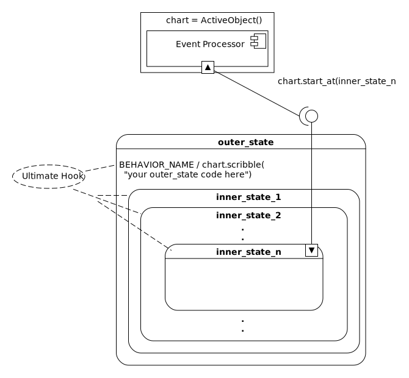
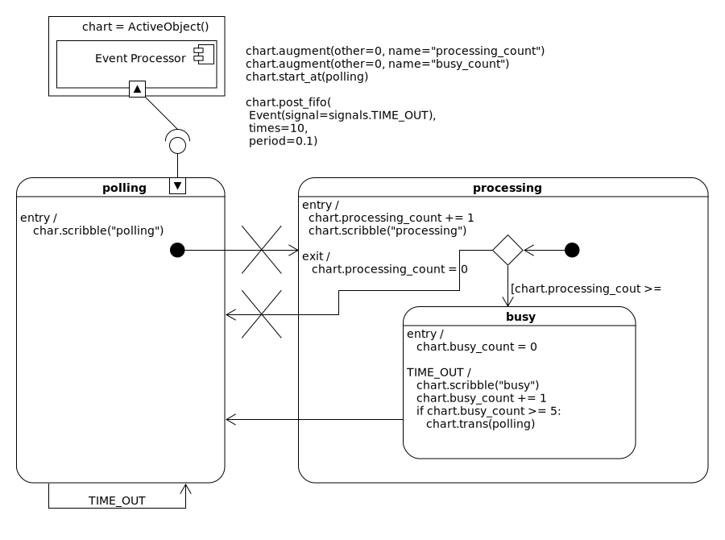
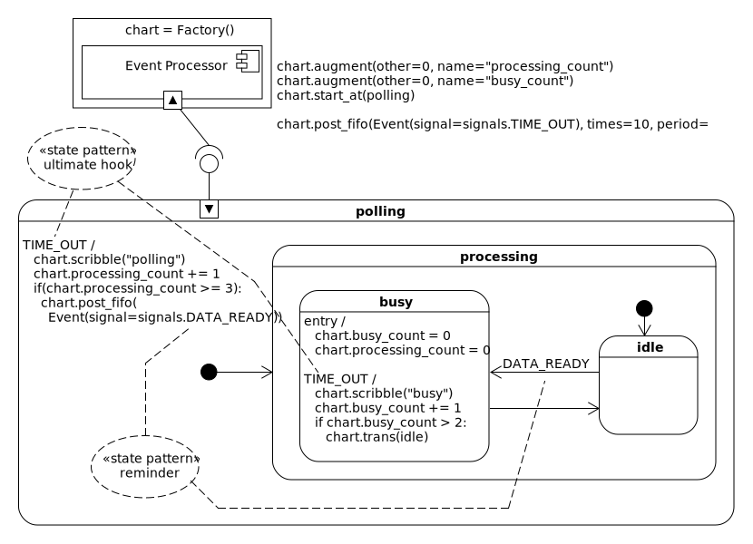
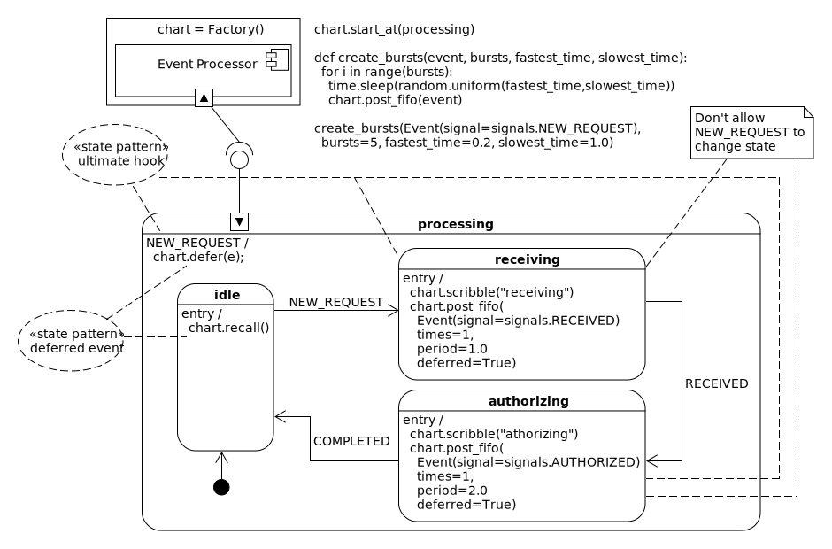
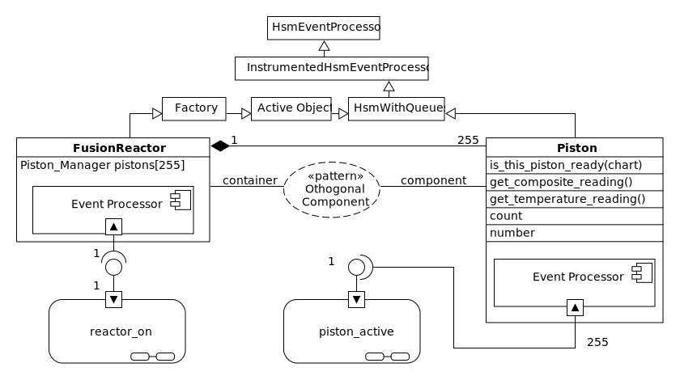
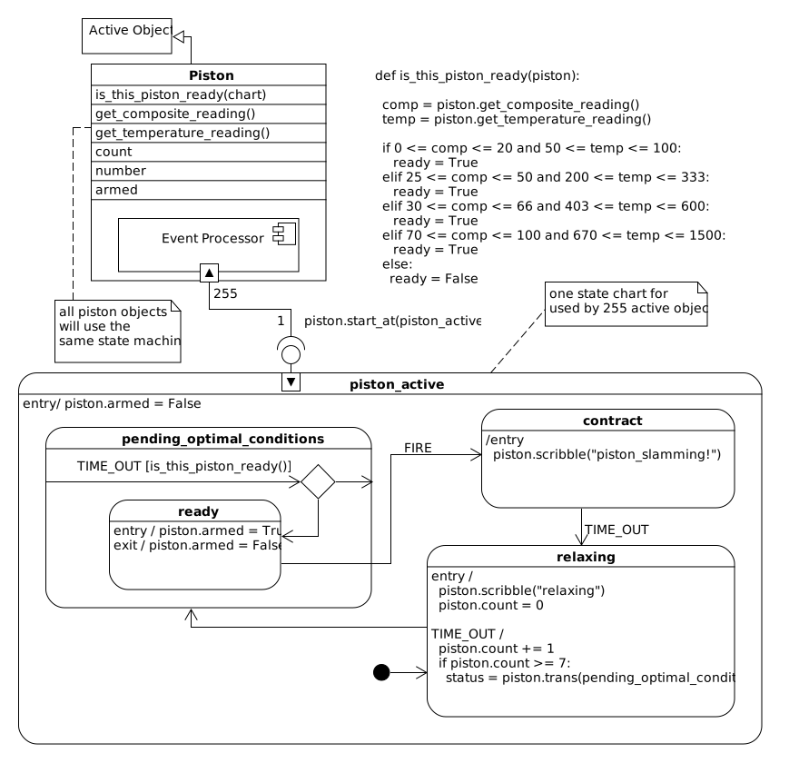

.. _patterns:

.. hlist::
  :columns: 3

  * :ref:`ultimate hook<patterns-ultimate-hook>`
  * :ref:`reminder<patterns-reminder>`
  * :ref:`deferred event<patterns-deferred-event>`
  * :ref:`orthogonal component<patterns-orthogonal-component>`
  * :ref:`transition to history<patterns-transition-to-history>`
  * :ref:`multichart race<patterns-multichart-race>`
  * :ref:`multichart pend<patterns-multichart-pend>`

Patterns
========
The idea of software design patterns came from the architect Christopher
Alexander.  He wrote a book, `a pattern language`_, about how different approaches
to architecture could be used across different scales (from the country to the
pantry) to help people feel better about living in their communities.  It's a
lovely book; a child can understand it yet it is still useful to professional
architects.

This can not be said for the book it inspired in computer science, "Design
Patterns: Elements of Reusable Object-Oriented Software"  This book *was not*
child friendly, in fact everyone I knew secretly hated it because of its
illegibility; but would make sure to have a copy of it on their shelf to look
like they were in the club.

The ideas within the book were great and the follow up books that `translated
it into English`_ were really useful.  Basically it described a set of
techniques for solving classes of problems that come up over and over again.
If you haven't learned the patterns yet, find a copy of a patterns book written
by a practitioner in your language(s) and work through it.  You will level up.

In chapter 5 of "Practical UML STATECHARTS in C/C++" I was leveled up by Miro
Samek.  He describes 5 statechart patterns and made the bold claim that
**statecharts are a pattern of patterns**.  I completely agree with him.  So here
is my translation of his work into this library.  I'll start each pattern with
quotes from his book, then write about it within the context of this work.

.. toctree::
   :maxdepth: 2
   :caption: Contents:

.. _patterns-ultimate-hook:

Ultimate Hook
^^^^^^^^^^^^^
Formal description:

    [The Ultimate Hook Pattern provides a] common facilities and policies for
    handling events but let clients override and specialize every aspect of the
    system's behavior.

    The semantics of state nesting provide the desired mechanism of handling
    all events, first in the context of the client code (the nested state) and
    of automatically forwarding of all unhandled events to the [parent state]
    (the default behavior). In that way, the client code intercepts every
    stimulus and can override every aspect of the behavior. To reuse the
    default behavior, the client simply ignores the event and lets the
    superstate handle it (the [child state] inherits behavior from the
    superstate) [#1]_

Makes sense to me.  Keep up! ;)

To understand the ultimate hook pattern, you first have to understand what a
hook is.  It is just some code in an ``if-elif`` clause.   A hook is just some
code that catches an event, runs your :term:`client code<Client Code>` and then
returns something which tells the event processor to stop searching.  **A hook
doesn't cause a state transition**.  It is a way to get the event processor's
search algorithm to do work for you without changing state.

You see, anytime the event processor is trying to figure out what to do with an
event it needs to :ref:`search your
statechart<recipes-what-a-state-does-and-how-to-structure-it>`.  If it finds
that it needs to do a transition, it will enlist the heavy-duty parts of it's
algorithm to make sure that the :term:`Harel Formalism<Harel Formalism>`
occurs.  The hook has nothing to do with this, because it short circuits the
search before it does a transition, but not before it gets this search algorithm
to do some useful work.

If your if-else structure in your state method catches the signal name of an
event, runs your code, then returns the ``return_status.HANDLED`` back to the
event processor, no state transition will occur.  This is how you make a hook.
You make sure that part of your if-elif clause catches the event signal, runs
your :term:`client code<Client Code>` and returns the ``return_state.HANDLED``
value.

.. image:: _static/ultimate_hook1.svg
    :align: center

Here is a simple example which demonstrates a hook.  In this example we will
show that we can get some client code to run when we post an event with the
signal name of BEHAVIOR_NAME to your statechart:

.. code-block:: python
  :emphasize-lines: 10-13

  import time
  from miros.hsm import spy_on, pp
  from miros.activeobject import ActiveObject
  from miros.event import signals, Event, return_status

  @spy_on
  def outer_state(chart, e):
    status = return_status.UNHANDLED

    if(e.signal == signals.BEHAVIOR_NAME):
      # your code would go here
      chart.scribble("your outer_state code here")
      status = return_status.HANDLED
    else:
      chart.temp.fun = chart.top
      status = return_status.SUPER
    return status

  ao = ActiveObject()
  ao.start_at(outer_state)
  ao.post_fifo(Event(signal=signals.BEHAVIOR_NAME))
  time.sleep(0.001)
  pp(ao.spy())

The highlighted code describes the hook.  We see that when the BEHAVIOR_NAME
signal is caught by this state method it runs your :term:`client code<Client Code>` then returns ``return_status.HANDLED``.

The :ref:`spy<recipes-using-the-spy>` output would look like this:

.. code-block:: python
  :emphasize-lines: 7
  :linenos:

  ['START',
   'SEARCH_FOR_SUPER_SIGNAL:outer_state',
   'ENTRY_SIGNAL:outer_state',
   'INIT_SIGNAL:outer_state',
   '<- Queued:(0) Deferred:(0)',
   'BEHAVIOR_NAME:outer_state',
   'your outer_state code here',
   'BEHAVIOR_NAME:outer_state:HOOK',
   '<- Queued:(0) Deferred:(0)']

Lines 1-5 describe the first :term:`rtc<Run To Completion>` event which occurs
when we start the statechart.  Lines 5-9 of the
:ref:`spy<recipes-using-the-spy>` log actually describe the hook behavior.  The
event processor ran, searching the statechart starting at the outer_state
method to see if it knew how to process the BEHAVIOR_NAME signal and it did:
the :term:`client code<Client Code>` just
:ref:`scribbled<recipes-scribble-on-the-spy>` something into our
:ref:`spy<recipes-using-the-spy>` log so we can see what happened.  On line 7
we see the result of this in the :ref:`spy<recipes-using-the-spy>` log.
Furthermore, no state transition occurred.

.. image:: _static/ultimate_hook2.svg
    :align: center

Now suppose we add another state within the outer state and start our active
object there.

.. code-block:: python
  :emphasize-lines: 20-29, 32
  :linenos:

  import time
  from miros.hsm import spy_on, pp
  from miros.activeobject import ActiveObject
  from miros.event import signals, Event, return_status

  @spy_on
  def outer_state(chart, e):
    status = return_status.UNHANDLED

    if(e.signal == signals.BEHAVIOR_NAME):
      # your code would go here
      chart.scribble("your outer_state code here")
      status = return_status.HANDLED
    else:
      chart.temp.fun = chart.top
      status = return_status.SUPER
    return status

  @spy_on
  def inner_state(chart, e):
    if(e.signal == signals.BEHAVIOR_NAME):
      # your code would go here
      chart.scribble("your inner_state code here")
      status = return_status.HANDLED
    else:
      chart.temp.fun = chart.top
      status = outer_state
    return status

  ao = ActiveObject()
  ao.start_at(inner_state)
  ao.post_fifo(Event(signal=signals.BEHAVIOR_NAME))
  time.sleep(0.001)
  pp(ao.spy())

Then look at the :ref:`spy<recipes-using-the-spy>`:

.. code-block:: python
  :emphasize-lines: 9
  :linenos:

  ['START',
   'SEARCH_FOR_SUPER_SIGNAL:inner_state',
   'SEARCH_FOR_SUPER_SIGNAL:outer_state',
   'ENTRY_SIGNAL:outer_state',
   'ENTRY_SIGNAL:inner_state',
   'INIT_SIGNAL:inner_state',
   '<- Queued:(0) Deferred:(0)',
   'BEHAVIOR_NAME:inner_state',
   'your inner_state code here',
   'BEHAVIOR_NAME:inner_state:HOOK',
   '<- Queued:(0) Deferred:(0)']

Ok, no surprises.  The inner_state hooked the BEHAVIOR_NAME signal and
ran some :term:`client code<Client Code>`.

.. image:: _static/ultimate_hook3.svg
    :align: center

Now let's remove the handling of the BEHAVIOR_NAME from our
inner state and see what happens when we start the active object in the
inner_state then send it an event with the BEHAVIOR_NAME.

.. code-block:: python
  :emphasize-lines: 28-29
  :linenos:

  import time
  from miros.hsm import spy_on, pp
  from miros.activeobject import ActiveObject
  from miros.event import signals, Event, return_status

  @spy_on
  def outer_state(chart, e):
    status = return_status.UNHANDLED

    if(e.signal == signals.BEHAVIOR_NAME):
      # your code would go here
      chart.scribble("your outer_state code here")
      status = return_status.HANDLED
    else:
      chart.temp.fun = chart.top
      status = return_status.SUPER
    return status

  @spy_on
  def inner_state(chart, e):
    #if(e.signal == signals.BEHAVIOR_NAME):
    #  # your code would go here
    #  chart.scribble("your inner_state code here")
    #  status = return_status.HANDLED
    #else:
    #  chart.temp.fun = outer_state
    #  status = return_status.SUPER
    chart.temp.fun = outer_state
    status = return_status.SUPER
    return status

  ao = ActiveObject()
  ao.start_at(inner_state)
  ao.post_fifo(Event(signal=signals.BEHAVIOR_NAME))
  time.sleep(0.001)
  pp(ao.spy())

In the highlighted code you can see that I adjusted the inner_state to run as
if it's ``else`` method clause was always active.  I did this so that it would not
handle the BEHAVIOR_NAME signal.  Now we run the code and look at the
:ref:`spy<recipes-using-the-spy>` output.

.. code-block:: python
  :emphasize-lines: 8-11
  :linenos:

  ['START',
   'SEARCH_FOR_SUPER_SIGNAL:inner_state',
   'SEARCH_FOR_SUPER_SIGNAL:outer_state',
   'ENTRY_SIGNAL:outer_state',
   'ENTRY_SIGNAL:inner_state',
   'INIT_SIGNAL:inner_state',
   '<- Queued:(0) Deferred:(0)',
   'BEHAVIOR_NAME:inner_state',
   'BEHAVIOR_NAME:outer_state',
   'your outer_state code here',
   'BEHAVIOR_NAME:outer_state:HOOK',
   '<- Queued:(0) Deferred:(0)']

The highlighted lines show how our event processor tried to determine what to
do with the event containing the BEHAVIOR_NAME signal.

It called the inner_state with the event (8), it wasn't handled, so it
called the parent outer_state with the same event (9) and we see on
line (10) that the outer_state :term:`client code<Client Code>` was run.  Finally, on line (11)
the spy instrumentation tells us that it detected a hooked event.  When you see
this in the log it means there was no state transition.

So, the outer_state hook code caught an event that was sent to the
inner_state.  The :term:`Harel Formalism<Harel Formalism>` followed by the
event processor determines that when it has an event, it will search outward
from the current state, to the next :term:`parent state<Parent State>`, then the next parent state
over and over until your event is handled or, it reaches the top most state of
your :term:`HSM<Hierarchical State Machine>`. This means that any inner state
method will automatically inherit the hook code of any outer state.  The outer
most state contains the ultimate hook; this is why the pattern is called what
it is.

.. note::

  To show that there is some sort of explicit design feature occuring on your
  diagram, something that might be too subtle for someone to see right away UML
  provides a dotted-collaboration-bubble.  It is very easy to over use
  this feature and clutter up your diagram.

You can overwrite the behavior of the outer state hooks simply by explicitly
handling the signal in an inner state.  These ideas are very similar to
inheritance and overloading in object oriented programming.

As a designer you would write default :term:`client code<Client Code>` behavior
in the outer states of charts, and all of your inner states would get this
behavior for free.  If they needed to overwrite this behavior they would
specifically handle the event in their state methods.

.. image:: _static/ultimate_hook5.svg
    :align: center

You would place generic reactions to events in your outer states and place the
specific responses in your inner states. Let's build out the above diagram:

.. code-block:: python
  :emphasize-lines: 6-8, 10-12, 14-17

  import time
  from miros.hsm import pp
  from miros.activeobject import Factory
  from miros.event import signals, Event, return_status

  def process_a_generic(chart, e):
    chart.scribble('processing a generic')
    return return_status.HANDLED

  def process_b_generic(chart, e):
    chart.scribble('processing b generic')
    return return_status.HANDLED

  # overrides the generic hook while in the specific state
  def process_a_specific(chart, e):
    chart.scribble('processing a specific')
    return return_status.HANDLED

  chart = Factory('ultimate_hook_example')
  generic = chart.create(state='generic'). \
    catch(signal=signals.a, handler=process_a_generic). \
    catch(signal=signals.b, handler=process_b_generic). \
    to_method()

  specific = chart.create(state='specific'). \
      catch(signal=signals.a, handler=process_a_specific). \
      to_method()

  chart.nest(generic, parent=None). \
        nest(specific, parent=generic)

  chart.start_at(specific)
  chart.post_fifo(Event(signal=signals.b))
  chart.post_fifo(Event(signal=signals.a))
  time.sleep(0.001)
  pp(chart.spy())

First of all we notice that instead of using an active object the diagram asks
us to use a :ref:`factory<towardsthefactoryexample-using-the-factory-class>`.
To use the factory we create states and tie specific signals to callback
functions.

The highlighted code shows the callback functions that are acting like hooks.
Pay special attention to what they return.  If they do not return
``return_status.HANDLED`` they will not work as hooks.

We can deterime if we got the expected behavior by looking at the
:ref:`spy<recipes-using-the-spy>` log:

.. code-block:: python
  :emphasize-lines: 10, 11, 14, 15
  :linenos:

  ['START',
   'SEARCH_FOR_SUPER_SIGNAL:specific',
   'SEARCH_FOR_SUPER_SIGNAL:generic',
   'ENTRY_SIGNAL:generic',
   'ENTRY_SIGNAL:specific',
   'INIT_SIGNAL:specific',
   '<- Queued:(0) Deferred:(0)',
   'b:specific',
   'b:generic',
   'processing b generic',
   'b:generic:HOOK',
   '<- Queued:(1) Deferred:(0)',
   'a:specific',
   'processing a specific',
   'a:specific:HOOK',
   '<- Queued:(0) Deferred:(0)']

On lines 10 and 11 we see the reaction to our first ``b`` signal.  As expected
the generic state's hook function was run while the statechart remained in the
specific state.

On lines 14 and 15 we see the specific behavior for the ``a`` signal.  The
statechart ran the :term:`client code<Client Code>` in the specific state then
stopped processing the signal.

.. _patterns-reminder:

Reminder
^^^^^^^^

Formal description:

  "Make the statechart topology more flexible by inventing an event an posting
  it to itself.

  Often in state modeling, loosely related functions of a system are strongly
  coupled by a common event. Consider, for example, periodic data acquisition,
  in which a sensor producing the data needs to be polled at a predetermined
  rate. Assume that a periodic TIME_OUT event is dispatched to the system at
  the desired rate to provide the stimulus for polling the sensor. Because the
  system has only one external event (the TIME_OUT event), it seems that this
  event needs to trigger both the polling of the sensor and the processing of
  the data. A straightforward but suboptimal solution is to organize the state
  machine into two distinct orthogonal regions (for polling and processing).
  However, orthogonal regions increase the cost of dispatching events ... and
  require complex synchronization between the regions because the polling and
  processing are not quite independent." [#2]_

.. note::
  If you find yourself drawing two separate states with a lot of arrows
  connecting them, remind yourself of this :ref:`reminder
  pattern<patterns-reminder-here>`.

The reminder pattern uses the :ref:`ultimate hook<patterns-ultimate-hook>`
pattern mixed with :term:`artificial event<Artificial Event>` injection.  It's
an :term:`artificial event<Artificial Event>` because it is invented by the
statechart and injected to itself rather than being invented and injected by an
outside caller.

I'll try to explain this idea by showing a bad, but working design, show how it
is expensive and then refactor the design using the :ref:`reminder
pattern<patterns-reminder-here>`.

We will begin with some specifications:

* Part of the system will poll a sensor based on a system clock running with
  a period of 100ms.
* Once polled this information will be sent to some processing code.
* After three such events, the system will perform some processing and it will
  enter a busy state (maybe communicating with a server).
* While the unit is in a busy state it should not poll the sensor or process
  input.
* After the busy process is completed the system should go back into it's
  polling mode.

Here is a first shot at implementing this specification:

We create a polling state which upon entry poles something.  Any time there is
a time out it will re-enter the state making this happen.

Then when it initializes it transitions into the processing state.  Upon
entering the processing state we add one to the ``chart.processing_count`` and
then process the message.  When the processing state initializes itself it will
either go back to the polling state or enter the busy state, if the
``chart.processing_count`` is high enough.

Upon entering the busy state the ``chart.busy_count`` is set to zero.  Then the
TIME_OUT event is used with a :term:`hook<Hook>` to work the information.  In
this example we just scribble "busy" into the :ref:`spy<recipes-using-the-spy>`
log.  Then we add 1 to our ``chart.busy_count``.  If the count is big enough we
transition back to the polling state.  Upon exiting the processing state, the
``chart.processing_count`` is set to 0.  That should work!  

Actually, it won't work at all.

Notice the large **Xs** on the diagram.  These are there to show that they
are illegal transitions.  The Miro Samek event processing algorithm will only
allow INIT_SIGNAL events to drill further into child states; they can not leave there
current state and navigate to another region of the chart.  I'll just pretend I
didn't know about this and continue.

Let's see what happens when we try to make this broken statechart

.. code-block:: python
  :emphasize-lines: 14,15,27,28

  import time
  from miros.hsm import pp
  from miros.activeobject import Factory
  from miros.event import signals, Event, return_status

  def polling_time_out(chart, e):
    return chart.trans(polling)

  def polling_enter(chart, e):
    chart.scribble("polling")
    return return_state.HANDLED

  def polling_init(chart, e):
    # illegal (init can't leave parent states)
    return chart.trans(processing)

  def processing_entry(chart, e):
    chart.processing_count += 1
    chart.scribble("processing")
    return return_status.HANDLED

  def processing_init(chart, e):
    status = None
    if chart.processing_count >= 3:
      status = chart.trans(busy)
    else:
      # illegal (init can't leave parent states)
      status = chart.trans(polling)
    return status

  def processing_exit(chart, e):
    chart.processing_count = 0
    return return_status.HANDLED

  def busy_entry(chart, e):
    chart.busy_count = 0
    return return_status.HANDLED

  def busy_time_out(chart, e):
    chart.busy_count += 1
    status = return_status.HANDLED
    if chart.busy_count >= 2:
      status = chart.trans(polling)
    return status

  chart = Factory('reminder_pattern_needed_1')
  chart.augment(other=0, name="processing_count")
  chart.augment(other=0, name="busy_count")

  polling = chart.create(state="polling"). \
              catch(signal=signals.TIME_OUT, handler=polling_time_out). \
              catch(signal=signals.INIT_SIGNAL, handler=polling_init). \
              catch(signal=signals.PROCESS, handler=polling_init). \
              to_method()

  processing = chart.create(state="processing"). \
              catch(signal=signals.ENTRY_SIGNAL, handler=processing_entry). \
              catch(signal=signals.INIT_SIGNAL, handler=processing_init). \
              catch(signal=signals.EXIT_SIGNAL, handler=processing_exit). \
              to_method()

  busy = chart.create(state="busy"). \
          catch(signal=signals.ENTRY_SIGNAL, handler=busy_entry). \
          catch(signal=signals.TIME_OUT, handler=busy_time_out). \
          to_method()

  chart.nest(polling, parent=None). \
        nest(processing, parent=None). \
        nest(busy, parent=processing)

  chart.start_at(polling)
  chart.post_fifo(Event(signal=signals.TIME_OUT), times=20, period=0.1)
  time.sleep(5)
  pp(chart.spy())

I have highlighted the :term:`illegal transitions<Illegal Transition>`.

If we run the code we will see:

.. code-block:: python

  miros.hsm.HsmTopologyException:
    impossible chart topology for HsmEventProcessor.init,
    see HsmEventProcessor.init doc string for details

So, how do we make this software work?  When you see this
:term:`HsmToplogyException<HsmToplogyException>`, it's probably time to
consider another way to design your :term:`statechart<Statechart>`.  We will
get to that shortly, but for now let's find a way to force this software to
work the way we want it to.

Instead of making the INIT_SIGNAL transition outside of the state, we could
invent a new signal, post it to ourselves and pretend like it came from outside
of the active object.  Then our chart could react to it like it would to any
other event.  This kind of thing is called an :term:`artificial
event<Artificial Event>`.  Here is the code that would create an artificial
PROCESS event:

.. code-block:: python

  # If 'PROCESS' signal wasn't invented before invent it now
  # We post it to ourselves so we can react to it in the next rtc.
  chart.post_fifo(Event(signal=signals.PROCESS))

Now that we know how to do that let's redesign our statechart:

.. image:: _static/reminder2.svg
    :align: center

This introduces a new :term:`glyph<Pseudostate>` called the final state:

.. image:: _static/reminder3.svg
    :align: center

When you see this :term:`glyph<Pseudostate>` on a diagram it means, stop running.  So:

.. image:: _static/reminder4.svg
    :align: center

Would look like this as code:

  .. code-block:: python

    def processing_init(chart, e):
      status = return_status.HANDLED
      if chart.processing_count >= 3: # Square brackets on diagram.
        chart.processing_count = 0
        status = chart.trans(busy) # HEAVY-DUTY Harel Formalism run here.
                                   # This is recursive and might take
                                   # a while  before this
                                   # routine finishes.
      else:
        # If 'POLL' signal wasn't invented before invent it now.
        # We post it to ourselves so we can react to it in the next rtc.
        chart.post_fifo(
          Event(signal=signals.POLL))
      return status

Ok now that we have that all out of the way let's start fresh, reconsidering
our specification and our proposed design, then implement it in code:

* Part of the system will poll a sensor based on a system clock running with
  a period of 100ms.
* Once polled this information will be sent to some processing code.
* After three such events, the system will perform some processing and it will
  enter a busy state (maybe communicating with a server).
* While the unit is in a busy state it should not poll the sensor or process
  input.
* After the busy process is completed the system should go back into it's
  polling mode.

.. image:: _static/reminder2.svg
    :align: center

Here is the code for this design with highlights for the :term:`artificial
events<Artificial Event>`:

.. code-block:: python
  :emphasize-lines: 8,9,26,27,53,60

  import time
  from miros.hsm import pp
  from miros.activeobject import Factory
  from miros.event import signals, Event, return_status

  def polling_time_out(chart, e):
    chart.scribble("polling")
    chart.post_fifo(
      Event(signal=signals.PROCESS))
    return return_status.HANDLED

  def polling_process(chart, e):
    return chart.trans(processing)

  def processing_entry(chart, e):
    chart.processing_count += 1
    chart.scribble("processing")
    return return_status.HANDLED

  def processing_init(chart, e):
    status = return_status.HANDLED
    if chart.processing_count >= 3:
      chart.processing_count = 0
      status = chart.trans(busy)
    else:
      chart.post_fifo(
        Event(signal=signals.POLL))
    return status

  def processing_poll(chart, e):
    return chart.trans(polling)

  def processing_exit(chart, e):
    return return_status.HANDLED

  def busy_entry(chart, e):
    chart.busy_count = 0
    return return_status.HANDLED

  def busy_time_out(chart, e):
    chart.scribble("busy")
    chart.busy_count += 1
    status = return_status.HANDLED
    if chart.busy_count > 2:
      status = chart.trans(polling)
    return status

  chart = Factory('reminder_pattern_needed_2')
  chart.augment(other=0, name="processing_count")
  chart.augment(other=0, name="busy_count")

  polling = chart.create(state="polling"). \
              catch(signal=signals.TIME_OUT, handler=polling_time_out). \
              catch(signal=signals.PROCESS,  handler=polling_process). \
              to_method()

  processing = chart.create(state="processing"). \
              catch(signal=signals.ENTRY_SIGNAL, handler=processing_entry). \
              catch(signal=signals.INIT_SIGNAL, handler=processing_init). \
              catch(signal=signals.EXIT_SIGNAL, handler=processing_exit). \
              catch(signal=signals.POLL, handler=processing_poll). \
              to_method()

  busy = chart.create(state="busy"). \
          catch(signal=signals.ENTRY_SIGNAL, handler=busy_entry). \
          catch(signal=signals.TIME_OUT, handler=busy_time_out). \
          to_method()

  chart.nest(polling,    parent=None). \
        nest(processing, parent=None). \
        nest(busy, parent=processing)

  chart.start_at(polling)
  chart.post_fifo(Event(signal=signals.TIME_OUT), times=20, period=0.1)
  time.sleep(1.0)
  pp(chart.spy())

If we run this code, it will output 1 seconds worth of information. The
comments in the spy log are the thoughts I would have while viewing it.

.. code-block:: python
  :emphasize-lines: 10,19,26,31,40,47,52,63,66,69,78, 79

   ['START', # start_at code running
   'SEARCH_FOR_SUPER_SIGNAL:polling', # Harel formalism search
   'ENTRY_SIGNAL:polling', # Harel formalism
   'INIT_SIGNAL:polling', # Harel formalism
   '<- Queued:(0) Deferred:(0)', # start_at code completed
   'TIME_OUT:polling', # time out event detected in polling
   'polling', # result of chart.scribble("polling")
   'POST_FIFO:PROCESS', # inventing and posting our artificial event
   'TIME_OUT:polling:HOOK',  # TIME_OUT was a hook, no state transition
   '<- Queued:(1) Deferred:(0)', # rtc completed (event waiting)
   'PROCESS:polling', # PROCESS event detected in polling
   'SEARCH_FOR_SUPER_SIGNAL:processing', # Harel formalism search
   'SEARCH_FOR_SUPER_SIGNAL:polling', # Harel formalism search
   'EXIT_SIGNAL:polling', # Harel formalism
   'ENTRY_SIGNAL:processing', # Harel formalism
   'processing', # result of chart.scribble("processing")
   'INIT_SIGNAL:processing', # Harel formalism
   'POST_FIFO:POLL', # chart.post_fifo(Event(signal=signals.POLL))
   '<- Queued:(1) Deferred:(0)', # rtc completed (event waiting)
   'POLL:processing', # polling state detected POLL event
   'SEARCH_FOR_SUPER_SIGNAL:polling', # Harel formalism search
   'SEARCH_FOR_SUPER_SIGNAL:processing', # Harel formalism search
   'EXIT_SIGNAL:processing', # Harel formalism
   'ENTRY_SIGNAL:polling', # Harel formalism
   'INIT_SIGNAL:polling', # Harel formalism
   '<- Queued:(0) Deferred:(0)', #rtc complete (no events waiting)
   'TIME_OUT:polling', # second TIME_OUT event cycle described above
   'polling',
   'POST_FIFO:PROCESS',
   'TIME_OUT:polling:HOOK',
   '<- Queued:(1) Deferred:(0)',
   'PROCESS:polling',
   'SEARCH_FOR_SUPER_SIGNAL:processing',
   'SEARCH_FOR_SUPER_SIGNAL:polling',
   'EXIT_SIGNAL:polling',
   'ENTRY_SIGNAL:processing',
   'processing',
   'INIT_SIGNAL:processing',
   'POST_FIFO:POLL',
   '<- Queued:(1) Deferred:(0)',
   'POLL:processing',
   'SEARCH_FOR_SUPER_SIGNAL:polling',
   'SEARCH_FOR_SUPER_SIGNAL:processing',
   'EXIT_SIGNAL:processing',
   'ENTRY_SIGNAL:polling',
   'INIT_SIGNAL:polling',
   '<- Queued:(0) Deferred:(0)',
   'TIME_OUT:polling', # third TIME_OUT event expecting something different now
   'polling', # result of chart.scribble("polling")
   'POST_FIFO:PROCESS',  # inventing and posting our artificial event
   'TIME_OUT:polling:HOOK', # TIME_OUT was a hook, no state transition
   '<- Queued:(1) Deferred:(0)', # rtc completed (event waiting)
   'PROCESS:polling', # PROCESS event detected in polling
   'SEARCH_FOR_SUPER_SIGNAL:processing', # Harel formalism search
   'SEARCH_FOR_SUPER_SIGNAL:polling', # Harel formalism search
   'EXIT_SIGNAL:polling', # Harel formalism
   'ENTRY_SIGNAL:processing', # Harel formalism
   'processing', # result of chart.scribble("processing")
   'INIT_SIGNAL:processing', # Harel formalism
   'SEARCH_FOR_SUPER_SIGNAL:busy', # Harel formalism search
   'ENTRY_SIGNAL:busy', # Harel formalism
   'INIT_SIGNAL:busy', # Harel formalism
   '<- Queued:(0) Deferred:(0)', # rtc completed
   'TIME_OUT:busy', # busy state detect it's first TIME_OUT
   'busy', # chart.scribble("busy")
   'TIME_OUT:busy:HOOK', # busy state hooks it and blocks it from leaving
   '<- Queued:(0) Deferred:(0)', # rtc completed
   'TIME_OUT:busy', # busy state detects it's second TIME_OUT
   'busy', # chart.scribble("busy")
   'SEARCH_FOR_SUPER_SIGNAL:polling', # Harel formalism search
   'SEARCH_FOR_SUPER_SIGNAL:busy', # Harel formalism search
   'EXIT_SIGNAL:busy', # Harel formalism
   'EXIT_SIGNAL:processing', # Harel formalism
   'SEARCH_FOR_SUPER_SIGNAL:processing', # Harel formalism search
   'ENTRY_SIGNAL:polling', # Harel formalism
   'INIT_SIGNAL:polling', # Harel formalism
   '<- Queued:(0) Deferred:(0)', # rtc completed
   'TIME_OUT:polling', # full circuit completed DESIGN CONFIRMED
   # deleting the rest of the log from documentation

The code works and we have met our specifications.

But the polling and the processing state are strongly coupled to the TIME_OUT
signal.  Our design of having the TIME_OUT start the system in the polling and
end up in the processing/busy state cost us a lot of CPU time.

Lets introduce the reminder pattern with a new design:

.. _patterns-reminder-here:

Let's discuss this diagram.

We use INIT_SIGNAL events to climb into the idle state.

We create a TIME_OUT ultimate hook, which is a method that can be used by any
state within the statechart.  This ultimate hook counts up each time it sees a
TIME_OUT and once this count hits 3 it posts an artificial event with the
signal DATA_READY.

Once the :term:`RTC<Run To Completion>` process is completed, idle will catch
the DATA_READY signal and transition into busy.  The busy state catches the
TIME_OUT event which means that it will not escape to the ultimate hook in
polling.  Instead it uses it to count up a busy_count and when it hits 2 it
will transition back into idle.

Now, let's write the code:

.. code-block:: python

  import time
  from miros.hsm import pp
  from miros.activeobject import Factory
  from miros.event import signals, Event, return_status

  def polling_time_out_hook(chart, e):
    '''generic TIME_OUT ultimate hook for all states,
       injects artificial event DATA_READY'''
    chart.scribble("polling")
    chart.processing_count += 1
    if(chart.processing_count >= 3):
      chart.post_fifo(Event(signal=signals.DATA_READY))
    return return_status.HANDLED

  def polling_init(chart, e):
    return chart.trans(processing)

  def processing_init(chart, e):
    return chart.trans(idle)

  def idle_data_ready(chart, e):
    return chart.trans(busy)

  def busy_entry(chart, e):
    chart.busy_count, chart.busy_count = 0, 0
    return return_status.HANDLED

  def busy_time_out_hook(chart, e):
    '''specific TIME_OUT hook for busy state'''
    status = return_status.HANDLED
    chart.scribble("busy")
    chart.busy_count += 1
    if(chart.busy_count >= 2):
      status = chart.trans(idle)
    return status

  chart = Factory('reminder')
  chart.augment(other=0, name="processing_count")
  chart.augment(other=0, name="busy_count")

  polling = chart.create(state="polling"). \
              catch(signal=signals.INIT_SIGNAL, handler=polling_init). \
              catch(signal=signals.TIME_OUT, handler=polling_time_out_hook). \
              to_method()

  processing = chart.create(state="processing"). \
                catch(signal=signals.INIT_SIGNAL, handler=processing_init). \
                to_method()

  idle = chart.create(state="idle"). \
          catch(signal=signals.DATA_READY, handler=idle_data_ready). \
          to_method()

  busy = chart.create(state="busy"). \
          catch(signal=signals.ENTRY_SIGNAL, handler=busy_entry). \
          catch(signal=signals.TIME_OUT, handler=busy_time_out_hook). \
              to_method()

  chart.nest(polling, parent=None). \
        nest(processing, parent=polling). \
        nest(idle, parent=processing). \
        nest(busy, parent=polling)

  chart.start_at(polling)
  chart.post_fifo(Event(signal=signals.TIME_OUT), times=20, period=0.1)
  time.sleep(1.0)
  pp(chart.spy())

If we run the code and looked at the spy log it would look like this: (I have
marked it up with comments)

.. code-block:: python
  :emphasize-lines: 11,17,23,30,39,43,54

  ['START', # start_at code running
   'SEARCH_FOR_SUPER_SIGNAL:polling', # Harel formalism search
   'ENTRY_SIGNAL:polling', # Harel formalism
   'INIT_SIGNAL:polling', # Harel formalism
   'SEARCH_FOR_SUPER_SIGNAL:processing', # Harel formalism search
   'ENTRY_SIGNAL:processing', # Harel formalism
   'INIT_SIGNAL:processing', # Harel formalism
   'SEARCH_FOR_SUPER_SIGNAL:idle', # Harel formalism search
   'ENTRY_SIGNAL:idle', # Harel formalism
   'INIT_SIGNAL:idle', # Harel formalism
   '<- Queued:(0) Deferred:(0)', # rtc completed
   'TIME_OUT:idle', # TIME_OUT detected in idle
   'TIME_OUT:processing', # TIME_OUT passed out to processing
   'TIME_OUT:polling', # TIME_OUT passed to polling
   'polling', # chart.scribble("polling")
   'TIME_OUT:polling:HOOK', # TIME_OUT hooked by the polling
   '<- Queued:(0) Deferred:(0)', # rtc completed
   'TIME_OUT:idle', # Second TIME_OUT circuit - dynamics same as above
   'TIME_OUT:processing',
   'TIME_OUT:polling',
   'polling',
   'TIME_OUT:polling:HOOK',
   '<- Queued:(0) Deferred:(0)',
   'TIME_OUT:idle', # Third TIME_OUT event
   'TIME_OUT:processing', 
   'TIME_OUT:polling',
   'polling',
   'POST_FIFO:DATA_READY', # Posting the artificial event to the chart
   'TIME_OUT:polling:HOOK', # TIME_OUT hooked by pooling
   '<- Queued:(1) Deferred:(0)', # rtc completed with 1 item in queue
   'DATA_READY:idle', # DATA_READY seen by idle state
   'SEARCH_FOR_SUPER_SIGNAL:busy', # Harel formalism search
   'SEARCH_FOR_SUPER_SIGNAL:idle', # Harel formalism search
   'SEARCH_FOR_SUPER_SIGNAL:polling', # Harel formalism search
   'EXIT_SIGNAL:idle', # Harel formalism
   'EXIT_SIGNAL:processing', # Harel formalism
   'ENTRY_SIGNAL:busy', # Harel formalism (busy_entry call run)
   'INIT_SIGNAL:busy', # Harel formalism 
   '<- Queued:(0) Deferred:(0)', # rtc completed
   'TIME_OUT:busy', # busy sees TIME_OUT event
   'busy', # chart.scribble("busy") 
   'TIME_OUT:busy:HOOK',  # busy hooks TIME_OUT event
   '<- Queued:(0) Deferred:(0)', # rtc completed
   'TIME_OUT:busy', # second TIME_OUT event seen by busy
   'busy', # chart.scribble("busy")
   'SEARCH_FOR_SUPER_SIGNAL:idle', # this started by return chart.trans(idle)
   'SEARCH_FOR_SUPER_SIGNAL:busy', # Harel formalism search
   'SEARCH_FOR_SUPER_SIGNAL:processing', # Harel formalism search
   'SEARCH_FOR_SUPER_SIGNAL:polling', # Harel formalism search
   'EXIT_SIGNAL:busy', # Harel formalism
   'ENTRY_SIGNAL:processing', # Harel formalism
   'ENTRY_SIGNAL:idle', # Harel formalism
   'INIT_SIGNAL:idle', # Harel formalism
   '<- Queued:(0) Deferred:(0)' # rtc completed .. full circuit demonstrated
   .
   .
   ]

This design required a lot less CPU time.  This is especially important if you
are going to port your design to an embedded system.  If you are using Python
in production you will be much less concerned with performance (since you are
using Python), even so, it is still a better design.

.. NOTE::
  If you were to use the trace you might be surprised that the hooked code is
  hidden from view.

  .. code-block:: python

    print(chart.trace())
    [2017-12-14 06:49:22.157806] [reminder] e->start_at() top->idle
    [2017-12-14 06:49:22.461012] [reminder] e->DATA_READY() idle->busy
    [2017-12-14 06:49:22.661728] [reminder] e->TIME_OUT() busy->idle
    [2017-12-14 06:49:22.763392] [reminder] e->DATA_READY() idle->busy
    [2017-12-14 06:49:22.963635] [reminder] e->TIME_OUT() busy->idle
    [2017-12-14 06:49:23.064705] [reminder] e->DATA_READY() idle->busy

  This is because the trace will only track items which cause state transitions
  and hooks do not cause state transitions.

.. _patterns-deferred-event:

Deferred Event
^^^^^^^^^^^^^^

Formal description:
  "Simplify state machines by modifying the sequencing of events" [#3]_

In reactive systems events come in `bursts`_.  They come whenever they come
with no regard for the current state of your statechart.

Suppose you were building a bank machine where the receiving and authorization
stages involved some complex computing.  To interrupt these states to deal with
an inconveniently timed request would be difficult to program.

Instead of coming up with some complicated scheme for shelving our work to
process new requests, we just defer the event, then re-inject the event into
our statechart when it's timing is more convenient.

Here is an example of a chart using the deferred event pattern.  

To begin with the chart climbs into the idle state.  Upon receiving it's first
NEW_REQUEST it transitions into the receiving state.  After a second of
processing it transitions into the authorizing state.  After the authorizing
state processes for 2 seconds it transitions back to the idle state.

The reminder pattern occurs when a NEW_REQUEST event is seen while the system
is either in receiving or authorizing.  This NEW_REQUEST event is ignored by
these states and caught by the hook in processing.  The processing state places
this NEW_REQUEST event into the deferred queue then passes the program's
control back into whichever state was currently active.

The idle state behaves differently, upon entering, it recalls any events that
were placed in the deferred queue.  This effectively transfers them into the
active object working queue and for all intents and purposes the statechart
will think that this event was just posted to it from the outside world.  In
the next RTC the idle state will react to the posted NEW_REQUEST by
transitioning into the receiving state and the cycle will continue.

Now that you have a high level view of how things are working I will talk about
timing.  The receiving and authorizing states are simulating difficultly by
using one shot events.  We are pretending that instead of just waiting around
for a one shot to fire, that instead, something really important is happening
in the background which we do not want to interrupt.

The event bursts, use to interrupt our chart, will be done with the
``create_bursts`` function seen on the diagram.  All this function does is to
waste a random amount of time between a few NEW_REQUEST events so that we can
see how are chart reacts.

We will use both the trace and spy instrumentation to look at our timing.  The
trace outputs timing information for state transitions.  So we will use the
trace to see if our chart state transitions remains steady despite the chaos we
are sending at it.  To confirm that we aren't just fooling ourselves we will
use the spy and scribble when timed events hit the chart.

Now let's redraw the diagram and then write it's code:

.. code-block:: python
  :emphasize-lines: 10,11,19,20

  import random
  import time
  from datetime import datetime
  from miros.hsm import pp
  from miros.activeobject import Factory
  from miros.event import signals, Event, return_status

  def processing_entry(chart, e):
    chart.defer(e)
    chart.scribble("deferred at {}". \
        format(datetime.now().strftime("%M:%S:%f")))
    return return_status.HANDLED

  def processing_init(chart, e):
    return chart.trans(idle)

  def idle_entry(chart, e):
    chart.recall()
    chart.scribble("recalled at {}". \
        format(datetime.now().strftime("%M:%S:%f")))
    return return_status.HANDLED

  def idle_new_request(chart, e):
    return chart.trans(receiving)

  def receiving_entry(chart, e):
    chart.scribble("receiving")
    chart.post_fifo(
      Event(signal=signals.RECEIVED),
      times=1,
      period=1.0,
      deferred=True)
    return return_status.HANDLED

  def receiving_received(chart, e):
    return chart.trans(authorizing)

  def authorizing_entry(chart, e):
    chart.scribble("authorizing")
    chart.post_fifo(
      Event(signal=signals.COMPLETED),
      times=1,
      period=2.0,
      deferred=True)
    return return_status.HANDLED

  def authorizing_authorized(chart, e):
    return chart.trans(idle)

  chart = Factory('deferred')
  
  processing = chart.create(state="processing"). \
                catch(signal=signals.NEW_REQUEST, handler=processing_entry). \
                catch(signal=signals.INIT_SIGNAL, handler=processing_init). \
                to_method()

  idle = chart.create(state='idle'). \
          catch(signal=signals.ENTRY_SIGNAL, handler=idle_entry). \
          catch(signal=signals.NEW_REQUEST, handler=idle_new_request). \
          to_method()

  receiving = chart.create(state='receiving'). \
                catch(signal=signals.ENTRY_SIGNAL, handler=receiving_entry). \
                catch(signal=signals.RECEIVED, handler=receiving_received). \
                to_method()

  authorizing = chart.create(state='authorizing'). \
                  catch(signal=signals.ENTRY_SIGNAL, 
                      handler=authorizing_entry). \
                  catch(signal=signals.COMPLETED,
                      handler=authorizing_authorized). \
                  to_method()

  chart.nest(processing, parent=None). \
        nest(idle, parent=processing). \
        nest(receiving, parent=processing). \
        nest(authorizing, parent=processing)

  chart.start_at(processing)

  def burst_event(event, bursts, fastest_time, slowest_time):
    for i range(bursts):
      time.sleep(random.uniform(fastest_time,slowest_time))
      chart.post_fifo(event)

  burst_event(Event(signal=signals.NEW_REQUEST),
               bursts=5,
               fastest_time=0.2,
               slowest_time=1.0)

  print(chart.trace())
  time.sleep(6)
  pp(chart.spy())

I have highlighted the code that I excluded from the diagram.  It is code that
will put timing information into the spy log.

When we run this test, it could take between 7 and 11 seconds.  The trace
and spy results I get will be different from what you get because of the
stochastic characteristics of when the events are posted to the statechart.

Let's first look at the trace output and confirm that our statechart behaves as
we intended:

.. code-block:: python

  [2017-12-15 09:20:49.465806] [deferred] e->start_at() top->idle
  [2017-12-15 09:20:50.435495] [deferred] e->NEW_REQUEST() idle->receiving
  [2017-12-15 09:20:51.451824] [deferred] e->RECEIVED() receiving->authorizing
  [2017-12-15 09:20:53.458799] [deferred] e->COMPLETED() authorizing->idle
  [2017-12-15 09:20:53.459805] [deferred] e->NEW_REQUEST() idle->receiving
  [2017-12-15 09:20:54.461726] [deferred] e->RECEIVED() receiving->authorizing
  [2017-12-15 09:20:56.463891] [deferred] e->COMPLETED() authorizing->idle
  [2017-12-15 09:20:56.464915] [deferred] e->NEW_REQUEST() idle->receiving
  [2017-12-15 09:20:57.466761] [deferred] e->RECEIVED() receiving->authorizing
  [2017-12-15 09:20:59.468877] [deferred] e->COMPLETED() authorizing->idle
  [2017-12-15 09:20:59.469876] [deferred] e->NEW_REQUEST() idle->receiving

The received state takes about 1 second to complete, so we are expecting to see
that the time between a NEW_REQUEST and a RECEIVED event should be about 1
second.  From inspection on lines 2-3, 5-6, 8-9 we see this is true:

.. code-block:: python
  :linenos:

  .
  [2017-12-15 09:20:50.435495] [deferred] e->NEW_REQUEST() idle->receiving
  [2017-12-15 09:20:51.451824] [deferred] e->RECEIVED() receiving->authorizing
  .
  [2017-12-15 09:20:53.459805] [deferred] e->NEW_REQUEST() idle->receiving
  [2017-12-15 09:20:54.461726] [deferred] e->RECEIVED() receiving->authorizing
  .
  [2017-12-15 09:20:56.464915] [deferred] e->NEW_REQUEST() idle->receiving
  [2017-12-15 09:20:57.466761] [deferred] e->RECEIVED() receiving->authorizing
  .
  .

The authorizing state takes about 2 seconds to complete so the RECEIVED and
COMPLETED events should be about 2 seconds apart.  From the inspection of lines
3-4, 6-7 and 9-10 we see this is true.

.. code-block:: python
  :linenos:

  .
  .
  [2017-12-15 09:20:51.451824] [deferred] e->RECEIVED() receiving->authorizing
  [2017-12-15 09:20:53.458799] [deferred] e->COMPLETED() authorizing->idle
  .
  [2017-12-15 09:20:54.461726] [deferred] e->RECEIVED() receiving->authorizing
  [2017-12-15 09:20:56.463891] [deferred] e->COMPLETED() authorizing->idle
  .
  [2017-12-15 09:20:57.466761] [deferred] e->RECEIVED() receiving->authorizing
  [2017-12-15 09:20:59.468877] [deferred] e->COMPLETED() authorizing->idle
  .

The deferred event pattern states that we will react to the recalled events
immediately and we can see this behavior on lines 4-5 and 8-9

.. code-block:: python
  :linenos:

  .
  .
  .
  [2017-12-15 09:20:53.458799] [deferred] e->COMPLETED() authorizing->idle
  [2017-12-15 09:20:53.459805] [deferred] e->NEW_REQUEST() idle->receiving
  .
  [2017-12-15 09:20:56.463891] [deferred] e->COMPLETED() authorizing->idle
  [2017-12-15 09:20:56.464915] [deferred] e->NEW_REQUEST() idle->receiving
  .
  .
  .

Now we have to confirm that NEW_REQUEST events were sent at random times and
deferred by the chart.  To do this we will have to dig into the spy log.  To
make it easier to see I will put spaces after the RTC event and I will
highlight the moments when a NEW_REQUEST was seen and defered by the
chart:

.. code-block:: python
  :emphasize-lines: 23, 39, 46, 53

  ['START',
   'SEARCH_FOR_SUPER_SIGNAL:processing',
   'ENTRY_SIGNAL:processing',
   'INIT_SIGNAL:processing',
   'SEARCH_FOR_SUPER_SIGNAL:idle',
   'ENTRY_SIGNAL:idle',
   'recalled at 20:49:465806',
   'INIT_SIGNAL:idle',
   '<- Queued:(0) Deferred:(0)',

   'NEW_REQUEST:idle',
   'SEARCH_FOR_SUPER_SIGNAL:receiving',
   'SEARCH_FOR_SUPER_SIGNAL:idle',
   'EXIT_SIGNAL:idle',
   'ENTRY_SIGNAL:receiving',
   'receiving',
   'INIT_SIGNAL:receiving',
   '<- Queued:(0) Deferred:(0)',
   
   'NEW_REQUEST:receiving',
   'NEW_REQUEST:processing',
   'POST_DEFERRED:NEW_REQUEST',
   'deferred at 20:51:020281',
   'NEW_REQUEST:processing:HOOK',
   '<- Queued:(0) Deferred:(1)',

   'RECEIVED:receiving',
   'SEARCH_FOR_SUPER_SIGNAL:authorizing',
   'SEARCH_FOR_SUPER_SIGNAL:receiving',
   'EXIT_SIGNAL:receiving',
   'ENTRY_SIGNAL:authorizing',
   'authorizing',
   'INIT_SIGNAL:authorizing',
   '<- Queued:(0) Deferred:(1)',

   'NEW_REQUEST:authorizing',
   'NEW_REQUEST:processing',
   'POST_DEFERRED:NEW_REQUEST',
   'deferred at 20:51:664940',
   'NEW_REQUEST:processing:HOOK',
   '<- Queued:(0) Deferred:(2)',

   'NEW_REQUEST:authorizing',
   'NEW_REQUEST:processing',
   'POST_DEFERRED:NEW_REQUEST',
   'deferred at 20:52:219593',
   'NEW_REQUEST:processing:HOOK',
   '<- Queued:(0) Deferred:(3)',

   'NEW_REQUEST:authorizing',
   'NEW_REQUEST:processing',
   'POST_DEFERRED:NEW_REQUEST',
   'deferred at 20:53:219562',
   'NEW_REQUEST:processing:HOOK',
   '<- Queued:(0) Deferred:(4)',

   'COMPLETED:authorizing',
   'SEARCH_FOR_SUPER_SIGNAL:idle',
   'SEARCH_FOR_SUPER_SIGNAL:authorizing',
   'EXIT_SIGNAL:authorizing',
   'ENTRY_SIGNAL:idle',
   'RECALL:NEW_REQUEST',
   'POST_FIFO:NEW_REQUEST',
   'recalled at 20:53:459805',
   'INIT_SIGNAL:idle',
   '<- Queued:(1) Deferred:(3)',
    .
    .
    .
   'INIT_SIGNAL:receiving',
   '<- Queued:(0) Deferred:(9)']

From the highlighted time stamps we see that these event injections were
sporatic; so it is safe to assume the design worked.

It turns out the design is a lot easier to explain and write than it is to
verify.  You might be wondering what happens if more items are posted than
there are slots in the deferred queue.  The deferred queue is a ``deque``, which
means it is a kind of ring buffer.  It you overflow it, it will remove the
oldest item and push the newest item onto the tail end of the queue.  It has a
queue size of 500.

.. NOTE::
  The spy log does not contain timing information.  To add timing information to the
  spy only takes a little effort; use the scribble method with a
  ``datetime.now()`` call.

.. _patterns-orthogonal-component:

Orthogonal Component
^^^^^^^^^^^^^^^^^^^^

Formal description:
  "Use state machines as components."

In the original statechart paper written by David Harel he describes how his
formalism needs to capture requirements like "[The] gearbox change of state is
independent of [the] braking system".  For this he invented something called a
'orthogonal region':

.. image:: _static/orthogonal_region1.svg
    :align: center

The two different areas in the above chart separated by the dotted line are
orthogonal regions.  They represent two separate state machines that act
independent of one another but are both turned on when the truck state is
initiated.

This part of the Harel formalism is not supported by the Miro Samek event
processing algorithm.  But, it would be trivial to implement within the miros
library, by building two separate active objects and letting them run
independently.

If you would like such a structure in your machine, you could use an orthogonal
component instead.  An orthogonal component is just a statechart that can
dispatch messages directly into another one.

Imagine we are asked to build some software for the general fusion reactor:

    "The General Fusion's Magnetized Target Fusion system uses a sphere filled
    with molten lead-lithium that is pumped to form a vortex.  A pulse of
    magnetically-confined plasma fuel is then injected into the vortex. Around
    the sphere, an array of pistons drive a pressure wave into the centre of
    the sphere, compressing the plasma to fusion conditions. This process is
    then repeated, while the heat from the reaction is captured in the liquid
    metal and used to generate electricity via a steam turbine."

Ambitious.  Ok, let's say we have to write the firing mechanism to cause all of
the pistons to initiate the pressure wave.  

.. raw:: html

  

  <iframe width="560" height="315" src="https://www.youtube.com/embed/zf8QIJ2VgqU" frameborder="0" gesture="media" allow="encrypted-media" allowfullscreen></iframe>
  

Each piston has a set of transducers to measure the local conditions of the
molten lead-lithium.  The first transducer provides a composite reading that
abstracts away a lot of the physics; it provides numbers between 0 and 100.
The second transducer measures the temperature; it's range is 0 to 9000 degrees
Celsius.  A piston can only fire after 1 second has passed since the last
firing event and once it passes this time threshold it would like to fire as
soon as possible so that the fusion reactor can output the maximum amount of
power.  All of the pistons have to fire at the same time.

There are 255 pistons.

Through a lot of trial and error it has been found a piston can fire in the
following situations:

============================  =========================================
Composite Transducer Reading  Temperature Transducer  [degrees Celsius]
============================  =========================================
0-20                          50-100 
25-50                         200-333
30-66                         403-600 
70-100                        670-1500 
============================  =========================================

Let's design the system.  First we will need to fake out the temperature and
composite transducer readings.  This can be done with an infinite impulse
response filter and a random number generator using a flat distribution.

.. code-block:: python

    class FakeNewsSpec:
    ''' provides the following syntax:
        spec.initial_value
        spec.aggression
        spec.minimum
        spec.maximum
    '''
    def __init__(self,
                  aggression=0,
                  initial_value=None,
                  minimum=None,
                  maximum=None):
      if minimum is None:
        assert(0)
      if maximum is None:
        assert(0)
      if minimum >= maximum:
        assert(0)

      if initial_value is None:
        initial_value = (maximum - minimum) / 2.0
      elif initial_value < minimum:
        initial_value = minimum
      elif initial_value > maximum:
        initial_value = maximum

      self.initial_value = initial_value
      self.aggression    = aggression
      self.minimum       = minimum
      self.maximum       = maximum

  def fake_news(spec):
    '''
      # aggression ranges from 1 to 100.  1 is the least aggressive and 100 is
      # the most agressive
      fn = fake_news(
        FakeNewsSpec(minimum=0, maximum=100, initial_value=45, aggression=50))
      for i in range(5):
        print(fn())
      # 70.40052265431565
      # 98.55643192543394
      # 63.607687838082626
      # 96.33858152348765
      # 47.2780049249278

    '''
    AGGRESSION_MAX = 100
    '''returns a function that will generate the kind of fake news specified'''
    import random
    random.seed()

    if 1 <= spec.aggression <= AGGRESSION_MAX:
      aggression = spec.aggression
    elif spec.aggression < 1:
      aggression = 1
    else:
      aggression = AGGRESSION_MAX

    def _fake_news_generator():
      '''provides an infinite set of number within the spec'''
      current_number = spec.initial_value

      while(True):
        random_number  = random.uniform(spec.minimum, spec.maximum)
        # IIR (infinite impulse response)
        current_number = ((aggression * random_number +
                           (AGGRESSION_MAX - aggression) *
                           current_number)) / AGGRESSION_MAX
        yield current_number

    def _fake_news():
      '''just hides the next syntax'''
      return next(_fake_news_generator())

    return _fake_news

Ok, let's try it out:

.. code-block:: python

  transducer_worker = fake_news(
                        FakeNewsSpec(minimum=0, maximum=100,
                                     initial_value=45, aggression=20))
  for i in range(10):
    print(transducer_worker())
  # 39.41035307935898
  # 51.639646042274904
  # 53.30613755950629

The numbers are phasing about which is what we wanted. Pushing on.

`Michel Laberge`_ can't make up his mind about the piston's firing criteria, so
we have to make sure it's easy to change.  We will create a selection function
then we can inject it into the chart.  For now we define it as this:

.. code-block:: python

  def is_this_piston_ready(chart):
    transducers_say_go = False
    comp = chart.get_composite_reading()
    temp = chart.get_temperater_reading()

    if 0  <= comp <= 20 and
       50 <= temp <= 100:
       transducers_say_go |= True
    elif 25  <= comp <= 50 and
         200 <= temp <= 333:
       transducers_say_go |= True
    elif 30  <= comp <= 66 and
         403 <= temp <= 600:
       transducers_say_go |= True
    elif 70  <= comp <= 100 and
         670 <= temp <= 1500:
       transducers_say_go |= True
    else:
      transducers_say_go = False

    return transducers_say_go

This ``is_this_piston_ready`` function will be used by an individual piston to
determine if it is ready to fire.

Here is a UML class diagram of our approach:

The FireManager object will aggregate 255 PistonManager objects.  A piston
manager object will use the event dispatcher of the ActiveObject (which means I
can't use a factory).  Or if you just read the code, you would see that the
FireManager object will have a list containing 255 other active objects, each
keeping track of their individual piston state.

The PistonManager objects will each contain their own event dispatchers, their
own event queues; but they will all reference the same piston_manager state
machine.

We are going to use the polyamorous nature of state methods to implement the
255 piston managers.  Instead of having a separate piston manager statemachine
defined for each of the 255 active objects we will instead define one that is
shared by all of them.  I will link to it once per each active object and they
won't know that they don't contain them as methods within their own class.  I
have no idea how to represent this in UML.  So I will write it this way:

The state machine will be defined as:

  .. code-block:: python

    @spy_on
    def piston_ready(chart, e):
      status = return_status.UNHANDLED
      if(e.signal == signals.INIT_SIGNAL):
        status = chart.trans(relaxing)
      elif(e.signal == signals.TIME_OUT):
        chart.count += 1
        if chart.count >= 750:
          chart.count = 0
          chart.post(Event(signal=signals.PRIMED))
      else:
        status, chart.temp.fun = return_status.SUPER, chart.top
      return status

    @spy_on
    def relaxing(chart, e):
      status = return_status.UNHANDLED
      if(e.signal == signals.ENTRY_SIGNAL):
        chart.scribble("relaxing")
      else:
        status, chart.temp.fun = return_status.SUPER, piston_ready
      return status

    @spy_on
    def triggered(chart, e):
      status = return_status.UNHANDLED
      if(e.signal == signals.ENTRY_SIGNAL):
        chart.scribble("piston_slamming!")
      else:
        status, chart.temp.fun = return_status.SUPER, piston_ready
      return status

    @spy_on
    def priming(chart, e):
      status = return_status.UNHANDLED
      if(e.signal == signals.TIME_OUT):
        status = return_status.HANDLED
        if chart.is_this_piston_ready():
          status = chart.trans(ready)
      else:
        status, chart.temp.fun = return_status.SUPER, piston_ready
      return status

    def ready(chart, e):
      status = return_status.UNHANDLED
      if(e.signal == signals.FIRE):
        status = chart.trans(triggered)
      else:
        status, chart.temp.fun = return_status.SUPER, priming
      return status

Now we will create the PistonManager class:

  .. code-block:: python
    
    class PistonManager(ActiveObject):
      def __init__(self,
                   get_composite_reading,
                   get_temperature_reading,
                   is_this_piston_ready,
                   number):
        super().__init__()
        self.is_this_piston_ready    = is_this_piston_ready
        self.get_composite_reading   = get_composite_reading
        self.get_temperature_reading = get_temperature_reading
        self.number = number
        self.count = 0
        self.temperature
        self.composite
  
To keep things flexible we will write a ``build_piston`` function which we can
change once we have read data coming in from the fusion reactor:

.. code-block:: python

  def build_piston(number, starting_state):
    '''
    The place to change how a fusion piston is constructed, set:
      get_composite_reading (where composite data is aquired)
      get_temperature_reading (where temperature data is aquired)
      is_this_piston_ready (to determine if it is ready to go)
    '''
    piston = PistonManager(
      get_composite_reading=fake_news(
        FakeNewsSpec(minimum=0,
                     maximum=100,
                     initial_value=89,
                     aggression=21)),
      get_temperature_reading=fake_news(
        FakeNewsSpec(minimum=0, 
                     maximum=1500,
                     initial_value=798,
                     aggression=16)),
      is_this_piston_ready=is_this_piston_ready,
      number=number
    )
    piston.start_at(starting_state)
    return piston

Now I will add the fire manager:

.. image:: _static/orthogonal_region5.svg
    :align: center

To construct the invidual 

.. _patterns-transition-to-history:

Transition To History
^^^^^^^^^^^^^^^^^^^^^

.. _patterns-multichart-race:

Multichart Race
^^^^^^^^^^^^^^^

.. _patterns-multichart-pend:

Multichart Pend
^^^^^^^^^^^^^^^

.. [#1] p.206 Practical UML STATECHARTS in C/C++, Second Edition
.. [#2] p.211 Practical UML STATECHARTS in C/C++, Second Edition
.. [#3] p.219 Practical UML STATECHARTS in C/C++, Second Edition
.. _bursts: http://barabasi.com/book/bursts
.. _a pattern language: https://www.patternlanguage.com/
.. _translated it into English: https://www.tutorialspoint.com/design_pattern/design_pattern_overview.htm
.. _Michel Laberge: https://www.ted.com/talks/michel_laberge_how_synchronized_hammer_strikes_could_generate_nuclear_fusion
.. _polyamorous: https://sonichits.com/video/Jimmy_Thackery_%01_John_Mooney/Eliza

