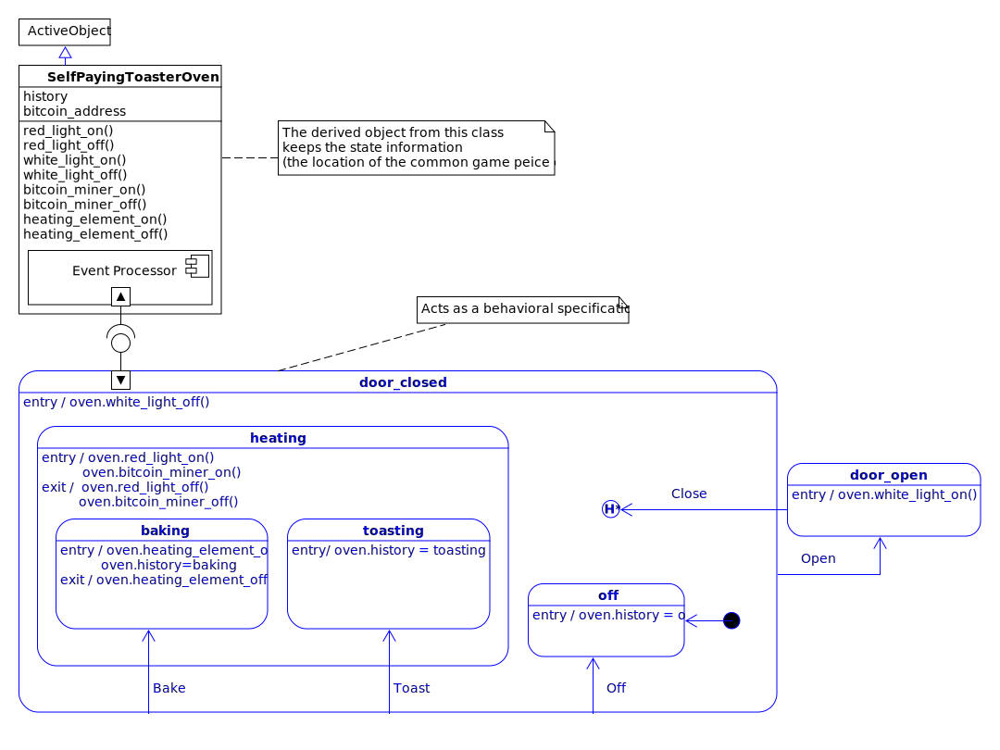
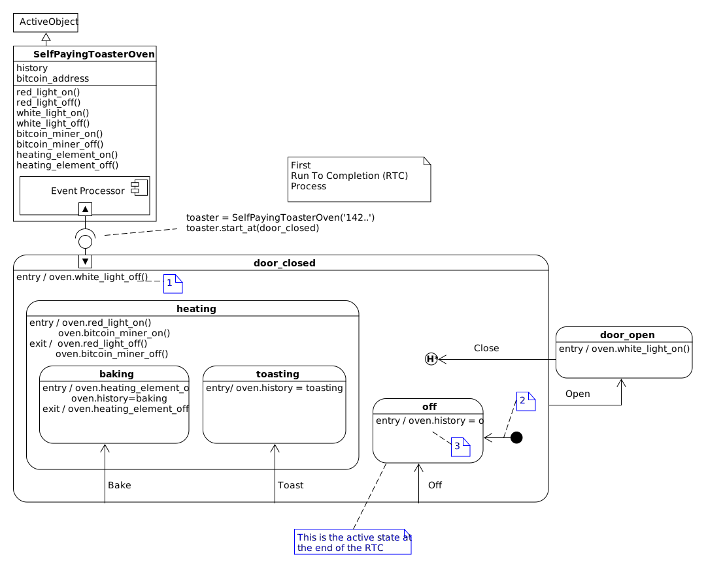
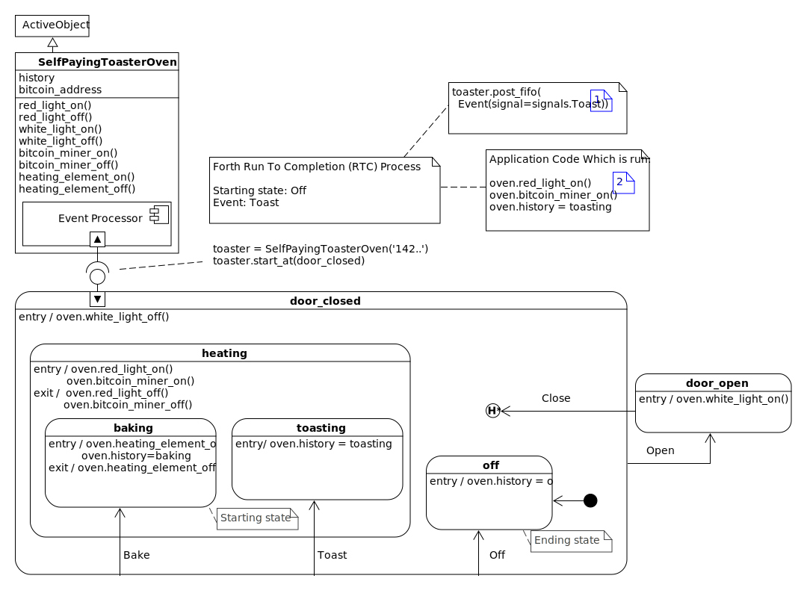

.. _quick-start:

Quick Start
===========
This library is intended for three different audiences, so I have constructed
three separate quick start sections:  

 * :ref:`quick start for people new to statecharts <quickstart-new-to-statecharts>`
 * :ref:`quick start for people experienced with statecharts <quickstart-quick-start-for-python>`
 * :ref:`quick start for embedded developers <quickstart-going-to-port-to-embedded>`

.. _quickstart-going-to-port-to-embedded:

Quick Start for Embedded
------------------------
As an embedded developer you will probably port your working miros Python code 
to C/C++ for a considerable performance gain.  If you are looking for an excellent,
and affordable framework, go to the source and use the `qp codebase
<https://github.com/QuantumLeaps/qpc>`_.  It is documented here:
`Practical UML Statechart in C/C++, 2nd Edition
<https://sourceforge.net/projects/qpc/files/doc/PSiCC2.pdf/download>`_.

There are two different ways to make statecharts with this miros Python library.
In this example, I will show you the programming technique that is best suited
for porting your code to the `qp framework <https://github.com/QuantumLeaps/qpc>`_:

Let's build a toaster oven that pays for itself, here is its **specification**:

* It will contain a bitcoin miner that runs hot enough to toast things.  
* It will have an oven element that can bake things.
* While toasting or baking, the inside of the toaster oven should glow red.  
* When the door is closed, and the oven is not heating, no light should be on. 
* When the door is opened, the heating should stop.  
* When the door is opened, a white light should turn on, so the customer can see their food.
* When the door is closed after it has been opened, the toaster oven should behave like it did before the door
  was opened.  
* the bitcoin miner should survive very high temperatures.

Here is a statechart picture that meets these specifications:

.. image:: _static/bitcoin_toaster_oven_active_object.svg
    :target: _static/bitcoin_toaster_oven_active_object.pdf
    :align: center

If you intend on porting this code to C/C++ for your embedded platform, it is
best to use the miros ``ActiveObject`` class rather than the miros ``Factory`` class.

Here is how you could code this using miros and the ActiveObject class.

.. code-block:: python

  from miros import ActiveObject
  from miros import signals
  from miros import Event
  from miros import return_status
  from miros import spy_on
  import time

  # This part of the code maps to the top part (non-state-machine) part of the
  # statechart diagram
  class SelfPayingToasterOven(ActiveObject):
    '''Class that holds the attributes and worker methods used by our toaster
       oven statechart'''

    def __init__(self, bitcoin_address):
      super().__init__("toaster_{}".format(bitcoin_address[0:5]))
      self.history = None
      self.bitcoin_address = bitcoin_address

      self.red_light_off()
      self.white_light_off()
      self.bitcoin_miner_off()
      self.heating_element_off()

    def red_light_on(self):
      print("turning red light on")

    def red_light_off(self):
      print("turning red light off")

    def white_light_on(self):
      print("turning white light on")

    def white_light_off(self):
      print("turning white light off")

    def bitcoin_miner_on(self):
      print("turning bitcoin miner on")

    def bitcoin_miner_off(self):
      print("turning bitcoin miner off")

    def heating_element_on(self):
      print("turning heating element on")

    def heating_element_off(self):
      print("turning heating element off")

  # The state-machine part of the statechart
  @spy_on
  def door_closed(oven, e):
    status = return_status.UNHANDLED
    if(e.signal == signals.ENTRY_SIGNAL):
      oven.white_light_off()
      status = return_status.HANDLED
    elif(e.signal == signals.INIT_SIGNAL):
      status = oven.trans(off)
    elif(e.signal == signals.Off):
      status = oven.trans(off)
    elif(e.signal == signals.Bake):
      status = oven.trans(baking)
    elif(e.signal == signals.Toast):
      status = oven.trans(toasting)
    elif(e.signal == signals.Open):
      status = oven.trans(door_open)
    elif(e.signal == signals.EXIT_SIGNAL):
      status = return_status.HANDLED
    else:
      oven.temp.fun = oven.top
      status = return_status.SUPER
    return status

  @spy_on
  def heating(oven, e):
    status = return_status.UNHANDLED
    if(e.signal == signals.ENTRY_SIGNAL):
      oven.red_light_on()
      oven.bitcoin_miner_on()
      status = return_status.HANDLED
    elif(e.signal == signals.EXIT_SIGNAL):
      oven.red_light_off()
      oven.bitcoin_miner_off()
      status = return_status.HANDLED
    else:
      oven.temp.fun = door_closed
      status = return_status.SUPER
    return status

  @spy_on
  def baking(oven, e):
    status = return_status.UNHANDLED
    if(e.signal == signals.ENTRY_SIGNAL):
      oven.heating_element_on()
      oven.history = baking
      status = return_status.HANDLED
    elif(e.signal == signals.EXIT_SIGNAL):
      oven.heating_element_off()
      status = return_status.HANDLED
    else:
      oven.temp.fun = heating
      status = return_status.SUPER
    return status

  @spy_on
  def toasting(oven, e):
    status = return_status.UNHANDLED
    if(e.signal == signals.ENTRY_SIGNAL):
      oven.history = toasting
      status = return_status.HANDLED
    else:
      oven.temp.fun = heating
      status = return_status.SUPER
    return status

  @spy_on
  def off(oven, e):
    status = return_status.UNHANDLED
    if(e.signal == signals.ENTRY_SIGNAL):
      oven.history = off
      status = return_status.HANDLED
    else:
      oven.temp.fun = door_closed
      status = return_status.SUPER
    return status

  @spy_on
  def door_open(oven, e):
    status = return_status.UNHANDLED
    if(e.signal == signals.ENTRY_SIGNAL):
      oven.white_light_on()
      status = return_status.HANDLED
    elif(e.signal == signals.Close):
      status = oven.trans(oven.history)
    else:
      oven.temp.fun = oven.top
      status = return_status.SUPER
    return status

  if __name__ == "__main__":

    # make our toaster oven with our account information
    toaster = SelfPayingToasterOven('142x5ZhQEMk5LLjXGZeiTBWpv2oxQpfaHJ')

    # turn on our instrumentation so that we can test if our design is working
    toaster.live_trace = True

    # Start our toaster oven in the off state
    toaster.start_at(off)

    # Let's Bake
    toaster.post_fifo(Event(signal=signals.Bake))

    # Let's Toast
    toaster.post_fifo(Event(signal=signals.Toast))

    # Let's Open the door to our toaster oven
    toaster.post_fifo(Event(signal=signals.Open))

    # Let's Close the door
    toaster.post_fifo(Event(signal=signals.Close))

    # The toaster is running in a different thread than our main program
    # So wait a bit so that it can catch up before we close out this program
    time.sleep(0.1)

Here is the output of this program:

.. code-block:: text

    turning red light off
    turning white light off
    turning bitcoin miner off
    turning heating element off
    turning white light off
    [2018-08-10 10:45:13.610478] [toaster_142x5] e->start_at() top->off
    turning red light on
    turning bitcoin miner on
    turning heating element on
    [2018-08-10 10:45:13.611530] [toaster_142x5] e->Bake() off->baking
    turning heating element off
    turning red light off
    turning bitcoin miner off
    turning red light on
    turning bitcoin miner on
    [2018-08-10 10:45:13.612099] [toaster_142x5] e->Toast() baking->toasting
    turning red light off
    turning bitcoin miner off
    turning white light on
    [2018-08-10 10:45:13.613183] [toaster_142x5] e->Open() toasting->door_open
    turning white light off
    turning red light on
    turning bitcoin miner on
    [2018-08-10 10:45:13.613700] [toaster_142x5] e->Close() door_open->toasting

.. _quickstart-quick-start-for-python:

Quick Start for Experienced
---------------------------

.. _quickstart-new-to-statecharts:

Quick Start for Newbies
-----------------------
This introduction to statecharts using miros will be done in stages:

* :ref:`analogy: <quickstart-an-analogy>` to link something you know already to something new
* :ref:`design<quickstart-a-self-paying-toaster-oven>` and :ref:`diagram <reading_diagrams-reading-diagrams>`: learn by building a statechart
* :ref:`mechanics: <quickstart-dynamics>` how a statechart works.
* :ref:`code:` translate your design into something a computer can do.
* :ref:`instrumentation:` how to debug and test your code
* :ref:`documenation:` how to quickly describe your design and solution to others.

.. _quickstart-an-analogy:

An Analogy
^^^^^^^^^^
If you don't know what a statechart is, think of it as a kind of board game that
you can solve your problems with.

The board game has a board with a picture on it, some marbles that the players
can place and then roll around the board in accordance to the game's rulebook.
It has a game piece that all of the members can move once it is their turn to
play.  The players don't move the piece directly, but they move it by having
their marble interact with the board.  If one player moves the game piece on
their turn, the next player will start their turn at this new position.

As the board game designer, you would have control over the drawing on the board
and you would design some of the marbles that are used by the players, but you
wouldn't control the rulebook or a player's specific behavior, what fun would
that be?

The players of your game could be people, touching an external user interface.
At the moment they press a key, an electrical signal would be sent into your
computer and then turned into a software abstraction of the key-press event that
could effect your board game.  But a player doesn't actually have to be a
person, it could be a count down timer that fires an event every 3 seconds, it
could be the stock market, it could be the weather.  A player in this metaphor
is just something in the outside world that can trigger the events you want your
board game to react to.

To distinguish one event from another event, we will call them by different
names: signal names.  Sometimes an event carries additional information, let's
call this a payload.  Going back to our metaphor, think of an event is a marble.
A player would build a marble and put it on the board when it was their turn to
play the game.  Every marble would have a signal name painted on it, and
sometimes, deep within the marble would be a payload.

The player would place their marble on the board at the current location of the
game piece, let go of it and watch it roll.  As it rolled on the board, it
might trigger software that you have written into that marble's groove.  It
might trigger additional marbles to pop out of the board and roll in turn; but
eventually the action would stop and the common game piece would be moved to
it's new position and the next player would get to play.

Every game has a rule book.  In our case the rule book is called the Harel
Formalism.  These rules govern how the marble can move on the board and how the
game piece is shifted in response.

The statechart board game also has rules about when a player gets to play.  If
one player really needs to put a marble on the board while another is playing,
it is OK.  She will just put it into a loading dock.  The statechart board
game will only let one player play out their marble on the board at a time; this
rule is called run to completion (RTC).  When a player's marble has finished
moving around the board, our board game will check it's loading dock to see if
another marble needs to be acted upon.

The loading dock is a python deque.  The thing that will load the marble onto
the board when the game has finished processing the last player's marble is a
python thread.

So what does this board game look like?  Well, it looks kind of like a bunch of
rounded rectangles connected with arrows.  The arrows have signal names painted
on them to describe paths that certain marbles can follow and the rounded
rectangles are called states.

All the states have names, and a state can be within another state.  As the
different players play the game, the common piece is moved around the board,
coming to rest within one of the states.  This is called the resting state.

The rules are pretty straightforward, but who wants to read a rulebook anyway?
The players certainly don't.  So, you as the board game designer and the board
game itself must know the rules.  The board game's software that applies the
rules to the marbles on the board is called the event processor.  It is based
upon the algorithm invented by Dr. Miro Samek.

So how is this useful?  Well your game has software on it's game board that can
run when a marble roles over it.  You can connect this software to the output of
your computer; so you can control things in the outside world.  Your board game,
statechart, could be used to control a trading strategy, it could be used to
control the massive doors over a stadium, automatically reacting to changes in
weather conditions.

Getting down to brass tacks, what do we do now?  Well I have to show you how to
draw a board game; I have to show you how to draw a statechart.  We will use
UML.  I have to show you how to connect your board game to it's automatic rule
book; the event processor.  I have to show you how to create your custom
marbles, the events and their payloads and how to send these to the board game
so that you can connect outside things into the events to which your statechart
will react too.

Once you know how to draw the pictures, you will need to know how to translate
this into code.  Lastely, I will show you how to see if your statechart is
working; so that it can give you feedback about what it is doing.   You can use
this feedback to both trouble shoot your design and to describe how it works to
others.

.. note:: 

  If the diagram is too small, click on it to open it's pdf

.. _quickstart-a-self-paying-toaster-oven:

A Self Paying Toaster Oven
^^^^^^^^^^^^^^^^^^^^^^^^^^
So now I will design a board game that is easy to understand.
Let's build a toaster oven that pays for itself, here is its **specification**:

* It will contain a bitcoin miner that runs hot enough to toast things.  
* It will have an oven element that can bake things.
* While toasting or baking, the inside of the toaster oven should glow red.  
* When the door is closed, and the oven is not heating, no light should be on. 
* When the door is opened, the heating should stop.  
* When the door is opened, a white light should turn on, so the customer can see their food.
* When the door is closed after it has been opened, the toaster oven should behave like it did before the door
  was opened.  
* the bitcoin miner should survive very high temperatures.

.. note:: 
  The name "Self Paying Toaster Oven" is a marketing ploy.  A better name for
  our product should be called the "Toaster Oven Lottery Ticket", since it is
  very unlikely our little bitcoin miner will succeed at mining a bitcoin.

Here is a :ref:`statechart picture<reading_diagrams-reading-diagrams>` (board game) that meets these specifications:

.. image:: _static/bitcoin_toaster_oven_active_object.svg
    :target: _static/bitcoin_toaster_oven_active_object.pdf
    :align: center

Let's break the board game image into it's parts, from the top down:

.. image:: _static/bitcoin_toaster_oven_active_object_0.svg
    :target: _static/bitcoin_toaster_oven_active_object_0.pdf
    :align: center

The top of the diagram, highlighted in blue, describes the :ref:`class
<reading_diagrams-classes>` that we want to use from the miros library.  This
class will provide our game's rulebook, the thread which our game will run in and
deques needed for our players to load their marbles into.

.. image:: _static/bitcoin_toaster_oven_active_object_1.svg
    :target: _static/bitcoin_toaster_oven_active_object_1.pdf
    :align: center

We inherit from the ActiveObject to make a new class called
SelfPayingToasterOven.  We put all of the worker methods and the attributes,
needed by our specific board game inside of this derived class.

In the diagram above, the hierarchical state machine (HSM) is highlighted in
blue.   This specific type of state machine is called a hierarchical
statemachine, because it has states within states, making a hierarchical
structure.  We will talk about the benefits of this shortly.

The miros package uses the HSM as a specification for behavior.  The
statemachine doesn't actually keep any information about what happens when your
program interacts with it.  All of that information is kept within the object
that uses it.  Because of this, a statemachine can be used by many many
different processes at the same time.

.. image:: _static/bitcoin_toaster_oven_active_object_3.svg
    :target: _static/bitcoin_toaster_oven_active_object_3.pdf
    :align: center

The icons highlighted blue in the above diagram represent the attachment point
between our toaster object and it's state machine.  Using our game metaphor,
think of this attachment point as a clear plastic sheet that our toaster puts
over the game board.  The event processor can write information onto this sheet
so that the game can keep track of its state without marking up the game board
directly.

The game is started where the attachment point is made, in the above example it
is like writing:

  * construct an object from the class containing the event processor
    (SelfPayingToasterOven)
  * place a clear plastic sheet down over the board game (our HSM)
  * on the sheet, use a marker to note that the beginning position is the ``door_closed``
    state.
  * begin the game

.. note::

  This attachment point is a useful fiction, but if you dig into the code, the
  statemachine is actually a set of functions that reference one another.  These
  functions have two arguments, a handle to your specific
  object and an event. These functions call your code
  and call other functions in accordance to the rulebook of the game.  A state
  machine's function doesn't have it's own memory, it uses the memory of the
  object provided as it's first argument.  We won't get into the details of this
  yet, but know that your statemachine functions are actually the thing from
  which the picture emerges.

Before I start talking about the dynamics of our game, let's clear up some
terminology:

A statechart, is a statemachine operating within a thread, which has access to
information about it's previous state.  It has queues that can be used to store
up events (marbles played by players who don't want to wait their turn to play).
So the statechart in this diagram is the whole picture.

.. _quickstart-dynamics:

Let's start the game:

.. code-block:: python

  toaster = SelfPayingToasterOven('142x5ZhQEMk5LLjXGZeiTBWpv2oxQpfaHJ')
  toaster.start_at(door_closed)

This will cause the game dynamics to turn on; the event processor starts rolling
marbles onto the board.

The ``start_at`` call will cause the game to enter the ``door_closed``
state.  As a result, the event processor will roll an entry marble onto the
board.  This is caught by the entry handler of the ``door_closed`` state, calling
the ``white_light_off()`` method of the toaster.  Now the game is in the
``door_closed`` region of the diagram.  

The event processor rolls an init marble onto the board, this is caught by the
black dot within the ``door_closed`` region.  

.. note::
  The black dots with connected arrows are called “init pseudostates” in UML.
  Think of them as, “What do I do when I land in this region?”. From now on I’ll
  call these init icons or black dots.

The marble follows the groove into the ``off`` state.  Since the
``off`` state was entered the event processor rolls an entry marble to it.  It's
entry handler runs the ``oven.history=off`` code in the context of the toaster
object.

At this point, the play is over, because the event processor has nothing left to
do.  Another way of saying this is that the run to completion process (RTC) is
finished.  The ``off`` state is marked onto the clear plastic sheet as the
starting state for the next play of the game.

Since there is nothing left to do, the statechart thread looks to see if there
is a marble in it's loading dock.  The marble might have been played during the
last RTC process by another player.

Now suppose that while the game was running its startup code, someone pressed
the ``Bake`` button on the outside of our toaster, in code this would look like
this:

.. code-block:: python

  bakeer.post_fifo(Event(signal=signals.Bake))

Here is what would happen:

.. image:: _static/bitcoin_toaster_oven_active_object_5_1.svg
    :target: _static/bitcoin_toaster_oven_active_object_5_1.pdf
    :align: center

The event processor would begin it's work by checking to see if the ``off``
state knew what to do with a ``Bake`` marble.  The ``off`` state doesn't know,
so the event processor would roll the marble outward on the board to the next most
outer state: ``door_closed``, and ask it if it knows what to do with the
``Bake`` marble.

The ``door_closed`` state has a named groove called ``Bake``, so it knows what
to do with the ``Bake`` marble.  The bake groove is trying to dump it's marble
from the ``door_closed`` state into the ``bakeing`` state, but before the event
processor can do this, it must exit out of the ``off`` state.

So the event processor gives itself a sub-goal to transition from ``off`` to
``baking``.  To begin this work it marks an S on the board over the ``off``
state and marks a T on the board on the ``door_closed`` state. S stands for
source and T stands for target.  Then it figures out how to transition from the
S to the T:

* it needs to exit the ``off`` state.

To exit the off state it rolls an exit marble to the ``off`` state handler.
There isn't one so nothing happens.

Now the event processor is in the ``door_closed`` state.  It's new target is the
``baking`` state.  So it marks an S on ``door_closed`` and a "T" on
``baking_state``.  Then it makes a list of the work required to transition
from "S" to "T":

* enter the ``heating`` state, then 
* enter the ``baking`` state.

To do this, it rolls an entry marble to the ``heating`` state, which is caught
by it's handler and the ``oven.red_light_on()`` is run, then the
``oven.bitcoin_miner_on()`` is run.  Then the event processor rolls an entry
marble to the ``baking`` state.  This causes our program to run
``oven.heating_element_on()`` then ``oven.history = baking``.

The event processor is now in a new region, the ``baking`` state region.  It
looks for an init icon and it's groove (a black dot with an arrow), but there
isn't any so it stops searching for work to do.

It is at this point that the second RTC process is completed.  So the event
processor marks ``baking`` as the next starting point for the game and passes
control back to the statechart's thread so it can check it's loading dock for
player marbles.

We just learned about one of the benefits of having a HSM.  We get automatic
grooves.  The ``off`` state didn't have to be explicitly connected to the
``baking`` state.  The Bake marble rolled outward till the event processor found
something that knew what to do with it.  This means in our game metaphor we
should think of the inner states as being higher off the ground than the outer
states; this way it becomes easy to imagine what the marbles do.  If they aren't
explicitly handled with a named arrow from the state that was rolled the marble,
they fall outward until they are.

Guess what happens when a marble isn't handled by an outer state?  That's right,
it rolls off the outer edge, is ignored and no state transition happens (only
costing us a few wasted cycles).

Now let's do something really dangerous; let's turn off the oven.  Here is what
would happen if you were in the ``baking`` state and you issued an Off event:

.. code-block:: python

  toaster.post_fifo(Event(signal=signals.Off))

.. image:: _static/bitcoin_toaster_oven_active_object_6.svg
    :target: _static/bitcoin_toaster_oven_active_object_6.pdf
    :align: center

Here is what would happen:

* Any code on the "Off" arrow would be run: none
* The exit code of the backing state would be run: ``oven.heating_element_off()`` 
* The exit code of the heating state would be run: ``oven.red_light_off();
  oven.bitcoin_miner_off()``
* The entry code of the off state could be run:  ``oven.history = off``
* The init code of the off state would be run: none

Let's toast something:

.. code-block:: python

  toaster.post_fifo(Event(signal=signals.Toast))

* Any code on the "Toast" arrow would be run: none
* The exit code of the off state would be run: none
* The entry code of the heating state would be run: ``oven.red_light_on();
  oven.bitcoin_miner_on()``
* The entry code to the toasting state would be run: ``oven.history = toasting``

Now let's open then close the door to the toaster over:

.. code-block:: python

  toaster.post_fifo(Event(signal=signals.Open))
  toaster.post_fifo(Event(signal=signals.Close))

.. image:: _static/bitcoin_toaster_oven_active_object_8.svg
    :target: _static/bitcoin_toaster_oven_active_object_8.pdf
    :align: center

* Any code in the "Open" arrow would be run: none
* The exit code of the toasting state: none
* The exit code of the heating state: ``oven.red_light_off(); oven.bitcoin_miner_off``
* The exit state of the door_closed state: none
* The entry state of the door_open: ``oven.white_light_on()``
* The Close event is sent to the event processor
* The code on the "Close" arrow would be run: none
* The deep history the last state of the door_closed region to be the target
* The entry code for the heating state: ``oven.red_light_on(); oven.bitcoin_miner_on()``
* The entry code of the toasting state: ``oven.history = toasting``
* The init code for the toasting state: none

If you understand this, you understand the basic dynamics of statecharts.

.. toctree::
   :maxdepth: 2
   :caption: Contents:

:ref:`Next topic<examples>`.

