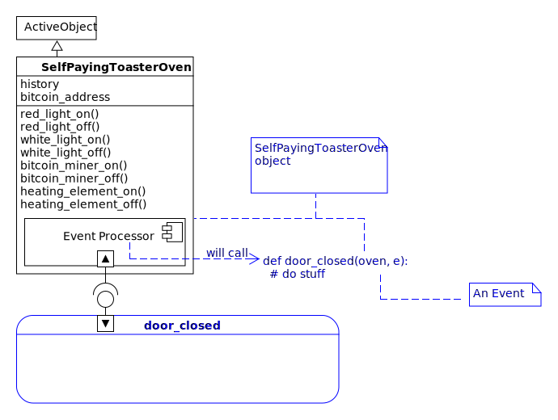
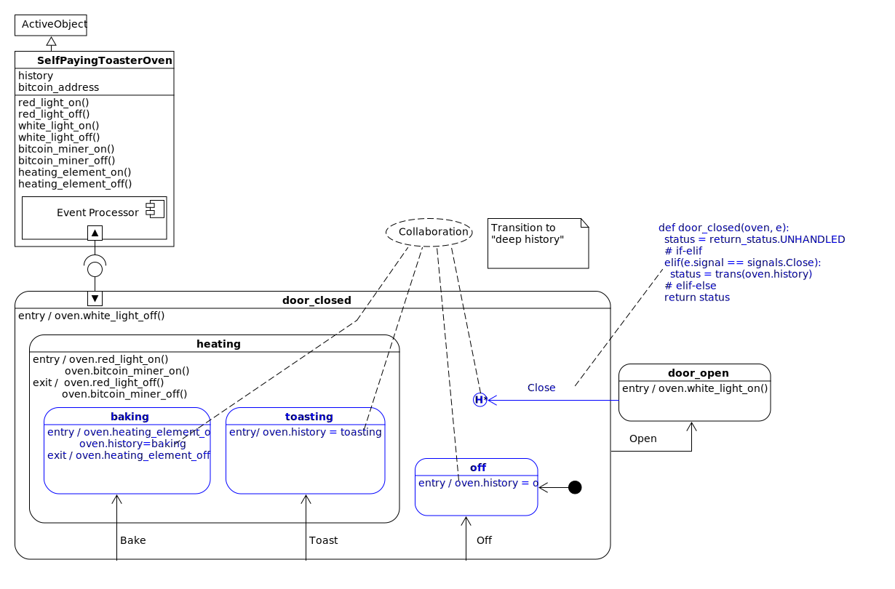

.. _quick-start:

Quick Start
===========
This library is intended for three different audiences, so I have constructed
three separate quick start sections:  

 * :ref:`quick start for people new to statecharts <quickstart-new-to-statecharts>`
 * :ref:`quick start for people experienced with statecharts <quickstart-quick-start-for-python>`
 * :ref:`quick start for embedded developers <quickstart-going-to-port-to-embedded>`

.. _quickstart-going-to-port-to-embedded:

Quick Start for Embedded
------------------------
As an embedded developer you will probably port your working miros Python code 
to C/C++ for a considerable performance gain.  If you are looking for an excellent,
and affordable framework, go to the source and use the `qp codebase
<https://github.com/QuantumLeaps/qpc>`_.  It is documented here:
`Practical UML Statechart in C/C++, 2nd Edition
<https://sourceforge.net/projects/qpc/files/doc/PSiCC2.pdf/download>`_.

There are two different ways to make statecharts with this miros Python library.
In this example, I will show you the programming technique that is best suited
for porting your code to the `qp framework <https://github.com/QuantumLeaps/qpc>`_:

Let's build a toaster oven that pays for itself, here is its **specification**:

* It will contain a bitcoin miner that runs hot enough to toast things.  
* It will have an oven element that can bake things.
* While toasting or baking, the inside of the toaster oven should glow red.  
* When the door is closed, and the oven is not heating, no light should be on. 
* When the door is opened, the heating should stop.  
* When the door is opened, a white light should turn on, so the customer can see their food.
* When the door is closed after it has been opened, the toaster oven should behave like it did before the door
  was opened.  
* the bitcoin miner should survive very high temperatures.

Here is a statechart picture that meets these specifications:

.. image:: _static/bitcoin_toaster_oven_active_object.svg
    :target: _static/bitcoin_toaster_oven_active_object.pdf
    :align: center

If you intend on porting this code to C/C++ for your embedded platform, it is
best to use the miros ``ActiveObject`` class rather than the miros ``Factory`` class.

Here is how you could code this using miros and the ActiveObject class.

.. include:: i_bitcoin_miner_toaster_oven.rst 

Here is the output of this program:

.. code-block:: text

    turning red light off
    turning white light off
    turning bitcoin miner off
    turning heating element off
    turning white light off
    [2018-08-10 10:45:13.610478] [toaster_142x5] e->start_at() top->off
    turning red light on
    turning bitcoin miner on
    turning heating element on
    [2018-08-10 10:45:13.611530] [toaster_142x5] e->Bake() off->baking
    turning heating element off
    turning red light off
    turning bitcoin miner off
    turning red light on
    turning bitcoin miner on
    [2018-08-10 10:45:13.612099] [toaster_142x5] e->Toast() baking->toasting
    turning red light off
    turning bitcoin miner off
    turning white light on
    [2018-08-10 10:45:13.613183] [toaster_142x5] e->Open() toasting->door_open
    turning white light off
    turning red light on
    turning bitcoin miner on
    [2018-08-10 10:45:13.613700] [toaster_142x5] e->Close() door_open->toasting

.. _quickstart-quick-start-for-python:

Quick Start for Experienced
---------------------------

.. _quickstart-new-to-statecharts:

Quick Start for Newbies
-----------------------
This introduction to statecharts using miros will be done in stages:

* :ref:`analogy: <quickstart-an-analogy>` to link something you know already to something new
* :ref:`design<quickstart-a-self-paying-toaster-oven>` and :ref:`diagram <reading_diagrams-reading-diagrams>`: learn by drawing a statechart
* :ref:`mechanics: <quickstart-dynamics>` to understand the dynamics of a reactive program.
* :ref:`code:<quickstart-code>` translate your design into something a computer can run.
* :ref:`instrumentation: <quickstart-instrumentation>` how to debug and test your code
* :ref:`documenation:` how to quickly describe your design and solution to others.

.. _quickstart-an-analogy:

An Analogy
^^^^^^^^^^
If you don’t know what a statechart is, think of it as a kind of board game that
you can use to solve problems.

This board game has a board with a picture on it, some marbles that the players
can place and then roll around the board in accordance to the game's rulebook.
It has a game piece that all of the members can move once it is their turn to
play. The players don’t move the game piece directly, but they move it by having
their marbles interact with the board.  To do this, your board game would have
grooves for the marbles to roll in.   If one player moved the game piece
on their turn, the next player will start their turn at this new position.

As the board game designer, you would have control over the drawing on the
board, and you would design some of the marbles that are used by the players,
but you wouldn't control the rulebook or a player’s specific behaviour, what fun
would that be?

The players of your game could be people, touching an external user interface.
At the moment they press a key, an electrical signal would be sent into your
computer and then turned into a software abstraction of the key-press event that
could affect your board game. But a player doesn't have to be a person; it could
be a countdown timer that fires an event every 3 seconds, it could be the stock
market, it could be the weather. A player in this metaphor is just something in
the outside world that can trigger the events.

To distinguish one event from another event, we will call them by different
names: signal names. Sometimes an event carries additional information, let’s
call this a payload. Going back to our metaphor, think of an event as a marble.
A player would build a marble and put it on the board when it was their turn to
play the game. Every marble would have a signal name painted on it, and
sometimes, deep within the marble would be a payload.

The player would place their marble on the board at the current location of the
game piece, let go of it and watch it roll. As it rolled on the board, it might
trigger software that you have written into that marble’s groove. It might
trigger additional marbles to pop out of the board and roll in turn, but
eventually, the action would stop, and the common game piece would be moved to
its new position, and the next player would get to play.

Every game has a rule book. In our case, the rulebook is called the Harel
Formalism. These rules govern how the marble can move on the board and how the
game piece is shifted in response.

The statechart board game also has rules about when a player gets to play. If
one player really needs to put a marble on the board while another is playing,
it is OK. She will just put it into a loading dock. The statechart board game
will only let one player play out their marble on the board at a time; this rule
is called run to completion (RTC). When a player’s marble has finished moving
around the board, our board game will check it’s loading dock to see if another
marble is waiting within it.

The loading dock is a python deque. The thing that will load the marble onto the
board when the game has finished processing the last player’s marble is a python
thread.

So what does this board game look like? Well, it looks kind of like a bunch of
rounded rectangles connected with arrows. The arrows have signal names painted
on them to describe paths that certain marbles can follow and the rounded
rectangles are called states.

All the states have names, and a state can be within another state. As the
different players play the game, the common piece is moved around the board,
coming to rest within one of the states. This is called the resting state.

The rules are pretty straightforward, but who wants to read a rulebook anyway?
The players certainly don’t. So, you as the board game designer and the board
game itself must know the rules. The board game’s software that applies the
rules to the marbles on the board is called the event processor. It is based
upon the algorithm invented by Dr. Miro Samek.

So how is this useful? Well, your game has software on its game board that can
run when a marble rolls over it. You can connect this software to the output of
your computer; so you can control things in the outside world. Your board game,
statechart, could be used to control a trading strategy, it could be used to
control the massive doors over a stadium, automatically reacting to changes to
weather forecasts.  You could build a sprinkler system for your garden that
checks weather and soil conditions and will turn on when the plants need it or
if the garden is being raided by deer.

Getting down to brass tacks, what do we do now? Well, I have to show you how to
draw a board game; I have to show you how to draw a statechart. We will use UML.
I have to show you how to connect your board game to its automatic rulebook: the
event processor. I have to show you how to create your custom marbles, the
events and their payloads and how to send these to the board game so that you
can connect outside things into the events to which your statechart will react
too.

Once you know how to draw the pictures, you will need to know how to translate
this into code. Lastly, I will show you how to see if your statechart is
working; so that it can give you feedback about what it is doing. You can use
this feedback to both troubleshoot your design and to describe how it works to
others.

.. note:: 

  If the diagram is too small, click on it to open it's pdf

.. _quickstart-a-self-paying-toaster-oven:

Design: A Self Paying Toaster Oven
^^^^^^^^^^^^^^^^^^^^^^^^^^^^^^^^^^
So now I will design a board game that is easy to understand.
Let's build a toaster oven that pays for itself, here is its **specification**:

1. It will contain a bitcoin miner that runs hot enough to "toast" things.  
2. It will also have a heating element that can "bake" things.
3. While toasting or baking, the inside of the toaster oven should glow red.  
4. When the door is closed, and the oven is not heating, no light should be on. 
5. When the door is opened, the heating should stop.  
6. When the door is opened, a white light should turn on.
7. When the door is closed after it has being opened, the oven should continue
   what it was doing before the door was opened.
8. The bitcoin miner should survive very high temperatures.

.. note:: 

  The name "Self Paying Toaster Oven" is a marketing ploy.  A better name for
  our product should be called the "Toaster Oven Lottery Ticket", since it is
  very unlikely our little bitcoin miner will succeed at mining a bitcoin.

Here is a :ref:`statechart picture<reading_diagrams-reading-diagrams>` (board game) that meets these specifications:

.. image:: _static/bitcoin_toaster_oven_active_object.svg
    :target: _static/bitcoin_toaster_oven_active_object.pdf
    :align: center

Let's break the board game image into its parts, from the top down:

.. image:: _static/bitcoin_toaster_oven_active_object_0.svg
    :target: _static/bitcoin_toaster_oven_active_object_0.pdf
    :align: center

The top of the diagram, highlighted in blue, describes the :ref:`class
<reading_diagrams-classes>` that we want to use from the miros library.  This
class will provide our game's rulebook, the thread which our game will run in and
deques needed for our players to load their marbles.

.. image:: _static/bitcoin_toaster_oven_active_object_1.svg
    :target: _static/bitcoin_toaster_oven_active_object_1.pdf
    :align: center

We inherit from the ActiveObject to make a new class called
SelfPayingToasterOven.  We put all of the worker-methods and the attributes,
needed by our specific board game inside of this derived class.

.. image:: _static/bitcoin_toaster_oven_active_object_2.svg
    :target: _static/bitcoin_toaster_oven_active_object_2.pdf
    :align: center

In the diagram above, the hierarchical state machine (HSM) is highlighted in
blue. This specific type of state machine is called a hierarchical state
machine, because it has states within states, making a hierarchical structure.
We will talk about the benefits of this shortly.

The miros package uses the HSM as a specification for behaviour. The state
machine doesn’t keep any information about what happens when your program
interacts with it. All of that information is kept within the object that uses
it. Because of this, a state machine can be used by many different
processes at the same time.

.. image:: _static/bitcoin_toaster_oven_active_object_3.svg
    :target: _static/bitcoin_toaster_oven_active_object_3.pdf
    :align: center

The icons highlighted blue in the above diagram represent the attachment point
between our toaster object and it’s state machine. Using our game metaphor,
think of this attachment point as a transparent plastic sheet that our toaster
puts over the game board. The event processor can write information onto this
sheet so that the game can keep track of its state without marking up the game
board directly.

The game is started where the attachment point is made, in the above example it
is like writing:

  * construct an object from the class containing the event processor
    (SelfPayingToasterOven)
  * place a transparent plastic sheet down over the board game (our HSM)
  * on the sheet, use a marker to note that the beginning position is the ``door_closed``
    state.
  * begin the game

.. note::

  This attachment point is a useful fiction, but if you dig into the code, the
  statemachine is actually a set of functions that reference one another.  These
  functions have two arguments, a handle to your specific
  object and an event. These functions call your code
  and call other functions in accordance to the rulebook of the game.  A state
  machine's function doesn't have it's own memory, it uses the memory of the
  object provided as it's first argument.  We won't get into the details of this
  yet, but know that your statemachine functions are actually the thing from
  which the picture emerges.

Before I start talking about the dynamics of our game, let’s clear up some
terminology:

A **statechart** is a state machine operating within a thread, which has access to
information about its previous state. It has queues that can be used to store up
events (marbles played by players who don’t want to wait for their turn to
play).

.. _quickstart-dynamics:

Mechanics: The Game's Dynamics
^^^^^^^^^^^^^^^^^^^^^^^^^^^^^^
Let’s start the game:

.. code-block:: python

  # build a self paying toaster oven with a working bitcoin address
  toaster = SelfPayingToasterOven('142x5ZhQEMk5LLjXGZeiTBWpv2oxQpfaHJ')
  toaster.start_at(door_closed)

This will cause the game dynamics to turn on; the event processor starts rolling
marbles onto the board.

.. image:: _static/bitcoin_toaster_oven_active_object_4.svg
    :target: _static/bitcoin_toaster_oven_active_object_4.pdf
    :align: center

The ``start_at`` call will cause the game to enter the ``door_closed``
state (1).  As a result, the event processor will roll an entry marble onto the
board.  This is caught by the entry handler of the ``door_closed`` state, calling
the ``white_light_off()`` method of the toaster (2).  Now the game is in the
``door_closed`` region of the diagram.  

The event processor rolls an init marble onto the board, and this is caught by
the black dot within the ``door_closed`` region (3).  

.. note::
  The black dots with connected arrows are called “init pseudostates” in UML.
  Think of them as, “What do I do when I land in this region?”. From now on I’ll
  call these block dots, init icons.

The marble follows the groove into the ``off`` state.  Since the
``off`` state was entered the event processor rolls an entry marble to it.  Its
entry handler runs the ``oven.history=off`` code in the context of the toaster
object (4).

At this point, the play is over, because the event processor has nothing left to
do.  Another way of saying this is that the run to completion process (RTC) is
finished.  The ``off`` state is marked onto the transparent plastic sheet as the
starting state for the next play of the game.

Since there is nothing left to do, the statechart thread looks to see if there
is a marble in it's loading dock.  The marble might have been played during the
last RTC process by another player.

Now suppose that while the game was running its startup code, someone pressed
the ``Bake`` button on the outside of our toaster, in code this would look like
this:

.. code-block:: python

   toaster.post_fifo(Event(signal=signals.Bake))

Here is what would happen:

.. image:: _static/bitcoin_toaster_oven_active_object_5_1.svg
    :target: _static/bitcoin_toaster_oven_active_object_5_1.pdf
    :align: center

The event processor would begin its work by checking to see if the ``off``
state knew what to do with a ``Bake`` marble.  The ``off`` state doesn't know,
so the event processor would roll the marble outward on the board to the next most
outer state: ``door_closed``, and ask it if it knows what to do with the
``Bake`` marble.

The ``door_closed`` state has a named groove called ``Bake``, so it knows what
to do with the ``Bake`` marble (1).  The bake groove is trying to dump its marble
from the ``door_closed`` state into the ``baking`` state, but before the event
processor can do this, it must exit out of the ``off`` state.

So the event processor gives itself a sub-goal to transition from ``off`` to
``baking``.  To begin this work it marks an S on the board over the ``off``
state and marks a T on the board on the ``door_closed`` state. S stands for
source and T stands for target.  Then it figures out how to transition from the
S to the T:

* it needs to exit the ``off`` state.

To exit the off state it rolls an exit marble to the ``off`` state handler.
There isn't one so nothing happens (2).

Now the event processor is in the ``door_closed`` state.  It's new target is the
``baking`` state.  So it marks an S on ``door_closed`` and a "T" on
``baking_state``.  Then it makes a list of the work required to transition
from "S" to "T":

* enter the ``heating`` state, then 
* enter the ``baking`` state.

To do this, it rolls an entry marble to the ``heating`` state, which is caught
by its handler and the ``oven.red_light_on()`` is run, then the
``oven.bitcoin_miner_on()`` is run (3).  Then the event processor rolls an entry
marble to the ``baking`` state.  This causes our program to run
``oven.heating_element_on()`` then ``oven.history = baking`` (4).

The event processor is now in a new region, the ``baking`` state region.  It
looks for an init icon, and it's groove (a black dot with an arrow), but there
isn't any, so it stops searching for work to do (5).

It is at this point that the second RTC process is completed.  So the event
processor marks ``baking`` as the next starting point for the game and passes
control back to the statechart's thread so it can check it's loading dock for
player marbles.

We just learned about one of the benefits of having an HSM.  We get automatic
grooves.  The ``off`` state didn't have to be explicitly connected to the
``baking`` state.  The Bake marble rolled outward till the event processor found
something that knew what to do with it.  This means in our game metaphor we
should think of the inner states as being higher off the ground than the outer
states; this way it becomes easy to imagine what the marbles do.  If they aren't
explicitly handled with a named arrow from the state that was rolled the marble,
they fall outward until they are.

Guess what happens when a marble isn't handled by an outer state?  That's right,
it rolls off the outer edge, is ignored, and no state transition occurs (only
costing us a few wasted cycles).

Now let's do something perilous; let's turn off the oven.  Here is what
would happen if you were ``baking`` and you issued an Off event:

.. code-block:: python

  toaster.post_fifo(Event(signal=signals.Off))

.. image:: _static/bitcoin_toaster_oven_active_object_6.svg
    :target: _static/bitcoin_toaster_oven_active_object_6.pdf
    :align: center

Here is what would happen:

* The ``Off`` event is sent to the event processor
* Any code on the Off-arrow would run: none
* The exit code of the ``backing`` state would run: ``oven.heating_element_off()`` 
* The exit code of the ``heating`` state would run: ``oven.red_light_off();
  oven.bitcoin_miner_off()``
* The entry code of the ``off`` state would run:  ``oven.history = off``
* The init code of the ``off`` state would run: none

Let's toast something:

.. code-block:: python

  toaster.post_fifo(Event(signal=signals.Toast))

.. image:: _static/bitcoin_toaster_oven_active_object_7.svg
    :target: _static/bitcoin_toaster_oven_active_object_7.pdf
    :align: center

* The ``Toast`` event is sent to the event processor
* Any code on the Toast-arrow would run: none
* The exit code of the ``off`` state would run: none
* The entry code of the ``heating`` state would run: ``oven.red_light_on();
  oven.bitcoin_miner_on()``
* The entry code to the ``toasting`` state would run: ``oven.history = toasting``

Now let's open then close the door to the toaster oven.:

.. code-block:: python

  toaster.post_fifo(Event(signal=signals.Open))
  toaster.post_fifo(Event(signal=signals.Close))

.. image:: _static/bitcoin_toaster_oven_active_object_8.svg
    :target: _static/bitcoin_toaster_oven_active_object_8.pdf
    :align: center

Here is what would happen in detail:

* The ``Open`` event is sent to the event processor
* Any code in the Open-arrow would run: none
* The exit code of the ``toasting`` state: none
* The exit code of the ``heating`` state: ``oven.red_light_off(); oven.bitcoin_miner_off``
* The exit state of the ``door_closed`` state: none
* The entry state of the ``door_open``: ``oven.white_light_on()``
* The ``Close`` event is sent to the event processor
* The code on the Close-arrow would run: none
* The deep history the last state of the ``door_closed`` region to be the target
* The entry code for the ``heating`` state: ``oven.red_light_on(); oven.bitcoin_miner_on()``
* The entry code of the ``toasting`` state: ``oven.history = toasting``
* The init code for the ``toasting`` state: none

If you understand this, you understand the basic dynamics of statecharts.

.. _quickstart-code:

Code
----
The thing to understand about the miros library is that it works with a special
type of callback function.  If you haven't seen a callback function before, it
is just a function that is given to another function, so that it can be called
later.

.. code-block:: python

  import time

  def print_msg(message):
    print(message)

  def call_something_later(callback):
    time.sleep(1)
    callback("hello world")

  call_something_later(print_msg)  # => hello world

The rectangles on the game board, or the states in your HSM, are represented as
functions in your Python code.  These state functions will be given to the event
processor; which will call them over and over again as it follows the rules
of the game.  So your state functions are just callback functions.

These state functions will all have the same argument list:

.. code-block:: python

  def some_state_function(statechart_object, event):
    # do stuff

To see how this ties into our self paying toaster oven:

.. code-block:: python

  def door_closed(oven, e):
    # do stuff

Remember before how I said that your HSM is just your application's behavioral
specification.  Well, you can see how this might be true if you look at the
first argument.  The ``oven`` in this callback's signature is referencing the
SelfPayingToasterOven object.  So we can write the state callback to do things
with that object, like call one of it's methods, ``oven.white_light_off()`` or
we can write something to one of it's attribute's: ``oven.history ==
door_closed``.  Provided the door_closed callback only manipulates the memory of
it's first argument, it can be called with different oven objects and behave the
same for all of them.

This is exactly how we create the transparent film over our game board.  None of
the state callbacks will keep their own state information, instead, they will write
their saved information onto their first argument.

Now let's talk about the second argument of our state callback function; the
event.  In our game metaphor the event is the marble.  It will have a signal
name and an optional payload.

Our state callback function can react to events by using an if-elif-else
structure:

.. code-block:: python

  def door_closed(oven, e):
    status = return_status.UNHANDLED
    if(e.signal == signals.ENTRY_SIGNAL):
      oven.white_light_off()
      status = return_status.HANDLED
    elif(e.signal == signals.Off):
      status = oven.trans(off)
    elif(e.signal === signals.Bake):
      status = oven.trans(baking)
    # ...
    return status

This is how the above code relates to our diagram:

.. image:: _static/statechart_to_code_2.svg
    :target: _static/statechart_to_code_2.pdf
    :align: center

Our ``door_closed`` state callback can transition to another state using the
``trans`` method as seen with the ``Off`` and the ``Bake`` signals.  The result
of the ``trans`` method is put in the ``status`` variable.  **So you can think
of the** ``trans`` **method as providing the named grooves in your game.**  You
can use the ``trans`` method to draw your named arrows on your diagram.

Not only do your state callback functions describe what is suppose to happen
with a specific state, but they also describe the topology of your diagram.

Your callback functions describe this topological arrangement in two ways, with
their ``else`` clause and with their ``trans`` calls.

The ``else`` clause in the case of our states will tell the event processor what
state is outside of the current state.  If there is nothing outside of our
state, then we return a special keyword, ``top``.  Consider the ``else``
structure in this code listing:

.. code-block:: python

  def door_closed(oven, e):
    status = return_status.UNHANDLED
    if(e.signal == signals.ENTRY_SIGNAL):
      oven.white_light_off()
      status = return_status.HANDLED
    elif(e.signal == signals.INIT_SIGNAL):
      status = oven.trans(off)
    elif(e.signal == signals.Off):
      status = oven.trans(off)
    elif(e.signal == signals.Bake):
      status = oven.trans(baking)
    elif(e.signal == signals.Toast):
      status = oven.trans(toasting)
    elif(e.signal == signals.Open):
      status = oven.trans(door_open)
    elif(e.signal == signals.EXIT_SIGNAL):
      status = return_status.HANDLED
    else:
      oven.temp.fun = oven.top  # reach into the event processor
      status = return_status.SUPER
    return status

The ``else`` clause answers the question, "what do I do with this event (marble)
if this callback function doesn't know what to do with it?"  The ``else`` clause
answers by saying, "I don't know what to do with this, but you should try my
parent state, who's address I'll write in the ``temp.fun`` attribute for you."
Just so you know that I'm suggesting to look outward, I'll set the status
variable to ``return_status.SUPER``.

If your state callback represents the outermost state of your design, set the
``temp.fun`` to ``top``, as seen above.

To be completely explicit I will write the else clauses of all of the states
used by this design:

.. image:: _static/bitcoin_toaster_oven_active_object.svg
    :target: _static/bitcoin_toaster_oven_active_object.pdf
    :align: center

.. code-block:: python

  from miros import return_status

  def door_closed(oven, e):
    status = return_status.UNHANDLED
    # if-elif structure
    else:
      oven.temp.fun = oven.top  # top of our HSM
      status = return_status.SUPER
    return status

  def heating(oven, e):
    status = return_status.UNHANDLED
    # if-elif structure
    else:
      oven.temp.fun = door_closed
      status = return_status.SUPER
    return status

  def baking(oven, e):
    status = return_status.UNHANDLED
    # if-elif structure
    else:
      oven.temp.fun = heating
      status = return_status.SUPER
    return status

  def toasting(oven, e):
    status = return_status.UNHANDLED
    # if-elif structure
    else:
      oven.temp.fun = heating
      status = return_status.SUPER
    return status

  def off(oven, e):
    status = return_status.UNHANDLED
    # if-elif structure
    else:
      oven.temp.fun = door_closed
      status = return_status.SUPER
    return status

  def door_open(oven, e):
    status = return_status.UNHANDLED
    # if-elif structure
    else:
      oven.temp.fun = chart.top  # top of our HSM
      status = return_status.SUPER
    return status

So the else clause is the thing that puts the H in HSM.  It provides the
hierarchy to our state machine.  A useful way to mentally manipulate your HSM
diagrams is to imagine them from the side, so that you can see how their
behaviors are layered:

.. image:: _static/bitcoin_toaster_oven_active_object_side_view.svg
    :target: _static/bitcoin_toaster_oven_active_object_side_view.pdf
    :align: center

Let's remove the top view of our HSM and just look at it's side projection:

.. image:: _static/bitcoin_toaster_oven_active_object_side_view_2.svg
    :target: _static/bitcoin_toaster_oven_active_object_side_view_2.pdf
    :align: center

The states that are above other states automatically get the behavior of their
lower states.  So the higher a state is in our HSM's side view, the more
behavioral complexity it has.  To be baking, the software would have behaved in a
``heating`` way and a ``door_closed`` way already.  As an example of this, I'll
simplify the above diagram, and roll our ``baking`` state an ``Off`` marble:

.. image:: _static/bitcoin_toaster_oven_active_object_side_view_3.svg
    :target: _static/bitcoin_toaster_oven_active_object_side_view_3.pdf
    :align: center

You can just glance at the diagram and see what will happen.  The marble will
roll off baking, into heating, off heating into door_closed and then end up in
the off state.  Specifically, our event processor will:

  * run any code on the Off arrow, or run any code in the elif ``e == signals.Off`` clause of the ``door_closed`` callback 
  * run the elif ``e == signal.EXIT_SIGNAL`` clause of the ``baking`` callback
  * run the elif ``e == signal.EXIT_SIGNAL`` clause of the ``heating`` callback
  * run the elif ``e == signal.ENTRY_SIGNAL`` clause of the ``off`` callback
  * run the elif ``e == signal.INIT_SIGNAL`` clause of the ``off`` callback

Now that we can see how the hierarchy relates to our statechart dynamics, let's
consider what our state callbacks return.  The state callback must return a
``return_status`` object to it's event processor.  In our code examples we store
this result in a variable named ``status``.  The ``status`` variable is very
important to the event processor, since it tells it if it needs to continue
searching for work to do, or if it is done processing.

The ``return_status`` object needs to be imported from the miros library.  It
contains a number of named attributes like ``UNHANDLED``, ``HANDLED`` and
``SUPER`` which can be used to tell the event processor how your state reacted
to a specific event.

So, your state function knows who its parent state function is.  It knows how it
should handle events and it knows how to cause a transition to another state
function.  But, it doesn't know how the full graph is ordered, the event processor
figures this out on the fly.

The event processor has a lot of work to do.  It needs to discover the full
structure of your statechart and it needs to implement the rule book of your
game.

.. note:: 

  The naming of the internals signals to ENTRY_SIGNAL, INIT_SIGNAL, EXIT_SIGNAL
  where named this way to make it easy for you to port your code to the qp framework.
  For similar reasons, the setting of the ``temp.fun`` to the name of the state
  of the parent was done this way so you can easily jump between the c/C++ and the
  Python varient of Miros Samek's algorithm. (if you choose to do so)

Let's back off from the details for a moment to reflect upon what our
callback has to do:

.. image:: _static/statechart_to_code_4.svg
    :target: _static/statechart_to_code_4.pdf
    :align: center

The idea about using the same callback function for many different things, to be
used to discover a graph and to be used to react to events may seem strange to
you.  Likewise, the idea of adding a new physical dimension to your code may
also seem strange, but with this added dimension makes many hard things simple.

.. note:: 

  Remember that the event processor's algorithm was designed to be very fast
  and to work with limited computer resources; it was built as a drop in
  replacement for real time operating systems in embedded applications.

  If you use this programming technique you are outsourcing a lot of the programs
  complexity to the event processor.  Miro Samek calls this "inversion of
  control".  In fact his entire business model is based upon it.

Now lets look at the H in the circle, with the star beside it.  This is UML
short hand for, "transition back to the state in this region that we were in
before we left this region."  You can see why we would want to use it with our
toaster oven.  When the user opens the door, we want to turn off the toaster
oven heating equipment and turn on a white light.  When they close the door,
they expect the toaster to operate like it did before.

.. note::

  In UML this is H in a circle with a star beside it is called the "transition
  to deep history pseudostate" 

The Miros Samek algorithm doesn't intrinsically support this feature, but it is
easy to implement in your application code.  You just save the state address
when you enter it, and when you need to transition back to the old state, you
transition the state held in the ``history`` attribute.

.. code-block:: python

  def door_closed(oven, e):

  # if-elif
  elif(e.signal == signals.Close)
    status = oven.trans(oven.history)
  # elif-else

There is one last thing I want to talk to you about before I show you the
code, that is the ``@spy_on`` decorator above all of the state functions.  It is
put there to instrument out functions, so that we debug our statechart.

Here is the full code:

.. image:: _static/bitcoin_toaster_oven_active_object.svg
    :target: _static/bitcoin_toaster_oven_active_object.pdf
    :align: center

.. include:: i_bitcoin_miner_toaster_oven.rst 

If you are new to statecharts, type it in, and get it running.  In the next
section I will show you how to see what it is doing.

.. note:: 

  The ``time.sleep(0.1)`` at the end of the code listing is placed there to let
  the main thread wait long enough for your toaster's thread to react to all of the
  events you have sent to it.

.. _quickstart-instrumentation:

Instrumentation
^^^^^^^^^^^^^^^
The miros library provides two different logging techniques so you can see how
your statecharts have reacted to events.  One provides great detail, the
``spy``, and the other, the ``trace``, provides a high level view.

But for these logging techniques to work you need to wrap your state callback
functions, within other functions that can instrument them.  Python's decorator
language feature, makes it easy to wrap a function inside of a function, and the
miros package uses this to make a ``@spy_on`` decorator.  If you place this
decorator on your state callback functions you will have the capability to use
either, or both, the ``spy`` or the  ``trace`` logging systems.

.. note::

  Once you are convinced your code is working as intended, you can remove the
  decorators from your state callbacks to improve the performance of your
  application.  (I never do this)

The ``trace`` log can be used to 

.. toctree::
   :maxdepth: 2
   :caption: Contents:

:ref:`Next topic<examples>`.

