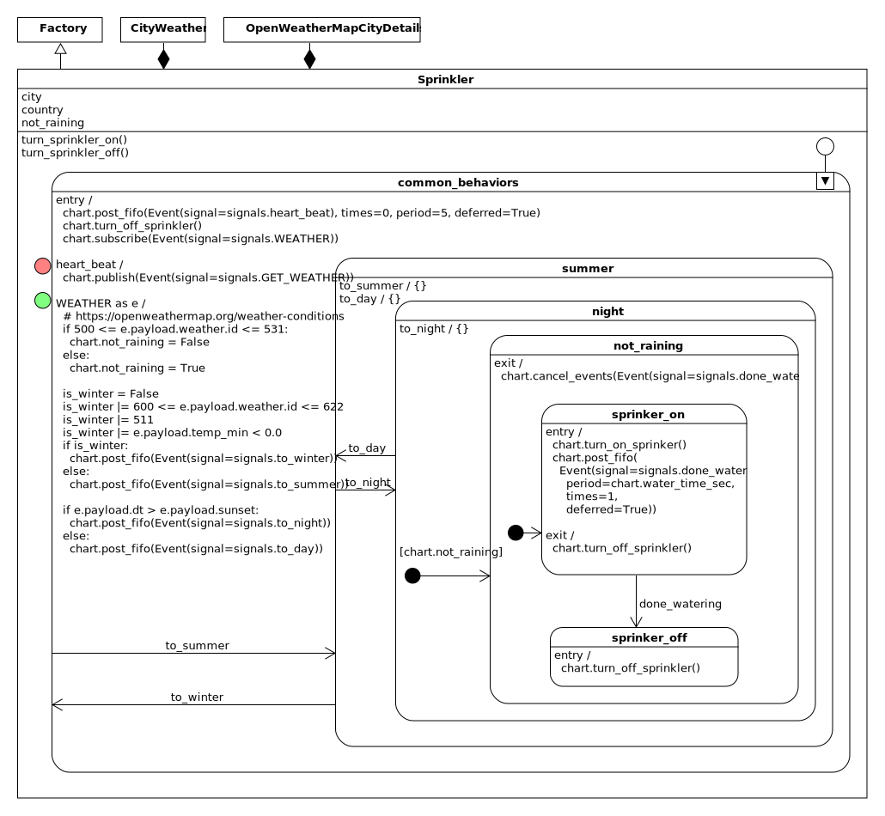

  *I invented the term object oriented, and I can tell you that C++ wasn't what I had in mind.* 
 

  -- Alan Kay

.. _quick-start:

Quick Start
===========
If you know nothing about statecharts I suggest you start here: :ref:`zero to
one <zero_to_one-zero-to-one>`

If you haven't seen UML diagrams before, scan the :ref:`understanding diagrams
<reading_diagrams-reading-diagrams>` part of this guide to make sense of the
pictures.

If you are an embedded developer and want to port your working miros Python code to
C/C++ for a considerable performance gain.  Check out this project: `qp codebase
<https://github.com/QuantumLeaps/qpc>`_.  It is documented here: `Practical UML
Statecharts in C/C++, 2nd Edition
<https://sourceforge.net/projects/qpc/files/doc/PSiCC2.pdf/download>`_.

In the next section we will show how to tackle a problem using UML statecharts.

.. _quickstart-a-quick-example:

A Networked Sprinkler
---------------------

Let's use the Python miros library to build a sprinkler. This
sprinkler will water our plants in the summer, after dark, and only when it is
not raining.  To do this we will call out to the `open weather api
<https://openweathermap.org/api>`_.

.. image:: _static/sprinkler.jpg
    :target: https://www.ijcaonline.org/archives/volume172/number6/28254-2017915160
    :align: center

Once the networked sprinkler knows which city its working in it should just turn
on and operate as if it could measure the weather conditions with local instruments.

The ``open weather`` documentation recommends that we request city information
using a city ID, so our software should extract this id from a file the ``open
weather`` folks have put on their website:
http://bulk.openweathermap.org/sample/city.list.json.gz.

Our design will consist of three different active objects which will work
together:

   * something that will control the sprinkler (Sprinkler).
   * something that will download a file from the open weather website and
     extract the correct city ID for a given city and country
     (OpenWeatherMapCityDetails).
   * something that will act like a weather station attached to the sprinkler,
     by making calls to the open weather API (CityWeather).

Here is a high level diagram of how these parts fit together and what they do:

.. note::

  On interpreting the diagram:

  The Sprinkler class **will have a** CityWeather object **and an**
  OpenWeatherMapCityDetails object (black diamond arrows).  The CityWeather
  object will interact with the Sprinkler and OpenWeatherMapCityDetails objects.
  (dashed lines)

We will use three different statecharts, one per object in the above diagram.
Having independent objects interface in a statechart is called orthogonality in
statechart theory.

.. _quickstart-figuring-out-what-information-will-be-passed-around:

Figuring out what Information will be Passed Around
^^^^^^^^^^^^^^^^^^^^^^^^^^^^^^^^^^^^^^^^^^^^^^^^^^^
Let's wave our hands an assume that the three active objects used in this
designed have been built already and are working, but we want to figure out how
they will communicate with one another.

David Harel called such a thing, a ``statocol`` (state protocol):  what
information will the statecharts need to share, so as a group, they will
achieve our design goal; and give us our networked sprinkler:

We need to figure out how to call the open weather api, with a city id, before it
will return weather information for its location. This is the problem the
``OpenWeatherMapCityDetails`` object solves: it will provide the city id when we
give it the city and country names of where we have placed the sprinkler.

A rough sketch of the ``OpenWeatherMapCityDetails`` object will look like this:

.. image:: _static/open_weather_map_city_details_medium.svg
    :target: _static/open_weather_map_city_details_medium.pdf
    :align: center

This diagram shows us the input and output goals; for a city and a country
return the open weather api's city id.  

``OpenWeatherMapCityDetails`` will subscribe to and receive events called
``REQUEST_DETAILS_FOR_CITY``.  Below this event is the namedtuple,
``RequestDetailsForCityPayload``.  This is the immutable payload that will ride
inside of the event.  Likewise the namedtuple called ``CityDetailsPayload`` will
ride inside of the ``CITY_DETAILS`` event.

.. note::

   On interpreting the diagram:

   All of the high level event interfaces will look like this one.  Arrows going
   into the rounded rectangle beside the green dots are the published events
   that the object will consume.  Arrows leaving the object, beside the red
   dots, will be the events it publishes.  The namedtuples near the event's name
   will describe the payload data structure.

.. note::

   On namedtuples:

   The miros library can place any kind of object into an event payload.
   However event payloads are objects that are shared between threads, we don't
   want one thread to change this object while another thread is trying to read
   it, so as a rule use immutable objects as payloads when programming with miros
   (to avoid nasty multithreading bugs).

The high level event interface of the ``CityWeather`` object looks like this:

.. image:: _static/city_weather_details_medium.svg
    :target: _static/city_weather_details_medium.pdf
    :align: center

This diagram shows us the ``CityWeather`` input and output goals: For a city and
a country get its city id, and when asked, return the weather information for
that city.

.. note::

  On implimentation (and sausage making):

  I wrote some prototype code, to poke at the open weather city api prior to
  designing this system.  I used the python debugger to break right after
  receiving a message from their service.  I compared what I was seeing with
  their documentation, then decided on what the payload data structures should
  look like.

Here is the high level interface diagram of the ``Sprinkler``:

.. image:: _static/sprinkler_details_medium.svg
    :target: _static/sprinkler_details_medium.pdf
    :align: center

This diagram shows us the ``Sprinkler`` input and output goals: Ask for the
weather and get the weather.

There can be many events which all share the same name; an event's name is
called a signal.  An event of a particular signal, can also carry a python
object with it.  As this event is passed through the system, the object that it
is carrying stays linked to it.  A linked object is called a payload.  The miros
library lets you link any python object to an event, or in other words, your
Event can have any Python object as a payload.  However, we are limiting
ourselves to only send namedtuples as payloads, because they are immutable and
provide very nice syntax.

Here is how you would use the miros library to publish (public send) a
``REQUEST_DETAILS_FOR_CITY`` event:

.. code-block:: python
 
  from miros import event
  from miros import signals
  from collections import namedtuple

  # define the REQUEST_DETAILS_FOR_CITY payload type
  RequestDetailsForCityPayload = namedtuple('RequestDetailsForCityPayload',
    ['city', 'country'])
   
  # Assume the CityWeather ActiveObject has been defined elsewhere and is
  # working.
  city_weather = CityWeather()

  # Published an event will have a red dot beside it on the diagram, it
  # publishes and the event has to wait somewhere before it is processed (red
  # light).
  #
  # If the 'REQUEST_DETAILS_FOR_CITY' signal name has not been defined before
  # miros will define it now.  Its signal will be given a signal_number
  # attribute and a signal_name attribute equal to 'REQUEST_DETAILS_FOR_CITY'
  # (signal name construction happens automatically in miros)
  city_weather.publish(
    Event(signal=signals.REQUEST_DETAILS_FOR_CITY,
      payload=RequestDetailsForCityPayload(city='Vancouver', country='CA')
    )
  )
  # any ActiveObject that has subscribed to REQUEST_DETAILS_FOR_CITY will 
  # receive the event and react to it.  When an event is received which
  # was subscribed to on the diagram, it will have a green dot beside it.
  # (green light)

To lock down how I want my payloads to look, I would place this in the top part
of the robotic sprinkler Python file:

.. code-block:: python
  
   from collections import namedtuple

   Coord = namedtuple(
     'Coord',
     [
       'lon',
       'lat'
     ]
   )

   # uses Coord
   CityDetailsPayload = namedtuple(
     'CityDetailsPayload',
     [
       'id', 
       'country',  # ISO 3166
       'city',
       'coord'  # Coord
     ]
   )

   RequestDetailsForCityPayload = namedtuple(
     'RequestDetailsForCityPayload',
     [
       'city',
       'country'  # ISO 3166
     ]
   )

   Weather = namedtuple(
     'Weather',
     [
       'icon',
       'main',
       'id',
       'description'
     ]
   )

   Wind = namedtuple(
     'Wind',
     [
       'speed',
       'deg',
     ]
   )

   # uses Weather, Coord
   WeatherOpenApiResult = namedtuple(
     'WeatherOpenApiResult', 
     [
       'city',
       'country',  # ISO 3166
       'coord',    # Coord
       'wind',     # Wind
       'weather',  # Weather
       'sunrise',
       'sunset',
       'temp_min',
       'temp_max',
       'temp',
       'humidity',
       'pressure'
       'dt',
       'visibility',
       'timezone',
     ]
   )

Now that we have a decent understanding about what information we want to flow
in our system, let's focus in on each part.

.. _quickstart-openweathermapcitydetails-specifications:

OpenWeatherMapCityDetails Specifications
^^^^^^^^^^^^^^^^^^^^^^^^^^^^^^^^^^^^^^^^
The ``OpenWeatherMapCityDetails`` needs to provide a city ID given a city and a
country.  This city ID will be used by the ``CityWeather`` object to make a call
to the open web API.  The open-weather website contains a compressed file called
``city.list.json.gz`` at
`http://bulk.openweathermap.org/sample/city.list.json.gz <http://bulk.openweathermap.org/sample/city.list.json.gz>`_.  If you have a
city name and a country code, you can use this file to look up the city's id.

I have long term plans to pull the ``OpenWeatherMapCityDetails`` object out of
the networked sprinkler and place it on a server somewhere.  This is because the
``city.list.json.gz`` file is really big, and I would like to cost reduce my
robotic sprinkler onto processors with very little memory.  This means that many
many different ``CityWeather`` objects might be making requests for city-ids at
the same time.

I only want to download the ``city.list.json.gz`` file if I don't have it
already, and I would like the ``OpenWeatherMapCityDetails`` object to be
resilient to network outages on the Open Weather website.  If it can't download
the file from the Open Weather server, it should wait ten seconds then try
again.  While its waiting, it should place any request from ``CityWeather``
objects for city-ids into a queue which will be answered once it gets the
information it needs.  Once it gets the file, it should answer any of its queued
requests in a first in first out kind of way.

Here is the design, it uses the :ref:`deferred event <patterns-deferred-event>`
statechart pattern.

.. image:: _static/open_weather_map_city_details.svg
    :target: _static/open_weather_map_city_details.pdf
    :align: center

From the design we can write our code (compacted to fit on the page):

.. code-block:: python

  import gzip
  import json
  import time
  import random
  from pathlib import Path
  from collections import namedtuple

  import requests
  from miros import Event
  from miros import signals
  from miros import Factory
  from miros import return_status

  # ... named tuples defined above, see previous section (removed to make it
  #     easier to see the OpenWeatherMapCityDetails code
  
  class InstrumentedFactory(Factory):
    def __init__(self, name, live_trace=None, live_spy=None):
      super().__init__(name)
      self.live_trace = False if live_trace == None else live_trace
      self.live_spy = False if live_spy == None else live_spy

  class OpenWeatherMapCityDetails(InstrumentedFactory):

    DEFAULT_LOOKUP_FILE_URL = \
      'http://bulk.openweathermap.org/sample/city.list.json.gz'

    LOOKUP_FILE_PATH = \
      'city_to_id_json.gz'

    def __init__(self, 
      name, 
      live_trace=None,
      live_spy=None,
      lookup_file_url=None):
      '''
      To see the design diagram:
        https://aleph2c.github.io/miros/_static/open_weather_map_city_details.pdf
      '''
      super().__init__(name, live_trace, live_spy)

      # setup attributes
      self.city = None
      self.country = None
      self.lookup_file_url = \
        OpenWeatherMapCityDetails.DEFAULT_LOOKUP_FILE_URL
      self.lookup_file_name = \
         OpenWeatherMapCityDetails.LOOKUP_FILE_PATH \
           if lookup_file_url == None else lookup_file_url

      # define the states, link signals to handlers
      self.api_lookup_data = self.create(state="api_lookup_data"). \
        catch(signal=signals.ENTRY_SIGNAL,
          handler=self.api_lookup_data_entry_signal). \
        catch(signal=signals.INIT_SIGNAL,
          handler=self.api_lookup_data_init_signal). \
        catch(signal=signals.REQUEST_CITY_DETAILS,
          handler=self.api_lookup_data_request_city_details). \
        catch(signal=signals.CITY_DETAILS,
          handler=self.api_lookup_data_city_details). \
        to_method()

      self.build_data_structure = self.create(state="build_data_structure"). \
        catch(signal=signals.ENTRY_SIGNAL,
          handler=self.build_data_structure_entry_signal). \
        catch(signal=signals.INIT_SIGNAL,
          handler=self.build_data_structure_init_signal). \
        catch(signal=signals.read_file,
          handler=self.build_data_structure_read_file). \
        catch(signal=signals.ready,
          handler=self.get_id_file_from_network_ready). \
        catch(signal=signals.retry_after_network_error,
          handler=self.get_id_file_from_network_retry_after_network_error). \
        to_method()

      self.get_id_file_from_network = \
        self.create(state="get_id_file_from_network"). \
         catch(signal=signals.ENTRY_SIGNAL,
           handler=self.get_id_file_from_network_entry_signal). \
         to_method()

      self.read_file = self.create(state="read_file"). \
        catch(signal=signals.ENTRY_SIGNAL,
          handler=self.read_file_entry_signal). \
        to_method()

      self.idle = self.create(state="idle"). \
        catch(signal=signals.ENTRY_SIGNAL,
          handler=self.idle_entry_signal). \
        catch(signal=signals.REQUEST_CITY_DETAILS,
          handler=self.idle_request_city_details). \
        to_method()

      self.conduct_query = self.create(state="conduct_query"). \
        catch(signal=signals.ENTRY_SIGNAL,
          handler=self.conduct_query_entry_signal). \
        catch(signal=signals.ready,
          handler=self.conduct_query_ready). \
        to_method()

      # add the hierarchy
      self.nest(self.api_lookup_data, 
             parent=None). \
           nest(self.build_data_structure,
             parent=self.api_lookup_data). \
           nest(self.get_id_file_from_network,
             parent=self.build_data_structure). \
           nest(self.read_file, 
             parent=self.build_data_structure). \
           nest(self.idle, 
             parent=self.build_data_structure). \
           nest(self.conduct_query, 
             parent=self.build_data_structure)

      # start the statechart (fire up a separate thread)
      self.start_at(self.api_lookup_data)

    def city_details_payload(self):
      '''Pull the city details out of the raw_weather_lookup_dict using the
         country and city attributes to identify the required item from the
         collection

      **Returns**:
         (CityDetailsPayload): namedtuple containing the city details needed for
         the open weather API call
      '''
      result = None
      for _id, _dict in self.raw_weather_lookup_dict.items():
        if self.city == _dict['name'] and self.country == _dict['country']:
          coord = Coord(lon=_dict['coord']['lon'], lat=_dict['coord']['lon'])
          result = CityDetailsPayload(
            id=_dict['id'],
            city=self.city,
            country=self.country,
            coord=coord)
          break
      return result

    @staticmethod
    def api_lookup_data_entry_signal(chart, e):
      status = return_status.HANDLED
      chart.subscribe(Event(signal=signals.REQUEST_CITY_DETAILS))
      chart.subscribe(Event(signal=signals.CITY_DETAILS))  # debugging
      return status

    @staticmethod
    def api_lookup_data_init_signal(chart, e):
      status = chart.trans(chart.build_data_structure)
      return status

    @staticmethod
    def api_lookup_data_request_city_details(chart, e):
      status = return_status.HANDLED
      chart.defer(e)
      return status

    @staticmethod
    def api_lookup_data_city_details(chart, e):
      status = return_status.HANDLED
      print("{}: {}".format(e.payload.city, e.payload.id))
      return status

    @staticmethod
    def build_data_structure_entry_signal(chart, e):
      status = return_status.HANDLED
      this_dir = Path('.').resolve()
      chart.lookup_file_path = this_dir / chart.lookup_file_name
      return status

    @staticmethod
    def build_data_structure_init_signal(chart, e):
      if not chart.lookup_file_path.exists():
        status = chart.trans(chart.get_id_file_from_network)
      else:
        status = chart.trans(chart.read_file)
      return status

    @staticmethod
    def build_data_structure_read_file(chart, e):
      status = chart.trans(chart.read_file)
      return status

    @staticmethod
    def get_id_file_from_network_ready(chart, e):
      status = chart.trans(chart.idle)
      return status

    @staticmethod
    def get_id_file_from_network_retry_after_network_error(chart, e):
      status = chart.trans(chart.build_data_structure)
      return status

    @staticmethod
    def get_id_file_from_network_entry_signal(chart, e):
      status = return_status.HANDLED
      try:
        r = requests.get(chart.lookup_file_url)
        with open(str(chart.lookup_file_path), 'wb') as f:
          f.write(r.content)
        chart.post_fifo(Event(signal=signals.read_file))
      except:
        chart.post_fifo(
          Event(signal=signals.retry_after_network_error),
          times=1,
          period=10.0,
          deferred=True)
      return status

    @staticmethod
    def read_file_entry_signal(chart, e):
      status = return_status.HANDLED
      raw_weather_lookup_list = []
      with gzip.open(str(chart.lookup_file_path), 'rb') as f:
        raw_weather_lookup_list = \
          json.loads(f.read().decode('utf-8'))
      chart.raw_weather_lookup_dict = {}
      chart.raw_weather_lookup_dict = \
        {node["id"] : node for node in raw_weather_lookup_list}
      chart.post_fifo(Event(signal=signals.ready))
      return status

    @staticmethod
    def idle_entry_signal(chart, e):
      status = return_status.HANDLED
      chart.recall()
      return status

    @staticmethod
    def idle_request_city_details(chart, e):
      chart.city = e.payload.city
      chart.country = e.payload.country
      status = chart.trans(chart.conduct_query)
      return status

    @staticmethod
    def conduct_query_entry_signal(chart, e):
      status = return_status.HANDLED
      chart.publish(Event(signal=signals.CITY_DETAILS,
        payload=chart.city_details_payload()))
      chart.post_fifo(Event(signal=signals.ready))
      return status

    @staticmethod
    def conduct_query_ready(chart, e):
      status = chart.trans(chart.idle)
      return status

Now that I have a design and its code, I would like to run it independently of
the other two objects needed to build the robotic sprinkler:

.. code-block:: python
  
  if __name__ == "__main__":
    owm = OpenWeatherMapCityDetails('city_details', live_trace=True)
    owm.publish(Event(signal=signals.REQUEST_CITY_DETAILS,
      payload=RequestDetailsForCityPayload(city="Vancouver", country="CA")))
    owm.publish(Event(signal=signals.REQUEST_CITY_DETAILS,
      payload=RequestDetailsForCityPayload(city="Burnaby", country="CA")))
    owm.publish(Event(signal=signals.REQUEST_CITY_DETAILS,
      payload=RequestDetailsForCityPayload(city="Toronto", country="CA")))
    owm.publish(Event(signal=signals.REQUEST_CITY_DETAILS,
      payload=RequestDetailsForCityPayload(city="Saskatoon", country="CA")))
    time.sleep(5)

To run it, I make sure to delete the compressed file (so the code will be forced
to download it again), then I hammer the statechart with a bunch of requests
(see above) while it is trying to download and decompress and make sense of the
file:

.. code-block:: python
  
  rm *.gz ; python sprinkler.py

Let's look at what it did, we can see it because we turned on the
``OpenWeatherMapCityDetails``'s live_trace feature:

.. code-block:: text
  
   [12:09:57] [city_details] e->start_at() top->get_id_file_from_network
   [12:09:57] [city_details] e->read_file() get_id_file_from_network->read_file
   [12:09:58] [city_details] e->ready() read_file->idle                                               
   [12:09:58] [city_details] e->REQUEST_CITY_DETAILS() idle->conduct_query                            
   [12:09:58] [city_details] e->ready() conduct_query->idle                                           
   [12:09:58] [city_details] e->REQUEST_CITY_DETAILS() idle->conduct_query                            
   Vancouver: 6173331
   [12:09:58] [city_details] e->ready() conduct_query->idle                                           
   [12:09:58] [city_details] e->REQUEST_CITY_DETAILS() idle->conduct_query                            
   Toronto: 6167865                                                                                                     
   [12:09:58] [city_details] e->ready() conduct_query->idle                                           
   [12:09:58] [city_details] e->REQUEST_CITY_DETAILS() idle->conduct_query                            
   Burnaby: 5911606                                                                                                     
   [12:09:58] [city_details] e->ready() conduct_query->idle                                           
   Saskatoon: 6141256  

:ref:`Turning this into a sequence diagram <recipes-drawing-a-sequence-diagram>` looks
like this:

.. code-block:: python
  
   [Statechart: city_details]
   top   get_id_file_from_network read_file   idle                  conduct_query
    +---start_at()->|              |           |                          |
    |      (1)      |              |           |                          |
    |               +-read_file()->|           |                          |
    |               |    (2)       |           |                          |
    |               |              +-ready()-->|                          |
    |               |              |  (3)      |                          |
    |               |              |           +--REQUEST_CITY_DETAILS()->|
    |               |              |           |           (4)            |
    |               |              |           +<---------ready()---------|
    |               |              |           |           (5)            |
    |               |              |           +--REQUEST_CITY_DETAILS()->|
    |               |              |           |           (6)            |
    |               |              |           +<---------ready()---------|
    |               |              |           |           (7)            |
    |               |              |           +--REQUEST_CITY_DETAILS()->|
    |               |              |           |           (8)            |
    |               |              |           +<---------ready()---------|
    |               |              |           |           (9)            |
    |               |              |           +--REQUEST_CITY_DETAILS()->|
    |               |              |           |          (10)            |
    |               |              |           +<---------ready()---------|
    |               |              |           |          (11)            |

We can see that the city_details statechart queued the REQUEST_CITY_DETAILS
(4,6,8,10) events until after it had downloaded the ``city.list.json.qz`` (1).

.. _quickstart-citydetails-specifications:

CityWeather Specifications
^^^^^^^^^^^^^^^^^^^^^^^^^^
The ``CityWeather`` goals are: 

* for a city and a country get a city id so the open weather api can be called for information about this city
* return weather information when it is asked for it.

``CityWeather`` will be built like this:

.. code-block:: python
  :emphasize-lines: 5
  
  cw = CityWeather(
    name='city_weather', # for trace outputs (logs)
    city='Vancouver',
    country='CA',
    api_key='b35975e18dc93725acb092f7272cc6b8',
    live_trace=True)  # if you want to see the live trace

You will have to get your own API key (highlighted) from `here
<https://openweathermap.org/appid>`_.  

Before ``CityWeather`` can get the weather, it needs to ask for the CITY_DETAILS so
it can call the open weather server with the correct city ID.  While
it's waiting around to get this information, it might start receiving
GET_WEATHER events.  If this happens it should just queue up these requests and
answer them in the right order when it can.

There is a chance that while its trying to contact the open weather API, there
could be an issue with the network.  If this happens wait 5 seconds and post the
GET_WEATHER event back at itself as if someone from outside of the active object
made the request.  However, if a real GET_WEATHER event comes into the object
while it's waiting for this network-error-timer to time out, just cancel the timer.
If we don't do this, we could end up sending way too many WEATHER events once the
network issue clears.

The open weather API asks us not to make more than 1 weather request every 10
seconds.  If we send too many requests per minute, the open api server will send
us an error message.  To avoid such a situation we ``CityWeather`` will only
make one real call to the open weather servers every 10 seconds, otherwise it
just returns its most recently discovered weather data.  This provide a kind of
time buffer between it in the server.

.. image:: _static/city_weather.svg
    :target: _static/city_weather.pdf
    :align: center

Here is the CityWeather code based on the above design:

.. code-block:: python

  class CityWeather(InstrumentedFactory):
  
    API_HOLD_OFF_TIME_IN_SEC = 10.0
    NETWORK_ERROR_RETRY_TIME_IN_SEC = 5.0
  
    def __init__(self,
      name,
      city,
      country,
      api_key,
      live_trace=None,
      live_spy=None):
      '''
      To see diagram of the CityWeather statechart:
        https://aleph2c.github.io/miros/_static/city_weather.pdf
      '''
      super().__init__(name, live_trace, live_spy)
  
      self.city = city
      self.country = country  # ISO 3166
      self.city_id = None
      self.api_key = api_key
      self.cached_payload = None
  
      self.weather_worker = self.create(state="weather_worker"). \
        catch(signal=signals.ENTRY_SIGNAL,
          handler=self.weather_worker_entry_signal). \
        catch(signal=signals.GET_WEATHER,
          handler=self.weather_worker_get_weather). \
        catch(signal=signals.CITY_DETAILS,
          handler=self.weather_worker_city_details). \
        catch(signal=signals.WEATHER,
          handler=self.weather_worker_weather). \
        to_method()
  
      self.query_weather = self.create(state="query_weather"). \
        catch(signal=signals.INIT_SIGNAL,
          handler=self.query_weather_init_signal). \
        to_method()
  
      self.idle = self.create(state="idle"). \
        catch(signal=signals.ENTRY_SIGNAL,
          handler=self.idle_entry_signal). \
        catch(signal=signals.GET_WEATHER,
          handler=self.idle_get_weather). \
        to_method()
  
      self.api_live = self.create(state="api_live"). \
        catch(signal=signals.ENTRY_SIGNAL,
          handler=self.api_live_entry_signal). \
        catch(signal=signals.INIT_SIGNAL,
          handler=self.api_live_init_signal). \
        catch(signal=signals.fresh_api_call,
          handler=self.api_live_fresh_api_call). \
        catch(signal=signals.network_error,
          handler=self.api_live_network_error). \
        to_method()
  
      self.api_paused = self.create(state="api_paused"). \
        catch(signal=signals.ENTRY_SIGNAL,
          handler=self.api_paused_entry). \
        catch(signal=signals.GET_WEATHER,
          handler=self.api_paused_get_weather). \
        to_method()
  
      self.nest(self.weather_worker, parent=None). \
        nest(self.query_weather, parent=self.weather_worker). \
        nest(self.idle, parent=self.query_weather). \
        nest(self.api_live, parent=self.query_weather). \
        nest(self.api_paused, parent=self.api_live)
  
      self.start_at(self.weather_worker)
  
    def query_api(self):
      api_query_url=self.make_url()
      result = requests.get(api_query_url)
      return result.json()
  
    def make_url(self):
      '''Make an Open Weather URL to request weather data this object's city and
         country
  
      **Note**:
         The URL request should look something like this:
  
         http://api.openweathermap.org/data/2.5/
           weather?id=6173331&APPID=
           b35975e18dc93725acb092f7272cc6b8&units=metric
  
      **Returns**:
         (str): the url which you can use with the requests library
      
      '''
      query = 'id='+str(self.city_id)
  
      url = 'http://api.openweathermap.org/data/2.5/weather?'
      url += query
      url += '&APPID='
      url += self.api_key
      url += '&units=metric'
  
      return url
  
    def to_weather_payload(self, weather_dict):
      '''Convert the open web api (as a dict) to the WeatherOpenApiResult.
  
      **Args**:
         | ``weather_dict`` (dict): dictionary version of the json structure
         |                          returned from the Open Weather Api service
  
      **Returns**:
         (WeatherOpenApiResult): immutable namedtuple of the data
      '''
      api = weather_dict
      api_weather_dict = api['weather'][0]
  
      coord = Coord(lon=api['coord']['lon'], lat=api['coord']['lat'])
  
      weather = Weather(
        icon=api_weather_dict['icon'],
        main=api_weather_dict['main'],
        id=api_weather_dict['id'],
        description=api_weather_dict['description']
      )
  
      wind = Wind(
        speed=api['wind']['speed'],
        deg=api['wind']['deg']
      )
  
      payload = WeatherOpenApiResult(
        city=self.city,
        country=self.country,
        coord=coord,
        wind=wind,
        weather=weather,
        sunrise=api['sys']['sunrise'],
        sunset=api['sys']['sunset'],
        temp_min=api['main']['temp_min'],
        temp_max=api['main']['temp_max'],
        temp=api['main']['temp'],
        humidity=api['main']['humidity'],
        pressure=api['main']['pressure'],
        dt=api['dt'],
        visibility=api['visibility'],
        timezone=api['timezone'],
      ) 
  
      return payload
  
    @staticmethod
    def weather_worker_entry_signal(chart, e):
      status = return_status.HANDLED
      chart.subscribe(Event(signal=signals.GET_WEATHER))
      chart.subscribe(Event(signal=signals.CITY_DETAILS))
      chart.subscribe(Event(signal=signals.WEATHER))
      chart.publish(Event(signal=signals.REQUEST_CITY_DETAILS,
        payload=RequestDetailsForCityPayload(
          city=chart.city,
          country=chart.country)))
      return status
  
    @staticmethod
    def weather_worker_get_weather(chart, e):
      status = return_status.HANDLED 
      chart.defer(e)
      return status
  
    @staticmethod
    def weather_worker_city_details(chart, e):
      status = return_status.HANDLED 
      if e.payload.city == chart.city and \
         e.payload.country == e.payload.country:
        chart.city_id = e.payload.id
        status = chart.trans(chart.query_weather)
      return status
  
    @staticmethod
    def weather_worker_weather(chart, e):
      status = return_status.HANDLED 
      if e.payload.city == chart.city and \
         e.payload.country == chart.country:
        print(e.payload)
      return status
  
    @staticmethod
    def query_weather_init_signal(chart, e):
      status = chart.trans(chart.idle)
      return status
  
    @staticmethod
    def idle_entry_signal(chart, e):
      status = return_status.HANDLED
      chart.recall()
      return status
  
    @staticmethod
    def idle_get_weather(chart, e):
      chart.cancel_events(
        Event(signal=signals.network_error)
      )
      status = chart.trans(chart.api_live)
      return status
  
    @staticmethod
    def api_live_entry_signal(chart, e):
      status = return_status.HANDLED
      try:
        weather_results_dict = chart.query_api()
        chart.cached_payload = \
          chart.to_weather_payload(weather_results_dict)
        chart.publish(
          Event(
            signal=signals.WEATHER,
            payload=chart.cached_payload
          )
        )
      except:
        chart.post_lifo(Event(signal=signals.network_error))
        chart.post_fifo(
          Event(signal=signals.GET_WEATHER),
          times=1,
          period=CityWeather.NETWORK_ERROR_RETRY_TIME_IN_SEC,
          deferred=True)
      return status
  
    @staticmethod
    def api_live_init_signal(chart, e):
      status = chart.trans(chart.api_paused)
      return status
  
    @staticmethod
    def api_live_fresh_api_call(chart, e):
      status = chart.trans(chart.idle)
      return status
  
    @staticmethod
    def api_live_network_error(chart, e):
      status = chart.trans(chart.idle)
      return status
  
    @staticmethod
    def api_paused_entry(chart, e):
      status = return_status.HANDLED
      chart.post_fifo(
        Event(signal=signals.fresh_api_call),
        times=1,
        period=CityWeather.API_HOLD_OFF_TIME_IN_SEC,
        deferred=True
      )
      return status
  
    @staticmethod
    def api_paused_get_weather(chart, e):
      status = return_status.HANDLED
      chart.publish(
        Event(signal=signals.WEATHER, 
          payload=chart.cached_payload
        )
      )
      return status

I already built the ``OpenWeatherMapCityDetails`` object which can return city
ID objects when it's asked to by ``CityWeather``.  

So, to see if the ``CityWeather`` object is working, I'll make both objects and
publish some ``GET_WEATHER`` events to both the them.

.. code-block:: python
  
  owm = OpenWeatherMapCityDetails('city_details', live_trace=True)
  cw  = CityWeather(
    name='city_weather',
    city='Vancouver',
    country='CA',
    api_key='b35975e18dc93725acb092f7272cc6b8',
    live_trace=True)

  for i in range(10):
    cw.publish(Event(signal=signals.GET_WEATHER))
    time.sleep(5)

This produces the following output, which convinced me that the code was
working:

.. code-block:: python

.. _quickstart-sprinkler-specifications:

Sprinkler Specifications
^^^^^^^^^^^^^^^^^^^^^^^^

.. raw:: html

  <a class="reference internal" href="introduction.html"prev</a>, <a class="reference internal" href="index.html#top">top</a>, <a class="reference internal" href="zero_to_one.html">next</a>

.. toctree::
   :maxdepth: 2
   :caption: Contents:

