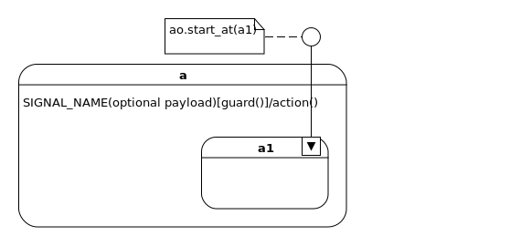

.. _reading_diagrams-reading-diagrams:

  *If I can't picture it, I can't understand it* 
  
  -- Albert Einstein

Diagrams
========
In the 1990s a number of people got together an collected all of the different
popular ways of drawing pictures of software into one standard called UML
(unified modeling language).  The Harel formalism (the way David Harel wanted us
to draw statecharts) was included in UML.

UML has fallen out of favor because the committee controlling it, became
overly pedantic. They tried to turn UML into a programming language, rather than
a collection of best practices about how to sketch out some pictures of software
systems.  They flew too close to the Sun, annoyed everyone, burnt their wings
and crashed into the ground.  Now UML has become some kind of undead, anti-brand.

But they left behind some useful technology.  A number of free diagramming tools
still exist which can be used to draw pictures really fast so that we can
communicate to one another what we want to build.  With these same tools we can
draw our statecharts.

Martin Fowler translated the gobbledegook of the UML standard into something
legible with his book: `UML distilled
<https://martinfowler.com/books/uml.html>`_.  If you want a very solid
understanding about Harel formalism as it relates to UML, go to the source and
read `Practical UML Statechart in C/C++, 2nd
Edition <https://sourceforge.net/projects/qpc/files/doc/PSiCC2.pdf/download>`_ by
Miro Samek.

Do you need to read these books before you use UML?  No, not really, just start
drawing things.  Use your search engine to answer the questions you come up with
as you go.  Make sure the people on your team know what you mean when you draw
your pictures.

At some point another attempt will be made to standardize the current best
practices for diagramming our software systems.  Maybe it will incorporate all
of the new programming idioms.  Until then we can limp along with UML.

.. _reading_diagrams-a-warning-about-diagramming:

A Warning about Diagramming
---------------------------
Be aware that as you draw your pictures, you will lock-in your thinking.

You and everyone on your team will be effected by the Sunk Cost Fallacy:  "Your
decisions are tainted by the emotional investments you accumulate, and the more
you invest in something the harder it becomes to abandon". [#]_  

If you build beautiful drawings with a graphic design application; you will need
to put time and effort into them and you will probably become emotionally
attached to them.  Remember, your diagrams are just mistakes in the right
direction.  You need to be able to destroy these pictures, just as casually as
you would refactor your code.

So use a simple and fast moving tool that almost draws the pictures for you; I
use UMLet.  With UMLet you can build custom templates.  `Here is the custom
template I use <https://github.com/aleph2c/umlet-statechart-template>`_.  It is
hard to fall in love with a picture made by UMLet.

You don't have to use this tool or this template, there `a lot of other UML drawing
tools available
<https://en.wikipedia.org/wiki/List_of_Unified_Modeling_Language_tools>`_.

Another way to make your pictures easy to change is to limit the amount of
detail on them.  You don't have to draw every class and you can shrink a
complicated statechart into a kind of short hand.

UML can't begin to describe what you write with your Python code.  So, if you
need to express a code's idea on the diagram, just write the code directly onto
the picture.

.. _reading_diagrams-classes:

Classes
-------
The class is a blueprint for an object.

Unfortunately UML was constructed to focus on this instead of the object itself.
But the UML class diagram is good at providing a bit of context around your
statechart diagram.  So we will talk about it.

Typically, your class diagram would have a name and it would describe the
important variables (attributes) and functions (methods) of your class.  I tend
to put a little line between these when I'm diagramming them.

.. image:: _static/class_1.svg
    :target: _static/class_1.pdf
    :align: center

If your class inherits from another class, you draw it with the inheritance
arrow (the ToasterOven *is an* ActiveObject):  

.. image:: _static/class_2.svg
    :target: _static/class_2.pdf
    :align: center

.. code-block:: python

  # ...
  class ToaterOven(ActiveObject):
    # ...

If the object that is instantiated from your class, constructs another
object, of another class, you can draw this with the composite arrow (The toaster
oven *has a* light):

.. image:: _static/class_3.svg
    :target: _static/class_3.pdf
    :align: center

.. code-block:: python

  class ToasterOven(ActiveObject):
    def __init__(self):
      self.light = Light()
      # ...

If your object references another object that already exists, you can draw this
with an aggregation arrow (The toaster oven *has a* relay).

.. image:: _static/class_4.svg
    :target: _static/class_4.pdf
    :align: center

.. code-block:: python

  relay = Relay()

  # ...
  class ToasterOven(ActiveObject):
    def __init__(self, relay):
      self.relay = relay
      # ...

  toaster_oven = ToasterOven(relay)

.. _reading_diagrams-backwards-arrows:

Oh, but wait, did you notice the aggregation and composition arrows are
backwards?  This was done for a good reason, the arrow head (diamond looking
thing) is on the side that owns the other thing.  So at a glance you can see who
owns what.

.. image:: _static/arrow_pear.svg
    :target: _static/arrow_pear.pdf
    :align: center

The composite pear-arrow is black because when your object is destroyed, so is
the object that it has built within it.

.. image:: _static/arrow_pear_2.svg
    :target: _static/arrow_pear_2.pdf
    :align: center

These mnemonics should help you when you are diagramming.

.. note::

  These class diagrams are ill conceived since you have to know about all sorts of
  activity in the background before you understand them.  You have to know that
  the relationships are between the objects that are instantiated and not the
  classes themselves.  As Dave Thomas (of Pragmatic fame) says, Python is not
  class oriented programming it's object oriented programming, yet UML draws
  everything with classes.

  So treat the class diagrams as a quick reference to provide your statechart some
  context, or just a kind of throw away thing.  Use lots of class shorthand
  pictures if you are going to draw a few different classes on the same diagram.
  Your actual classes are well defined in your Python code, so you can use your
  code-tools (ctag/cscope) to see the class hierarchies and who references what
  within your editor.

Martin Fowler spends over two chapters of `UML distilled
<https://martinfowler.com/books/uml.html>`_ writing about class diagrams.  You
can make them really complicated if you want.

If you are using the miros package, you are managing your system's
complexity using statecharts and not with classes.  So drawing detailed pictures
using class diagrams is not a good use of your time.

.. _reading_diagrams-inheritance:

Inheritance and miros
----------------------
Imagine that you have written some code that is good at doing something, so you
pack this code into a Python class.  Now you want to make a new object that does
these things and a few more things.  You don't want to copy in your old working
code, it's variables and functions into new class, you just want it included
automatically, so that it's in one spot, easy to fix and change.  You want a
syntactical short hand for, "take this old blueprint and change it a bit".  You
want to program your blueprints by difference.  You want to use the idea of a
code-patch as it applies to your classes.

.. image:: _static/class_5.svg
    :target: _static/class_5.pdf
    :align: center

So, you put your working code into a class, then make a new class where it
inherits from the class with the working code.  That's a nice feature and it's
called inheritance.  Any time you see an arrow with an open arrow on one side,
think of it as short hand for: "is a".  The above diagram would read
BluePrintPatch "is a" ClassContainingWorkingCode.

Within the context of this library, you would inherit from either the
ActiveObject or the ActiveFactory to gain access to the event processor, and all
of the other useful methods which would drive your statechart diagram.  Then,
you can either attach this class directly to your statechart, or make an
intermediate class that holds all of your worker-functions for the thing you are
trying to build.

.. image:: _static/class_6.svg
    :target: _static/class_6.pdf
    :align: center

Patching is easy for a computer, but it's a lot harder for a human mind.  In the
1990's when object oriented programming was *the* raging fad, the computer
science community really over-emphasized this feature.  We have since learned
that inheritance is like any good vitamin, if you use too much of it becomes
hazardous to your well-being.

So don't over use inheritance or you will make your code *really* hard to debug
and maintain:

.. image:: _static/class_7.svg
    :target: _static/class_7.pdf
    :align: center

It makes sense to inherit from an ActiveObject or an ActiveFactory, because you
probably have no intention of debugging this library's code.  If you make a
subclass of one of these classes, you can put your specific worker functions and
named attributes in it; but will you ever need to subclass beyond that point?
Probably not; inheritance can get you into a lot of trouble if it's too deep.

If you are going to inherit ask yourself if the "as-a" relationship holds true
when you use the two class names in a sentence.  "The ToasterOven class is an
ActiveObject"; yes, that makes sense.  Ok, I'll use inheritance.

If you want all of the states of your statechart to react the same when they see
a specific event, use the :ref:`ultimate hook pattern <patterns-ultimate-hook>`.
This gives you all of the benefits of inheritance while still having debuggable
code.

.. _reading_diagrams-understand-what-a-statechart-is-from-a-metaphor:

Understand what a Statechart is from a Metaphor
-----------------------------------------------
If you don't know what a statechart is, think of it as a kind of board
game.

The board game has a board with a picture on it, some marbles that the players
can place, and or roll around the board in accordance to the game's rulebook.
This game has two common game pieces that are used to move around the board;
they respond to how the marbles are played.  If one player moves the game pieces on
their turn, the next player will start their turn at this new position.

As the board game designer, you would have control over the drawing on the board
and you would design some of the marbles that are used by the players, but you
wouldn't control the rulebook or the players specific behavior, what fun would
that be?  But, you could choose who gets to play the game.

The players of your game could be people, touching an external user interface.
At the moment they press a key, an electrical signal would be sent into your
computer and then turned into a software abstraction of the key-press event that
could effect your board game.  But a player doesn't actually have to be a
person, it could be a count down timer that fires an event every 3 seconds, it
could be the stock market, it could be the weather.  A player in this metaphor
is just something in the outside world that can trigger the events you want your
board game to react to.

To distinguish one event from another event, we will call them by different
names: signal names.  Sometimes an event carries additional information, let's
call this a payload.  Going back to our metaphor, think of an event is a marble.
A player would build a marble and put it on the board when it was their turn to
play the game.  Every marble would have a signal name painted on it, and
sometimes, deep within the marble would be a payload.

The player would place their marble on the board at the current location of the
game pieces, let go of it and watch it roll.  As it rolled on the board, it
might trigger software that you have written into that marble's groove.  It
might trigger additional marbles to pop out of the board and roll in turn; but
eventually the action would stop and the common game pieces would be moved to
position and the next player would get to play.

Every game has a rule book.  In our case our case the rule book is
called the Harel Formalism.  These rules govern how the marble can move on the
board and how the game pieces are shifted in response.

The statechart board game also has rules about when a player gets to play.  If
one player really needs to put a marble on the board while another is playing,
this is OK.  She will just put it into a loading dock.  The statechart board
game will only let one player play out their marble on the board at a time; this
rule is called run to completion (RTC).  When a player's marble has finished
moving around the board, our board game will check it's loading dock to see if
another marble needs to be acted upon.

The loading dock is a python deque.  The thing that will load the marble onto
the board when the game has finished processing the last player's marble is a
python thread.

So what does this board game look like?  Well, it looks kind of like a bunch of
rounded rectangles connected with arrows.  The arrows have signal names painted
on them to describe paths that certain marbles can follow and the rounded
rectangles are called states.

All the states have names, and a state can be within another state.  As the
different players play the game, the common pieces are moved around the board,
coming to rest within one of the states.  This is called the resting state.

The rules are pretty straightforward, but who wants to read a rulebook anyway?
The players certainly don't.  So, you as the board game designer and the board
game itself must know the rules.  The board game's software that applies the
rules to the marbles on the board is called the event processor.  It is based
upon the algorithm written by Miro Samek.

So how is this useful?  Well your game has software on it's game board that can
run when a marble roles over it.  You can connect this software to the output of
your computer; so you can control things in the outside world.  Your board game,
statechart, could be used to control a trading strategy, it could be used to
control the massive doors over a stadium, automatically reacting to changes in
weather conditions.

Getting down to brass tacks, what do we do now?  Well I have to show you how to
draw a board game; I have to show you how to draw a statechart.  We will use
UML.  I have to show you how to connect your board game to it's automatic rule
book; the event processor.  I have to show you how to create your custom
marbles, the events and their payloads and how to send these to the board game
so that you can connect outside things into the events to which your statechart
will react too.

Once you know how to draw the pictures, you will need to know how to translate
this into code.  Lastely, I will show you how to see if your statechart is
working; so that it can give you feedback about what it is doing.   You can use
this feedback to both trouble shoot your design and to describe how it works.

.. _reading_diagrams-events:

Events
------
Any code which uses the miros library is event-driven.

This means that your software will be waiting for an occurrence of an event: a
mouse click, a stock price passing a certain threshold, or the arrival of a data
packet.  After recognizing the event your system will react to it, by
manipulating the hardware state or sending further internal events to itself.
After completing the processing of this event in accordance to your design, and
the Harel formalism (the rule book of the board game), the system will stop
processing; and wait for the next event.

An event has a name and an optional payload.  The event's name is called a
signal name.  There are internal signal names, like entry, exit and init (black
dot's on the diagram) and there are external signals; which are just names that
you define to track the real world events that your software is reacting to.

Here is how to make an external event in miros:

.. code-block:: python

  from miros import Event, signals
  from collections import namedtuple

  my_event = Event(signal=signals.MY_EVENT)
  my_event_with_payload = Event(signal=signals.MY_EVENT,
    payload="with a payload that is just a string")

  MouseCoordinate = namedtuple("MouseCoordinates",
    ['x_px','y_px','z_px']

  mouse_click_evt = Event(signal=signals.MOUSE_CLICK,
    payload=(MouseCoordinate(x_px=20, y_px=40, z_pz=30)))

Typically, external events like these come from outside of your statechart, so
you don't have to draw them on your diagram.

The event is like a named marble that can roll on a groove, described by the
arrows of your statechart.  You can think of the groove as being pitched so that
a marble can only roll in one direction.  Any groove can have software written
on it, but this software will only run when a marble rolls over it.  This is how
these grooves can be drawn with UML:

.. image:: _static/Transition_Triggers.svg
    :target: _static/Transition_Triggers.pdf
    :align: center

In English, the above diagram would say, "If I receive an event with a signal
name "SIGNAL_NAME" while I am in source_state, run the guard, if it returns
True, run the action() function within the context of the source state, then add
the EVT_A event to my fifo queue so that it can be run during my next RTC
process, then transition to the target_state, but, if my guard code returns
False, ignore the event and do nothing".

Your event can also run some code without causing a state transition; this is
called a hook:

In English, the above diagram would say, "If I receive an event with a signal
named "SIGNAL_NAME" while I am in source_state, run the guard, if it returns
True, run the action().  When I have finished running the action, stay in the
source_state.  If the guard returned false, ignore the event."

Now that we understand how to draw external events on our diagrams we will talk
about internal events:

  * entry
  * exit
  * init (the black dot)

I will explain how they work when we look at the board game's rule book, for now
I will just show you how to draw them.  The entry and exit internal events, are
just hooks:

.. image:: _static/Transition_Triggers_With_Internal_0.svg
    :target: _static/Transition_Triggers_With_Internal_0.pdf
    :align: center

The init internal event is drawn with something that UML calls a pseudostate;
which means a widget on your picture that is not a state.  The init signal is a
black dot connected to an arrow.

.. image:: _static/Transition_Triggers_With_Internal_1.svg
    :target: _static/Transition_Triggers_With_Internal_1.pdf
    :align: center

The internal events are triggered in reaction to transitions made by external
event on your diagram.

To get a marble onto the board, you need to get it into the games loading dock.
To do this, you use one of two different API calls to this library,
``post_fifo`` or ``post_lifo``.  If you use ``post_fifo``, which stands for post
first-in-first out, you are playing fair.  You will post your marble at the end
of the line of marbles waiting to be played by the board game.  If you use the
``post_lifo``, you are budging in line, placing your marble at the front of the
line so that it will be the next marble the game plays.

.. _reading_diagrams-event-processor-connection:

Event Processor Attachment Points
---------------------------------
To connect the event processor of your object to a statemachine; draw an
attachment point like this:

I'm not sure if I'm using UML properly according to the standard, and I don't
really care.  What I care about is if you understand what I mean.

In the context of this library an object instantiated with an event processor
can attach itself to a statemachine.  Another object instantiated with an event
processor can also attach to the same statemachine.

The statemachine doesn't keep track of variables or the current state; it simply
acts as a behavioral specification.  The object that was instantiated from the class
containing the event processor keeps track of it's variable contents and state
information.  This is why the diagram is drawn this way.

.. _reading_diagrams-states:

States
------
UML lets you draw lots of different states.  The Miro Samek algorithm doesn't
really care about this, since it supports finite state machines (simple states)
and hierarchical state machines (composite states) exactly the same.

Here is a simple state, you would use it when drawing a finite state machine:

Here is an example of a finite state machine.

You could have drawn the above machine like this:

Here is a second way of drawing the same machine is here:

Here is a simple hierarchical state machine:

You could draw the above hierarchical state machine using simple states, but
that would be harder to do than using the composite state widgets, so just use
the composite state widgets.

In code your state is represented with a state handler, which is kind of a
callback function that is given two arguments, a reference to an object that has
an event processor and an event.

This event contains information that can be used by your handler.  The returned
value from this state handler has to be something that makes sense to the event
processor.  

So a state handler is not like a function or a method, you don't give it
arguments and it gives you a result.  Instead, you send it events and its
behavior is dependent upon how you have structured it's topology.  The results
of the work done by your statechart are left on the object provided as the first
argument to the state handler.

.. _reading_diagrams-state-shorthand:

State Shorthand
---------------
When you are wrestling with your tools to draw a picture, you will often find
that a state has too much information in it to fit on your page.

You can hide some of the inner details of your states with state shorthand, so
that your diagram is sized to fit on the page.

For some reason the OMG called this decomposition hiding.  I don't use this
terminology, I'm not sure how to remember it, but if you need to google it, this
is it's search term.

.. _reading_diagrams-entry-signals:

Entry Event
-----------
The entry event will be sent to your state handler anytime the lines representing
it's boundary are cross from the outer, into the inner.

.. _reading_diagrams-initialization-signals:

Initialization Dot
------------------
The init event will be sent to your state handler anytime you have settled into a
state, this could happen after the last entry event, if the transition occurred
from after an entry signal or after the last exit signal.

.. _reading_diagrams-exit-signals:

Exit Signals
-------------
The exit event will be sent to your state handler anytime the lines representing
it's boundary are cross from the inner, to the outer part of your diagram.

.. _reading_diagrams-event-guards:

Event Guards (If Structures)
----------------------------
You can write code that will run on an event arrow that could cause a state
transition.  If you would like to only let this event work if a condition is
true, you would add an event guard to it.  It looks like this:

In the code this would translate to something like this:

.. _reading_diagrams-if-structures:

If-Else Structures
------------------
If you would like an event to be managed in different ways depending on some
condition, you would use an if-else structure.  In UML your if structures look
like diamonds:

The above diagram would look something like this in the code:

.. _reading_diagrams-extending-arrows:

Extending Arrows
----------------
Often you will find it tricky to get all of your arrows packed onto your page.
If a number of arrows share the same kind of action, you can join them using a
bar:

You can also split them using a bar too:

.. _reading_diagrams-explicitely-placing-the-return-codes-on-your-diagram:

Explicitely Placing the Return codes on your diagram
----------------------------------------------------
Your statechart's topology is discovered by the event processor every time it
reacts to an event.  To so this, it uses the returned values of your state
handler method.  When I first wrote the library I hid this from the user; but it
is necessary to have control of the return value since with it, you can define
hooks, or let events be processed and fall out to another state.

.. _reading_diagrams-making-notes:

Making Notes
------------
You can add notes to your diagram using the note box:

.. _reading_diagrams-terminate-pseudostate:

Terminate Dot
-------------
If you want to destroy your statechart upon reacting to an event, you can use the terminate
icon:

.. _reading_diagrams-final-state:

Final Dot
---------
If your event has completed all of the work required in the enclose region, you
want draw this with the final state icon:

This might make sense to use this if you want some code to run upon the
initialization of the state, but you do not want to transition deeper into the
state machine.

Fall Through
------------
The miros event handler can do something that I haven't seen specified anywhere,
it can do a kind of catch and release, where an event can be processed by a
state, then released outward into the statechart to be processed by an outer
state.

.. note::

  This is not in the UML standard

.. _reading_diagrams-deep-history-dot:

Deep History Dot
----------------
If an event has caused you to leave a state deeply embedded in your statechart,
but you would like to transition back to that state after the interruption, you
can use the deep history dot, it's a circle enclosing a H*:

.. _reading_diagrams-publishing-to-other-charts:

Publishing Dot
--------------
If you are publishing an event to another chart, if is often very useful to have
your eyes fall on this immediately while looking at your diagram.  I use a red
dot to signify this, red, because the event is currently stopped waiting for
processing.

.. note::

  This is not in the UML standard

.. _reading_diagrams-subscribing-from-other-charts:

Subscription Dot
----------------
If you have subscribed to an event being posted by another chart, it's often
very useful to have your eyes fall on this immediately while looking at your
diagram.  I use a green dot, to show that this signal is going, or being acted
upon by the statechart which has subscribed to it

.. note::

  This is not in the UML standard

.. _reading_diagrams-high-level-dependency-diagrams:

High Level Dependency Diagrams
------------------------------
If you have a number of statecharts that are all working together to perform
some sort of collective action, it's often very useful to see how they relate
to one another from a very high point of view.  For this I draw high level
dependency diagrams:

.. note::

  This is not in the UML standard

.. _reading_diagrams-medium-level-construction-and-pub/sub-diagrams:

Medium Level Construction and Pub/Sub Diagrams
----------------------------------------------
If you have build a federation of statecharts working together, you might want
to look at how a specific statchart works in the context of this federation
without looking at the details of its state machine.  This can be done with a
medium level contextual view.  You would identify what it publishes, what it's
subscribed to and what it constructs to perform it's tasks:

.. _reading_diagrams-detailed-statechart-diagrams:

Detailed Statechart Diagrams
----------------------------
The complete statechart is something that shows the topological nature of your
design with code marked upon it so you can quickly scan it and see what it's
doing.  The publish and subscription dots are immediately visible and if you
need to further augment the chart with graphs to describe timing or whatever you
think will be useful, place those on the diagram well:

.. _reading_diagrams-sequence-diagrams:

Sequence Diagrams
-----------------
Sequence diagrams are very useful and extremely fragile to design changes.  The
can be generated directly from the trace instrumentation of the state machine and
quickly written up in plain text.

Avoid spending a lot of time on these diagrams, and avoid the more advanced
diagramming features, since to put effort into hand drawing a sequence diagram
while designing a reactive system will be a Sisyphean task

.. _reading_diagrams-payloads:

Payloads
--------
Your statechart is running in it's own thread.  An event can be published from
one thread and consumed by another thread.  This means if you put mutable data
in your event's payload, you could be creating a shared global variable between two
separating threads.  Shared global information should be locked and unlocked if
it's being used by multiple concurrent processes.

Instead of coming up with complicated locking mechanisms, wrap large common data
structures within their own statecharts and copy smaller payloads into named
tuples.  A named tuple is immutable, so you won't accidentally short yourself in
the foot by accidentally creating a global variable.  You can draw your payloads
into your statecharts like this:

.. _reading_diagrams-dealing-with-the-anti-brand:

Dealing with the Anti-Brand
---------------------------
People may roll their eyes when they see your pictures.

A techno-anthropologist could build a career around looking at the history of
UML.  In my own career I saw a strange kind of social stratum emerge between
architects and practitioners, where architects had higher social status than the
people implementing their vision.  The architects invented techno-babble to
describe simple concepts and tried to present their work as a collection of open
secrets and I don't think they did this on purpose.

The developers, who were ultimately responsible for the delivery of working
software would create something independent of this vision.  It wouldn't
surprise me if the whole agile management movement was given birth because of
this political tension.  It is a lot more interesting than this, but I'm not a
historian.

So, what do you do when people start rolling their eyes when you show them these
pictures?  First of all, don't take it personally, they might have some well
earned cynicism.  Just quickly explain what the pictures mean and show them how
to draw their own pictures.  Show them why they are useful.  Explain things in
plain English, don't use the language of professors or consultants.  You don't
have to signal that you are clever, we are trying to expose ideas not to hide
behind them.

The Python programming language has moved well beyond UML.  In fact, it could be
said that we don't really know how to program computers yet.  We might still be
using Roman numerals; when Arabic numbers have yet to be discovered.  UML isn't
the answer, it's a trajectory toward what we really want.  We want to be able
to see our designs using the visual parts of our mind.  We want to be able to
communicate our complex ideas to one another using a formalism that is
expressive enough to solve our problems.

If you can't sell your ideas to everyone, don't worry about it.  Their will
always be people you can't reach, focus on what you can change instead.  This is
the power of open source, you can always fork a project and go your own way.

If a developer isn't diagramming their own software, then your organization is
doing it wrong.

.. [#]  `The Sunk Cost Fallacy <https://youarenotsosmart.com/2011/03/25/the-sunk-cost-fallacy/>`_
