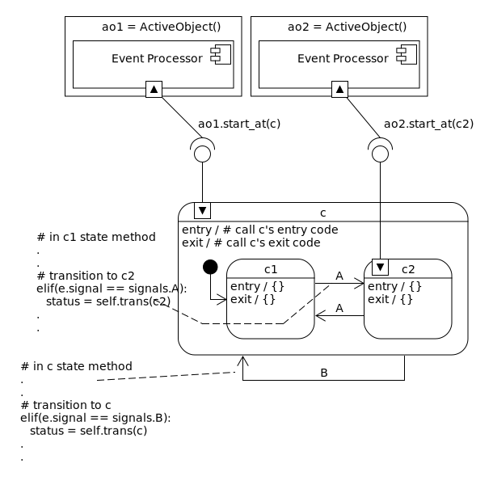
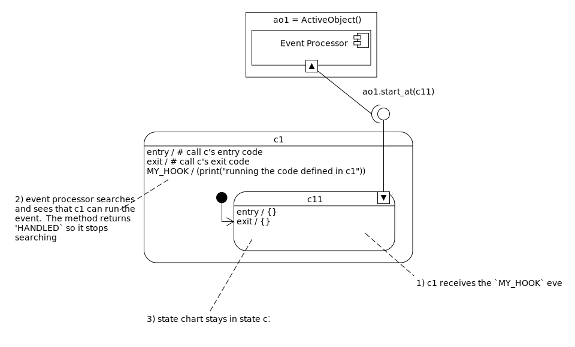
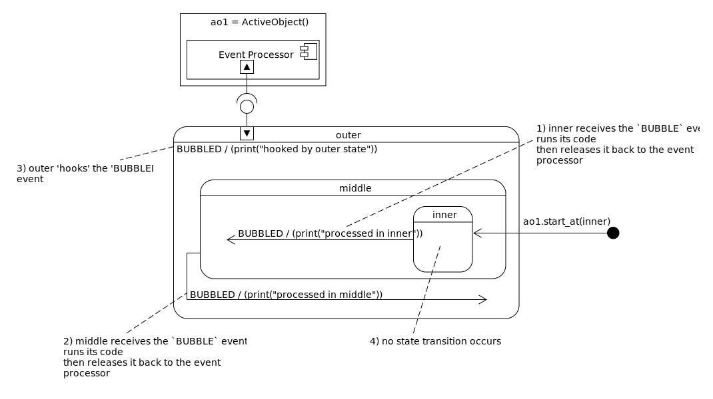
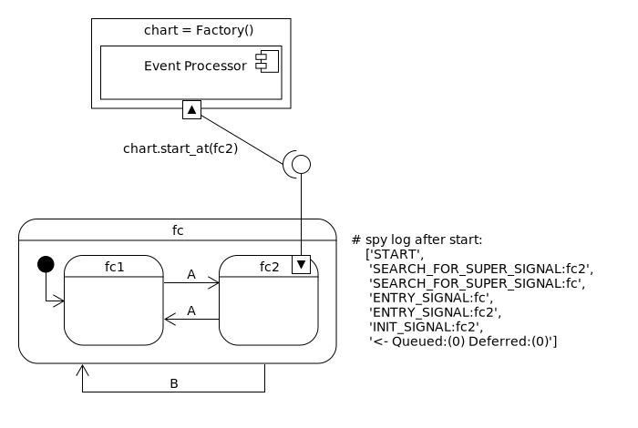

.. _recipes:

Recipes
=======

.. toctree::
   :maxdepth: 2
   :caption: Contents:

**Simple things should be simple, complex things should be possible.** -- *Alan Kay*

.. _recipes-states:

States
------
In the miros frame work, your state methods act as places to link your application code into designed behavior.

States need to:

1. React to events and run your application code.
2. Describe their parent state.
3. Describe how they should transition to other states for specific events.

There are different ways to create states with miros:

1. :ref:`You can create a hand-coded state
   method.<recipes-boiler-plate-state-method-code>`

2. :ref:`You can have the library generate a state method for you, then register
   callback responses to specific events and set a parent at
   runtime.<recipes-creating-a-state-method-from-a-template>`

3. You can use a fusion technique.  You can hand write a :term:`state<State>` and use context
   managers within the method so that the miros package can register callbacks
   for specific signals, or even change it's parent at run time.

4. :ref:`You can use an Active Object Factory to create your statechart<recipes-creating-a-state-method-from-a-factory>`

.. _recipes-state-recipes:

**State Recipes**:

* :ref:`Boiler plate state method code<recipes-boiler-plate-state-method-code>`
* :ref:`Describe a parent state<recipes-describe-a-parent-state>`
* :ref:`Pass an event through to a parent state<recipes-pass-an-event-through-to-a-parent-state>`
* :ref:`Transition to another state<recipes-transition-to-another-state>`
* :ref:`Do something when the state is entered<recipes-do-something-when-the-state-is-entered>`
* :ref:`Do something when the state is initialized<recipes-do-something-when-the-state-is-initialized>`
* :ref:`Do something when the state is exited<recipes-do-something-when-the-state-is-exited>`
* :ref:`Create a hook<recipes-create-a-hook>`
* :ref:`Catch and release<recipes-catch-and-release>`
* :ref:`Create a one-shot<recipes-create-a-one-shot-state>`
* :ref:`Create a multi-shot<recipes-create-a-mult-shot-state>`
* :ref:`Cancel events<recipes-cancelling-events-state>`
* :ref:`Defer and Recall an event<recipes-deferring-an-event-state>`
* :ref:`A Deeper look at state methods<recipes-what-a-state-does-and-how-to-structure-it>`
* :ref:`Creating a statechart from a template<recipes-creating-a-state-method-from-a-template>`
* :ref:`Creating a statechart from a factory<recipes-creating-a-state-method-from-a-factory>`

.. _recipes-what-a-state-does-and-how-to-structure-it:

What a State Does and How to Structure it
^^^^^^^^^^^^^^^^^^^^^^^^^^^^^^^^^^^^^^^^^
Your state methods represent the rounded rectangles in your statechart diagram.
They contain information about how a state should react to an event and they
contain information about how they relate to other states.  They do not
explicitly create the behavior that you expect from your statechart, this is
done by an event processor.  An event processor is created when you instantiate
an active object and it is the thing that calls the state methods over and over
again to manifest the expected behavior.

When an active object uses its ``start_at`` method, it connects your state
method to its event processor.  

An event processor never actually learns or remembers the full nature of how
your state methods are linked to one another, it only remembers it's current
state and where it would like to transition within the diagram on its next
pass.  It always searches them as it reacts to whatever event you have provided
it.  So, your design is discovered as the event processor reacts to events.  Your
state method's can be used by many different event processors, they're
polyamorous:

.. image:: _static/eventprocessors.svg
    :align: center

In the diagram above we see that two different active objects can use the same
statechart structure.  Each active object can be in a different state, even
though they are using the same diagram.   ``ao1`` starts it's interpretation of
the statechart in state ``c`` and ``ao2`` starts it's interpretation of the
statechart in state ``c2``.  As someone building this design you would create
two different active objects, and you would define three different state
methods, then you would start the different active objects with a ``start_at``
call.

You don't explicitly call an event processor while using the miros api, it is
called in the background when you use methods like ``start_at``, ``post_fifo``
or ``post_lifo``.

The event processor treats a state method as if it was defined within its own
class.  It does this by using its ``self`` variable in the first argument to
the state method call.  It then injects the event into the second argument to
see what the state method will do about it.  

The state method communicates back to it's currently connected event processor
in two different ways.  It adjusts internal attributes on this ``self``
variable of the thing searching it and by returning a status value.  The first
argument of your state method does not have to be written as ``self``, it can
be called anything.  If it is called ``chart`` or ``hsm``, it makes no
difference to how it will actually be used by the event processor.

State methods themselves are stateless.  They do not keep internal variables,
they only react and tweak the variable states of the objects that were given to
them as input arguments.  It is the ``self`` variable of the outside caller
that has new information impressed upon it.  This is how state methods stay
polyamorous.

The states contain a place to anchor your application code.  They also provide
information about the design topology of your chart.  They describe their
parent state and they describe how some events can cause transitions to other
state methods. That's it.  There is no full picture described in a table or in
any other data structure.  The picture is actually written in the interaction
of your state method code and the event processor calling it.

For this reason an event processor can call your state method many times while
it is trying to discover how your statechart is structured.  It does this
during the ``start_at`` call, or when a ``post_fifo`` or ``post_lifo`` method
is called with an event.

As an application developer you don't have to care about `how` the event
processor does its job you just need to tell it `what` to do.  You
need to take your picture and turn it into code.  This is done by writing one
state method at a time; linking them together with hierarchy and arrows.

To make an arrow is fairly straight forward.  You just use the ``trans``
method with your target state as an argument.  This is easy to code.

To describe the hierarchy is a little bit more subtle.

All state methods must reveal their parent information.  They do this by using
an if-elif-else and placing the parent information in the ``else`` clause.  It
does this as a kind of default arrow for all events it doesn't know how to
react to, to the next-outer-most-state.  In this ``else`` clause it:

1.  sets ``self.temp.fun`` of the event processor to point to it's parent state method
2.  return the value of ``return_status.SUPER``

.. image:: _static/stateapplicationcode1.svg
    :align: center

For the outermost state of your state chart you set the parent  to ``self.top``.
This state method is actually defined within the event processor and when it
sees this state it knows that it is about to fall of the edge of your map.

If your parent state isn't the outer most state, you would just set the
``self.temp.fun`` to whatever state is:

.. image:: _static/stateapplicationcode2.svg
    :align: center

Now that we understand how state methods relate to each other and to event
processors let's look at a simple example to see how the pictures relate to
working code.

.. image:: _static/eventprocessors.svg
    :align: center

First you would describe state's ``c``, ``c1`` and ``c2``:

.. code-block:: python

  from miros.hsm import spy_on
  from miros.activeobject import ActiveObject
  from miros.event import signals, return_status, Event

  def c(self, e):
    status = return_status.UNHANDLED
    if(e.signal == signals.ENTRY_SIGNAL):
      # call c's entry code
      status = return_status.HANDLED
    elif(e.signal == signals.INIT_SIGNAL):
      status = self.trans(c1)
    elif(e.signal == signals.B):
      status = return_status.trans(c)
    elif(e.signal == signals.EXIT_SIGNAL):
      # call c's exit code
      status = return_status.HANDLED
    else:
      status = return_status.SUPER
      chart.temp.fun = self.top
    return status

  def c1(self, e):
    status = return_status.UNHANDLED
    if(e.signal == signals.ENTRY_SIGNAL):
      status = return_status.HANDLED
    elif(e.signal == signals.INIT_SIGNAL):
      status = return_status.HANDLED
    elif(e.signal == signals.A):
      status = trans(c2)
    elif(e.signal == signals.EXIT_SIGNAL):
      status = return_status.HANDLED
    else:
      status = return_status.SUPER
      chart.temp.fun = self.c
    return status

  def c2(self, e):
    status = return_status.UNHANDLED
    if(e.signal == signals.ENTRY_SIGNAL):
      status = return_status.HANDLED
    elif(e.signal == signals.INIT_SIGNAL):
      status = return_status.HANDLED
    elif(e.signal == signals.A):
      status = trans(c1)
    elif(e.signal == signals.EXIT_SIGNAL):
      status = return_status.HANDLED
    else:
      status = return_status.SUPER
      chart.temp.fun = self.c
    return status

Then you would connect the state methods into two different active objects and
start them in their desired states:

.. code-block:: python

  ao1, ao2 = ActiveObject(), ActiveObject()
  ao1.start_at(c)
  ao2.start_at(c2)

``ao1`` would act as if it owned the map, and ``ao2`` would act as if it owned
the map.  Neither would know that `their` state methods were being used by more
than one active object.

.. _recipes-boiler-plate-state-method-code:

Boiler Plate State Method Code
^^^^^^^^^^^^^^^^^^^^^^^^^^^^^^
For a flat state:

.. code-block:: python

  def <your_state_method_name>(self, e):
    # if you state method doesn't know what to do it should return this
    status = return_status.UNHANDLED

    if(e.signal == signals.ENTRY_SIGNAL):
      # call your entry application code

      # make sure you tell the event processor you handled this event
      status = return_status.HANDLED
    elif(e.signal == signals.INIT_SIGNAL):
      # call your initialization (big black dot) application code

      # make sure you tell the event processor you handled this event
      status = return_status.HANDLED

    #
    # Write your custom
    # event handlers in here as there own elif clauses
    #

    elif(e.signal == signals.EXIT_SIGNAL):
      # call your exit (big black dot) application code

      # make sure you tell the event processor you handled this event
      status = return_status.HANDLED
    else:
      # this logic will run when your event processor sends an event with the
      # SEARCH_FOR_SUPER_SIGNAL name

      # 1) place your parent state method into the chart.temp.fun
      chart.temp.fun = <your_parent_state_method>

      # 2) make sure you return this value
      status = return_status.SUPER
    # return the status value
    return status
    
If your state method didn't include handling for the ``ENTRY_SIGNAL``,
``INIT_SIGNAL`` or ``EXIT_SIGNAL``, the event processor will just assume it did
and returned return_state.HANDLED.

.. _recipes-describe-a-parent-state:

Describe a Parent State
^^^^^^^^^^^^^^^^^^^^^^^
To describe your parent state:

1. setting the ``temp.fun`` attribute of the first argument to point at their
   parent state.
2. return the value of ``return_state.SUPER``

Generally speaking this is how it is done:

.. code-block:: python
  :emphasize-lines: 5,6

  def <state_method_name>(chart, e):
    # .
    # .
    else:
      status = return_status.SUPER
      chart.temp.fun = <parent_state_of_this_state_method>
    return status.

If you need to define your parent state as the outermost state of your diagram, you would
set the ``<parent_state_of_this_state_method>`` to the ``top`` attribute of the
first argument provided your crafted the state method:

.. code-block:: python
  :emphasize-lines: 6

  def <state_method_name>(chart, e):
    # .
    # .
    else:
      status = return_status.SUPER
      chart.temp.fun = chart.top
    return status.

To read more about why you structure your state methods this way, read :ref:`this.<recipes-what-a-state-does-and-how-to-structure-it>`

.. _recipes-pass-an-event-through-to-a-parent-state:

Pass an event through to a Parent State
^^^^^^^^^^^^^^^^^^^^^^^^^^^^^^^^^^^^^^^
The easiest way to pass an event outward in your statechart is not to handle it
in your ``if-elif`` clauses and let your ``else``
:ref:`clause<recipes-describe-a-parent-state>` handle it.

.. code-block:: python

  # Sending Event(signal=signals.B) to c1 would cause
  # the parent state c to be called with this event,
  # since it is not handled in the ``if-elif``
  # logic structure or c1.
  def c1(self, e):
    status = return_status.UNHANDLED
    if(e.signal == signals.ENTRY_SIGNAL):
      status = return_status.HANDLED
    elif(e.signal == signals.INIT_SIGNAL):
      status = return_status.HANDLED
    elif(e.signal == signals.A):
      status = trans(c2)
    elif(e.signal == signals.EXIT_SIGNAL):
      status = return_status.HANDLED
    else:
      status = return_status.SUPER
      self.temp.fun = self.c
    return status

Another way to pass an event out to your parent state is to handle the event in
the ``if-elif`` clause, then return ``return_status.UNHANDLED`` to the event
processor.  When it sees that your state method couldn't handle the event it
will call it again to find it's parent state and then call that parent state
method with the event that you want to trickle outward in your diagram.

.. code-block:: python
  :emphasize-lines: 12

  # Sending Event(signal=signals.B) to c1 would cause
  # the parent state c to be called with this event,
  # since c1 returns a `UNHANDLED` value to the event
  # processor
  def c1(self, e):
    status = return_status.UNHANDLED
    if(e.signal == signals.ENTRY_SIGNAL):
      status = return_status.HANDLED
    elif(e.signal == signals.INIT_SIGNAL):
      status = return_status.HANDLED
    elif(e.signal == signals.B):
      print("saw signal B, but letting it trickle through to my parent")
    elif(e.signal == signals.A):
      status = trans(c2)
    elif(e.signal == signals.EXIT_SIGNAL):
      status = return_status.HANDLED
    else:
      status = return_status.SUPER
      self.temp.fun = self.c
    return status

.. _recipes-transition-to-another-state:

Transition to another state
^^^^^^^^^^^^^^^^^^^^^^^^^^^
To transition to another state, use the ``trans`` method:

.. code-block:: python
  :emphasize-lines: 8,9

  # Sending Event(signal=signals.A) will cause a transition to c2
  def c1(self, e):
    status = return_status.UNHANDLED
    if(e.signal == signals.ENTRY_SIGNAL):
      status = return_status.HANDLED
    elif(e.signal == signals.INIT_SIGNAL):
      status = return_status.HANDLED
    elif(e.signal == signals.A):
      status = trans(c2)
    elif(e.signal == signals.EXIT_SIGNAL):
      status = return_status.HANDLED
    else:
      status = return_status.SUPER
      self.temp.fun = self.c
    return status

Make sure that you return the result of the call to your ``trans`` method, or
the event processor will break.

.. _recipes-do-something-when-the-state-is-entered:

Do Something when the State is Entered
^^^^^^^^^^^^^^^^^^^^^^^^^^^^^^^^^^^^^^
To have your application code run when a state is entered place it in the
``ENTRY_SIGNAL`` clause of your state's if-elif structure.  An entry event will
occur anytime the event processor detects a transition from the outside to the
inside of your state method's boundary.

.. code-block:: python
  :emphasize-lines: 4-6

  # Running application code when the state is entered
  def c1(self, e):
    status = return_status.UNHANDLED
    if(e.signal == signals.ENTRY_SIGNAL):
      print("Running my entry application code here")
      status = return_status.HANDLED
    elif(e.signal == signals.INIT_SIGNAL):
      status = return_status.HANDLED
    elif(e.signal == signals.EXIT_SIGNAL):
      status = return_status.HANDLED
    else:
      status = return_status.SUPER
      self.temp.fun = self.c
    return status

.. _recipes-do-something-when-the-state-is-initialized:

Do Something when the State is Initialized
^^^^^^^^^^^^^^^^^^^^^^^^^^^^^^^^^^^^^^^^^^
To have your application code run when a state is initialized place it in the
``INIT_SIGNAL`` clause of your state's if-elif structure.  An init event will
occur after the entry event, if a transition is moving from the outside to the
inside of your state method's boundary.  It will also occur if there is a
transition into this state from one of its child states.

.. code-block:: python
  :emphasize-lines: 6-9

  # Running application code when the state is initialized
  def c1(self, e):
    status = return_status.UNHANDLED
    if(e.signal == signals.ENTRY_SIGNAL):
      status = return_status.HANDLED
    # BIG BLACK DOT ON DIAGRAM
    elif(e.signal == signals.INIT_SIGNAL):
      print("Running my init application code here")
      status = return_status.HANDLED
    elif(e.signal == signals.EXIT_SIGNAL):
      status = return_status.HANDLED
    else:
      status = return_status.SUPER
      self.temp.fun = self.c
    return status

:NOTE:  If you only want to run initialization code and do not want your state
        to immediately transition into another state, make sure you return
        ``HANDLED`` after running your application code, otherwise your
        statechart will not behave properly.

The ``INIT_SIGNAL`` handler is often used as the place where your state can
immediately transition into another state.  To do this, just use the
:ref:`trans <recipes-transition-to-another-state>` method and return its result
from your state method call:

.. code-block:: python
  :emphasize-lines: 6-10

  # Running application code when the state is initialized
  def c1(self, e):
    status = return_status.UNHANDLED
    if(e.signal == signals.ENTRY_SIGNAL):
      status = return_status.HANDLED
    # BIG BLACK DOT ON DIAGRAM
    elif(e.signal == signals.INIT_SIGNAL):
      print("Running my init application code here")
      # now transition into the c2 state
      status = self.trans(c2)
    elif(e.signal == signals.EXIT_SIGNAL):
      status = return_status.HANDLED
    else:
      status = return_status.SUPER
      self.temp.fun = self.c
    return status

.. _recipes-do-something-when-the-state-is-exited:

Do Something when the State is Exited
^^^^^^^^^^^^^^^^^^^^^^^^^^^^^^^^^^^^^^
To have your application code run when a state is exited place it in the
``EXIT_SIGNAL`` clause of your state's if-elif structure.  An exit event will
occur anytime the event processor detects a transition from the inside to the
outside of of your state method's boundary.

.. code-block:: python
  :emphasize-lines: 8-10

  # Running application code when the state is entered
  def c1(self, e):
    status = return_status.UNHANDLED
    if(e.signal == signals.ENTRY_SIGNAL):
      status = return_status.HANDLED
    elif(e.signal == signals.INIT_SIGNAL):
      status = return_status.HANDLED
    elif(e.signal == signals.EXIT_SIGNAL):
      print("Running my exit application code here")
      status = return_status.HANDLED
    else:
      status = return_status.SUPER
      self.temp.fun = self.c
    return status

.. _recipes-create-a-hook:

Create a Hook
^^^^^^^^^^^^^
A hook is some application code that is shared between your state method and
all of its child state method's.

Here we will create a hook in the c1 state, linking some application code to an
event with the signal name ``MY_HOOK``.

.. code-block:: python
  :emphasize-lines: 9-11

  # Sending Event(signal=signals.A) will cause a transition to c2
  def c1(self, e):
    status = return_status.UNHANDLED
    if(e.signal == signals.ENTRY_SIGNAL):
      status = return_status.HANDLED
    elif(e.signal == signals.INIT_SIGNAL):
      status = return_status.HANDLED

    elif(e.signal == signals.MY_HOOK):
      print("running the code defined in c1")
      status = return_status.HANDLED

    elif(e.signal == signals.EXIT_SIGNAL):
      status = return_status.HANDLED
    else:
      status = return_status.SUPER
      self.temp.fun = self.top
    return status

Now we will make a child state.

.. code-block:: python

  # Create a child state of c1
  def c11(self, e):
    status = return_status.UNHANDLED
    if(e.signal == signals.ENTRY_SIGNAL):
      status = return_status.HANDLED
    elif(e.signal == signals.INIT_SIGNAL):
      status = return_status.HANDLED
    elif(e.signal == signals.EXIT_SIGNAL):
      status = return_status.HANDLED
    else:
      status = return_status.SUPER
      chart.temp.fun = self.c1
    return status

We will start up our state chart, in c11 and send the ``MY_HOOK`` event:

.. code-block:: python

  ao = ActiveObject()
  ao.start_at(c11)
  # run code in c1 from c11 by using a hook
  ao.post_fifo(Event(signal=signals.MY_HOOK)) 
    # => "running the code from defined in c1"
  # demonstrate the state didn't change
  assert(ao.state.fun.__name__ == 'c11')

In the above code we see evidence that our statechart ran some application code
contained in the parent state (``c1``) while it stayed within its child state
(``c11``).

The child state received an event called ``MY_HOOK`` which it didn't know what
to do with.  So the event processor searched the parent state and saw that there was a
handler for this event in ``c1``.  The ``MY_HOOK`` handler (the if-elif
clause) returned ``return_status.HANDLED``.  Upon seeing this value, the event
processor determined that no transition is needed and it stopped running.

In this way hook code is run in the search phase of the search-then-transition
part of the event processor algorithm.

The ``c1`` state method, "hooks" the ``MY_HOOK`` event, by capturing it, running
its application code and returning the ``HANDLED`` value.  It stops the
``MY_HOOK`` event from falling off the edge of the map and returns control to
the state that originally experienced the event.

.. _recipes-catch-and-release:

Catch and Release
^^^^^^^^^^^^^^^^^
The catch and release recipe is similar to the
:ref:`hook<recipes-create-a-hook>` recipe in that you are using the search
phase of the event processor algorithm to run your code.

Instead of hooking the code with an ``HANDLED`` response, your state method
returns an ``UNHANDLED`` status.  This causes the event processor, to query it
again to find its parent, then dispatch the event to that state method.

Here we create the state in the picture, notice that ``inner`` and ``middle``
do not return ``HANDLED`` when they see the ``BUBBLED`` signal.

.. code-block:: python
  :emphasize-lines: 3-5, 12-14, 21-23, 30, 37

  def outer(chart, e):
    status = return_status.UNHANDLED
    if(e.signal == signals.BUBBLED):
      print("hooked by the outer state")
      status = return_status.HANDLED
    else:
      status = return_status.SUPER
      chart.temp.fun = chart.top
    return status

  def middle(chart, e):
    status = return_status.UNHANDLED
    if(e.signal == signals.BUBBLED):
      print("processed in middle")
    else:
      status = return_status.SUPER
      chart.temp.fun = outer
    return status

  def inner(chart, e):
    status = return_status.UNHANDLED
    if(e.signal == signals.BUBBLED):
      print("processed in inner")
    else:
      status = return_status.SUPER
      chart.temp.fun = outer
    return status

  ao = ActiveObject()
  ao.start_at(inner)
  # run each state's application code for the bubble event
  ao.post_fifo(Event(signal=signals.BUBBLED)) 
    # => "processed in inner"
    #    "processed in middle"
    #    "hooked by the outer state"
  # demonstrate the state didn't change
  assert(ao.state.fun.__name__ == 'inner')

.. _recipes-create-a-one-shot-state:

Create a One-Shot
^^^^^^^^^^^^^^^^^

.. include:: i_create_a_one_shot.rst 

.. _recipes-create-a-mult-shot-state:

Create a Multi-Shot
^^^^^^^^^^^^^^^^^^^

.. include:: i_create_a_multishot.rst 

.. _recipes-cancelling-events-state:

Cancelling Events
^^^^^^^^^^^^^^^^^
To kill a cancel a spefic event, see :ref:`this.<recipes-cancelling-a-specific-event-source>`

To kill all events sharing a signal name, see :ref:`this.<recipes-cancelling-event-source-by-signal-name>`

.. _recipes-deferring-an-event-state:

Deferring and Recalling an Event
^^^^^^^^^^^^^^^^^^^^^^^^^^^^^^^^

.. include:: i_defer_and_recall.rst 

.. _recipes-create-a-guard:

Create a Guard
^^^^^^^^^^^^^^
There will be situations where you only would like an event to cause a
transition between two states if a condition is true.  This is called a guard,
in UML it looks like this:

.. image:: _static/guard.svg
    :align: center

The logic between the square brackets must be true for this event to work.  In
this case the ``T`` event is guarded, it can only cause a transition if the the
function ``g()`` returns ``True``, otherwise nothing will happen.

The ``t()`` function is a function that runs if the ``g()`` returns True.

To implement a guard in your state method is very straight forward, you use an
if statement:

.. code-block:: python
  :emphasize-lines: 2

  elif(e.signal == signals.T):
    if g():
      t()
      chart.trans(<state_to_transition_to)

The highlighted code is the guard.

To learn more about guards read the
:ref:`hacking to learn example.<scribbleexample-hacking-to-learn-the-deeper-dynamics>`

.. _recipes-creating-a-state-method-from-a-template:

Creating a Statechart From a Template
^^^^^^^^^^^^^^^^^^^^^^^^^^^^^^^^^^^^^^
To have the library create your state methods for you:

1. :ref:`Import the correct items from the miros library<recipes-template-1>`
2. :ref:`Create a set of states from the miros template.<recipes-template-2>`
3. :ref:`Create callback functions which you will link into the chart<recipes-template-3>`
4. :ref:`Create an active object, and link it to your state handler<recipes-template-4>`
5. :ref:`Register callbacks to each of your events.<recipes-template-5>`
6. :ref:`Relate your states to one another by assigning them parents<recipes-template-6>`
7. :ref:`Start up the active object in the desired state<recipes-template-7>`
8. :ref:`Debugging a templated state method<recipes-template-8>`

.. image:: _static/factory2.svg
    :align: center

.. _recipes-template-1:

Import the correct items from the miros library:

.. code-block:: python

  from miros.hsm import state_method_template
  from miros.activeobject import ActiveObject
  from miros.event import signals, Event, return_status

.. _recipes-template-2:

Create a set of states from the miros template:

.. code-block:: python

  tc2_s1 = state_method_template('tc2_s1')
  tc2_s2 = state_method_template('tc2_s2')
  tc2_s3 = state_method_template('tc2_s3')

.. _recipes-template-3:

Create callback functions which you will link into your chart:

.. code-block:: python

  def trans_to_c2_s1(chart, e):
    return chart.trans(tc2_s1)

  def trans_to_c2_s3(chart, e):
    return chart.trans(tc2_s3)

  def trans_to_c2_s2(chart, e):
    return chart.trans(tc2_s2)

  def handled(chart, e):
    return return_status.HANDLED

.. _recipes-template-4:

Create an active object and link it to your state handler:

.. code-block:: python

  ao = ActiveObject()

.. _recipes-template-5:

Register callbacks to each of your events:

.. code-block:: python

  ao.register_signal_callback(tc2_s1, signals.BB, trans_to_c2_s1)
  ao.register_signal_callback(tc2_s1, signals.ENTRY_SIGNAL, handled)
  ao.register_signal_callback(tc2_s1, signals.EXIT_SIGNAL,  handled)
  ao.register_signal_callback(tc2_s1, signals.INIT_SIGNAL,  trans_to_c2_s2)

  ao.register_signal_callback(tc2_s2, signals.A, trans_to_c2_s3)
  ao.register_signal_callback(tc2_s2, signals.EXIT_SIGNAL,  handled)
  ao.register_signal_callback(tc2_s2, signals.INIT_SIGNAL,  handled)

  ao.register_signal_callback(tc2_s3, signals.A, trans_to_c2_s2)
  ao.register_signal_callback(tc2_s3, signals.ENTRY_SIGNAL, handled)

.. _recipes-template-6:

Relate your states to one another by assigning them to parents:

.. code-block:: python

  ao.register_parent(tc2_s1, ao.top)
  ao.register_parent(tc2_s2, tc2_s1)
  ao.register_parent(tc2_s3, tc2_s1)

.. _recipes-template-7:

Start up the active object in the desired state:

.. code-block:: python

  ao.start_at(tc2_s2)

:ref:`Then all of you usual state recipes apply<recipes-state-recipes>`.

.. _recipes-template-8:

If you need to debug or unwind your templated state methods, reference
:ref:`this<recipes-flatting-a-state-method>`.

.. _recipes-creating-a-state-method-from-a-factory:

Creating a Statechart From a Factory
^^^^^^^^^^^^^^^^^^^^^^^^^^^^^^^^^^^^^^
To have the library create your state methods for you:

1. :ref:`Import the correct items from the miros library<recipes-factory-1>`
2. :ref:`Create the statechart's event callback methods<recipes-factory-2>`
3. :ref:`Create a factory object<recipes-factory-3>`
4. :ref:`Build up your statemethods using the factory object<recipes-factory-4>`
5. :ref:`Add the hierarchy information to your factory object<recipes-factory-5>`
6. :ref:`Start your statechart in the desired state<recipes-factory-6>`
7. :ref:`Debugging a state method made from a factory<recipes-factory-7>`

.. _recipes-factory-1:

Import the correct items from the miros library:

.. code-block:: python

  from miros.activeobject import Factory
  from miros.event import signals, Event, return_status

.. _recipes-factory-2:

Create the statechart's event callback methods:

.. code-block:: python

  # the statechart's event callback methods
  def trans_to_fc(chart, e):
    return chart.trans(fc)

  def trans_to_fc1(chart, e):
    return chart.trans(fc1)

  def trans_to_fc2(chart, e):
    return chart.trans(fc2)

.. _recipes-factory-3:

Create your statechart using the ``Factory`` class.

.. code-block:: python

  # Factory is a type of ActiveObject, so it will have it's methods
  chart = Factory('factory_class_example')

.. _recipes-factory-4:

Create the state methods and describe how you want to react to different
signals.  Then turn it it into a method.

.. code-block:: python

  fc = chart.create(state='fc'). \
    catch(signal=signals.B, handler=trans_to_fc). \
    catch(signal=signals.INIT_SIGNAL, handler=trans_to_fc1). \
    to_method()

  fc1 = chart.create(state='fc1'). \
    catch(signal=signals.A, handler=trans_to_fc2). \
    to_method()

  fc2 = chart.create(state='fc2'). \
    catch(signal=signals.A, handler=trans_to_fc1). \
    to_method()

.. _recipes-factory-5:

Add the hierarchy information to your state methods:

.. code-block:: python

  chart.nest(fc,  parent=None). \
        nest(fc1, parent=fc). \
        nest(fc2, parent=fc)

.. _recipes-factory-6:

Start your statechart in the desired state.

.. code-block:: python

  chart.start_at(fc)

:ref:`Then all of you usual state recipes apply<recipes-state-recipes>`.

.. _recipes-factory-7:

If you need to debug or unwind your factor generated state methods, reference
:ref:`this<recipes-flatting-a-state-method>`.

.. _recipes-events-and-signals:

Events And Signals
------------------

.. _recipes-creating-an-event:

Creating an Event
^^^^^^^^^^^^^^^^^
An event is something that will be passed into your statechart, it will be
reacted to, then removed from memory.

.. code-block:: python

  from miros.event import Event
  from miros.event import signals

  event_1 = Event(signal="name_of_signal")
  # or 
  event_2 = Event(signal=signals.name_of_signal)

.. _recipes-creating-a-signal:

Creating a Signal
^^^^^^^^^^^^^^^^^
A signal is the name of an event.  Many different events can have the same
name, or signal.  When a signal is created, it is given a number which is one
higher than the oldest signal that was within your program.  You shouldn't have
to worry about what a signal number is, they are only used to speed up the
event processor. (it is faster to compare two numbers than two strings)

When you create a signal it will not be removed from memory until your program
finishes.  They are created at the moment they are referenced, so you don't
have to explicitly define them.

.. code-block:: python
  :emphasize-lines: 6

  from miros.event import Event
  from miros.event import signals
  
  # signal named "name_of_signaL" invented
  # here and given a unique number
  event_1 = Event(signal="name_of_signal")
  # the signal number of this event will have
  # the same number as in line 6
  event_2 = Event(signal=signals.name_of_signal)

Notice that the signal was invented on line **6** then re-used on line **9**.

The signals are shared across your whole program.  To see reflect upon your
signals read :ref:`this<recipes_seeing_your_signals>`.

.. _posting_events:

Posting Events
^^^^^^^^^^^^^^
The Active Object ``post_fifo``, ``post_lifo``, ``defer`` and ``recall``
methods are use to feed events to the statechart.  An Event can be thought of
as a kind of named marble that is placed onto a topological map.  If a
particular elevation doesn't know what to do with the marble, it rolls the
marble to the next lower elevation, or state.  If the lowest elevation is
reached and the program doesn't know what to do, it just ignores the event, or
lets the marble fall out of play.

The name of the marble is the signal name. An event can have a payload, but it
doesn't have to.  An event can only be posted to a chart after the chart has
started.  Otherwise the behavior of the active object is undefined.

The state methods typically react to the names of a event, or the signal names.
This means that the if-else structures that you write will use the signal names
in their logic.

If you use the chart's post event methods within the chart, the chart will not
concern itself with *where* you initiated that event.  It will post its events
into its queue as if they were provided by the outside world.  In this way
these events are called *artificial*; instead of the world creating the event,
the chart does.  There are a number of situations where it makes sense to do
this, they will be described in the patterns section.

.. _recipes-posting-an-event-to-the-fifo:

Posting an Event to the Fifo
^^^^^^^^^^^^^^^^^^^^^^^^^^^^
To post an event to the active object first-in-first-out (fifo) buffer, you
must have first started your statechart.  Here is a simple example:

.. code-block:: python

  ao = ActiveObject()
  # start at 'outer' for the sake of our example
  ao.start_at(outer)

  # Send an event with the signal name 'mary'
  ao.post_fifo(Event(signal=signals.mary))

The signal names used by the events are common across the entire system.  You
do not need to declare them.  If the system had not seen the ``signals.mary``
signal code before in our above example, this name would be added and assigned
a unique number automatically.

.. _recipes-posting-an-event-to-the-lifo:

Posting an Event to the LIFO
^^^^^^^^^^^^^^^^^^^^^^^^^^^^

To post an event to the active object last-in-first-out (lifo) buffer, you
must have first started your statechart.  Here is a simple example:

.. code-block:: python

  ao = ActiveObject()
  # start at 'outer' for the sake of our example
  ao.start_at(outer)

  # Now say we want to send an event with
  # th the signal name of 'mary' to the chart
  ao.post_lifo(Event(signal=signals.mary))

You would post to the 'lifo' buffer if you needed your event to be moved to the
front of the active object's collection of unprocessed events.  You might want
to do this with a timing heart beat or for any event that needs to be processed
with a greater priority than other events.

.. _recipes-creating-a-one-shot-event:

Creating a One-Shot Event
^^^^^^^^^^^^^^^^^^^^^^^^^

.. include:: i_create_a_one_shot.rst 

.. _recipes-creating-a-multishot-event:

Creating a Multishot Event
^^^^^^^^^^^^^^^^^^^^^^^^^^
.. include:: i_create_a_multishot.rst

Cancelling a Specific Event Source
^^^^^^^^^^^^^^^^^^^^^^^^^^^^^^^^^^
The requests to the ``post_fifo`` and ``post_lifo`` methods, where ``times`` are
specified, can be thought of as event sources.  This is because they create
background threads which track time and periodically post events to the active
object.

There are two different ways to cancel event sources.  You can cancel a
specific event source, or you can cancel all event sources that create a
specific signal name (easier).  Read the
:ref:`recipes-cancelling-event-source-by-signal-name` recipe to see how to do
this.

To cancel a specific signal source, you need to track the thread id which was
created when it was made, then use that id to cancel the event.  Since a state
method can be used by many different active objects, you don't want to store
this id on the method itself, or in its variable name space.  Instead, you can
markup the name of the chart that is using the method, this ``chart`` object is
passed to the state method as the first argument.

.. code-block:: python

    # Here define a middle state the creates a multi-shot event called
    # three_pulse.  The same three_pulse signal is captured
    # by the middle state and used to transition into the inner state
    #
    # We want to cancel this specific event source when we are exiting this
    # state
    @spy_on
    def middle(chart, e):
      status = state.UNHANDLED
      if(e.signal == signals.ENTRY_SIGNAL):
        multi_shot_thread = \
          chart.post_fifo(Event(signal=signals.three_pulse),
                          times=3,
                          period=1.0,
                          deferred=True)
        # We graffiti the provided chart object with this id
        chart.augment(other=multi_shot_thread,
                      name='multi_shot_thread')
        status = state.HANDLED

      elif(e.signal == signals.EXIT_SIGNAL):
        chart.cancel_event(chart.multi_shot_thread)

        # remove our graffiti
        del(chart.multi_shot_thread)
        status = state.HANDLED

      if(e.signal == signals.INIT_SIGNAL):
        status = state.HANDLED
      elif(e.signal == signals.three_pulse):
        status = chart.trans(inner)
      else:
        status, chart.temp.fun = state.SUPER, outer
      return status

The ``augment`` api is used to graffiti our chart upon entering the state.
We write the event-source id onto the ``multi_shot_thread`` chart attribute,
so that we can use it later.  By marking this specific ``chart`` object, the
middle state method handler can be shared by other active objects.

You would use this method of canceling an event source if you need the
three_pulse signal name elsewhere in your statechart.  If you do not intend on
re-using this signal name you can just cancel event sources using a much
simpler api: the ``cancel_event``.

.. _recipes-cancelling-event-source-by-signal-name:

Cancelling Event Source By Signal Name
^^^^^^^^^^^^^^^^^^^^^^^^^^^^^^^^^^^^^^
If you would like to re-use your event source signal names through your chart,
then you can use the :ref:`recipes-cancelling-a-specific-event-source` recipe
to cancel a specific source and leave your other event sources running.
Otherwise, you can use the simpler ``cancel_sources`` api provided by the
Active Object:

.. code-block:: python

    # Here we define a middle state the creates a multi-shot event called
    # three_pulse.  The same three_pulse signal is captured
    # by the middle state and used to transition into the inner state
    #
    # We want to cancel this specific event source when we are exiting this
    # state
    @spy_on
    def middle(chart, e):
      status = state.UNHANDLED
      if(e.signal == signals.ENTRY_SIGNAL):
        chart.post_fifo(Event(signal=signals.three_pulse),
                        times=3,
                        period=1.0,
                        deferred=True)
        status = state.HANDLED

      elif(e.signal == signals.EXIT_SIGNAL):
        # cancel all event sources with the signal named three_pulses
        chart.cancel_events(Event(signal=signals.three_pulse))
        status = state.HANDLED

      if(e.signal == signals.INIT_SIGNAL):
        status = state.HANDLED
      elif(e.signal == signals.three_pulse):
        status = chart.trans(inner)
      else:
        status, chart.temp.fun = state.SUPER, outer
      return status

There is no need to keep a thread id for the event source, since the Active
Object can just look at all of the event source threads and kill any of them
that have this signal name provided to the ``cancel_events`` call.

.. _recipes-deferring-an-event:

Deferring and Recalling an Event
^^^^^^^^^^^^^^^^^^^^^^^^^^^^^^^^

.. include:: i_defer_and_recall.rst 

.. _recipes-adding-a-payload-to-an-event:

Adding a Payload to an Event
^^^^^^^^^^^^^^^^^^^^^^^^^^^^
To add a payload to your event:

.. code-block:: python

  e = Event(signal=signals.YOUR_SIGNAL_NAME, event="My Payload")

.. _recipes-determining-if-an-event-has-a-payload:

Determining if an Event Has a Payload
^^^^^^^^^^^^^^^^^^^^^^^^^^^^^^^^^^^^^
To determine if an event has a payload:

.. code-block:: python

  e1 = Event(signal=signals.YOUR_SIGNAL_NAME, event="My Payload")
  e2 = Event(signal=signals.YOUR_SIGNAL_NAME)

  assert(e1.has_payload() == True)
  assert(e2.has_payload() == False)

.. _seeing_what_is_going_on:

.. _recipes-multiple-statecharts:

Multiple Statecharts
--------------------
Break your design down into different interacting charts by using the
ActiveFabric.

The active fabric is a set of background tasks which act together to dispatch
events between the active objects in your system.

As a user of the software you wouldn't touch the active fabric directly, but
instead would use your active object's ``publish`` and ``subscribe`` methods.  The
active fabric has two different priority queues and two different tasks which
pend upon them.  One is for managing subscriptions in a first in first (fifo)
out manner, the other is for managing messages in a last in first out (lifo)
manner.  By having two different queues and two different tasks an active
object is given the option to subscribe to another active object's published
events, using one of two different strategies:

1.  If it subscribes to an event using the ``fifo`` strategy, the active fabric
    will post events to it using its :ref:`post_fifo<recipes-posting-an-event-to-the-fifo\>` method.
2.  If it subscribes in a ``lifo`` way it will post using the :ref:`post_lifo<recipes-posting-an-event-to-the-lifo>` method.

You can also set the priority of the event while it is in transit within the
active fabric.  This would only be useful if you are expecting contension
between various events being dispatched across your system.

.. _recipes-subscribing-to-an-event-posted-by-another-active-object:

Subscribing to an Event Posted by Another Active Object
^^^^^^^^^^^^^^^^^^^^^^^^^^^^^^^^^^^^^^^^^^^^^^^^^^^^^^^
Your active object can subscribe to the events published by other active objects.

An active object can set how the active fabric posts events to it.  If it would
like a message to take priority over all other events waiting to be managed,
you would use the ``lifo`` technique:

.. code-block:: python

  subscribing_ao = ActiveObject()
  subscribing_ao.subscribe(signals.THING_SUBSCRIBING_AO_CARES_ABOUT,
    queue_type='lifo')

This approach would make sense if you were subscribed to a timed heart beat
being sent out by another active object, or if this event was some sort of
safety related thing.

In most situations you can use the subscription defaults:

.. code-block:: python

  subscribing_ao = ActiveObject()
  subscribing_ao.subscribe(signals.THING_SUBSCRIBING_AO_CARES_ABOUT)
  # which is the same as writing
  subscribing_ao.subscribe(
    signals.THING_SUBSCRIBING_AO_CARES_ABOUT, queue_type='fifo')

It seems a little bit strange to subscribe to an event, since an event is a
specific thing in which belongs a general thing; the signal.  But the ``subscribe``
method supports subscribing to events so that it's method signature looks like
the other method signatures in the library.  (Less things for you to remember)

If you chose to subscribe to events and not directly to signals, think of your
call as saying, "I would like to subscribe to this type of event".

.. code-block:: python

  # subscribing to a `type` of event
  subscribing_ao.subscribe(
    Event(signal=signals.THING_SUBSCRIBING_AO_CARES_ABOUT),
    queue_type='fifo')

.. _recipes-publishing-event-to-other-active-objects:

Publishing events to other Active Objects
^^^^^^^^^^^^^^^^^^^^^^^^^^^^^^^^^^^^^^^^^
Your active object can communicate to other active objects in the system by
publishing events.  There are two different threads in the active fabric
object that manage this communication and they each have a priority queue.  A
priority queue lets you post items into a queue with different priorities.  If
one posted thing is higher than another, it will be pushed closer to the front of
the queue.  The ``publish`` method has access to the same prioritization.  If
you call it with a priority number it will pass this number in with the message
that it is transmitting out to all of its subscribers.  The task will
automatically arrange this message relative to all of the other
events that are waiting in the queue.

For an active object to publish an event to another active object (which has
subscribed to the event):

.. code-block:: python

  publishing_ao = ActiveObect()
  publishing_ao.publish(Event(signal=signals.THING_SUBSCRIBING_AO_CARES_ABOUT)

  # or you can set the priority (1 is the highest priority see note):
  publishing_ao.publish(
    Event(signal=signals.THING_SUBSCRIBING_AO_CARES_ABOUT
    priority=1)

:NOTE:
The highest event priority corresponds to the number 1 and all higher numbers
have lower priority.  If a number is higher than another it will have lower
priority than the number it is greater than.  By default all published events
are given a priority of 1000.  If two events have the same priority the queue
will behave like a first in first out queue.

.. _recipes-seeing-what-is-:

Seeing What is Going On
-----------------------

.. _recipes-determining-the-current-state:

Determining the Current State
^^^^^^^^^^^^^^^^^^^^^^^^^^^^^

.. include:: i_determining_the_current_state.rst 

.. _recipes-seeing-what-signals-you-have-in-your-system:

Seeing what Signals You Have In Your System
^^^^^^^^^^^^^^^^^^^^^^^^^^^^^^^^^^^^^^^^^^^

.. _recipes_seeing_your_signals:

.. include:: i_seeing_your_signals.rst 

.. _recipes-using-the-trace:

Using the Trace
^^^^^^^^^^^^^^^

.. include:: i_trace_reactive.rst

.. _recipes-using-the-spy:

Using the Spy
^^^^^^^^^^^^^

.. include:: i_spy_reactive.rst

.. _recipes-tracing-live:

Tracing Live
^^^^^^^^^^^^
There are situations where you would like to see what an active object is doing
while it is running.  Each active object has an attribute called
``live_trace``.  By setting this attribute to ``True`` the active object will
output it's trace information to the terminal while it reacts to events:

To turn on/off the live trace:

.. code-block:: python
  :emphasize-lines: 3,8

  ao1 = ActiveObject()
  # turn on the live trace
  ao1.live_trace = True
  # your code and state interactions here
  # live trace information will be displayed on the terminal

  # turn off the live trace
  ao1.live_trace = False

.. _recipes-spying-live:

Spying Live
^^^^^^^^^^^

There are situations where you would like to see what an active object is doing
while it is running.  Each active object has an attribute called
``live_spy``.  By setting this attribute to ``True`` the active object will
output it's spy information to the terminal while it reacts to events:

To turn on/off the live spy:

.. code-block:: python
  :emphasize-lines: 3,8

  ao1 = ActiveObject()
  # turn on the live spy
  ao1.live_spy = True
  # your code and state interactions here
  # live spy information will be displayed on the terminal

  # turn off the live spy
  ao1.live_spy = False

.. _recipes-scribble-on-the-spy:

Scribble On the Spy
^^^^^^^^^^^^^^^^^^^

.. include:: i_scribble_on_the_spy.rst

.. _recipes-flatting-a-state-method:

Flatting a State Method
^^^^^^^^^^^^^^^^^^^^^^^
If you have created a state method using either a ``template`` or a ``Factory``
and you would like to see it's code as if it where written by hand, use the
``to_code`` call.

Let's first look how to flatten a template state method:

.. code-block:: python
  :emphasize-lines: 20

  from miros.hsm import state_method_template
  from miros.activeobject import ActiveObject
  from miros.event import signals, Event, return_status

  def trans_to_fc1(chart, e):
    return chart.trans(fc1)

  # create a state method using a template
  fc = state_method_template('fc')

  # build an active object, which has an event processor
  ao = ActiveObject()

  # write the design information into the fc state method
  ao.register_signal_callback(fc, signals.BB, trans_to_fc)
  ao.register_signal_callback(fc, signals.INIT_SIGNAL,  trans_to_fc1)
  ao.register_parent(fc, ao.top)

  # to see how fc would be written as a flat method:
  print(ao.to_code(fc)) # ->
    # @spy_on                                                                                   
    # def fc(chart, e):                                                                         
    #   status = return_status.UNHANDLED                                                        
    #   if(e.signal == signals.ENTRY_SIGNAL):                                                   
    #     status = return_status.HANDLED                                                        
    #   elif(e.signal == signals.INIT_SIGNAL):                                                  
    #     status = trans_to_fc1(chart, e)                                                       
    #   elif(e.signal == signals.BB):                                                           
    #     status = trans_to_fc(chart, e)                                                        
    #   elif(e.signal == signals.EXIT_SIGNAL):                                                  
    #     status = return_status.HANDLED                                                        
    #   else:                                                                                   
    #     status, chart.temp.fun = return_status.SUPER, chart.top                               
    #   return status                                                                           

Above we see that the state method is flattened using the ``to_code`` method of
the active object.  You could copy this and drop it into your design for
debugging purposes.

The same process applies for a state method built using the ``Factory``:

.. code-block:: python
  :emphasize-lines: 16
  
  from miros.activeobject import ActiveObject
  from miros.event import signals, Event, return_status
  from miros.activeobject import Factory

  # create the specific behavior we want in our state chart
  def trans_to_fc1(chart, e):
    return chart.trans(fc1)

  chart = Factory('factory_class_recipe_example')

  fc = chart.create(state='fc').                             \
    catch(signal=signals.BB, handler=trans_to_fc).           \
    catch(signal=signals.INIT_SIGNAL, handler=trans_to_fc1). \
    to_method()

  chart.to_code(fc) # =>
    # @spy_on                                                                                   
    # def fc(chart, e):                                                                         
    #   status = return_status.UNHANDLED                                                        
    #   if(e.signal == signals.ENTRY_SIGNAL):                                                   
    #     status = return_status.HANDLED                                                        
    #   elif(e.signal == signals.INIT_SIGNAL):                                                  
    #     status = trans_to_fc1(chart, e)                                                       
    #   elif(e.signal == signals.BB):                                                           
    #     status = trans_to_fc(chart, e)                                                        
    #   elif(e.signal == signals.EXIT_SIGNAL):                                                  
    #     status = return_status.HANDLED                                                        
    #   else:                                                                                   
    #     status, chart.temp.fun = return_status.SUPER, chart.top                               
    #   return status                                                                           

To see how to unwind an auto-generated statechart read
:ref:`unwinding a state method<towardsthefactoryexample-unwinding-a-factory-state-method>`

.. _recipes-describing-your-work:

Describing your Work
--------------------

.. _recipes-drawing-a-statechart:

Drawing a StateChart
^^^^^^^^^^^^^^^^^^^^
The Harel formalism was consumed by the UML standard.

The UML standards were not properly curated and became overly-complicated and
full of contradictions.  As a result, they are largely disregarded by the
software community at large, so most of the open source drawing tool projects
have been abandoned.  

A lot of the commercial drawing tools have tried to keep up with the overly
complicated UML standards, so you end up fighting with the tools when you just
want to draw a simple picture.  The point of the picture is to be expressive
enough to explain something to someone else.

So in many ways UML has become a kind of anti-brand but it has it's good parts.
Skip the class diagrams and use the :ref:`sequence
diagram<recipes-drawing-a-sequence-diagram>` and the statecharts.

A statechart drawing tool only needs to provide the following features:

1. zoom in and out of a diagram.
2. draw the basic Harel statemachine building blocks.  
3. draw arrows and the other useful parts of UML.  
4. mark up the diagram with code
5. be simple to change a design

Pencil and paper are great for drawing your designs.  It is good to work on
them over and over again without the impediment of the computer interface
getting in your way.

Once you think you have it figured out you can transfer the picture into
something digital using a free tool called `umlet`_.

There is also an online version of the tool, which is called `umletino`_.

It is easy to use and it has a lot of youtube training videos.  It doesn't
provide the zooming features asked for by the original Harel paper (1987), but
this could be implemented using HTML/SVG if you have a lot of spare time.

If you want to drop an ASCII art picture into your code (which you will see in
the examples) you can use the `drawit`_ vim plugin, or something like it for
your text editor.  If you don't know how to do it yet, look up vertical
editing, this is required if you are going to sketch in meaningful pictures.

.. _recipes-drawing-a-sequence-diagram:

Drawing a Sequence Diagram
^^^^^^^^^^^^^^^^^^^^^^^^^^

.. include:: i_making_sequence_diagrams_from_trace.rst

.. _recipes-testing:

Testing
-------

.. _recipes-using-a-trace-as-a-test-target:

Using a Trace As a Test Target
^^^^^^^^^^^^^^^^^^^^^^^^^^^^^^

.. include:: i_test_with_trace.rst

Using a Spy as a Test Target
^^^^^^^^^^^^^^^^^^^^^^^^^^^^^^

.. include:: i_test_with_spy.rst

.. _umlet: http://www.umlet.com/
.. _umletino: http://www.umlet.com/umletino/umletino.html
.. _OMG: https://en.wikipedia.org/wiki/Object_Management_Group
.. _mandala: https://en.wikipedia.org/wiki/Sand_mandala
.. _drawit: https://github.com/vim-scripts/DrawIt
