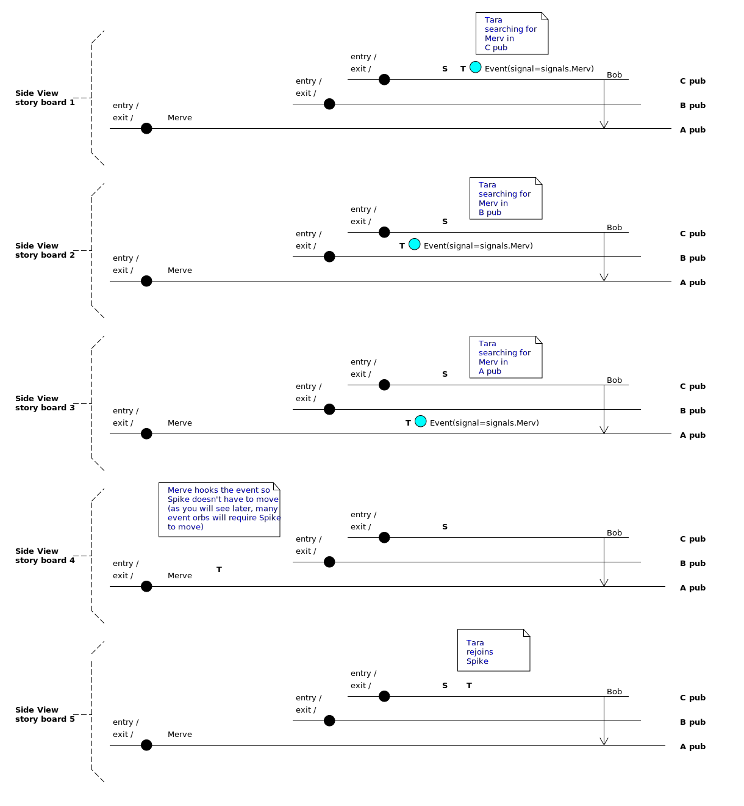
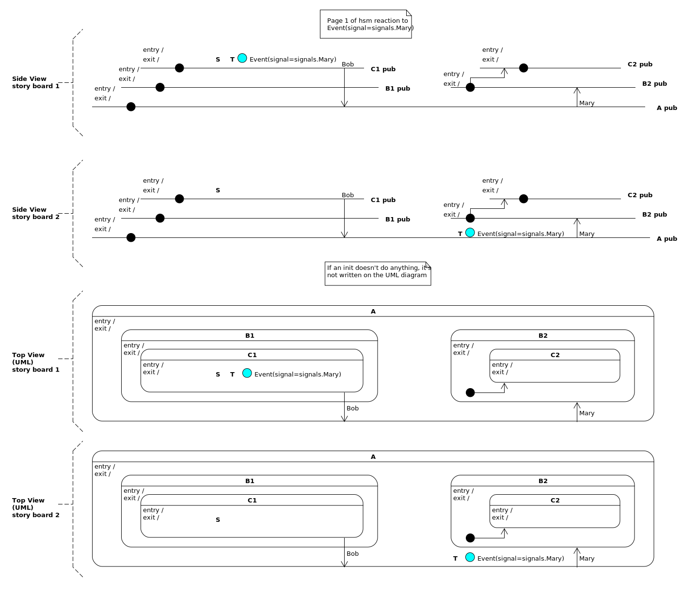
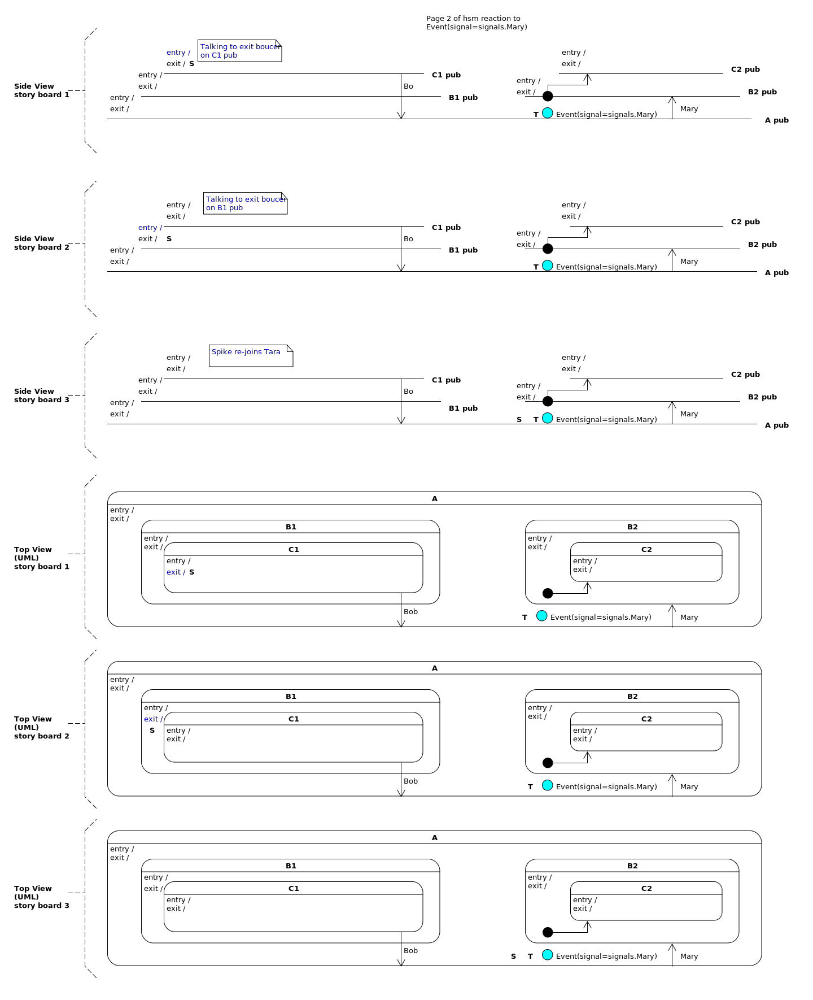

.. _zero_to_one-zero-to-one:

  *Begin.  To Begin is half the work, let half still remain; again begin this,
  and thou wilt have finished.*

  -- Marcus Aurelius

Zero To One
===========
This is not a 5-minute blog read.  But, if you want to learn how statecharts
work, this is your one-stop shop, it will take you from 0 to 1.

First, I'll try to explain the statechart concepts, pictures and mechanics using
a :ref:`story <zero_to_one_story>`.  At the end of the story I'll describe how the story's stage,
characters and theme map back onto the things you need to know to be a
statechart designer.  Don't worry if you are a little bit confused after reading
the story; if a few things stick, great, proceed into the example, then re-read
the story once you have written your first couple of statecharts.

Secondly, we will work through an :ref:`example <zero-to-one-a-simple-example>`
together.  The example will be broken up into a set of iterations and each
iteration will be broken into 4 parts:

* `spec`, what are we trying to build and how do we know when we are done.
* `design`, a picture, as a formal description of the thing we are trying to build
* `code`, the code required to manifest the design
* `proof`, proof that our code is actually matching our design
* `questions`, a list of questions and answers

The questions section will provide you with a choose-your-own-adventure style of
reading the documentation.

Each iteration is heavily linked so that you can quickly bounce around between
its various parts.

.. admonition:: Scott Volk: 2018-09-09

  I will also pepper the story with boxes, like this one, containing **hints**
  about how the story relates to the technical aspects of statecharts.
  
  I challenge you *not to read* these boxes in your first look at the story,
  especially if you are new to this type of technical language.  Read the hints
  after you have programmed your first working statechart.

  On your first pass just read the story and look over the pictures.

  After you have completed the example, read the story again if your
  understanding of the dynamics aren't clear, the hint boxes will serve as a
  bridge between the story and your technical work.

.. _zero_to_one_story:

Story
^^^^^ 
If you are like me, learning something entirely new can be very exhausting.  You
need to learn new words, new ideas and you have to juggle them in your head
until you finally see how they interrelate.  This can be hard work.

But stories about people moving around on a small stage are much easier to
remember.  If it's a good story, it doesn't feel like work at all.

So why don't we try to explain something that is hard to remember using
something that is easier to remember?

I will do this now, I will use a story as a mental-scaffolding around the
statechart ideas you need to know.

.. raw:: html

   

   
   
Our story will be placed in a little universe.  This little universe will
   consist of a heaven, an earth and an underworld.   The earth in the story
   isn't round like ours.  It's a very small flat-earth, acting as a platform,
   floating above the underworld.  On top of the earth are a set of pubs,
   arranged on different terraces.
   

   

   To get to a higher pub, you would first have to walk through a lower pub.  The
   lower pubs are for a more general audience, while the higher pubs, though having
   less space have a more specialized aesthetic. 
   

   
   

   Now let's add some characters and a bit more detail to the story.
   

   

   On every terrace, there will be two bouncers a greeter and zero or more
   bartenders.  There will only be one set of stairs that can be used to enter or
   exit a pub, and this is where that pub's bouncers will sit.
   

   

   One bouncer will be facing in the direction of people entering the terrace and
   the other will be facing in the direction of people wanting to leave it.  The
   greeter will talk to anyone who has decided to stay on her terrace.  If there is
   a bartender on the terrace, he will serve drinks and sometimes he will have
   secrets.
   

   

.. image:: _static/md_terraced_pubs.svg
    :target: _static/md_terraced_pubs.pdf
    :align: center

.. admonition:: hint

  Each pub is a state in a statemachine.  You would program these states as
  functions that take two arguments, a reference to an active object and an event.

  These state functions will contain an if-elif structure which will have
  multiple clauses.  The greeter is the "init" clause, and the enter and exit
  bouncers are the "entry" and "exit" clauses.

  The "init", "enter", and "exit" clauses can be activated when the state
  function is given an event with an init, entry or exit name.

  Likewise, the bartender is a clause where the application developer sets the
  event name.

.. raw:: html

   

   

   Now let's add some supernatural beings: three gods and a spirit.
   

   

   The heaven will have one goddess Eve, "the goddess of law and order" and
   the underworld will be ruled by Theo, <a href="https://en.wikipedia.org/wiki/Solipsism">the solipsist.</a> The earth
   will have a lazy god named Spike, "the source" who happens to be the only guy
   who can drink in the whole universe.  Spike will have a companion spirit,
   named Tara "the explorer."
   

   

   We know now about the entire cast of the story.  There are bouncers, greeters,
   bartenders, three gods and one spirit.
   

   

.. image:: _static/md_terraced_gods.svg
    :target: _static/md_terraced_gods.pdf
    :align: center

.. admonition:: hint

  Eve represents the "event processor", or the algorithm that sends the state
  functions different events.

  Spike, represents the "Source" state while the event processor is searching
  the statechart.  Think of Spike as the current state of the statemachine.
  
  Tara represents the "Target" state, which is used by the event processor to
  explore the statemachine while it is trying to figure out what to do.

  Theo is the "thread" in which all of the code is run.  The event processor and
  all of it's calls to the various state functions will be driven by this
  thread.  

  An application developer will not write code to change the internal behaviour
  of the event processor, the source and target states or the thread.  This is
  why these characters are supernatural in the story; it's a mnemonic.

.. raw:: html

   

   

   Let's put our little universe into a small multiverse. Each universe will have
   it's own heaven and underworld, gods, people and explorer spirit, but its
   terraced architecture of pubs, can be shared across all connected universes.
   

   

   If this doesn't make any sense, don't worry about it.  Let's move on.
   

   

.. image:: _static/md_multiverse.svg
    :target: _static/md_multiverse.pdf
    :align: center

.. admonition:: hint

  Anytime a statechart references a callback, that callback will change the
  internal variable state of the active object in its first argument -- the
  state callback functions do not have their own memory.

  Since the callback functions don't keep any information, they can be called by
  many different active objects, in that active object's thread, and behave as
  expected; there are no side effects.  In this way, many different active
  objects can use the same set of state callback functions.

.. raw:: html

   

   

   Eve, the goddess of heaven has a birds-eye view of our little world.  She rules
   over the people: the bouncers, greeters and bartenders and, Tara, "the explorer"
   spirit.  She took on her duty as "the goddess of law and order" with such gusto,
   that sometime in the world's history, she banned alcohol consumption for
   everyone on earth, except Spike, who she can't control.
   

   

.. image:: _static/md_eve.svg
    :target: _static/md_eve.pdf
    :align: center

.. admonition:: hint

  Eve is the "event processor".  The if-elif clauses, represented by the people
  in the story, exist within each of the state functions.  These if-elif clauses
  only become active when the event processor calls its function with an
  internal event, represented by one of the people in the story.

  Tara, the "target state" is used by the event processor when it is searching a
  statemachine to see which state handles an external event.

  Since the event processor calls the function and change's its target state
  while it is searching through a statemachine, we say that Eve rules over the
  people and Tara the "explorer spirit".

.. raw:: html

   

   

   Theo, "the solipsist" is the god of the underworld.  He is only called the
   "solipsist" by people outside of his universe, like you and me, because his
   universe only works and exists if he is thinking about it.  Nobody in his world
   is aware that he has this power.
   

   

   One of Theo's duties is to join the little universe with other universes.  Theo
   watches a portal, which is connected to a loading dock which receives
   messages from different worlds, including ours.  He is extraordinarily attentive
   and enthusiastic.  He can motivate anyone he talks to or even looks upon, in
   fact, this is his supernatural ability.
   

   

.. image:: _static/md_theo.svg
    :target: _static/md_theo.pdf
    :align: center

.. admonition:: hint

  Theo represents a "thread" pending on a queue.  The activeobject's ``post_fifo``
  and ``post_lifo`` methods allow an application developer to put events into
  this queue.  When the thread sees that a queue has an item, it will wake up,
  and drive the event processor, which in turn, will call the functions
  making up the statemachine.

.. raw:: html

   

   

   When Theo receives a message from another universe, it appears as a round hollow
   orb which sometimes contains a scroll.  He calls these orbs "events", and if they
   have a scroll within them, he calls that scroll a "payload".
   

   

.. image:: _static/md_events.svg
    :target: _static/md_events.pdf
    :align: center

.. admonition:: hint
  
  An event has a name, called a signal, which can be a user defined name or it
  can be a predefined name.  An event with a user defined signal name is called
  an external event.  An event with a predefined name is called an internal
  event.

  The whole point of naming an event with a signal is so that a state function
  can use an if-elif clause to "catch" the event when it is given to that
  function.  When such an event is caught, your code is run.

  An event can have an optional payload.

.. raw:: html

   

   

   When an "event" comes through the portal, Theo will pick it up, marvel at it
   then in a reverent gesture, pass it to Eve.  They both become excited, maybe
   even a little nervous, because they know there universe is going to change; it
   will react to the event.
   

   

   Theo encourages Eve to fly back up into the sky and to "follow the laws." Then
   he will watch as she gives her minions their marching orders.  Only after all of
   the activity stops, will he focus his attention back on the portal.
   

   

   Feeling oddly refreshed and encouraged by Theo, Eve looks around the map until
   she see's Spike from her high vantage point.  Spike being the god of the earth,
   is easy to see and Eve knows that her underling-spirit Tara, "the explorer",  is
   always near him.
   

   

   Eve flies done to Tara and gives her the event.  She says, "I want you to go to
   the terrace where there is a bartender who knows what to do with this event.
   Then I want you to go to wherever he tells you to take it.  Good luck Tara, I
   believe in you."
   

   

   Tara enjoys Spike's company, but she also loves adventure.
   

   

   She looks down at the event to study it and notices that it has something written
   on it, a word, a phrase, it could be different every time, but it's a clue and
   Tara loves a puzzle.  She looks around the pub on her terrace and studies each
   of the bartender's name tags.  If she sees that a name tag matches the name on
   the event, she will approach that bartender and talk to him.
   

   

.. image:: _static/md_events_bartenders.svg
    :target: _static/md_events_bartenders.pdf
    :align: center

.. raw:: html

   

   

   If there is no bartender to talk to on her terrace, she will go to it's exit
   staircase and descend to the next terrace.  Being a spirit, she is hard to see
   and the bouncers and greeters leave her alone when she is by herself.
   

   

.. admonition:: hint

  The terraces are just callback functions containing if-elif-else clauses.  The
  else clause of each callback function provides information about what other
  callback function should be called if it doesn't know what to do with a given
  event.  This other function, can be thought of as a lower terrace.

  The bartenders are named arrows on the HSM diagram.

  The bartender also represents an if-elif clause that matches the name of the
  event given to that function.  

.. raw:: html

   

   

   She will continue to climb down the terraces until she comes to the edge of the
   universe.  If she can't find a bartender who can answer her question, she will
   take the event and throw it off the edge of the earth, into oblivion, then climb
   back up to rejoin Spike.  In such rare cases their universe doesn't react to the
   event.
   

   

.. image:: _static/md_bartenders_on_the_hsm_oblivion.svg
    :target: _static/md_bartenders_on_the_hsm_oblivion.pdf
    :align: center

.. admonition:: hint

  Here we are starting to explore a statechart's dynamics.  If your statemachine
  doesn't handle an event in any of it's callback functions, the event will be
  ignored.

.. raw:: html

   

   

   But if Tara does find a bartender who's name tag matches the name on the event,
   she will show it to him.  He will take it and study it, sometimes he might even
   take out it's scroll.  Then he will lean across the bar and whisper the answer
   into Tara's ear.
   

   

   Sometimes the bartender says, "give me the event I'll handle it, don't worry
   about it anymore."  When this happens, Tara passes over the event, then rejoins
   Spike, who rejoices because he doesn't have to do anything.  For some reason
   Spike calls this a "hook".
   

   

.. admonition:: hint

  Tara, the "target state" is used by the event processor to find which state
  callback function knows how to handle a given event.  In the above picture we
  see that T started in "C pub", then the event processor recursed outward to "A
  pub" at which point it found an if-elif clause in the "A pub" callback that
  "handled" the event with the signal name of "Merve".  If the application
  developer placed code between the "Merve" clause and it's return statement,
  this code would be run while T is searching.

  When a state callback function returns "handled" the event processor pulls T
  back to where S is, then it stops searching.

  A state callback function can use the T state of the event processor to
  perform this type of event handling.  For more details about this programming
  technique, read about the :ref:`ultimate hook pattern.<patterns-ultimate-hook>`

.. raw:: html

   

   

   Most of the time, however, the bartender will tell Tara where she has to take
   the event.  If she has to continue her journey, she will wait for Spike so she can
   tell him about it.
   

   

.. raw:: html

   

   

   Spike knows when Tara is waiting for him.  Though he is lazy, and drunk most of
   the time, he always has something interesting to say, and this is what Tara
   loves about him.  Having nothing else to do, he makes his way to the terrace
   where Tara has gotten her next clue.  He knows that she will want to talk to him
   about it.  As he approaches the exit, the exit bouncer puts up a hand, then
   looks at a clip board to see if Spike is on the guest list, which he always is,
   and then let's Spike pass to the next lower terrace.  You really can't stop the
   god of the earth.  For every terrace that Spike needs to leave so that he can
   rejoin with Tara, this futile ritual is repeated.
   

   

.. admonition:: hint

  Tara, the "target state" is used by the event processor to recurse outward
  from C1 to find a state that knows what to do with the Event, who's signal
  name is Mary.  

  The A state has an if-elif clause which handles Mary, and within the clause
  there is a transition to the B2 state.  In this scenario, the A state is
  called the Least Common Ancestor, LCA of S and T.  S needs to exit all states,
  from it's current state, to the LCA.  However, it should not exit the LCA.

  As an application developer, you don't really care about the LCA acronym.  You
  just need to understand the dynamics of how exits work.

.. raw:: html

   

   

   When Spike finally finds Tara he asks her what she learned.  Bubbling with
   excitement, she tells him about where the bartender said to take the event, to
   which he always says, "great I'll meet you there, but first I want to have a
   drink."  Tara takes the event and makes her way to the location that the
   bartender told her about.
   

   

   Spike finishes his drink, then again starts to make his way toward Tara.  Before
   he can climb up to a new Terrace, he is stopped by the entry bouncer, who looks
   at his clip board to see if Spike is on the guest list, which he always is, then
   let's Spike proceed.  You really can't stop the god of the earth anyway.
   

   

.. image:: _static/md_bartenders_on_the_hsm_reaction_3.svg
    :target: _static/md_bartenders_on_the_hsm_reaction_3.pdf
    :align: center

.. raw:: html

   

   

   When Spike finally arrives on the Terrace where Tara is, a greeter approaches
   them.  She looks at Spike and feels slightly uncomfortable, because sometimes
   she needs to tell them that they can't stay on this terrace.  Instead of talking
   to Spike directly, gods are intimidating, she whisper's something into Tara's
   ear.  Both the greeter and Tara work for Eve after all.  Tara is always happy to
   hear that there is more to do, because she likes to explore the pubs on the
   different terraces.
   

   

   If the greeter tells Tara that she needs to climb higher, Tara will relay the
   message to Spike who will answer, "great, I'll meet you there, but first I want
   to have a drink".
   

   

   Tara climbs to the terrace where the greeter told her to go.  Spike finishes his
   drink and makes his way through the entry bouncers and finally arrives at the
   same terrace where Tara is waiting.  At which point there might be another
   greeter with another uncomfortable message.
   

   

.. image:: _static/md_bartenders_on_the_hsm_reaction_4.svg
    :target: _static/md_bartenders_on_the_hsm_reaction_4.pdf
    :align: center

.. raw:: html

   

   

   If no greeter approaches them, Tara looks down at the event and watches with
   satisfaction, as it throbs with light, then slowly fades from existence.  To
   this, Spike smiles and looks towards heaven, as he raises a toast to Eve.  
   

   

   When Eve, the goddess of heaven, see's this her shoulder's relax and the tension
   releases from her back: The laws were followed.
   

   

   Theo, "the solipsist", god of the underworld, has been watching the whole scene,
   and its "run to completion".  Knowing there is nothing left to do in the
   universe, he turns his gaze back to the portal.  He waits patiently for an event
   to pass through the little universe's loading dock.  All is well.
   

   

.. admonition:: hint

  The run to completion, RTC, concept is very important to understand.  Your
  statechart will only react to one event at a time.  The thread will only
  process the next event when the event processor has run out of things to do
  with your old event.

  For this reason, you should not put blocking code into your statecharts.  If
  you do, they will stop reacting to events and become unresponsive.

.. raw:: html

   

   

   But is it?  Sometimes when Theo, "the solipsist", god of the underworld, closes
   his eyes and daydreams; his attention briefly drifts back to his world.  This is
   enough to wake everyone up from their non-existence.
   

   

   When the people wake up, they become listless. The bouncers who have had nothing
   to do since the prohibition was announced by Eve, are particularly frustrated
   with the meaninglessness of their jobs.  They only have one customer now.  Even
   if Spike wasn't always permitted to pass them, there is no way they could stop
   the god of earth. Why have a universe full of pubs if only one guy can drink?
   It seems so pointless.  It's lame.
   

   

   Then somehow they find out about you and me, fellow humans called developers.
   

   

   They learn that we, despite being human, are all powerful.  That we can build
   the pub terrace system to which their gods are subservient; that we can send the
   events and give the greeters and the bouncers their secret directions (arrows on
   the diagram).  That we can even built lots of different interconnected universes
   and have them communicate with each other.
   

   

   They challenge us to make something useful out of their existence, even if
   they can't understand it from where they are, they need something to
   <strong>mean something</strong>.  So, they create an organized campaign:
   "hack the humans".  This is how it works: All of the humans in the little
   universe, open themselves to run code from our universe, while they are
   talking to either Tara or Spike.
   

   

.. image:: _static/md_hack_the_humans.svg
    :target: _static/md_hack_the_humans.pdf
    :align: center

.. raw:: html

   

   

   To help us, they create a Rosetta stone, translating the concepts of their
   universe into something legible for you and me:
   

   

.. _zero_to_one_rosetta:

+-------------------------------------+-----------------------------------------+
| **Story Concept**                   | **Programming Concept**                 |
+=====================================+=========================================+
| The universe                        | a statechart, which is an ActiveObject  |
|                                     | derived object.                         |
+-------------------------------------+-----------------------------------------+
| The multiverse of terraced bars     | a set of callback functions making an   |
|                                     | HSM (accessible from multiple           |
|                                     | statecharts, via the ``start_at``       |
|                                     | method), each callback takes two        |
|                                     | arguments, a reference to a statechart  |
|                                     | and an event to send to it              |
+-------------------------------------+-----------------------------------------+
| Eve, "the goddess of law and order",| the event processor                     |
| goddess of heaven                   |                                         |
+-------------------------------------+-----------------------------------------+
| Spike, "the source",                | the source state, **S** of a statechart |
| god of the earth                    | (the current state of the HSM)          |
+-------------------------------------+-----------------------------------------+
| Theo, "the solipsist"               | the thread that drives the              |
| god of the underworld               | statechart                              |
+-------------------------------------+-----------------------------------------+
| Tara, "the explorer", spirit        | a search aspect, **T** (target), of the |
|                                     | event processor                         |
+-------------------------------------+-----------------------------------------+
| bartender                           | arrow or hook on the HSM diagram,       |
|                                     | represented as a conditional statement  |
|                                     | for a user defined event,               |
|                                     | any code associated with this           |
|                                     | conditional statement it run when       |
|                                     | touched by **T**                        |
+-------------------------------------+-----------------------------------------+
| greeter                             | ``INIT_SIGNAL`` event given to callback |
|                                     | by the event processor when **S**       |
|                                     | stabilizes in the state it represents   |
+-------------------------------------+-----------------------------------------+
| exit bouncer                        | ``EXIT_SIGNAL`` event given to callback |
|                                     | by the event processor when **S** exits |
|                                     | the state it represents                 |
+-------------------------------------+-----------------------------------------+
| exit bouncer                        | ``ENTRY_SIGNAL`` event given to callback|
|                                     | by the event processor when **S** enters|
|                                     | the state it represents                 |
+-------------------------------------+-----------------------------------------+
| **run to completion, RTC**:         | The thread will only handle one event   |
| Theo keeps his attention on the     | a time. This is called RTC.  An RTC     |
| universe's activities until the     | process is over when the event processor|
| action stops                        | can no longer cause state transitions   |
|                                     | and the statechart settles on a new     |
|                                     | state.                                  |
+-------------------------------------+-----------------------------------------+
| Top level view of terraced bar      | Make these drawings with a 90's drawing |
| universe                            | technology called UML                   | 
+-------------------------------------+-----------------------------------------+

.. raw:: html

   

   

   Here is a warning that they provide us about UML:
   

   

.. image:: _static/md_translation_with_notes.svg
    :target: _static/md_translation_with_notes.pdf
    :align: center

.. raw:: html

   

   

   The above diagram shows us how a lot of information is missing from a "UML
   statechart".  The picture describes some class information, and a behavioural
   specification for the states provided as a bird's eye view of the terraced
   bar system, but there is no information about the thread, <strong>S</strong>,
   <strong>T</strong>, the deques, the events or any of the dynamics for the
   statechart.
   

   

   So the human's provide us with the option of laying down a spy-carpet over
   any bar in their universe. If you lay this carpet down, it will record and
   report all activity that transpired between <strong>T</strong>,
   <strong>S</strong> and any human within that pub.  To use this carpet, you
   place the <strong>@spy_on</strong> decorator above any callback function
   representing a pub, or state in the HSM.  This is called instrumentation.
   

   

   Let's answer their challenge for deep meaning, by using one of their universes
   to make a toaster oven:
   

   

.. _zero-to-one-a-simple-example:

A Simple Example: Toaster Oven
^^^^^^^^^^^^^^^^^^^^^^^^^^^^^^
To make this toaster oven statechart example seem like a real software project,
I will break it's design process up into 6 steps, or iterations.  We will use
the `lean-start-up methodology <https://www.youtube.com/watch?v=9bPgNEDdX3E>`_
and discover our customers by having them interact with our product after each
iteration.

Each iteration will have a specification, a design diagram and the code needed
to match the design diagram.  Then I will prove that the code works and I'll
provide links to a bunch of questions and answers about the code.

You can use these links to choose the questions you want to see the answers to,
or just skip onto the next iteration.  Each iteration is heavily linked so
that you can quickly bounce around in its documentation.

.. _iter1:

Iteration 1: setup
------------------
In this iteration I will talk about setting up our development environment.  We
will built a very simple statechart example and confirm that it is working.  We
aren't ready to talk to our customers yet.

.. _iter1_spec:

Iteration 1 specification
"""""""""""""""""""""""""

* Ensure our Python version is 3.5 or greater (miros needs this to work)
* Install miros
* Import the required statechart components
* Build a ToasterOven class which inherits from an ActiveObject
* Make a single state, and start the statechart in that state
* Add instrumentation to our state
* Use the instrumentation to confirm that the statechart is working.

.. include:: i_navigation_1.rst

To confirm that Python is version 3.5 or greater, in your terminal type:

.. code-block:: bash

  python3 --version

To install miros, use pip (included in Python 3.5 or greater), in your terminal
type:

.. code-block:: bash

  python3 -m venv
  . ./venv/bin/activate
  pip install miros

.. note::
  Miros is not dependent on any other packages.

.. _iter1_design:

Iteration 1 design
""""""""""""""""""

Here is the design we will use to confirm that miros is working on your computer:

.. image:: _static/ToasterOven_0.svg
    :target: _static/ToasterOven_0.pdf
    :align: center

.. include:: i_navigation_1.rst

.. _iter1_code: 

Iteration 1 code
""""""""""""""""

.. code-block:: python
  :linenos:

  # file named toaster_oven_1.py
  from miros import ActiveObject
  from miros import return_status
  from miros import Event
  from miros import signals
  from miros import spy_on
  import time

  class ToasterOven(ActiveObject):
    def __init__(self, name):
      super().__init__(name)

  @spy_on
  def some_state_to_prove_this_works(oven, e):
    status = return_status.UNHANDLED
    if(e.signal == signals.ENTRY_SIGNAL):
      print("hello world")
      status = return_status.HANDLED
    else:
      oven.temp.fun = oven.top
      status = return_status.SUPER
    return status

  if __name__ == "__main__":
    oven = ToasterOven(name="oven")
    oven.live_trace = True
    oven.start_at(some_state_to_prove_this_works)

    time.sleep(0.1)

.. include:: i_navigation_1.rst

.. _iter1_proof:

Iteration 1 proof
"""""""""""""""""

Now to prove that the code works, in your terminal, run the program:

.. code-block:: bash

  python3 toaster_oven_1.py
  hello world
  [2018-09-11 09:35:10.011526] [oven] \
    e->start_at() top->some_state_to_prove_this_works

.. include:: i_navigation_1.rst

.. _iter1_questions:

Iteration 1 questions
"""""""""""""""""""""

Questions and Answers about the code and the results:

* :ref:`Why is miros only supported in Python 3.5 or greater?<why_is_miros_onl>`                                                 
* :ref:`Can you explain what is going on with the imports on lines 1-7?<can_you_explain_>`
* :ref:`Why bother making a ToasterOven that inherits from the ActiveObect, why not just use the ActiveObject?<why_bother_making>`
* :ref:`You keep calling the state functions callbacks, what do you mean by this?<you_keep_calling>`
* :ref:`What do you mean by a function signature?<what_do_you_mean>`
* :ref:`How am I going to remember to structure my callback functions with all of these rules?<how_am_i_going_t>`
* :ref:`This seems strange to me, I haven't seen Python that looks like this before.  Why do it this way?<this_seems_stran>`
* :ref:`Where is the thread, event processor and queues in the diagram?<where_is_the_thr>`
* :ref:`Can you explain what is happening in the entry clause?<can_you_explain_what_is_happening_in_the_entry_clau>`
* :ref:`Can you explain where the init and exit clauses are?<can_you_explain_where_the_init_and_exit_clauses_a>`
* :ref:`Can you explain what is going on with the else clause?<can_you_explain_what_is_going_on_with_the_else_clau>`
* :ref:`How does the live_trace call work?<how_does_the_live_trace_call_wo>`
* :ref:`What happens when the start_at method is called?<what_happens_when_the_start_at_method_is_call>`
* :ref:`Why are you placing a delay at the end of the code sample?<why_are_you_placing_a_delay_at_the_end_of_the_code_samp>`
* :ref:`How did your prove that your code worked?<how_did_your_prove_that_your_code_work>`
* :ref:`Why are you using threads and not asyncio?<why_are_you_using_threads>`
* :ref:`When is it going to be done?<when_is_it_going_to_be_do>`

.. include:: i_navigation_1.rst

.. _why_is_miros_onl:

**Why is miros only supported in Python 3.5 or greater?**

I originally wrote and tested miros in Python 3.5.  I didn't know it at the
time, but I used the Python 3.5 feature of avoiding circular imports.  When I
tried to run miros in 3.4 I got a lot of ImportErrors.  So there you go, it was
an accidental limitation.

.. include:: i_navigation_1.rst

.. _can_you_explain_:

**Can you explain what is going on with the imports on lines 1-7?**

I'll answer this question by putting a lot of comments into the code:

.. code-block:: python

  # ActiveObject contains the thread, event processor, and queues
  # it also contains the miros API
  from miros import ActiveObject

  # return_status contains information on how a state callback 
  # should respond when called by the event processor
  from miros import return_status

  # Event is the miros Event class, use this to make a new event object
  from miros import Event

  # signals, contains all of the signal names in the system
  # it also automatically constructs new signals names if it
  # is used with a name that hasn't been used before:
  #   example:
  #     e = Event(signal=signals.NEW_NAME)
  from miros import signals

  # spy_on is a decorator which when applied to state callback
  # function will let use used the spy and trace instrumentation
  # on that callback
  from miros import spy_on

  # time is imported so that the program can be delayed
  import time

.. include:: i_navigation_1.rst

.. _why_bother_making:

**Why bother making a ToasterOven that inherits from the ActiveObect, why not just use the ActiveObject?**

We will put toaster oven attributes and worker functions into the toaster oven
class later.  For instance, we could put a ``light_on`` method in the
ToasterOven class.  The first argument given to any state callback function by
the event processor will be a reference to a ToasterOven object. Now suppose
this first argument was called ``oven``, any state callback function could turn
on the light with: ``oven.light_on()``

.. include:: i_navigation_1.rst

.. _you_keep_calling:

**You keep calling the state functions callbacks, what do you mean by this?**

A callback function is just a function that is given to another function, so
that it can be called later:

.. code-block:: python

  import time

  # this will be our callback
  def print_msg(message):
    print(message)

  def call_something_later(callback):
    time.sleep(1)
      callback("hello world")

  # wait one second then print "hello world"
  call_something_later(print_msg)

The states in our diagram are constructed as callback functions with a given
signature.  The event processor will call these functions when it needs to.

.. include:: i_navigation_1.rst

.. _what_do_you_mean:

**What do you mean by a function signature?**

A function signature describes the arguments that a function can take and the
type of items it can return.

Our state callback functions will always have the same signature:

.. code-block:: python

  # The event processor will call this function when it needs to 
  # because the  function isn't called right away,
  # it is called a callback function

  # 1st part of the function signature, it's arguments.
  # Our state callback functions will always take two arguments:
  # 1) a reference to a state_chart_object 
  # 2) an event
  def some_state_function(state_chart_object, e):
    status = return_status.UNHANDLED
    # do useful work, then

    # set the status variable to an attribute of return_status
    # to tell the event processor how your function responded
    # to its call

    # 2nd part of the function signature: it will always return
    # an attribute of the return_status object
    return status

For a real state function, it's signature would be expressed like this:

.. code-block:: python
  :emphasize-lines: 1, 2, 5, 8, 9
  :linenos:

  def some_state_to_prove_this_works(oven, e):
    status = return_status.UNHANDLED
    if(e.signal == signals.ENTRY_SIGNAL):
      print("hello world")
      status = return_status.HANDLED
    else:
      oven.temp.fun = oven.top
      status = return_status.SUPER
    return status

To make our state callback function have the right signature, we ensure that it
takes two arguments, a statechart object and an event, line 1.  Then, depending
on how the function reacts, we either return:

  * ``return_status.UNHANDLED`` if we want an event to bubble outward in the
    chart.  Typically this is the default value of the item you will return from
    a statechart callback.  See line 2.
  * ``return_status.HANDLED`` when we want the event processor to stop searching
    for an event.  See line 3.
  * ``return_status.SUPER`` when we don't know what to do to the event, so we
    return information that will tell the event processor to try our super state. See line 8.

There are more things that can be returned, we will address them as the example continues.

.. include:: i_navigation_1.rst

.. _this_seems_stran:

**This seems strange to me, I haven't seen Python that looks like this before.  Why do it this way?**

The miros library is intended to serve two different audiences:

* Embedded programmers who need to quickly prototype their designs, then port
  the work to c/C++ using the QP framework.  
* Python developers who want to use statecharts.

This way of writing statecharts -- by using callbacks with if-elif structures,
working with an ActiveObject -- will make code that is extremely easy to port
back to the QP framework.

If you would like to program in a more "Pythonic" way, you can inherit from the
miros Factory class instead of the ActiveObject.  Under the hood, the Factory
class is just making the kinds of callback functions we are talking about here.

It is easier to explain this library using the traditional techniques of engaging
with the Miros Samek event processing algorithm than by just jumping into the
Factory class. (I only program the statecharts using the Factory class)

.. include:: i_navigation_1.rst

.. _how_am_i_going_t:

**How am I going to remember to structure my callback functions with all of these rules?**

Once you do it a few times you will remember it.  To begin with just reference
the :ref:`boiler plate example <recipes-boiler-plate-state-method-code>`, and change it
to match your design.

Also, it is relatively easy to add this boiler plate code to whatever snippet
technology you are using with your editor. I use Ultisnips in Vim.

.. include:: i_navigation_1.rst

.. _where_is_the_thr:

**Where is the thread, event processor and queues in the diagram?**

The thread is missing from the UML:

.. image:: _static/ToasterOven_0_1.svg
    :target: _static/ToastOven_0_1.pdf
    :align: center

Unlike the thread the, event processor is actually shown on the picture:

.. image:: _static/ToasterOven_0_2.svg
    :target: _static/ToastOven_0_2.pdf
    :align: center

I leave the event processor on my pictures so I can show the starting state of
the active object.

The queues are missing from the UML as well, but they are contained within the
ActiveObject class:

.. image:: _static/ToasterOven_0_3.svg
    :target: _static/ToastOven_0_3.pdf
    :align: center

.. include:: i_navigation_1.rst

.. _can_you_explain_what_the_spy_on_decorator_is_doing:

**Can you explain what the spy_on decorator is doing?**

The spy_on decorator wraps a state's callback function with some code that lets
you log the output of the event processor as it follows its rules, making **T**
and **S** move around the HSM.

.. code-block:: python
  :emphasize-lines: 1,3

  from miros import spy_on

  @spy_on
  def some_state_to_prove_this_works(oven, e):
    status = return_status.UNHANDLED
    if(e.signal == signals.ENTRY_SIGNAL):
      print("hello world")
      status = return_status.HANDLED
    else:
      oven.temp.fun = oven.top
      status = return_status.SUPER
    return status

By using the decorator you can debug, test and document the behavior of your
statechart.

If you don't include the decorator, the statechart will work a little bit
faster, but it will be harder to debug.

.. note::

  The spy_on decorator needs to be placed on every callback that you want to
  monitor.  I usually place the spy_on decorator on all of the state callbacks.

.. include:: i_navigation_1.rst

.. _can_you_explain_what_is_happening_in_the_entry_clau:

**Can you explain what is happening in the entry clause?**

When the event processor sends an event with the signal name ``ENTRY_SIGNAL``
the if clause of the state callback will print "hello world" to the terminal
then it will set the status variable to ``return_status.HANDLED``.  This status value
is returned to the event processor, letting it know to stop processing the
``ENTRY_SIGNAL`` event.

.. code-block:: python
  :emphasize-lines: 3-5

  def some_state_to_prove_this_works(oven, e):
    status = return_status.UNHANDLED
    if(e.signal == signals.ENTRY_SIGNAL):
      print("hello world")
      status = return_status.HANDLED
    else:
      oven.temp.fun = oven.top
      status = return_status.SUPER
    return status

The entry signal is sent to the callback as a result of the HSM being started in
the ``some_state_to_prove_this_works`` state.

.. include:: i_navigation_1.rst

.. _can_you_explain_where_the_init_and_exit_clauses_a:

**Can you explain where the init and exit clauses are?**

We don't need the init and exit clauses in the design, so we don't include them
in the if-elif structure of the state's callback function.  The event processor
will still call the function with the event named ``INIT_SIGNAL``, after it has
entered the ``some_state_to_prove_this_works`` state, but it will be ignored.

By only including the events that we need we keep our callback function small
and easy to read.

.. include:: i_navigation_1.rst

.. _can_you_explain_what_is_going_on_with_the_else_clau:

**Can you explain what is going on with the else clause?**

A callback function can land in its `else` clause for one of two reasons:

1. The event processor is explicitly asking it for its super state callback function.
2. The event processor has sent it an event it has received in the hopes that it
   knows what to do with it, but the current state doesn't know what to do with
   it.

.. note::
  
   In the second case, :ref:`T <zero_to_one_rosetta>` has not found anything in the
   current state that can handle its event and it needs to know how to descent outward in the HSM.

Thankfully, your callback function doesn't have to care which of these two
reasons were behind why it has landed in its ``else`` clause.  It just has set
the ``tem.fun`` attribute of its first argument to the its parent callback
function, and return ``return_status.SUPER``.

.. code-block:: python
  :emphasize-lines: 6-8

  def some_state_to_prove_this_works(oven, e):
    status = return_status.UNHANDLED
    if(e.signal == signals.ENTRY_SIGNAL):
      print("hello world")
      status = return_status.HANDLED
    else:
      oven.temp.fun = oven.top  # no outer state
      status = return_status.SUPER
    return status

But in our example, the ``some_state_to_prove_this_works`` state doesn't have an outer
state, so we set the ``oven.temp.fun`` attribute to ``oven.top``, to let the event
processor know it has reached the outermost state of the HSM.

.. image:: _static/ToasterOven_0_4.svg
    :target: _static/ToastOven_0_4.pdf
    :align: center

The returned value of the state callback function is set to
``return_status.SUPER`` so that your function can notify the event processor
that it set the ``oven.temp.fun`` to its superstate's function.

.. note::

  How the else clause is called doesn't really matter to you as an application
  developer.  You just have to follow some rules:

  * set the ``oven.temp.fun`` to the callback function representing the
    superstate
  * if there is no superstate, set it to the ``top`` attribute of the first
    argument given to the callback function
  * ensure that the callback function returns, return_state.SUPER if the else
    clause is reached.

.. _how_does_the_live_trace_call_wo:

.. include:: i_navigation_1.rst

**How does the live_trace call work?**

The :ref:`live_trace <recipes-tracing-live>` attribute needs to be set before the
statechart's thread is started:

.. code-block:: python

  if __name__ == "__main__":
    oven = ToasterOven(name="oven")
    oven.live_trace = True
    oven.start_at(some_state_to_prove_this_works)

    time.sleep(0.1)

It output's the trace log as your statechart is reacting to events.  It can only
work if the ``@spy_on`` decorator is placed above the state functions in your HSM.

There are two different types of instrumentation output provided by miros.  The
:ref:`trace <recipes-using-the-trace>` and the :ref:`spy
<recipes-using-the-spy>`.  The trace provides information only if a state
transition has occurred.  It reports if :ref:`S <zero_to_one_rosetta>`
has moved.  For each line in a trace log,  describes:

  * The time stamp of when the event was reacted to
  * The name of the statechart
  * The event that caused the transition
  * The starting state of :ref:`S <zero_to_one_rosetta>` 
  * The ending state of :ref:`S <zero_to_one_rosetta>`

Our minimal example doesn't do much, it starts from outside of the HSM and then
transitions into the ``some_state_to_prove_this_works``.

.. code-block:: python

  [2018-09-11 09:35:10] [oven] e->start_at() top->some_state_to_prove_this_works

In this example we see: when I ran the test.  That the statechart is called oven,
that the starting state of :ref:`S <zero_to_one_rosetta>` in this oven instance was ``top`` and the
ending state of :ref:`S <zero_to_one_rosetta>` was ``some_state_to_prove_this_works``.

There is no ``start_at`` event in miros.  But to keep the trace output useful, I
write a fake ``start_at`` event as the cause of the initial transition into the
HSM.  On the diagram, this will be where the event processor attachment point
touches the HSM.

.. note:: 

  I might remove some information from the timestamp in this documentation to make
  the text fit on the screen.

.. include:: i_navigation_1.rst

.. _what_happens_when_the_start_at_method_is_call:

**What happens when the start_at method is called?**

The ``start_at`` method links the oven object to the HSM, then it starts the
statechart.  It does this by creating a new thread, then running the oven's
event processor in that thread.

.. code-block:: python

  if __name__ == "__main__":
    oven = ToasterOven(name="oven")
    oven.live_trace = True
    oven.start_at(some_state_to_prove_this_works)

    time.sleep(0.1)

Before a statechart is started, :ref:`T <zero_to_one_rosetta>` and :ref:`S <zero_to_one_rosetta>`
exist outside of the outermost
state.  The ``start_at`` call, places :ref:`T <zero_to_one_rosetta>` into the
``some_state_to_prove_this_works``.  :ref:`S <zero_to_one_rosetta>`
marches towards :ref:`T <zero_to_one_rosetta>`, triggering as
many needed entry events as required, then the init event in the state that
:ref:`T <zero_to_one_rosetta>` is in.

In our example there isn't much to talk about.  The entry clause of the
``some_state_function`` is called, printing "hello world".

.. include:: i_navigation_1.rst

.. _why_are_you_placing_a_delay_at_the_end_of_the_code_samp:

**Why are you placing a delay at the end of the code sample?**

.. code-block:: python
  :emphasize-lines: 6
  :linenos:

  if __name__ == "__main__":
    oven = ToasterOven(name="oven")
    oven.live_trace = True
    oven.start_at(some_state_to_prove_this_works)

    time.sleep(0.1)

The delay is placed at the bottom of the file to ensure that the statechart's
thread can react, and produce some live trace feedback, before the main thread
exits the program.

.. note::

  The miros package uses daemonic threads, which means that they will be shut
  down with the main thread stops running.  

.. include:: i_navigation_1.rst

.. _how_did_your_prove_that_your_code_work:

**How did your prove that your code worked?**

Looking at the design, we see that the starting state should be
``some_state_to_prove_this_works`` and that when it enters this state it should
print "hello world" to the terminal.

.. image:: _static/ToasterOven_0.svg
    :target: _static/ToasterOven_0.pdf
    :align: center

The output is:

.. code-block:: bash

  hello world
  [2018-09-11 09:35:10.011526] [oven] \
    e->start_at() top->some_state_to_prove_this_works

Which is exactly what were were expecting.

.. include:: i_navigation_1.rst

.. _why_are_you_using_threads:

**Why are you using threads and not asyncio?**

Asyncio is cool, but it doesn't work with everything yet.  It may be the future
of Python, but to use it all of your libraries will have to be asyncio
compliant.  I wrote miros so that it can use as much existing Python as possible.

If you want to check out another implementation of the Miro Samek event
processing algorithm in Python, written with asyncio, check out `Dean Hall's pq.
<https://github.com/dwhall/pq>`_

In the future I might port the miros threads to David Beazley's `thredo <https://github.com/dabeaz/thredo>`_ technology.

.. _when_is_it_going_to_be_do:

**When is it going to be done?**

I'm not answering this question

.. include:: i_navigation_1.rst

.. _iter2:

Iteration 2: basic oven
-----------------------
Now that we know miros will run on our system, lets use it to build a very basic
toaster oven.  The following describes our minimal viable product:

.. _iter2_spec:

Iteration 2 specification
"""""""""""""""""""""""""

* The toaster oven will have a door, it will always be closed.
* The toaster oven will have an oven light, which can be turned on and off.
* The toaster oven will have a heater, which can be turned off and on.
* It will have two different heating modes, baking which can bake a potato
  and toasting which can toast some bread.
* The toaster oven should start in the off state.
* The toaster can only heat when the door is closed.
* The toaster's light should be off when the door is closed.

.. include:: i_navigation_2.rst

.. _iter2_design:

Iteration 2 design
"""""""""""""""""""

.. image:: _static/ToasterOven_2.svg
    :target: _static/ToasterOven_2.pdf
    :align: center

.. include:: i_navigation_2.rst

.. _iter2_code:

Iteration 2 code
""""""""""""""""

.. code-block:: python

  # file named toaster_oven_2.py
  from miros import ActiveObject
  from miros import return_status
  from miros import Event
  from miros import signals
  from miros import spy_on
  import time

  class ToasterOven(ActiveObject):
    def __init__(self, name):
      super().__init__(name)

    def light_on(self):
      print("light_on")

    def light_off(self):
      print("light_off")

    def heater_on(self):
      print("heater_on")

    def heater_off(self):
      print("heater_off")

  @spy_on
  def door_closed(oven, e):
    status = return_status.UNHANDLED
    if(e.signal == signals.ENTRY_SIGNAL):
      oven.light_off()
      status = return_status.HANDLED
    elif(e.signal == signals.Baking):
      status = oven.trans(baking)
    elif(e.signal == signals.Toasting):
      status = oven.trans(toasting)
    elif(e.signal == signals.INIT_SIGNAL):
      status = oven.trans(off)
    elif(e.signal == signals.Off):
      status = oven.trans(off)
    else:
      oven.temp.fun = oven.top
      status = return_status.SUPER
    return status

  @spy_on
  def heating(oven, e):
    status = return_status.UNHANDLED
    if(e.signal == signals.ENTRY_SIGNAL):
      oven.heater_on()
      status = return_status.HANDLED
    elif(e.signal == signals.EXIT_SIGNAL):
      oven.heater_off()
      status = return_status.HANDLED
    else:
      oven.temp.fun = door_closed
      status = return_status.SUPER
    return status

  @spy_on
  def baking(oven, e):
    status = return_status.UNHANDLED
    if(e.signal == signals.ENTRY_SIGNAL):
      print("baking")
      status = return_status.HANDLED
    else:
      oven.temp.fun = heating
      status = return_status.SUPER
    return status

  @spy_on
  def toasting(oven, e):
    status = return_status.UNHANDLED
    if(e.signal == signals.ENTRY_SIGNAL):
      print("toasting")
      status = return_status.HANDLED
    else:
      oven.temp.fun = heating
      status = return_status.SUPER
    return status

  @spy_on
  def off(oven, e):
    status = return_status.UNHANDLED
    if(e.signal == signals.ENTRY_SIGNAL):
      print("off")
      status = return_status.HANDLED
    else:
      oven.temp.fun = door_closed
      status = return_status.SUPER
    return status

  if __name__ == "__main__":
    oven = ToasterOven(name="oven")
    oven.live_trace = True
    oven.start_at(off)
    # toast something
    oven.post_fifo(Event(signal=signals.Toasting))
    # bake something
    oven.post_fifo(Event(signal=signals.Baking))
    # turn the oven off
    oven.post_fifo(Event(signal=signals.Off))
    time.sleep(0.01)

.. include:: i_navigation_2.rst

.. _iter2_proof:

Iteration 2 proof
"""""""""""""""""

.. code-block:: bash

	python3 toaster_oven_2.py
	off
	[2018-09-12 13:54:51.890583] [oven] e->start_at() top->off
	heater_on
	toasting
	[2018-09-12 13:54:51.891473] [oven] e->Toasting() off->toasting
	heater_off
	heater_on
	baking
	[2018-09-12 13:54:51.891989] [oven] e->Baking() toasting->baking
	heater_off
	off
	[2018-09-12 13:54:51.892568] [oven] e->Off() baking->off

.. include:: i_navigation_2.rst

.. _iter2_questions:

Iteration 2 questions
"""""""""""""""""""""

Questions and Answers about code and results (iteration 2):

* :ref:`Can you explain how the picture meets the design specification?<can_you_explain_how_the_picture_meets_the_design_specification>`
* :ref:`How do I write my state callback functions based on the HSM diagram?<can_you_explain_how_the_callbacks_are_arranged_relative_to_each_other>`
* :ref:`How do I use the return_status with these callbacks?<how_do_i_use_the_return_status_with_the_callbacks>`
* :ref:`How does this toaster oven example relate to humans in the story?<how_does_this_toaster_oven_example_relate_to_humans_in_the_story>`
* :ref:`What does posting the events do?<what_does_posting_the_events_do>`
* :ref:`Where are the event names defined?<where_are_the_signal_names_defined>`
* :ref:`What are S and T exactly? Why no just talk about S?<what_are_s_and_t_exactly_why_not_just_talk_about_s>`
* :ref:`Can you explain how this statechart starts?<can_you_explain_how_this_statechart_starts>`
* :ref:`Can you explain how this statechart can transition from off to toasting?<can_you_explain_how_this_statechart_toasts>`
* :ref:`Is there a way I can get miros to show me what happened and how it happened?<is_there_a_way_i_can_get_miros_to_show_me_what_happened_and_how_it_happened>`
* :ref:`Can you explain how this statechart bakes?<can_you_explain_how_this_statechart_bakes>`
* :ref:`Can you explain how this statechart turns off?<can_you_explain_how_this_statechart_turns_off>`
* :ref:`Why are you putting state information into the ToasterOven and not its HSM?<why_are_you_putting_state_into_the_toasteroven_and_not_its_hsm>`
* :ref:`How does your proof show that you met your specification?<how_does_your_proof_show_that_you_met_your_specification_2>`
* :ref:`How do I put something in the oven and cook it?<how_do_i_put_something_in_the_oven_and_cook_it>`

.. _can_you_explain_how_the_picture_meets_the_design_specification:

**Can you explain how the picture meets the design specification?**

Let's break it down:

**The toaster oven will have a door, it will always be closed**

The door_closed state will contain all of the behavior that the system will have
while the door is closed in the toaster oven.

.. image:: _static/ToasterOven_2_spec_1.svg
    :target: _static/ToasterOven_2_spec_1.pdf
    :align: center

All of the statemachine's states exist within this door_closed state, and the
machine is started in the off state.  So the door will always be closed.

**The toaster oven will have an oven light, which can be turned off and on**

The ``light_on`` and ``light_off`` methods are within the ToasterOven class which is
inherited from the ActiveObject class.  The statemachine can access these
methods at anytime.  We see that when the door_closed state is entered, it uses
one of them to shut off the oven light.

.. image:: _static/ToasterOven_2_spec_2.svg
    :target: _static/ToasterOven_2_spec_2.pdf
    :align: center

**The toaster oven will have a heater, which can be turned off and on**

The ``heater_on`` and ``heater_off`` methods are within the ToasterOven class
which is inherited from the ActiveObject class.  The statemachine can access
these methods at anytime.  We see that when the heating state is entered, it
uses one of them to turn on the heater, and when it is exited, it uses the other
one to turn off the heater.

.. image:: _static/ToasterOven_2_spec_3.svg
    :target: _static/ToasterOven_2_spec_3.pdf
    :align: center

**It will have two different heating modes, baking which can bake a potato and toasting which can toast some bread**

The toasting and baking states exist within the heating state.  To get to the
states we need to invent two different events, named, "Baking" and "Toasting".
To allow our statechart to respond to these events, two different arrows are
drawn from the door_closed state into the baking and toasting states.

.. image:: _static/ToasterOven_2_spec_4_1.svg
    :target: _static/ToasterOven_2_spec_4_1.pdf
    :align: center

What these arrows mean in English is, "while I'm in any state within the
door_closed state, a "Baking" event will cause me to enter the baking state, and a
"Toasting" event will cause me to enter the toasting state.

If you haven't seen an HSM before, placing the arrows from the outer state
pointing to an inner state, is the equivalent of drawing these arrows from all
of the states within the outer state to the target inner state.  That last
sentence is hard to parse; its idea is best explained with a picture:

.. image:: _static/ToasterOven_2_spec_4_2.svg
    :target: _static/ToasterOven_2_spec_4_2.pdf
    :align: center

So now we have two different heating modes, but do they behave differently?  No,
they pretty much do the same thing, they are just called different names.

We will add different behaviors to these states in one of the next iterations of
the design.

**The toaster oven should start in the off state**

Before the HSM can start reacting to events, a starting state needs to be
selected.  Here we see we start in the off state, and this meets the
specification.

.. image:: _static/ToasterOven_2_spec_5.svg
    :target: _static/ToasterOven_2_spec_5.pdf
    :align: center

You can see while the unit is off, it is not heating.

**The toaster can only heat when the door is closed**

You can see how we meet this specification item in the picture:

.. image:: _static/ToasterOven_2_spec_6.svg
    :target: _static/ToasterOven_2_spec_6.pdf
    :align: center

**The toaster's light should be off when the door is closed**

We can see that we have met this specification because the oven light is turned
off as the HSM transitions into the off state:

.. image:: _static/ToasterOven_2_spec_7.svg
    :target: _static/ToasterOven_2_spec_7.pdf
    :align: center

.. include:: i_navigation_2.rst

.. _can_you_explain_how_the_callbacks_are_arranged_relative_to_each_other:

**How do I write my state callback functions based on the HSM diagram?**

Consider the HSM part of the statechart:

.. image:: _static/ToasterOven_2_0.svg
    :target: _static/ToasterOven_2_0.pdf
    :align: center

Now lets make a side projection of the HSM (the side projection is not UML):

.. image:: _static/ToasterOven_2_1.svg
    :target: _static/ToasterOven_2_1.pdf
    :align: center

Here is how you would construct the ``door_closed`` state callback:

.. image:: _static/ToasterOven_2_2_door_closed.svg
    :target: _static/ToasterOven_2_2_door_closed.pdf
    :align: center

The callback's if-elif clauses handle the events that interact with the state.
You can see what these events are, by doing the following:

* Trace your eyes around the state boundary, and identify all the arrows that
  start from this boundary.
* Identify all, hooks, entry, exit and init event handlers drawn within the
  state's region.

To build your else clause:

* set the oven.temp.fun to the callback function representing the superstate
* if there is no superstate, set it to the ``top`` attribute of the first argument given to the callback
* ensure that the callback function returns, return_state.SUPER if the else clause is reached.

Now let's see how we would construct the off state callback:

.. image:: _static/ToasterOven_2_2_off.svg
    :target: _static/ToasterOven_2_2_off.pdf
    :align: center

The same rules apply to the other states in the HSM.

So, you can think of the callback functions as actually existing in two
dimensions as a type of DAG:

.. image:: _static/ToasterOven_2_3.svg
    :target: _static/ToasterOven_2_3.pdf
    :align: center

The event processor will use this structure to determine how to behave.

.. include:: i_navigation_2.rst

.. _how_do_i_use_the_return_status_with_the_callbacks:

**How do I use the return_status with these callbacks?**

The event processor will send events to your state callback function.  Your
state callback function will return information to the event processor telling
it how it responded to that event.  There are only certain types of responses
that are permitted with the Miros Samek event processor, and this information is
enumerated in the ``return_status`` object.

The event processor flips back and forth between searching the graph and
sending events to your callbacks to provide the expected behavior of your HSM.

As an application developer you shouldn't care about the inner workings of the
event processing algorithm.  So just follow some simple conventions:

* set status to ``UNHANDLED`` at the top of your callback: 
  ``status = return_status.UNHANDLED``
* if your callback handles an internal event, ``ENTRY_SIGNAL``, ``EXIT_SIGNAL``
  or ``INIT_SIGNAL`` set status to ``HANDLED``:
  ``status = return_status.HANDLED``
* if your callback uses a hook, set the status to ``HANDLED``:
  ``status = return_status.HANDLED``
* if your callback needs to transition to another state, let the ``trans`` set
  the status variable:
  ``status = oven.trans(<some_state>)``
* in the else clause also set the status to ``SUPER``:
  ``status = return_status.SUPER``

.. code-block:: python
  :emphasize-lines: 2-4, 6-8, 10-13, 15-18, 20-22, 24-27, 29-32

  def door_closed(oven, e):
    # set the status variable to the default
    # UNHANDLED attribute
    status = return_status.UNHANDLED
    if(e.signal == signals.ENTRY_SIGNAL):
      oven.light_off()
      # this is an internal event so we set
      # the status to the HANDLED attribute
      status = return_status.HANDLED
    elif(e.signal == signals.Baking):
      # this is an external event causing a transition
      # so we let the trans method set the status
      # attribute
      status = oven.trans(baking)
    elif(e.signal == signals.Toasting):
      # this is an external event causing a transition
      # so we let the trans method set the status
      # attribute
      status = oven.trans(toasting)
    elif(e.signal == signals.INIT_SIGNAL):
      # this is an internal event so we set
      # the status to the HANDLED attribute
      status = oven.trans(off)
    elif(e.signal == signals.Off):
      # this is an external event causing a transition
      # so we let the trans method set the status
      # attribute
      status = oven.trans(off)
    else:
      # this is the else clause, set your status
      # to SUPER
      oven.temp.fun = oven.top
      status = return_status.SUPER
    return status

.. note::

  I haven't talked about how to implement a hook yet, you will see this in a
  future design iteration.

.. include:: i_navigation_2.rst

.. _how_does_this_toaster_oven_example_relate_to_humans_in_the_story:

**How does this toaster oven example relate to humans in the story?**

Let's consider the HSM:

.. image:: _static/ToasterOven_3_0.svg
    :target: _static/ToasterOven_3_0.pdf
    :align: center

The humans in the story are the bouncers, the greeters and the bartenders, they
all exist on the earth, which is just the HSM in the metaphor.

The entry and exit bouncers and the greeters are internal events:

.. image:: _static/ToasterOven_3_1.svg
    :target: _static/ToasterOven_3_1.pdf
    :align: center

The bartenders, are the user defined arrows and hooks, they are the external
events:

.. image:: _static/ToasterOven_3_2.svg
    :target: _static/ToasterOven_3_2.pdf
    :align: center

Each of these humans exist as a cause in your callback's if-elif clause
structure.  To participate in their "hack the human" campaign, to give their life
some meaning, you place your code between their clause and how you set the return
status for that clause.  To give the bartenders their secrets, you use the
``trans`` method, to transition to a different state.  To have a greeter move
Spike and Tara along, again, you use the ``trans`` method.

.. code-block:: python

  def door_closed(oven, e):
    status = return_status.UNHANDLED

    # entry bouncer clause
    if(e.signal == signals.ENTRY_SIGNAL):
      # hacking this human
      # Every time he talks to Spike he
      # will turn our oven light's off!
      oven.light_off()
      status = return_status.HANDLED

    # a bartender named 'Baking'
    elif(e.signal == signals.Baking):
      # his secret to Tara is to go to the baking terrace
      status = oven.trans(baking)

    # a bartender named 'Toasting'
    elif(e.signal == signals.Toasting):
      # his secret to Tara is to go to the toasting terrace
      status = oven.trans(toasting)

    # This is the terrace's greeter
    elif(e.signal == signals.INIT_SIGNAL):
      # if Spike and Tara arrive and settle on the terrace
      # will will tell Tara they need to proceed to the
      # off terrace
      status = oven.trans(off)

    # A bartender named 'Off'
    elif(e.signal == signals.Off):
      # his secret to Tara is to go to the off terrace
      status = oven.trans(off)

    else:
      # Tara can't find her answer, so she throw's her
      # event into oblivion
      oven.temp.fun = oven.top
      status = return_status.SUPER

    return status

.. include:: i_navigation_2.rst

.. _what_does_posting_the_events_do:

**What does posting the events do?**

We post the events at the bottom part of our file:

.. code-block:: python
  :emphasize-lines: 4

  if __name__ == "__main__":
    oven = ToasterOven(name="oven")
    oven.live_trace = True
    oven.start_at(off)
    # toast something
    oven.post_fifo(Event(signal=signals.Toasting))
    # bake something
    oven.post_fifo(Event(signal=signals.Baking))
    # turn the oven off
    oven.post_fifo(Event(signal=signals.Off))
    time.sleep(0.01)

The above code is running in the main thread.  The statechart's thread is
started with the ``start_at`` call.  After this call, your program is running
two threads.

Your oven thread starts up it's event processor, attaches to your callback
graph, searches it and determines how to get ``off``. ;)

While this is happening your main thread is posting events into the oven
thread's first in first out queue. 

.. code-block:: python
  :emphasize-lines: 6, 8, 10

  if __name__ == "__main__":
    oven = ToasterOven(name="oven")
    oven.live_trace = True
    oven.start_at(off)
    # toast something
    oven.post_fifo(Event(signal=signals.Toasting))
    # bake something
    oven.post_fifo(Event(signal=signals.Baking))
    # turn the oven off
    oven.post_fifo(Event(signal=signals.Off))
    time.sleep(0.01)

This queue is "thread safe", which means that it can be shared across two
threads.

When the oven's thread finally finishes processing your ``start_at`` call, and it has
situated, **S** and **T** in the off state, it checks it's queue to see if
anything is there.

Remember this picture from the story?

.. image:: _static/md_theo.svg
    :target: _static/md_theo.pdf
    :align: center

The Theo in our toaster oven example is the oven thread, and after finishing its
``start_at`` call, it's queue will look like this:

.. image:: _static/ToasterOven_2_4.svg
    :target: _static/ToasterOven_2_4.pdf
    :align: center

It sees the first posted event,
``Event(signal=signals.Toasting))`` and it passes this information to the event
processor which eventually causes a transition into the ``baking`` state.

Meanwhile your main thread has probably finished processing, and it would like
to exit.  If it were to exit, the oven thread wouldn't get a chance to do all of
it's work.  It still needs to process the "Baking" and "Off" events.

So, we place a ``time.sleep(0.01)`` at the end of our file, to let the oven
thread finish its work before the main thread exits and kills the oven thread.

.. include:: i_navigation_2.rst

.. _where_are_the_signal_names_defined:

**Where are the event names defined?**

The event names are called signals.  A signal has a name and a number.  The
number needs to be unique for each signal.

If you were making your statecharts in c/C++ your signal numbers would be
defined as an enumeration.  But miros is written in Python, so the signals are
objects just like everything else.

The internal signal names, ``EXIT_SIGNAL``, ``ENTRY_SIGNAL``, ``INIT_SIGNAL``
are defined within the miros.event package, but you can access them by importing
``signals`` into your program:

.. code-block:: python

  from miros import signals

To get access to the internal signal objects:

.. code-block:: python

  signals.EXIT_SIGNAL
  signals.ENTRY_SIGNAL
  signals.INIT_SIGNAL

The external signals, or the events that you define in your program, are created
at the moment they are used.   Specifically when you reference an attribute of
the ``signals`` object that doesn't exist within it.  This creation only happens
once, so the signal's name and number remain unique across the life of the
program.

.. code-block:: python

  # signals object does not have a New signal
  some_event_the_system_has_never_seen = Event(signal=signals.New)
  # signals object now has a New signal, it has been assigned a unique number
  # and the name "New"

So do you need to care about this?  No, you just need to remember to type,
``Event(signal=signals.<whatever_name_you_want>)`` and not worry about defining
things before you use them.

.. include:: i_navigation_2.rst

.. _what_are_s_and_t_exactly_why_not_just_talk_about_s:

**What are S and T exactly?  Why not just talk about S?**

The event processor performs two different tasks, it discovers how your HSM is
structured and it follows the entry, exit and init rules described above.  You
can think of these tasks in more general terms as, *planning* and *acting*.

The current state of your statemachine is called **S**, or the *source state*.
If your statechart receives an event that is not handled within it's source state,
the event processor will have to search the next most outer state, then its next
most outer state, until it finds code that knows what to do with the event.
While it searches a state, it marks them as **T**, which stands for the *target
state*.

The event processor's planning phase involves it moving **T** from **S**, and
making a list of the things it needs to do.  When **T** stops on an outer state
that can handle the event, by finding a ``trans`` call, the event processor
stops planning and starts to act.

To act on the plan, the event processor marches **S** outward, towards **T**.
It's plan would be made up of a list of functions that need to be exited. 

Once **S** is positioned in the state that had the ``trans`` call, the event
processor would begin another planning stage.  It would place **T** on the inner
target state, the argument to the ``trans`` call, and make a list of functions that
have to be entered for **S** to march toward **T**.

.. note::

  The only way that the event processor knows that a ``trans`` call was found is
  by monitoring the callback's return_status

  .. code-block:: python

      # ..
      elif(e.signal == signals.Baking):
        status = oven.trans(baking)
      # ..
      return status

It would then act on the plan, and march **S** inward, back to **T**.

Once **S** and **T** are back within the same state, the event processor looks
to see if its init condition, the big black dot on the diagram, has another
``trans`` call, or arrow pointing to another inner state.  If it does, it
creates another plan and then acts on this plan, and re-settles deeper within
the HSM.  This process would repeat until there was nothing left to do.  

If this isn't clear, the upcoming examples will show how these dynamics work.

So why even mention **T**?  As an application developer, you only really care
about **S** right?  Well, no, you can hack the planning stage of the event
processor and make it do useful work.

While **T** is leaving an inner state, looking for an outer state with a
``trans`` call, you can create an elif clause that handles this event in an
outer state, then instead of calling ``trans``, you just return HANDLED.  This
will run your code then snap **T** back to **S** and the process is completed,
this is called a hook.

.. code-block:: python

    # ..
    elif(e.signal == signals.Baking):
      # add your hook code here
      # the planning state of the event processor will
      # run this code, then just snap back to S
      status = return_status.HANDLED
    # ..
    return status

You can use hooks to define common behaviors in the outer states of your HSM.
These behaviors can be shared by all of the inner states.  To get access to this
behavior, you would send your statechart an event that would trigger the hook
and your state machine would run the hook's code and not change states.

This plan-hacking is a very powerful feature of the Miro Samek algorithm.  There
are no hooks in this iteration.  They will be introduced in a future iteration.

.. include:: i_navigation_2.rst

.. _can_you_explain_how_this_statechart_starts:

**Can you explain how this statechart starts?**

I'll answer this question in two different ways, with a short answer and a long
answer.

**Here is the short answer:**

* The oven statechart is instantiated
* **S** and **T** are outside the door_closed state
* the ``start_at`` method of oven is called, it starts the oven's thread and
  places **T** in the off state.
* **S** begins to walk toward **T**, by sending an ENTRY_SIGNAL
  event to the door_closed state callback function.
* **S** lands in the same state as **T**, by sending an ENTRY_SIGNAL event to
  the off state callback function.
* Since **S** and **T** have settled in the same state, the event processor
  sends an INIT_SIGNAL event to the off callback handler; the event is ignored.
* The statechart stops processing and it's thread pends on it's queue

**Here is the long answer:**

Let's talk about how the statechart starts.  In code we see it build an oven,
then started it in its off state:

.. code-block:: python

  oven = ToaterOven(name='oven')
  oven.start_at(off)

Before the oven is started, both **S** and **T**, start outside of the HSM:

.. image:: _static/ToasterOven_2_5_1.svg
    :target: _static/ToasterOven_2_5_1.pdf
    :align: center

The ``start_at`` call places **T** in the off state, starts the thread and begins
the event processor:

.. image:: _static/ToasterOven_2_5_2.svg
    :target: _static/ToasterOven_2_5_2.pdf
    :align: center

The event processor constructs a plan for how to get **S** to **T**.

Next, the plan is put into action;  **S** will start walking through
the entry conditions to re-join **T**; it's first step will trigger the entry
condition of the door_closed state:

.. image:: _static/ToasterOven_2_5_3.svg
    :target: _static/ToasterOven_2_5_3.pdf
    :align: center

This means that the event processor will call the door_closed state with an
ENTRY_SIGNAL event:

.. code-block:: python
  :emphasize-lines: 3,4,5

  def door_closed(oven, e):
    status = return_status.UNHANDLED
    if(e.signal == signals.ENTRY_SIGNAL):
      oven.light_off()
      status = return_status.HANDLED
    elif(e.signal == signals.Baking):
      status = oven.trans(baking)
    elif(e.signal == signals.Toasting):
      status = oven.trans(toasting)
    elif(e.signal == signals.INIT_SIGNAL):
      status = oven.trans(off)
    elif(e.signal == signals.Off):
      status = oven.trans(off)
    else:
      oven.temp.fun = oven.top
      status = return_status.SUPER
    return status

Your ``door_closed`` callback will catch this event with its if clause, use the
active object's ``light_off`` method to turn off the light, then return
``return_status.HANDLED``, to let the event processor know it handled the
ENTRY_SIGNAL event.

Next, **S** rejoins **T** in the off state, this will trigger the off state's
entry condition:

.. image:: _static/ToasterOven_2_5_4.svg
    :target: _static/ToasterOven_2_5_4.pdf
    :align: center

To trigger the off state's entry condition the event processor will send the
``off`` state callback an ENTRY_SIGNAL event.

.. code-block:: python
  :emphasize-lines: 3-5

  def off(oven, e):
    status = return_status.UNHANDLED
    if(e.signal == signals.ENTRY_SIGNAL):
      print("off")
      status = return_status.HANDLED
    else:
      oven.temp.fun = door_closed
      status = return_status.SUPER
    return status

The ``off`` callback catches the ENTRY_SIGNAL event in its if clause, prints
"off" to the terminal and let's the event processor know it handled the event.

Next, the event processor calls the ``off`` state with an INIT_SIGNAL event.
There is no if-elif clause for this event in the ``off`` function, because we
don't need to initialize the off state in this design.  So the callback notifies
the event processor that it doesn't handle this condition by returning
``return_status.SUPER``; in effect the event is ignored:

.. code-block:: python
  :emphasize-lines: 8

  def off(oven, e):
    status = return_status.UNHANDLED
    if(e.signal == signals.ENTRY_SIGNAL):
      print("off")
      status = return_status.HANDLED
    else:
      oven.temp.fun = door_closed
      status = return_status.SUPER
    return status

Now the event processor has finished its ``start_at`` work.  The first run RTC
process is completed and the oven's thread pends on its queue.

.. image:: _static/ToasterOven_2_5_5.svg
    :target: _static/ToasterOven_2_5_5.pdf
    :align: center

.. include:: i_navigation_2.rst

.. _can_you_explain_how_this_statechart_toasts:

**Can you explain how this statechart can transition from off to toasting?**

I'll answer this question in two different ways, with a short answer and a long
answer.

**Here is the short answer:**

* **S** and **T** are in the off state
* A Toasting event is created an posted to the statechart's first in first out
  queue.
* This causes the event processor to react to the Toasting event in the off
  state.
* **T** begins its search in the off state callback, but no Toasting event handler is
  found
* **T** searches the ``door_closed``, finds that it wants to react to the
  Toasting event by transitioning into the toasting state.
* **T** stops in the door_closed state and waits for **S**
* **S** exits the off state, by sending the EXIT_SIGNAL event to the off
  callback, this event is ignored
* **S** joins **T** in the door_closed state.
* The event processor places **T** into the toasting state.
* **S** starts marching to **T** by first entering the heating state, it does
  this by sending an ENTRY_SIGNAL event to the heating state callback.
* **S** enters the toasting state by sending it's callback an ENTRY_SIGNAL
  event.
* **S** and **T** are both settled in the toasting state so the event processor
  sends an INIT_SIGNAL event to the toasting state callback, this event is
  ignored.
* The RTC process is finished, the oven thread pends on it's queue

**Here is the long answer:**

The starting state is ``off``, meaning that both **S** and **T** are in the off
state.

.. image:: _static/ToasterOven_2_6_1.svg
    :target: _static/ToasterOven_2_6_1.pdf
    :align: center

To toast, we need to send the oven a Toasting event.  This is how we do it with
the miros package:

.. code-block:: python

  oven.post_fifo(Event(signal=signals.Toasting))

The above code places the "Toasting" event into the oven's FIFO:

.. image:: _static/ToasterOven_2_6_2.svg
    :target: _static/ToasterOven_2_6_2.pdf
    :align: center

The oven's thread takes the Toasting event off the queue and passes it to the
event processor.  **T** begins its search; the event processor calls the
``off`` state with a Baking event.

.. image:: _static/ToasterOven_2_6_3.svg
    :target: _static/ToasterOven_2_6_3.pdf
    :align: center

There is no if-elif clause in the ``off`` state callback, so it's else clause is
triggered:

.. code-block:: python
  :emphasize-lines: 6-9

  def off(oven, e):
    status = return_status.UNHANDLED
    if(e.signal == signals.ENTRY_SIGNAL):
      print("off")
      status = return_status.HANDLED
    else:
      oven.temp.fun = door_closed
      status = return_status.SUPER
    return status

This notifies the event processor that the ``off`` state can't handle the Baking
event, and it sets the next place to look to ``door_closed``.  Here we see the
power of the HSM.

Next, **T** checks the ``door_closed`` state to see if it can handle ``Event(signal=signals.Baking)``:

.. image:: _static/ToasterOven_2_6_4.svg
    :target: _static/ToasterOven_2_6_4.pdf
    :align: center

To do this, the event processor calls the ``door_closed`` callback with a Baking event,
which is caught by an elif clause:

.. code-block:: python
  :emphasize-lines: 6,7

  def door_closed(oven, e):
    status = return_status.UNHANDLED
    if(e.signal == signals.ENTRY_SIGNAL):
      oven.light_off()
      status = return_status.HANDLED
    elif(e.signal == signals.Baking):
      status = oven.trans(baking)
    elif(e.signal == signals.Toasting):
      status = oven.trans(toasting)
    elif(e.signal == signals.INIT_SIGNAL):
      status = oven.trans(off)
    elif(e.signal == signals.Off):
      status = oven.trans(off)
    else:
      oven.temp.fun = oven.top
      status = return_status.SUPER
    return status

The ``door_closed`` function reacts to the Baking event by using the oven's
``trans`` method to request a transition to the ``baking`` state.  It places the
value of the ``trans`` method into it's status variable and returns whatever
this information is, to the event processor.

.. note::
  
  This means that ``door_closed`` is the least common ancestor, LCA, of ``off``
  and ``baking``.

Next, **S** begins moving to rejoin **T**.  It's first step is to call the exit
condition of the off state:

.. image:: _static/ToasterOven_2_6_5.svg
    :target: _static/ToasterOven_2_6_5.pdf
    :align: center

There is no exit condition in the ``off`` state code so it's else clause is
triggered:

.. code-block:: python
  :emphasize-lines: 6-9

  def off(oven, e):
    status = return_status.UNHANDLED
    if(e.signal == signals.ENTRY_SIGNAL):
      print("off")
      status = return_status.HANDLED
    else:
      oven.temp.fun = door_closed
      status = return_status.SUPER
    return status

Next, **S** then rejoins **T**, and they are now both in the ``door_closed``
state.

.. image:: _static/ToasterOven_2_6_6.svg
    :target: _static/ToasterOven_2_6_6.pdf
    :align: center

Next, the event processor places **T** into baking:

.. image:: _static/ToasterOven_2_6_7.svg
    :target: _static/ToasterOven_2_6_7.pdf
    :align: center

Next, **S** begins to climb into the chart so that it can rejoin **T**. It
start's this journey by triggering the entry event of the heating state.  

.. image:: _static/ToasterOven_2_6_8.svg
    :target: _static/ToasterOven_2_6_8.pdf
    :align: center

To do this, the event processor sends an ENTRY_SIGNAL event to the ``heating`` state callback:

.. code-block:: python
  :emphasize-lines: 3-5

  def heating(oven, e):
    status = return_status.UNHANDLED
    if(e.signal == signals.ENTRY_SIGNAL):
      oven.heater_on()
      status = return_status.HANDLED
    elif(e.signal == signals.EXIT_SIGNAL):
      oven.heater_off()
      status = return_status.HANDLED
    else:
      oven.temp.fun = door_closed
      status = return_status.SUPER
    return status

The ENTRY_SIGNAL is caught by an elif clause, which will turn the heater on and
tell the event processor it handled the event.

Next, **S** enters the heating state to rejoin **T**

.. image:: _static/ToasterOven_2_6_9.svg
    :target: _static/ToasterOven_2_6_9.pdf
    :align: center

To do this the event processor calls the ``baking`` callback with an ENTRY_SIGNAL event:

.. code-block:: python
  :emphasize-lines: 3-5

  def baking(oven, e):
    status = return_status.UNHANDLED
    if(e.signal == signals.ENTRY_SIGNAL):
      print("baking")
      status = return_status.HANDLED
    else:
      oven.temp.fun = heating
      status = return_status.SUPER
    return status

**S** and **T** are now settled in the baking state, so the event processor
sends an INIT_SIGNAL to the ``baking`` callback to see if it needs to transition
deeper into the statechart.  There is no init handle for this state, so this
event is ignored.

.. note::

  There is only one handled init signal in the whole design and it's in the
  door_closed state.  It will never be called because we start the statechart in
  the off state.  If were where to start the statechart in the door_closed
  state, this init event would be triggered, causing the statemachine to
  ultimately settle into the off state.

Another run to completion process has been finished, so the oven thread, looks
back to it's queue to see if any other thread posted event's to it while it was
trying to toast something:

.. image:: _static/ToasterOven_2_5_5.svg
    :target: _static/ToasterOven_2_5_5.pdf
    :align: center

.. include:: i_navigation_2.rst

.. _is_there_a_way_i_can_get_miros_to_show_me_what_happened_and_how_it_happened:

**Is there a way I can get miros to show me what happened and how it happened?**

Yes, in fact there are two different ways to show you what happened and how it
happened.  If you instrument your state callbacks using the ``@spy_on``
decorator, you can use either the ``trace`` or ``spy`` output.

I will break this answer up into two parts, what you can see with either a
trace or a spy, and how you can use these tools to make sense of your own
designs.

.. note::

  The trace tracks movement of **S** through your HSM.  While the spy tracks
  movements of **T**.  So, to remember which is which, remember that when it
  comes to instrumentation there is an anti-mnemonic at play, ``spy`` tracks **T**
  and the ``trace`` tracks **S**.

  The ``spy`` name was used in miros, because the qp framework uses the word spy
  to output how the event processor is working (how it tracks T).  I wanted the
  concepts to remained consistent for embedded developers who were going to port the
  Python designs into qp, so I kept the spy name, even though it's hard to
  remember.
  
  The last time I checked there was no ``trace`` feature in the qp framework.

**What you can see with a trace:**

We have talked about how the statecharts starts in the off state, now let's look
at how this was reported by the ``trace``:

.. code-block:: python

	[2018-09-12 13:54:51.890583] [oven] e->start_at() top->off

It describes:

  * when the event happened,
  * in what statechart: oven
  * what event caused the transition: start_at
  * the starting state: top
  * the ending state: off.

We have also talked about how the oven transitions from off to the toasting
state.  Here is what was reported by the ``trace``:

.. code-block:: python

	[2018-09-12 13:54:51.891473] [oven] e->Toasting() off->toasting

It describes:

  * when the event happened,
  * in what statechart: oven,
  * what event caused the transition: "Toasting"
  * the starting state: off
  * the ending state: toasting

The ``trace`` is a useful tool to get a very rough understanding about what has
happened with a statechart, but consider all of the information that is missing:

  * It does not report on the entry triggers and init triggers.  
  * It does not describe how the event processor searched your callbacks to discover how the
    HSM is structured.  

To see this information you can use the ``spy`` instrumentation.

**What you can see with the spy:**

Here is the spy output resulting from the ``oven.start_at(off)`` call: 

.. code-block:: python

  START
  SEARCH_FOR_SUPER_SIGNAL:off
  SEARCH_FOR_SUPER_SIGNAL:door_closed
  ENTRY_SIGNAL:door_closed
  ENTRY_SIGNAL:off
  INIT_SIGNAL:off
  <- Queued:(0) Deferred:(0)

The spy output describes an event's signal name and which state it is expressed in.

From the spy output we can monitor the event processor planning and acting
stages.  For instance in the above spy output, we can see the event processor
query the off state and door_closed state with the SEARCH_FOR_SUPER_SIGNAL
event.  This is done so that it can know how to enter the statemachine, then it
acts on this plan by entering the door_closed state, then the off state, then it
settles into the off state by sending it an INIT_SIGNAL event.

At the end of this RTC process, we see what is waiting in the queues for the next
run of the event processor.  We have only been talking about one queue so far, and that is the
first queue in the listing.  The Deferred queue is something you will learn
about in the patterns section.

Here is the spy output for the chart transitioning from the off state to the
toasting state:

.. code-block:: python

  Toasting:off
  Toasting:door_closed
  EXIT_SIGNAL:off
  SEARCH_FOR_SUPER_SIGNAL:toasting
  SEARCH_FOR_SUPER_SIGNAL:door_closed
  SEARCH_FOR_SUPER_SIGNAL:heating
  ENTRY_SIGNAL:heating
  ENTRY_SIGNAL:toasting
  INIT_SIGNAL:toasting
  <- Queued:(2) Deferred:(0)

The SEARCH_FOR_SUPER_SIGNAL event lines in the spy output can be confusing to look at.  Miro
Samek's event processing algorithm has to consider 7 different graph topologies,
so as an application developer you might know how and why these calls are taking
place.  Instead, pay attention to the other things in the output:

  * The off state is sent the Toasting event signal (which it doesn't handle)
  * The door_closed state is sent the Toasting event (which causes a trans)
  * The off state is sent the EXIT_SIGNAL event
  * The heating state is sent the ENTRY_SIGNAL event
  * The toasting state is sent the ENTRY_SIGNAL event
  * The toasting state is sent the INIT_SIGNAL

Finally, we see the line describing the state of the queues.  In this case their
are two events pending in the queue, due to our code calling the ``post_fifo``
method with a "Baking" and "Off" event.

To turn on a live spy, replace the live_trace call with the live_spy call in
your code:

.. code-block:: python

  oven.list_spy = True
  oven.start_at(off)

.. include:: i_navigation_2.rst

.. _can_you_explain_how_this_statechart_bakes:

**Can you explain how this statechart bakes?**

To get the statechart to bake, you just send a Bake event to it.  (you can't
open the door and puts things into your oven yet, so there little point to
baking).

Now that we know how to use the trace tool, let's look at the trace output for
this type of transition:

.. code-block:: python

	[2018-09-12 13:54:51.891989] [oven] e->Baking() toasting->baking

We see that the Baking event will cause the statemachine to leave toasting, and
enter the baking state.

For more details, we could look at the spy output for the same transition:

.. code-block:: python
  
  Baking:toasting  # T searching for Baking event in toasting state 1
  Baking:heating   # T searching for Baking event in heating state  2
  Baking:door_closed  # T searching for Baking in door_closed       3
  EXIT_SIGNAL:toasting # S in toasting, exit event sent to toasting 4
  EXIT_SIGNAL:heating  # S in heating, exit even sent to heating    5
  SEARCH_FOR_SUPER_SIGNAL:heating # event processor searching ...   6
  SEARCH_FOR_SUPER_SIGNAL:baking      #  ...
  SEARCH_FOR_SUPER_SIGNAL:door_closed #  ...
  SEARCH_FOR_SUPER_SIGNAL:heating     #  ...
  ENTRY_SIGNAL:heating # S in heating, entry event sent to heating  7
  ENTRY_SIGNAL:baking # S in baking, entry event sent to baking     8
  INIT_SIGNAL:baking # S and T settled, init event sent to baking   9

.. image:: _static/ToasterOven_2_7_1.svg
    :target: _static/ToasterOven_2_7_1.pdf
    :align: center

.. include:: i_navigation_2.rst

.. _can_you_explain_how_this_statechart_turns_off:

**Can you explain how this statechart turns off?**

The oven can be turned off while it already is off, or when it's baking or
toasting.  We will examine how it is turned off while it is baking.

As you have learned from the previous explanations, with a bit of practice, you
can just see how your statechart will react to an event.

To see what has happened this time, let's turn on the ``live_trace`` and
``live_spy`` and examine their outputs.  Here is how to turn on both types of
live instrumentation:

.. code-block:: python
  :emphasize-lines: 3,4,11
  :linenos:

  if __name__ == "__main__":
    oven = ToasterOven(name="oven")
    oven.live_trace = True
    oven.live_spy = True
    oven.start_at(off)
    # toast something
    oven.post_fifo(Event(signal=signals.Toasting))
    # bake something
    oven.post_fifo(Event(signal=signals.Baking))
    # turn the oven off
    oven.post_fifo(Event(signal=signals.Off))
    time.sleep(0.01)

To answer this question, we will be examining the behavior caused by the
transition on line 11.  The system's reaction line 11 will have a trace and spy
which will look like this:

.. code-block:: python

  [2018-09-20 07:55:43.449132] [oven] e->Off() baking->off
  Off:baking
  Off:heating
  Off:door_closed
  EXIT_SIGNAL:baking
  EXIT_SIGNAL:heating
  SEARCH_FOR_SUPER_SIGNAL:heating
  SEARCH_FOR_SUPER_SIGNAL:off
  ENTRY_SIGNAL:off
  INIT_SIGNAL:off
  <- Queued:(0) Deferred:(0)

.. image:: _static/ToasterOven_3_0.svg
    :target: _static/ToasterOven_3_0.pdf
    :align: center

The trace output describes that the "Off" event caused a transition from baking
to off: ``e-Off() baking->off``.  

The spy output describes some of the specifics about how the baking to off
transition took place:

    In a nutshell, it received the "Off" event in the baking state, then it let
    **T** fall outward until it reached the door_closed state, which knew what
    to do with the event.  The event processor moves **S** through the required
    exit conditions until it settles in the door_closed state.  Then it
    places **T** in the off state, and creates a plan for how **S** can be with
    **T** again.  It acts on this plan by sending an ENTRY_SIGNAL to the off
    state.  Both **S** and **T** are settled in the off state, so the event
    processor sends it an INIT_SIGNAL, which is not handled so it is ignored.
    The RTC process is completed and the thread goes back to pending on the
    queue.

You have now examined all of the possible transitions of this statemachine.

.. include:: i_navigation_2.rst

.. _why_are_you_putting_state_into_the_toasteroven_and_not_its_hsm:

**Why are you putting state information into the ToasterOven and not its HSM?**

You can see that we have a ``light_on`` and ``light_off`` method, and the ``heater_on`` and
``heater_off`` method in the ToasterOven's object:

.. image:: _static/ToasterOven_2.svg
    :target: _static/ToasterOven_2.pdf
    :align: center

If this were a real toaster oven, it's state would occur in two different
places.  The first would be in the physical world.  The actual light would be on
or the light would be off.  The physical heater would be heating or that heater
wouldn't be heating.  The second, would be in our software.  The HSM would be in
a state where the light/heater would either be on or off.  The code in the
ToasterOven class would contain the drivers for making the physical equipment do
what our HSM wants it to do.  So, the state would be kept in the HSM not within the
ToasterOven object.

This isn't to say that you can't track state information in your derived
ActiveObject.  There may be situations where you want to do this, it is up to
you.  For instance, if we added a bit more complexity to our design we could set
the oven's temperature.  This could be held in an attribute of the ToasterOven.
You can think of a temperature value as being a kind of state, so, it is
possible to smear state information between your HSM and your object.

HSM's are good at reacting to event's and changing state: As a designer
using miros, you would consider the trade-offs between putting state information
in your object and into your HSM.  The goal would be to meet your specification
while minimizing your design's complexity.  To do this well will require you to
practice.

.. include:: i_navigation_2.rst

.. _how_does_your_proof_show_that_you_met_your_specification_2:

**How does your proof show that you met your specification?**

From this design:

.. image:: _static/ToasterOven_2.svg
    :target: _static/ToasterOven_2.pdf
    :align: center

We preform these actions:

.. code-block:: python

  if __name__ == "__main__":
      oven = ToasterOven(name="oven")
      oven.live_trace = True
      oven.start_at(off)
      # toast something
      oven.post_fifo(Event(signal=signals.Toasting))
      # bake something
      oven.post_fifo(Event(signal=signals.Baking))
      # turn the oven off
      oven.post_fifo(Event(signal=signals.Off))
      time.sleep(0.01)

We see this output to our terminal, which I have called proof that the design
works:

.. code-block:: python

  > python3 toaster_oven_2.py
  off
  [2018-09-12 13:54:51.890583] [oven] e->start_at() top->off
  heater_on
  toasting
  [2018-09-12 13:54:51.891473] [oven] e->Toasting() off->toasting
  heater_off
  heater_on
  baking
  [2018-09-12 13:54:51.891989] [oven] e->Baking() toasting->baking
  heater_off
  off
  [2018-09-12 13:54:51.892568] [oven] e->Off() baking->off

The trace output happens after the statechart has reacted to an event, so all
of the print statements should happen before the trace reports on what happened.

We see that the oven starts in the off state, which reports an "off" to the
terminal.  

The oven is then sent a "Toasting" event.  This causes a transition from the off
state to the toasting state. To perform this transition the oven turns the
heater on with its entry condition to the heating state.  We see this happened
because our ToasterOven's ``heater_on`` driver just writes "heater_on" to the
terminal.  Then the toasting state's entry condition prints "toasting" to the
terminal.

Next, we send a "Baking" event.  It exits the heating state, causing the
"heater_off" to print, then it re-enters to the heating state, which causes the
"heater_on" to print and the enters the baking state, causing it's entry
condition to print "baking".

Finally, we send the "Off" event to oven.  This causes a transition from baking
to off.  To do this it prints "heater_off" from the exit condition of the
heating state and prints "off" from the entry condition of the off state.

.. include:: i_navigation_2.rst

.. _how_do_i_put_something_in_the_oven_and_cook_it:

**How do I put something in the oven and cook it?**

You can't, we don't even know if our customer's want to cook anything, so we
will ship it, discover what our customers want through the customer discovery
process, then pivot if the need arises.

.. include:: i_navigation_2.rst

.. _iter3:

Iteration 3: history
--------------------
We have shipped our toaster ovens, and much to our surprise nobody bought any of
them.

Through a lengthy customer-discovery-process we learn that people would like to
put food in the toaster ovens, which means that we should be able to open it's
door then close it again.  When they close the door they want the toaster to act
like it did before.

We would also like to remove the print statements from our code so that we don't
clutter up our terminal's output while it is run.

So we iterate our existing product with the following additional specification:

.. include:: i_navigation_3.rst

.. _iter3_spec:

Iteration 3 specification
"""""""""""""""""""""""""
The toaster oven should behave like it was before, and:

* A customer should be able to open and close the door of our toaster oven
* The toaster should turn on its light when the door is opened
* When a customer closes the door, the toaster oven should go back to behaving
  like it did before.
* Remove the print statements from your production code.

.. include:: i_navigation_3.rst

.. _iter3_design:

Iteration 3 design
""""""""""""""""""

.. image:: _static/ToasterOven_3.svg
   :target: _static/ToasterOven_3.pdf
   :align: center

.. include:: i_navigation_3.rst

.. _iter3_code:

Iteration 3 code
""""""""""""""""

.. code-block:: python
  :emphasize-lines: 12, 40-41, 66, 78, 90, 97-107 
  :linenos:

   # zero_to_one.ipynb
   from miros import ActiveObject
   from miros import return_status
   from miros import Event
   from miros import signals
   from miros import spy_on
   import time

   class ToasterOven(ActiveObject):
     def __init__(self, name):
       super().__init__(name)
       self.history = None

     def light_on(self):
       self.scribble("light_on")

     def light_off(self):
       self.scribble("light_off")

     def heater_on(self):
       self.scribble("heater_on")

     def heater_off(self):
       self.scribble("heater_off")

   @spy_on
   def door_closed(oven, e):
     status = return_status.UNHANDLED
     if(e.signal == signals.ENTRY_SIGNAL):
       oven.light_off()
       status = return_status.HANDLED
     elif(e.signal == signals.Baking):
       status = oven.trans(baking)
     elif(e.signal == signals.Toasting):
       status = oven.trans(toasting)
     elif(e.signal == signals.INIT_SIGNAL):
       status = oven.trans(off)
     elif(e.signal == signals.Off):
       status = oven.trans(off)
     elif(e.signal == signals.Door_Open):
       status = oven.trans(door_open)
     else:
       oven.temp.fun = oven.top
       status = return_status.SUPER
     return status

   @spy_on
   def heating(oven, e):
     status = return_status.UNHANDLED
     if(e.signal == signals.ENTRY_SIGNAL):
       oven.heater_on()
       status = return_status.HANDLED
     elif(e.signal == signals.EXIT_SIGNAL):
       oven.heater_off()
       status = return_status.HANDLED
     else:
       oven.temp.fun = door_closed
       status = return_status.SUPER
     return status

   @spy_on
   def baking(oven, e):
     status = return_status.UNHANDLED
     if(e.signal == signals.ENTRY_SIGNAL):
       oven.scribble("baking")
       oven.history = baking
       status = return_status.HANDLED
     else:
       oven.temp.fun = heating
       status = return_status.SUPER
     return status

   @spy_on
   def toasting(oven, e):
     status = return_status.UNHANDLED
     if(e.signal == signals.ENTRY_SIGNAL):
       oven.scribble("toasting")
       oven.history = toasting
       status = return_status.HANDLED
     else:
       oven.temp.fun = heating
       status = return_status.SUPER
     return status

   @spy_on
   def off(oven, e):
     status = return_status.UNHANDLED
     if(e.signal == signals.ENTRY_SIGNAL):
       oven.scribble("off")
       oven.history = off
       status = return_status.HANDLED
     else:
       oven.temp.fun = door_closed
       status = return_status.SUPER
     return status

   @spy_on
   def door_open(oven, e):
     status = return_status.UNHANDLED
     if(e.signal == signals.ENTRY_SIGNAL):
       oven.light_on()
     elif(e.signal == signals.Door_Close):
       status = oven.trans(oven.history)
     else:
       oven.temp.fun = oven.top
       status = return_status.SUPER
     return status

.. include:: i_navigation_3.rst

.. _iter3_proof:

Iteration 3 proof
"""""""""""""""""
To prove our design works we could turn on the spy, then:

   * start the oven 
   * open the door
   * close the door
   * bake something
   * open the door
   * close the door
   * toast something
   * open the door
   * close the door

But the spy output would be tedious for you to read, so instead, I'll just
turn on the trace, toast something, open the door, then close the door again,
then ship the product. HeeHaw.

.. code-block:: python

   oven = ToasterOven(name="oven")
   oven.live_trace = True
   oven.start_at(off)

   # toast something
   oven.post_fifo(Event(signal=signals.Toasting))
   # open the door
   oven.post_fifo(Event(signal=signals.Door_Open))
   # close the door
   oven.post_fifo(Event(signal=signals.Door_Close))

   time.sleep(0.01)

Here are the results:

.. code-block:: python
   
  [2019-01-31 06:32:28.095880] [oven] e->start_at() top->off
  [2019-01-31 06:32:28.098218] [oven] e->Toasting() off->toasting
  [2019-01-31 06:32:28.099014] [oven] e->Door_Open() toasting->door_open
  [2019-01-31 06:32:28.099489] [oven] e->Door_Close() door_open->toasting

That's kind of hard to read too, so here is a sequence diagram expressing the same
information:

.. code-block:: python

  [Statechart: oven]
         top              off           toasting         door_open
          +---start_at()-->|                |                |
          |      (1)       |                |                |
          |                +---Toasting()-->|                |
          |                |      (2)       |                |
          |                |                +---Door_Open()->|
          |                |                |      (3)       |
          |                |                +<-Door_Close()--|
          |                |                |      (4)       |

1-2.  Same behavior as the previous design

3. The ``door_open`` state can be transitioned to.

4. While in the ``door_open`` state, a ``Door_Close`` event causes the unit to
   go back into its previous state, the toasting state.

As a first pass, this is looking good, but is it a proof that our system is
working.  Not even close.

.. include:: i_navigation_3.rst

.. _iter3_questions:

Iteration 3 questions
"""""""""""""""""""""

* :ref:`Can you show the full proof that the system works? <zero_to_one-can-you-show-the-proof-that-the-system-works3>`
* :ref:`What does the H with a star beside it mean? <zero_to_one-what-does-the-h-with-a-star-beside-it-mean3>`
* :ref:`How does your code give me the deep history feature? <zero_to_one-how-does-your-code-give-me-the-deep-history-feature3>`
* :ref:`Why don't you set the history attribute in the door_closed, off and heating states? <zero_to_one-why-don't-you-set-the-history-attribute-in-the-door_closed,-off-and-heating-states3>`
* :ref:`Why is the state pattern oval put on the diagram? <zero_to_one-why-is-the-state-pattern-oval-put-on-the-diagram3>`
* :ref:`Isnt the Deep history icon and the call to oven history redundant? <zero_to_one-isn't-the-deep-history-icon-and-the-call-to-oven-history-redundant3>`
* :ref:`Why isn't the deep history handled by the framework? <zero_to_one-why-isn't-the-deep-history-handled-by-the-framework3>`
* :ref:`What is the difference between deep and shallow history? <zero_to_one-what-is-the-difference-between-deep-and-shallow-history3>`

.. _zero_to_one-can-you-show-the-proof-that-the-system-works3:

**Can you show the full proof that the system works?**

Ok, you asked for it:

.. code-block:: python

   oven = ToasterOven(name="oven")
   oven.live_spy = True
   oven.live_trace = True  # I'll add this to interleave the trace

   # Start the oven in the Off state
   oven.start_at(off)
   # Open the door
   oven.post_fifo(Event(signal=signals.Door_Open))
   # Close the door
   oven.post_fifo(Event(signal=signals.Door_Close))
   # Bake something
   oven.post_fifo(Event(signal=signals.Baking))
   # Open the door
   oven.post_fifo(Event(signal=signals.Door_Open))
   # close the door
   oven.post_fifo(Event(signal=signals.Door_Close))
   # Toast something
   oven.post_fifo(Event(signal=signals.Toasting))
   # Open the door
   oven.post_fifo(Event(signal=signals.Door_Open))
   # Close the door
   oven.post_fifo(Event(signal=signals.Door_Close))

   time.sleep(0.1)

Here is the output:

.. code-block:: python
  :emphasize-lines: 1, 6, 11, 19, 22, 29, 34, 47, 59, 62, 70, 77, 94, 106, 109, 117
  :linenos:
   
  [2019-01-31 08:30:22.869093] [oven] e->start_at() top->off
  START
  SEARCH_FOR_SUPER_SIGNAL:off
  SEARCH_FOR_SUPER_SIGNAL:door_closed
  ENTRY_SIGNAL:door_closed
  light_off
  ENTRY_SIGNAL:off
  off
  INIT_SIGNAL:off
  <- Queued:(0) Deferred:(0)
  [2019-01-31 08:30:22.873013] [oven] e->Door_Open() off->door_open
  Door_Open:off
  Door_Open:door_closed
  EXIT_SIGNAL:off
  SEARCH_FOR_SUPER_SIGNAL:door_open
  SEARCH_FOR_SUPER_SIGNAL:door_closed
  EXIT_SIGNAL:door_closed
  ENTRY_SIGNAL:door_open
  light_on
  INIT_SIGNAL:door_open
  <- Queued:(7) Deferred:(0)
  [2019-01-31 08:30:22.874019] [oven] e->Door_Close() door_open->off
  Door_Close:door_open
  SEARCH_FOR_SUPER_SIGNAL:off
  SEARCH_FOR_SUPER_SIGNAL:door_open
  SEARCH_FOR_SUPER_SIGNAL:door_closed
  EXIT_SIGNAL:door_open
  ENTRY_SIGNAL:door_closed
  light_off
  ENTRY_SIGNAL:off
  off
  INIT_SIGNAL:off
  <- Queued:(6) Deferred:(0)
  [2019-01-31 08:30:22.875289] [oven] e->Baking() off->baking
  Baking:off
  Baking:door_closed
  EXIT_SIGNAL:off
  SEARCH_FOR_SUPER_SIGNAL:baking
  SEARCH_FOR_SUPER_SIGNAL:door_closed
  SEARCH_FOR_SUPER_SIGNAL:heating
  ENTRY_SIGNAL:heating
  heater_on
  ENTRY_SIGNAL:baking
  baking
  INIT_SIGNAL:baking
  <- Queued:(5) Deferred:(0)
  [2019-01-31 08:30:22.876085] [oven] e->Door_Open() baking->door_open
  Door_Open:baking
  Door_Open:heating
  Door_Open:door_closed
  EXIT_SIGNAL:baking
  EXIT_SIGNAL:heating
  heater_off
  SEARCH_FOR_SUPER_SIGNAL:heating
  SEARCH_FOR_SUPER_SIGNAL:door_open
  SEARCH_FOR_SUPER_SIGNAL:door_closed
  EXIT_SIGNAL:door_closed
  ENTRY_SIGNAL:door_open
  light_on
  INIT_SIGNAL:door_open
  <- Queued:(4) Deferred:(0)
  [2019-01-31 08:30:22.877258] [oven] e->Door_Close() door_open->baking
  Door_Close:door_open
  SEARCH_FOR_SUPER_SIGNAL:baking
  SEARCH_FOR_SUPER_SIGNAL:door_open
  SEARCH_FOR_SUPER_SIGNAL:heating
  SEARCH_FOR_SUPER_SIGNAL:door_closed
  EXIT_SIGNAL:door_open
  ENTRY_SIGNAL:door_closed
  light_off
  ENTRY_SIGNAL:heating
  heater_on
  ENTRY_SIGNAL:baking
  baking
  INIT_SIGNAL:baking
  <- Queued:(3) Deferred:(0)
  [2019-01-31 08:30:22.878420] [oven] e->Toasting() baking->toasting
  Toasting:baking
  Toasting:heating
  Toasting:door_closed
  EXIT_SIGNAL:baking
  EXIT_SIGNAL:heating
  heater_off
  SEARCH_FOR_SUPER_SIGNAL:heating
  SEARCH_FOR_SUPER_SIGNAL:toasting
  SEARCH_FOR_SUPER_SIGNAL:door_closed
  SEARCH_FOR_SUPER_SIGNAL:heating
  ENTRY_SIGNAL:heating
  heater_on
  ENTRY_SIGNAL:toasting
  toasting
  INIT_SIGNAL:toasting
  <- Queued:(2) Deferred:(0)
  [2019-01-31 08:30:22.879734] [oven] e->Door_Open() toasting->door_open
  Door_Open:toasting
  Door_Open:heating
  Door_Open:door_closed
  EXIT_SIGNAL:toasting
  EXIT_SIGNAL:heating
  heater_off
  SEARCH_FOR_SUPER_SIGNAL:heating
  SEARCH_FOR_SUPER_SIGNAL:door_open
  SEARCH_FOR_SUPER_SIGNAL:door_closed
  EXIT_SIGNAL:door_closed
  ENTRY_SIGNAL:door_open
  light_on
  INIT_SIGNAL:door_open
  <- Queued:(1) Deferred:(0)
  [2019-01-31 08:30:22.880552] [oven] e->Door_Close() door_open->toasting
  Door_Close:door_open
  SEARCH_FOR_SUPER_SIGNAL:toasting
  SEARCH_FOR_SUPER_SIGNAL:door_open
  SEARCH_FOR_SUPER_SIGNAL:heating
  SEARCH_FOR_SUPER_SIGNAL:door_closed
  EXIT_SIGNAL:door_open
  ENTRY_SIGNAL:door_closed
  light_off
  ENTRY_SIGNAL:heating
  heater_on
  ENTRY_SIGNAL:toasting
  toasting
  INIT_SIGNAL:toasting
  <- Queued:(0) Deferred:(0)

.. include:: i_navigation_3.rst

.. _zero_to_one-what-does-the-h-with-a-star-beside-it-mean3:

**What does the H with a star beside it mean?**

The H with a star beside it is called the :ref:`deep history <deep-history-icon>` pseudostate.  A
pseudostate is any useful icon on a statechart, that isn't actually a state.

.. image:: _static/ToasterOven_3.svg
   :target: _static/ToasterOven_3.pdf
   :align: center

When an arrow points to a deep history pseudostate, it means, go back to the
last activated state that was used in this region of the statechart.  In our
example this could be ``door_closed``, ``heating``, ``baking``, ``toasting`` or ``off``
states.

.. include:: i_navigation_3.rst

.. _zero_to_one-how-does-your-code-give-me-the-deep-history-feature3:

**How does your code give me the deep history feature?**

.. include:: i_navigation_3.rst

.. _zero_to_one-why-don't-you-set-the-history-attribute-in-the-door_closed,-off-and-heating-states3:

**Why don't you set the history attribute in the door_closed, off and heating states?**

.. include:: i_navigation_3.rst

.. _zero_to_one-why-is-the-state-pattern-oval-put-on-the-diagram3:

**Why is the state pattern oval put on the diagram?**

.. include:: i_navigation_3.rst

.. _zero_to_one-isnt-the-deep-history-icon-and-the-call-to-oven-history-redundant3:

**Isn't the Deep history icon and the call to oven history redundant?**

.. include:: i_navigation_3.rst

.. _zero_to_one-why-isn't-the-deep-history-handled-by-the-framework3:

**Why isn't the deep history handled by the framework?**

.. include:: i_navigation_3.rst

.. _zero_to_one-what-is-the-difference-between-deep-and-shallow-history3:

**What is the difference between deep and shallow history?**

.. include:: i_navigation_3.rst

Iteration 4: hook
-----------------

We sold our first oven!  Our market segment has been labeled as
barbie-oven-utilizers by our marketing department.  They want a buzzer and they
want their ovens in pink.

.. include:: i_navigation_4.rst

.. _iter4_spec:

Iteration 4 specification
"""""""""""""""""""""""""

* While the toaster oven is in any state the customer should be able to press a
  buzzer which will get the attention of anyone nearby.

.. _iter4_design:

Iteration 4 design
""""""""""""""""""

.. include:: i_navigation_4.rst

.. _iter4_code:

Iteration 4 code
""""""""""""""""

.. include:: i_navigation_4.rst

.. _iter4_proof:

Iteration 4 proof
"""""""""""""""""

.. include:: i_navigation_4.rst

.. _iter4_questions:

Iteration 4 questions
"""""""""""""""""""""

.. include:: i_navigation_4.rst

.. _iter5:

Iteration 5: one-shots
----------------------

Though our customer's don't care that our oven doesn't actually heat anything
for real, they have asked that the toasting and baking states at least pretend
to have different cooking durations.

.. include:: i_navigation_5.rst

.. _iter5_spec:

Iteration 5 specification
"""""""""""""""""""""""""

* The toaster oven should stay in the baking state for twenty seconds, then buzz
  and turn off.
* The toaster oven should stay in the toasting state for ten seconds, then buzz
  and turn off.
* If the door is opened, then closed, the cooking time should be set back to
  it's default time of ten or twenty seconds.

.. _iter5_design:

Iteration 5 design
""""""""""""""""""

.. include:: i_navigation_5.rst

.. _iter5_code:

Iteration 5 code
""""""""""""""""

.. include:: i_navigation_5.rst

.. _iter5_proof:

Iteration 5 proof
"""""""""""""""""

.. include:: i_navigation_5.rst

.. _iter5_questions:

Iteration 5 questions
"""""""""""""""""

.. include:: i_navigation_5.rst

.. _iter6:

Iteration 6: adding cook times
------------------------------

Though our customer's don't care that our oven doesn't actually heat anything
for real (they don't want this), they have asked that the toasting and baking
states at least pretend to have different cooking durations.

.. include:: i_navigation_6.rst

.. _iter6_spec:

Iteration 6 specification
"""""""""""""""""""""""""

Iteration 6 specification:

* The toaster oven should stay in the baking state for twenty seconds, then buzz
  and turn off.
* The toaster oven should stay in the toasting state for ten seconds, then buzz
  and turn off.
* If the door is opened, then closed, the cooking time should be set back to
  it's default time of ten or twenty seconds.

.. _iter6_design:

Iteration 6 design
""""""""""""""""""

.. include:: i_navigation_6.rst

.. _iter6_code:

Iteration 6 code
""""""""""""""""

.. include:: i_navigation_6.rst

.. _iter6_proof:

Iteration 6 proof
"""""""""""""""""

.. include:: i_navigation_6.rst

.. _iter6_questions:

Iteration 6 questions
"""""""""""""""""""""

.. image:: _static/ToasterOven_1.svg
    :target: _static/ToasterOven_1.pdf
    :align: center

.. include:: i_navigation_6.rst

.. raw:: html

  <a class="reference internal" href="quickstart.html"prev</a>, <a class="reference internal" href="index.html#top">top</a>, <a class="reference internal" href="reading_diagrams.html">next</a>

