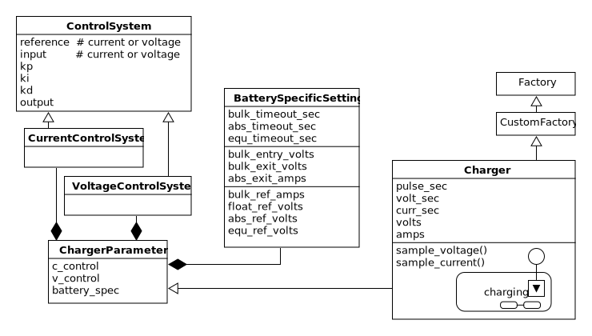
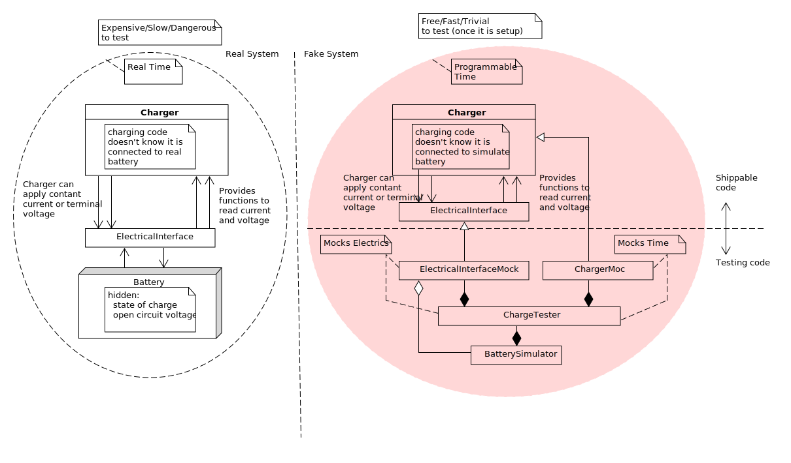
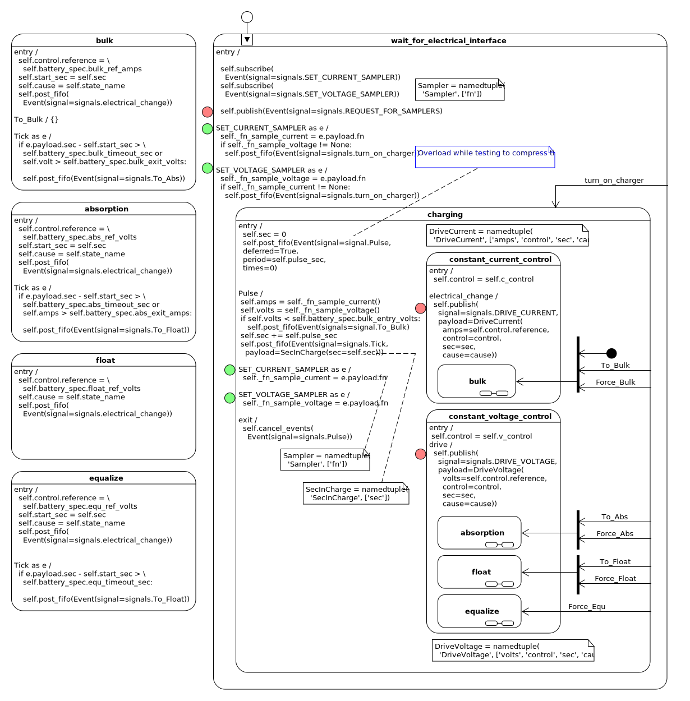
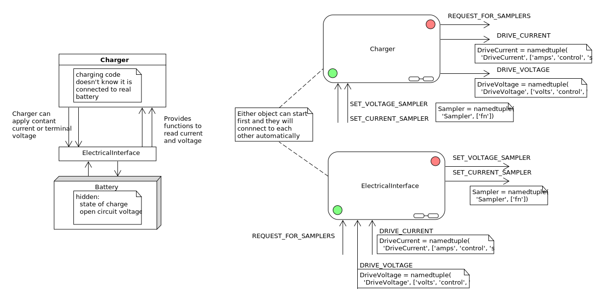

.. role:: new_spec
  :class: new_spec

.. epigraph::

  Software should be treated not as a static product, but as a living
  manifestation of the development team's collective understanding.

  -- From `How to Build Good Software <https://www.csc.gov.sg/articles/how-to-build-good-software>`_, by Li Hongyi

.. _batterychargingexample-battery-charging-example:

Distributed Battery Charging
============================

This essay describes two engineers working together to build a distributed three
stage battery charger.  It follows them as they learn from one another and
challenge each other's work.  As their progress evolves against their shared
knowledge, they pack what they have learned and what they have done, into a very
short document called the specification (spec).

They treat their specification as a time capsule they are sending into the
future, as an artifact to help the engineers of tomorrow (who might just be older
versions of themselves) make sense of their system.

Before we start with the story, here is a bit of background information that
will help provide some context.

.. _batterychargingexample-high-level-summary-of-batteries-and-chargers:

High Level Introduction to how Batteries and Chargers Work
^^^^^^^^^^^^^^^^^^^^^^^^^^^^^^^^^^^^^^^^^^^^^^^^^^^^^^^^^^

Lead acid batteries are very heavy.  But they are cheaper than lithium ion
batteries and this is why they are used in a lot of off-grid electrical systems.

.. image:: https://krisdedecker.typepad.com/.a/6a00e0099229e8883301bb0820445e970d-pi
    :target: https://www.lowtechmagazine.com/2015/05/sustainability-off-grid-solar-power.html
    :class: scale-to-fit

A large lead-acid battery is made up of a set of smaller lead-acid batteries
connected together in series.  These smaller batteries are called cells.

.. image:: _static/cells_in_series.PNG
    :target: https://chargetek.com/images/pdfs/equal.pdf
    :class: scale-to-fit

Each cell contains two terminals, and each terminal is connected to a plate that
reaches down into a bath of sulphuric acid (H2SO4) and water (H2O).  There is a
positive and a negative terminal.  The positive terminal of a cell is made up of
lead dioxide (PbO2) and the negative terminal is made out of lead (Pb).

A battery is a chemical reaction that wants to happen, but can't until there is
a path for electrons to flow from one material to another.  As a result, there
is a voltage potential expressed across the positive and negative terminals of
the battery.  If an electrical device is connected across these terminals an
electron path is made, the battery can begin its chemical reaction.  As a side
effect the electrical device is powered on.  The flow of current leaves the
positive terminal and enters the negative terminal.  When this happens the
battery is said to discharge.

.. image:: https://circuitglobe.com/wp-content/uploads/2017/01/lead-acid-cell-112.jpg
    :target: https://circuitglobe.com/lead-acid-battery.html
    :class: noscale-center

Charging of a battery occurs when current is forced to flow in the opposite
direction: current leaves the negative terminal and enters the positive
terminal. This causes the chemical reaction to reverse, sequestering the
electrons back into the various materials of the battery.  You can charge a
battery with a battery charger.

.. image:: https://circuitglobe.com/wp-content/uploads/2017/01/recharging-of-lead-acid-battery.jpg
    :target: https://circuitglobe.com/lead-acid-battery.html
    :class: noscale-center

.. note::

   If you aren't familiar with the terminology of electricity, imagine a water
   tower.  The water is trying to get to the ground, due to gravity,
   but it is held in place by the walls of the tower.  This means that there is a
   potential for the water to flow, the height of the tower determines how much
   energy is stored within it.  The higher the tower, the higher the potential
   energy.  Voltage is analogous to height of the held water in the tower.

   .. image:: https://encrypted-tbn0.gstatic.com/images?q=tbn:ANd9GcTtYw4fJS9o3meW9yv5ZGJ5enzVpyJ0sfw5L45UifmATQERiArD
       :target: https://encrypted-tbn0.gstatic.com/images?q=tbn:ANd9GcTtYw4fJS9o3meW9yv5ZGJ5enzVpyJ0sfw5L45UifmATQERiArD
       :class: noscale-right-wrap

   Now imagine connecting a pipe from the tower to the ground, and letting the
   water flow through it.  This flow is like current in an electrical system, and
   the pipe width would limit that flow, so that would be like an electrical load.

   Our battery is like a water tower; if no pipe is connected, current can't flow.
   If a pipe is connected, it can, and the energy of the battery reduces just like
   the potential energy of our water tower would reduce as its water leaves it
   through a pipe.  If you were to push the current back into the pipe, by
   connecting a higher water tower, or by just driving the current back up the
   tube with a pump, you would cause the potential of the water tower to increase.
   We would be charging the tower.

   As mentioned before, a battery is made up of stacking cells in series.  Think of
   that as a very tall water tower made up of stacked shorter water towers.  You
   can increase their potential energy by stacking them this way.

As a lead acid battery is discharged, a crust of lead sulphate (PbSO4) forms on the
plates.  This crust reduces the surface area of the lead plates exposed to the
acid, reducing its ability to react and drive current.

.. image:: https://stevedmarineconsulting.com/wp-content/uploads/2019/06/082504179.jpg
    :target: https://stevedmarineconsulting.com/sulfation-too-many-batteries-die-an-unnecessarily-early-death-from-this-phenomenon/
    :class: noscale-center

There are electrical charging techniques which can remove this lead sulphate
(PbSO4), by reversing the chemical reaction, and even sometimes bubbling the
acid.  These bubbles physically massage away the lead sulphate crystals,
dislodging them from the plate, dropping them into the acid bath where they can
break down, crystallizing their lead atoms back onto the plates.

An electrical charger can control one of two things, it can act to control
current flow or it can control the voltage across the terminals of the
battery.  If it holds the current constant, electrons are pushed back into the
battery, which will cause the voltage of the battery to slowly rise over time.

If the charger holds the voltage at a higher potential than the battery voltage,
current will flow into the battery.  At first it will flow quickly, but over
time the battery's ability to accept electrons will be limited by the amount of
material within it, causing the current flow to subside.

.. note::

   Thinking back to the water tower.  If we re-filled our water tower using a
   pump to push a constant amount of water, this would be like controlling the
   current being pushed into the battery.  If we connected a higher water tower,
   and let it passively drain some of its water into the lower tower, this would
   be like controlling the voltage of our charger.  Together the two towers
   would have the potential energy of the taller tower, so its voltage would be
   set to this.

When you hear people talk about the stages of charging of a battery, they are
talking about either a constant current or a constant voltage charging
technique.  In two stage charging, a constant current technique starts the
charging process, then once the battery voltage rises to a high enough level, a
constant voltage technique takes over.  In three stage charging, the third stage
is a constant voltage technique, but held at a lower value than the second
stage.  A forth stage of charging can be applied very infrequently, it's called
equalization.  It is a constant voltage technique that applies such a high
voltage across the battery terminals, that the acid boils, and explosive
hydrogen is expelled from the batteries (this is why battery rooms need to be
well vented).

There are arbitrary naming conventions that have been applied to these stages of
charging:

+---------------------+----------+----------+----------------------------------+
| Name of Stage       | Constant | Constant | Notes                            |
|                     | Current? | Voltage? |                                  |
+=====================+==========+==========+==================================+
| *bulk stage*        |  yes     | no       | 80 percent of charge put back    |
+---------------------+----------+----------+----------------------------------+
| *absorption stage*  |  no      | yes      |                                  |
+---------------------+----------+----------+----------------------------------+
| *float stage*       |  no      | yes      | voltage is lower than absorption |
+---------------------+----------+----------+----------------------------------+
| *equalization*      |  no      | yes      | voltage is very high             |
+---------------------+----------+----------+----------------------------------+

A charger is typically called one of these:

+-----------------------+--------------------------------------------------------+
| Name of Charger       |  Meaning                                               |
+=======================+========================================================+
| *trickle charger*     |  float stage only                                      |
+-----------------------+--------------------------------------------------------+
| *two stage charger*   |  bulk followed by the float stage                      |
+-----------------------+--------------------------------------------------------+
| *three stage charger* |  bulk followed by absorption, followed by float        |
+-----------------------+--------------------------------------------------------+

The *equalization* stage is so dangerous that it doesn't happen automatically,
it has to be manually set by the user.

It has been found that when you charge batteries with three stage chargers, the
process of plate sulphation is slower than it would be with a two stage charger.
If such a charger is also equipped with the equalization feature, a knowledgeable
user can keep their battery's healthy for a long time.

Let's look at the three stage charging electrical profile:

.. image:: _static/three_stage_charging_all.svg
    :target: _static/three_stage_charging_all.pdf
    :class: scale-to-fit

That diagram is not going to win any graphic design awards, but it shows you
everything you need to know about building a charger.  We need two control
systems, one that can hold current to a constant level and one that can hold the
voltage to a constant level.  We need to track time, so that we can exit a stage
if the charger has been in it too long.  And we need to be able to set some
parameters based on the kind of battery we are attached too.

The bulk stage is where the battery is charged quickly.  Charging the battery is
what our customer's care about the most, but battery maintenance is very
important too.

The charger will have a rated current, the more money we put into its hardware,
the higher this current can be.  The problem is if we over-build this, our
charger will be too big for a lot of systems and these customers will buy
someone else's product because it is cheaper than ours.

A way to solve this problem is to build a charger that can be ganged together
with more versions of itself.  That way we can keep the costs low, and if a
customer needs a lot of current, they can buy as many of our products as they
need and gang them together in parallel.

The added benefit of this approach is that if one of their chargers fails, there
batteries can still be charged by the others in their system.  It offers them
some resilience.  If they felt so inclined, they could actually over-build their
charging system to increase their system's reliability (think military
contracts).  Batteries are expensive, heavy and dangerous, and chargers are
relatively cheap and easy to work with and install.

Another problem our customers have is with the parameters.  We can't expect them
to figure out what all of the values and time-outs mean.  They really don't
care, we need to eat this complexity on their behalf, especially if we are
expecting them to buy a bunch of our products for a single installation.

Often the hardest thing to do on a project is to pack knowledge into a
specification (spec).  The specification should be simple and full of pictures,
if it isn't nobody will look a it, and nobody will change it to match what the
system actually does.  Engineers talk with pictures, because pictures transmit
more information than writing.  Pictures also illicit conversation which moves
relevant personal knowledge into project knowledge:  When you are talking to
technical people they often forget that they know a lot of things you don't
know. If you are both pointing to and talking about a picture, you will both
learn more about each others contribution and thinking in regards to the
project.  Once things are discovered from one another they should be packed into
a couple of notes and pictures and added to the spec.

The spec should be short enough that it can be read and understood by everyone
involved.  If specific drawings are too technical for some members, efforts
should be made to explain what they mean so everyone can participate in the
conversation.  Here is an example of such a conversation to discover how to
build a single three stage battery charger.

.. note::

  New knowledge and things said by other imagined people will be
  :new_spec:`highlighted.`

.. _batterychargingexample-spec-1:-control-systems:

Spec 1: Control Systems
^^^^^^^^^^^^^^^^^^^^^^^

**Specification (1)**

* :new_spec:`A charger has two control systems: constant current and constant voltage.`
* :new_spec:`The bulk stage is a constant current control technique.`
* :new_spec:`The absorption, float and equalization stages are constant voltage control
  techniques.`

.. image:: _static/three_stage_charging_chart_1.svg
    :target: _static/three_stage_charging_chart_1.pdf
    :class: noscale-center

I show the above diagram to the :new_spec:`electrical engineer` I'm working
with, and he says, :new_spec:`Yeah, it looks good, but can you make sure the two
control systems are generalizeable?`

"What do you mean?"

:new_spec:`Well, I want to just give the current control system a reference
current and it will drive the device to output that current.  The same idea
applies to the voltage controller.`

He continues, :new_spec:`A control system is just some math, you give it a goal
called a "reference".  then you give it the value of the thing it is trying to
control, call this the "input" and the math will drive the "output" towards the
goal.  We connect this output value to our hardware and it will behave as
expected.  I want to use the same math to solve the current and voltage control
problems, so give me a reference and give me the input and I'll make it work.`

You turn to leave and he says, :new_spec:`Oh, one more thing, I need to tune the
two control systems differently, so make sure I can set some variables "ki",
"kp" and "kd".  That should be good`.

So now we have to start thinking about all of the parameters, each can be
changed for a different battery type.  We change the language on the diagram to
match how our electrical engineer speaks.

.. image:: _static/three_stage_charging_parameters.svg
    :target: _static/three_stage_charging_chart_1.pdf
    :class: scale-to-fit

After we update the image we show our electrical engineer the new picture.

He looks at it and asks, :new_spec:`What are these arrows connecting the boxes
together?`

You answer, "It's just a way of saying that the ``reference``,
``input``, ``kp``, ``ki`` and ``kd`` values will be in both of the current and
voltage control classes.  Think of it as a drawing short hand."

He says, :new_spec:`Ok, it looks good.`

.. _batterychargingexample-spec-2:-battery-parameters:

Spec 2: Battery Parameters
^^^^^^^^^^^^^^^^^^^^^^^^^^

**Specification (2)**

* A charger has two control systems: constant current and constant voltage.
* The bulk stage is a constant current control technique.
* The absorption, float and equalization stages are constant voltage control
  techniques.

:new_spec:`The electrical profile of the system will look like this:`

.. image:: _static/three_stage_charging_parameters.svg
    :target: _static/three_stage_charging_chart_1.pdf
    :class: scale-to-fit

:new_spec:`The behavior of the system will look like this:`

.. image:: _static/three_stage_charging_chart_1.svg
    :target: _static/three_stage_charging_chart_1.pdf
    :class: noscale-center

But we still haven't solved the parameter issue.  To create a data structure
that has the control system information and the battery stuff in one place we
adjust our data model to look like this:

.. image:: _static/three_stage_charging_parameters_2.svg
    :target: _static/three_stage_charging_parameters_2.pdf
    :class: scale-to-fit

The ``ChargerParameter`` class "has a" (black diamond arrow)
``CurrentControlSystem``, a ``VoltageControlSystem`` and some
``BatterySpecificInformation``.

Now that we have a plan for structuring our data, we need to go back to our
behavioral diagram and figure out how to get information from the world.

We track down our electrical engineer and ask him, "How fast to I need to read
the voltage and the current?"

He says, :new_spec:`Well, I have to read these values very quickly in the
embedded device's interrupt service routines, the control systems will be
running at 20 Khz, but you don't have to worry about that.  Changing between the
various stages can happen slowly.  I'll be reading the input, I'll use raw ADC
readings to keep my code fast and I'll use the PWM peripherals on the part to
set the output current and voltage via an H-bridge.  But I will need you to
determine which control system to run and I'll need you to set its reference.
Make it so I can tune these values later if I need to, but for now you can
sample the current, voltage and make decisions at 2 Hz".  (every 0.5 seconds)`

You say, "Wait, I'm not controlling the current or voltage?".

He laughs and says, :new_spec:`Not with Python you aren't, but you control which
control system will run, and you will control that controllers reference and
tuning parameters, think meta, man!`

----

Here we are seeing some of the power of statecharts.  They allow us to wrap deep
expertise inside of a system with a rich set of other features.  The electrical
engineer will manage the control system and the circuits needed to make the
device work, but that is where his expertise stops.  We need to manage which of
the control strategies are applied, and what their goals are.

Let's pack this new knowledge into our pictures.  Let's start with the data
model.  We want to attach it to our statechart so that our statechart can use
it:

We show our design to the electrical engineer and he says, :new_spec:`What are
those diamond arrows?`

You answer, "It's just a way of saying one class has an
attribute of another class.  For instance the ``battery_spec`` in the
``ChargerParameter`` class "has a" ``BatterySpecificInformation`` class.  You leave
the ``BatterySpecificInformation`` class on the picture so you can see what its
attribute names are."

:new_spec:`It seems kind of complicated, can you just show me in code?`

.. code-block:: python

  class ControlSystem:
    def __init__(self):
      self.reference = 0
      # ..

   class CurrentControlSystem(ControlSystem):
     def __init__(self):
       super().__init__(self)

   class VoltageControlSystem(ControlSystem):
     def __init__(self):
       super().__init__(self)

   class BatterySpecificSettings:
     def __init__(self):
       self.bulk_timeout_sec = 700
       # ..

   class ChargerParameters:
      def __init__(self):
        self.controller = None
        self.c_control = CurrentControlSystem()
        self.v_control = VoltageControlSystem()
        self.battery_spec = BatterySpecificSettings()

   class Charger(ChargerParameters, CustomFactory):
      def __init__(self):
         # ..

   if __name__ = '__main__':
      charger = Charger()
      charge.c_control.reference = 40.0
      charge.battery_spec.bulk_timeout_sec = 600
      # ..

He looks at the picture and the code for a while, then says, :new_spec:`OK, I
see how it works, but why are the diamond arrows backwards?`

You answer, "The head of the diamond describes who owns the other thing.  If you
want to know why it was set that way you will have to ask the committee that
decided this in the 1990's"

Then he asks, :new_spec:`What's the ball and the stick?`

"That's where the data will connect to the software that drives the charger's
behavior.  The behavior will need the data, and if you see the ``Charger`` class
inherits from the ``CustomFactory`` class which contains all of the code that
can drive behavior.  Inheritance is just programming by difference, that arrow
is like a copy and paste, it's as if I have copied and pasted all of that
``CustomFactory`` and ``ChargerParameters`` code into the ``Charger`` class.
The ball is just short hand for saying the data attaches to the behavior "here".
The "here" in this case is the "charging state" which will be described
somewhere else."

He looks confused, and says, :new_spec:`I guess you will have to show me when you make it.`

----

The data model seems good enough so let's start designing the system behavior.
We need to start programming time, so we will construct three heart beats,
something that will sample the current, something that will sample the voltage
and something that will drive the statechart's decisions.  To make current and
voltage readings, we create two hooks in the charging state.  Finally, we make
sure that these heart beats are turned off when we leave the state; :ref:`we
can't remember why this is important, but we know it is.
<recipes-avoiding-heart-beat-bleed-bugs>`

.. image:: _static/three_stage_charging_chart_2_chart.svg
    :target: _static/three_stage_charging_chart_2_chart.pdf
    :class: noscale-center

We also adjust the chart so that the correct control system is selected when we
enter a charging stage, and then we use our data model and our behavior to
select which current or voltage reference will be set in each stage.

Now we want to talk to our electrical engineer about behavior, but we know we
should accompany the statechart diagram with the electrical profile, or it might
be a bit much for him.

.. image:: _static/three_stage_charging_chart_2_graph.svg
    :target: _static/three_stage_charging_chart_2_graph.pdf
    :class: scale-to-fit

We show him the diagram, and say, "Listen, some stuff is missing on this, but I
just want you to look at how the current and voltage are sampled, and how the
control systems are set up."

He says, :new_spec:`Ok, show me.`

You say, "In the entry stage we create three different named pulses that repeat
forever, or until the charging state is exited. The chart can react to these
named pulses and change state, or just run some code."

I pause and look at him, he says, :new_spec:`Keep going.`

"Alright, see that ``Sample_Current`` pulse, it will fire forever with a period of
``cur_in_sec`` which we will probably just set to 0.5 seconds, but we can tune
it, we can make this something else if we need to."

"The ``Sample_Current`` and ``Sample_Voltage`` events will be sent at the chart
and the chart will react to them, but in our case, we just hook these signals
to sample the current and voltage.  The chart won't actually change state when
these events are seen by it, it will just use the events to update a ``curr``
and ``volt`` attribute in its data structure so these values can be kept fresh
enough that the chart can make good decisions with the information."

"Does that make sense?"

:new_spec:`Yeah, it's just a timer right?`

You answer, "Yeah, but look there is another one, called ``Pulse``, it's not
wired up yet, but soon it will be the thing that drives the chart's decisions"

"Now I'll show you how the controllers are set up.  After the charging state is
entered, it will set up these pulses, then it will enter the bulk state.  When
it enters the ``constant_current_state``, it sets the control system to use the
``CurrentControlSystem`` and then when it enters the bulk state, it sets the
reference of this control system to be ``battery_spec.ref_amps`` from our data
model."

He looks at it for a while, and says, :new_spec:`Yeah, this is what I wanted, ok,
yeah, I get it.  How do I get into the other states?`

"I haven't set that up yet, but suppose we were to enter the ``absorption``
state, we would first have to enter the ``constant_voltage_state``.  This would
cause our control system to change, we would detach the current control system,
and attach the voltage control system.  We would then use all of that control
system's ``kp``, ``ki`` and ``kd`` parameters."

:new_spec:`Yeah, ok, good, this is what I wanted.`

Things seem to be coming together, so we go back and work on our spec, teasing
apart our high level descriptions from our technical design.

.. _batterychargingexample-spec-3:-electrical-charging-profile:

Spec 3: Electrical Charging Profile
^^^^^^^^^^^^^^^^^^^^^^^^^^^^^^^^^^^

**High level Specification (3)**

* This product will be a three stage charger with an equalization feature.
* The charger has two control systems: constant current and constant voltage.
* The bulk stage is a constant current control technique.
* The absorption, float and equalization stages are constant voltage control
  techniques.

:new_spec:`The charging electrical profile can be seen here:`

.. image:: _static/three_stage_charging_chart_2_graph.svg
    :target: _static/three_stage_charging_chart_2_graph.pdf
    :class: scale-to-fit

**Sofware Functional Specification (3)**

* :new_spec:`The software system will be broken into two parts, fast running c code and slower running Python code`
* :new_spec:`The c code will run in ISRs at a frequency of 20 Khz and will control the charger in either a constant current or
  constant voltage mode. (see separate doc)`
* :new_spec:`The Python code will determine which control strategy the c code is
  using, it will also set the c code's control system parameters.  The Python code will not directly control the electrical output of the unit`
* :new_spec:`The Python code will sample the current and voltage and make decisions every 0.5 seconds`

:new_spec:`The Python data architecture can be seen here:`

:new_spec:`The Python behavioral architecture can be seen here.`

.. image:: _static/three_stage_charging_chart_2_chart.svg
    :target: _static/three_stage_charging_chart_2_chart.pdf
    :class: noscale-center

Let's wire up the ``Pulse`` event and add more functionality to our chart.  We
want the charger to:

* change its charging state to match our electrical/time profile
* be able to be forced into any of the charge states

Here is a new design that does these things:

.. image:: _static/three_stage_charging_chart_3_chart.svg
    :target: _static/three_stage_charging_chart_3_chart.pdf
    :class: scale-to-fit

Since there is a need for timeouts in various states, we invent a new signal
called ``Tick``.  ``Tick`` is driven by our ``Pulse`` event, and it is given a
payload which is the time in seconds since the charging state was entered.

Time to show our electrical engineer.

We approach him with the diagrams and he says, :new_spec:`Ok walk me through
it`.

"When the ``charging`` state is entered the ``sec`` is set to 0, then the
three heart beats are initiated.  Two of the heart beats drive the current and
voltage readings, but the third heart beat, ``Pulse``, will fire every
``pulse_sec`` seconds.  We will probably set ``pulse_sec`` to 0.5.  The key
thing to notice on this picture is that Pulse drives another event called
``Tick`` which is given a payload of ``sec`` which is how much time has passed
since the charging state was entered."

:new_spec:`Wait, how does this tick thing work?`.

"When system turns on the
first thing that will happen is it will enter the ``charging`` state. When the
``charging`` state is entered a bunch of heart beats are setup, these are
basically named timers, ``Sample_Current``, ``Sample_Voltage`` and ``Pulse``.
Then the charging state initializes, causing a transition into the ``bulk``
state.  While this happens, the ``constant_current_state`` is entered, setting
the control system to use your current control system, then it enters the
``bulk`` state, which sets the reference of your current control system."

He looks at the diagram and after some time says, :new_spec:`Ok, yeah, I see
that, but how does this pulse stuff work?`

"The Pulse event will fire every, say 0.5 seconds, but it is caught by a hook,
which invents another signal called ``Tick`` which has a payload, ``sec``.  The
``sec`` payload of the Tick signal will have the time in seconds since the
charging state was entered.  It's this ``Tick`` event, which can make stuff
happen.  Do you see it?"

:new_spec:`I see it.  So how do these charging stage time outs work?  Can you
show me the electrical profile and the statechart timing mechanisms together?`

.. image:: _static/three_stage_charging_chart_3_graph.svg
    :target: _static/three_stage_charging_chart_3_graph.pdf
    :class: scale-to-fit

"Ok, so first of all we enter the bulk state, then we start getting ``Tick``
events with ``sec`` payloads representing the amount of time in seconds since
the beginning of ``charging``.  Notice that when the ``bulk`` state is entered,
the time at which this happened is squirreled away in the ``start_sec``
attribute.  From then on, every ``pulse_sec`` a ``Tick`` signal will be seen by
the bulk state.  Your current control system will charge the battery.  While this
is happening the ``bulk`` state will see a whole lot of ``Tick`` events which it
will ignore.  But once the time in bulk is equal to or greater than
``abs_timeout_sec`` or if the battery voltage is equal to or greater than
``bulk_exit_volt``, the ``bulk`` state will post a ``To_Abs`` event to the chart."

"The ``To_Abs`` event, will cause an exit from the ``bulk`` state, then an exit
from the ``constant_current_control`` state.  Then it will enter into the
``constant_voltage_control`` state, which will switch the control system to use
a voltage controller, then enter the ``absorption`` state which will set the
voltage reference to ``abs_ref_volts``".

:new_spec:`I see how it works and I see how the same thing happens for
transitions to float from absorption.  Also, I see that you can only force your
way into the equalize state, that's good.`

He looks a bit longer and says, :new_spec:`So the charger will try and spend
most of its time in float? But how to we get back into bulk if there is a big
draw on the batteries? Say our customer has a big DC load that draws the voltage
down below the bulk_entry_volts.  What happens then?`

You look at the chart and see that you can't get back into bulk, "Right now you
can't, I missed that, but let me fix it"  You spend a moment adjusting the
chart, "Look at this:"

"See how I adjusted the ``Sample_Voltage`` hook to post a ``To_Bulk`` signal when
the voltage is below the ``bulk_entry_volts``.  I have added a ``To_Bulk`` hook
in the ``bulk`` state which blocks this event from causing a transition from
``charging`` to ``bulk`` while the unit is in bulk but the voltage is still
lower than the ``bulk_exit_volts``."

He asks, :new_spec:`Why would that happen?`.

"The charger would probably need some time to get the voltage above the
``bulk_entry_volts`` once it fell below this threshold, maybe because of a big
DC draw on the battery."

He says, :new_spec:`Yeah, that will probably happen in some situations`.

You ask him, "Do we need to separate the timing of our current, voltage and
decision pulses?"

He says, :new_spec:`No, it's not that important, what's the cost of having extra
timers anyway?`

"It's not a big deal, just each heart beat will have its own thread, and when
I'm looking at the logs it could get kind of cluttered having all of those
signals firing at the same time.  So, maybe I could simplify the design by just
having one heart beat."

:new_spec:`Yeah, simple is good, we probably won't need separate timers.`

You spend a moment adjusting the chart.  "Here, it's less cluttered now":

.. image:: _static/three_stage_charging_chart_3_chart_2.svg
    :target: _static/three_stage_charging_chart_3_chart_2.pdf
    :class: scale-to-fit

Do you see anything else we could pull out of there?

:new_spec:`No, it seems pretty compact, how are you going to test this thing
anyway?  I'm not going to have hardware for you for a couple of weeks, can you
test it before that?`.

"I will run it on a PC and feed it fake electrical profiles, I also plan
to squeeze time so I can run it through all of its states quickly".

Things seem to be coming together, so we go back and work on our spec, teasing
apart our high level descriptions from our technical design.

.. _batterychargingexample-spec-4:-charger-behavior-design:

Spec 4: Charger Behavioral Design
^^^^^^^^^^^^^^^^^^^^^^^^^^^^^^^^^

**High level Specification (4)**

* This product will be a three stage charger with an equalization feature.
* The charger has two control systems: constant current and constant voltage.
* The bulk stage is a constant current control technique.
* The absorption, float and equalization stages are constant voltage control
  techniques.

The charging electrical profile can be seen here:

.. image:: _static/three_stage_charging_chart_2_graph.svg
    :target: _static/three_stage_charging_chart_2_graph.pdf
    :class: scale-to-fit

**Sofware Functional Specification (4)**

* The software system will be broken into two parts, fast running c code and slower running Python code.
* The c code will run in ISRs at a frequency of 20 Khz and will control the charger in either a constant current or
  constant voltage mode. (see separate doc)
* The Python code will determine which control strategy the c code is
  using, it will also set the c code's control system parameters.  The Python code will not directly control the electrical output of the unit.
* The Python code will sample the current and voltage and make decisions every 0.5 seconds.

The Python data architecture can be seen here:

.. image:: _static/three_stage_charging_chart_4_data.svg
    :target: _static/three_stage_charging_chart_4_data.pdf
    :class: noscale-center

The Python behavioral architecture can be seen here:

.. image:: _static/three_stage_charging_chart_4_chart.svg
    :target: _static/three_stage_charging_chart_4_chart.pdf
    :class: scale-to-fit

We have enough knowledge now to build something.  Let's start with the data
model:

.. image:: _static/three_stage_charging_chart_4_data.svg
    :target: _static/three_stage_charging_chart_4_data.pdf
    :class: noscale-center

The `code to make this model can be found here
<https://github.com/aleph2c/miros/blob/master/examples/single_unit_three_stage_charger_1.py>`_

It would be simple enough to adjust our code to use a SQL database, or an
object-relational-mapper, like `SQLAlchemy <https://www.sqlalchemy.org>`_ to
track the different types of battery specifications.  For now we will leave our
model as Python code, but if you had a lot of different battery types, you might
want to keep them in a database.

Next, let's write the statechart:

.. image:: _static/three_stage_charging_chart_4_chart.svg
    :target: _static/three_stage_charging_chart_4_chart.pdf
    :class: noscale-center

.. code-block:: python

   class Charger(ChargerParameters, LoggedBehavior, ThreadSafeAttributes):

     # The charger will be multithreaded, provide simple locks around data
     # accesses to these attributes
     _attributes = [
       'amps',
       'volts',
       'sec',
       'control',
     ]

     def __init__(self, name=None, charger_params=None, live_trace=None,
         live_spy=None, pulse_sec=None):
       '''Three stage battery charger feature management

       This class will manage the data and the behavior of our three stage
       battery charger.  The control systems used by the charge will be
       written in c, but the reference and turning parameters of these
       controllers will be accessible to this python code via SWIG.

       To understand this class reference:

         1) the three stage charging electrical profile drawing:

         2) the three stage charging data architecture drawing:

         3) the three stage charging state chart drawing:

       **Args**:
          | ``name`` (str): name of the charging state chart
          | ``charger_params=None`` (ChargerParameters):
          |                           parameters/controller
          |                           needed by charger
          | ``live_trace=None(bool)``: enable live_trace feature?
          | ``live_spy=None(bool)``: enable live_spy feature?
          | ``pulse_sec=None``(float): how often to same current/voltage
          |                            and make decisions about
          |                            state changes

       **Example(s)**:

       .. code-block:: python

         ccs = CurrentControlSystem(# ...)
         vcs = VoltageControlSystem(# ...)
         battery_spec = BatterySpecificationSettings(# ...)
         charge_params = ChargerParameters(
           c_control=ccs,
           v_control=vcs,
           battery_spec=battery_spec)

         three_stage_charger = Charger(
           'charger',
           charger_params=charger_params,
           live_trace=True)

       '''
       self.pulse_sec = 0.5 if pulse_sec is None else pulse_sec
       c_control = charger_params.c_control
       v_control = charger_params.v_control
       battery_spec = charger_params.battery_spec

       super().__init__(
         name=name,
         live_trace=live_trace,
         live_spy=live_spy,
         c_control=c_control,
         v_control=v_control,
         battery_spec=battery_spec,
       )

       self.charging = self.create(state="charging"). \
         catch(signal=signals.ENTRY_SIGNAL,
           handler=self.charging_entry_signal). \
         catch(signal=signals.INIT_SIGNAL,
           handler=self.charging_init_signal). \
         catch(signal=signals.Pulse,
           handler=self.charging_pulse). \
         catch(signal=signals.To_Bulk,
           handler=self.charging_to_bulk). \
         catch(signal=signals.Force_Bulk,
           handler=self.charging_force_bulk). \
         catch(signal=signals.To_Abs,
           handler=self.charging_to_abs). \
         catch(signal=signals.Force_Abs,
           handler=self.charging_force_abs). \
         catch(signal=signals.To_Float,
           handler=self.charging_to_float). \
         catch(signal=signals.Force_Float,
           handler=self.charging_force_float). \
         catch(signal=signals.Force_Equ,
           handler=self.charging_force_equ). \
         catch(signal=signals.EXIT_SIGNAL,
           handler=self.charging_exit_signal). \
         to_method()

       self.constant_current_control = \
         self.create(state="constant_current_control"). \
           catch(signal=signals.ENTRY_SIGNAL,
             handler=self.constant_current_control_entry_signal). \
         to_method()

       self.constant_voltage_control = \
         self.create(state="constant_voltage_control"). \
           catch(signal=signals.ENTRY,
             handler=self.contant_voltage_control_entry). \
         to_method()

       self.bulk = self.create(state="bulk"). \
         catch(signal=signals.ENTRY_SIGNAL,
           handler=self.bulk_entry_signal). \
         catch(signal=signals.To_Bulk,
           handler=self.bulk_to_bulk). \
         catch(signal=signals.Tick,
           handler=self.bulk_tick). \
         to_method()

       self.absorption = self.create(state="absorption"). \
         catch(signal=signals.ENTRY_SIGNAL,
           handler=self.absorption_entry_signal). \
         catch(signal=signals.Tick,
           handler=self.absorption_tick). \
         to_method()

       self.float = self.create(state="float"). \
         catch(signal=signals.ENTRY,
           handler=self.float_entry). \
         to_method()

       self.equalize = self.create(state="equalize"). \
         catch(signal=signals.ENTRY_SIGNAL,
           handler=self.equalize_entry_signal). \
         catch(signal=signals.Tick,
           handler=self.equalize_tick). \
         to_method()

       self.nest(self.charging, parent=None). \
         nest(self.constant_current_control, parent=self.charging). \
         nest(self.constant_voltage_control, parent=self.charging). \
         nest(self.bulk, parent=self.constant_current_control). \
         nest(self.absorption, parent=self.constant_voltage_control). \
         nest(self.float, parent=self.constant_voltage_control). \
         nest(self.equalize, parent=self.constant_voltage_control)

       self.start_at(self.charging)

     def charging_entry_signal(self, e):
       status = return_status.HANDLED
       self.sec = 0
       self.post_fifo(Event(signal=signals.Pulse),
         deferred=True,
         period=self.pulse_sec,
         times=0)
       return status

     def charging_init_signal(self, e):
       status = self.trans(self.constant_current_control)
       return status

     def charging_pulse(self, e):
       status = return_status.HANDLED
       self.amps = self.sample_current()
       self.volts = self.sample_voltage()
       if(self.volts < self.battery_spec.bulk_entry_volts):
         self.post_fifo(Event(signal=signals.To_Bulk))
       self.sec += self.pulse_sec
       self.post_fifo(Event(signal=signals.Tick,
         payload=SecInCharge(sec=self.sec)))
       return status

     def charging_to_bulk(self, e):
       status = self.trans(self.bulk)
       return status

     def charging_force_bulk(self, e):
       status = self.trans(self.bulk)
       return status

     def charging_to_abs(self, e):
       status = self.trans(self.absorption)
       return status

     def charging_force_abs(self, e):
       status = self.trans(self.absorption)
       return status

     def charging_to_float(self, e):
       status = self.trans(self.float)
       return status

     def charging_force_float(self, e):
       status = self.trans(self.float)
       return status

     def charging_force_equ(self, e):
       status = self.trans(self.equalize)
       return status

     def charging_exit_signal(self, e):
       status = return_status.HANDLED
       self.cancel_events(Event(signal=signals.Pulse))
       return status

     def constant_current_control_entry_signal(self, e):
       status = return_status.HANDLED
       self.control = self.c_control
       return status

     def contant_voltage_control_entry(self, e):
       status = return_status.HANDLED
       self.control = self.c_voltage
       return status

     def bulk_entry_signal(self, e):
       status = return_status.HANDLED
       self.control.referece = self.battery_spec.bulk_ref_amps
       self.start_sec = self.sec
       return status

     def bulk_to_bulk(self, e):
       status = return_status.HANDLED
       return status

     def bulk_tick(self, e):
       status = return_status.HANDLED
       if(e.payload.sec - self.start_sec >
         self.battery_spec.bulk_timeout_sec or
         self.volts > self.battery_spec.bulk_exit_volts):
         self.post_fifo(Event(signal=signals.To_Abs))
       return status

     def absorption_entry_signal(self, e):
       status = return_status.HANDLED
       self.control.reference = \
         self.battery_spec.abs_ref_volts
       self.start_sec = self.sec
       return status

     def absorption_tick(self, e):
       status = return_status.HANDLED
       if(e.payload.sec - self.start_sec >
         self.battery_spec.abs_timeout_sec or
         self.amps > self.battery_spec.abs_exit_amps):
         self.post_fifo(Event(signal=signals.To_Float))
       return status

     def float_entry(self, e):
       status = return_status.HANDLED
       self.control.reference = self.battery_spec.float_ref_volts
       return status

     def equalize_entry_signal(self, e):
       status = return_status.HANDLED
       self.control.reference = \
         self.battery_spec.equ_ref_volts
       self.start_sec = self.sec
       return status

     def equalize_tick(self, e):
       status = return_status.HANDLED
       if(e.payload.sec - self.start_sec >
         self.battery_spec.equ_timeout_sec):
         self.post_fifo(Event(signal=signals.To_Float))
       return status

     def sample_current(self):
       '''return 20 amps'''
       return 20

     def sample_voltage(self):
       '''return 12 volts'''
       return 12

You can `see the full code here
<https://github.com/aleph2c/miros/blob/master/examples/single_unit_three_stage_charger_2.py>`_.

Before we continue, let's tune the trace and spy instrumentation to write to a
log file.  We will do this by writing a ``LoggedBehavior`` class which forces
the trace and spy to write to a log file called *single_unit_three_stage_charger.log*.

.. code-block:: python

   class LoggedBehavior(Factory):
     def __init__(self,
       name,
       log_file=None,
       live_trace=None,
       live_spy=None,
       **kwargs):

       super().__init__(name, *kwargs)

       self.live_trace = False if live_trace == None \
         else live_trace

       self.live_spy = False if live_spy == None \
         else live_spy

       self.log_file = 'single_unit_three_stage_charger.log' \
         if log_file == None else log_file

       # clear our old log file
       with open(self.log_file, "w") as fp:
         fp.write("")

       logging.basicConfig(
         format='%(asctime)s %(levelname)s:%(message)s',
         filename=self.log_file,
         level=logging.DEBUG)

       self.register_live_spy_callback(
         partial(self.spy_callback)
       )
       self.register_live_trace_callback(
         partial(self.trace_callback)
       )

     def trace_callback(self, trace):
       '''trace without datetimestamp'''
       trace_without_datetime = re.search(r'(\[.+\]) (\[.+\].+)', trace).group(2)
       logging.debug("T: " + trace_without_datetime)

     def spy_callback(self, spy):
       '''spy with machine name pre-pending'''
       logging.debug("S: [{}] {}".format(self.name, spy))

To see the behavior of the chart we need to setup a data model, then create
the statechart.  We will do this at the bottom of the file so it's easy to test.

.. code-block:: python

   if __name__ == '__main__':

     # current control system
     ccs = CurrentControlSystem(
       reference=50.0,  # 50 amps
       kp=0.5,
       ki=0.03,
       kd=0.04
     )

     # voltage control system
     vcs = VoltageControlSystem(
       reference=12.0, # 12 volts
       kp=0.4,
       ki=0.02,
       kd=0.005
     )

     # battery specification
     battery_spec = BatterySpecificationSettings(
       bulk_timeout_sec=700,
       abs_timeout_sec=900,
       equ_timeout_sec=86400,
       bulk_entry_volts=18.0,
       bulk_exit_volts=28.0,
       abs_exit_amps=12,
       bulk_ref_amps=240,
       float_ref_volts=24.0,
       abs_ref_volts=28.0,
       equ_ref_volts=30.0
     )

     # aggregated charger paramters
     charger_params = ChargerParameters(
       c_control=ccs,
       v_control=vcs,
       battery_spec=battery_spec
     )

     # the charger data and behavior
     three_stage_charger = Charger(
       name='charger',
       charger_params=charger_params,
       live_trace=True,
       live_spy=True,
     )

     time.sleep(10)

When we run `this code
<https://github.com/aleph2c/miros/blob/master/examples/single_unit_three_stage_charger_2.py>`_
it will write our custom ``spy`` and ``trace`` output to the log file.

To view the results, you can `cat` and grep for the ``trace`` log:

.. code-block:: shell

  cat 'single_unit_three_stage_charger.log' | grep T:
  19:54:21,801 DEBUG:T: [charger] e->start_at() top->constant_current_control
  19:54:22,304 DEBUG:T: [charger] e->To_Bulk() constant_current_control->bulk

Or view the ``spy``:

.. code-block:: shell

  cat 'single_unit_three_stage_charger.log' | grep S:
  .
  .
  .
  19:56:38,706 DEBUG:S: [charger] <- Queued:(0) Deferred:(0)
  19:56:39,204 DEBUG:S: [charger] Pulse:bulk
  19:56:39,204 DEBUG:S: [charger] Pulse:constant_current_control
  19:56:39,205 DEBUG:S: [charger] Pulse:charging
  19:56:39,205 DEBUG:S: [charger] POST_FIFO:To_Bulk
  19:56:39,205 DEBUG:S: [charger] POST_FIFO:Tick
  19:56:39,205 DEBUG:S: [charger] Pulse:charging:HOOK
  19:56:39,205 DEBUG:S: [charger] <- Queued:(2) Deferred:(0)
  19:56:39,206 DEBUG:S: [charger] To_Bulk:bulk
  19:56:39,206 DEBUG:S: [charger] To_Bulk:bulk:HOOK
  19:56:39,206 DEBUG:S: [charger] <- Queued:(1) Deferred:(0)
  19:56:39,207 DEBUG:S: [charger] Tick:bulk
  19:56:39,207 DEBUG:S: [charger] Tick:bulk:HOOK
  19:56:39,207 DEBUG:S: [charger] <- Queued:(0) Deferred:(0)

Our electrical engineer comes up to us, :new_spec:`How is it going?`.

You answer, "No plan ever survives first contact with the enemy."

:new_spec:`That well hey?`

"It's going well enough, I have the data model and statechart written, I can see
that it might be working, and I only had to change a few things in the design do
get it there.  Now I have to figure out how to test it. I have no idea if it
*actually* works"

:new_spec:`Any ideas?`

"I would like to feed in a graph or a CSV file, and have the statechart respond
to the graph.  I would have to instrument it in such a way that the statechart's
log output would be easy to interpret next to the graph."

:new_spec:`If you figure that out, i would like to use it too.  that's the nice
thing about software, it's so gullible, it's so easy to lie to software?`

You look at him for a while, and say, "Yeah, I guess you are right, maybe I could
mock it out using dependency injection via subclassing or something like that".

:new_spec:`Why do you software guys always invent these complicated names for
things?`

You think for a while and surprise him with an answer, "I think it happens
because we try to keep everything as general as possible, and we aren't that
creative about naming, because naming isn't the thing we think is important at
the time. We are usually trying to solve some other specific problem when we
have to come up with a name.  So, a name just becomes the first, most general
description that pops into our mind, and first ideas are usually bad. But
we don't care because we don't think that the name is important when we invent
it. Then that name sticks, and whatever the specific problem we were trying to
solve is forgotten. Nobody has control of the language once it is released to
the public (unless it's French), so the dumb language just lingers like a bad
smell."

He laughs and says, :new_spec:`Well at least you aren't using Latin.  I think
your industry comes up with bad names because the names are made by academics,
and they will increase their chances of being published, -- paid --, if they
make things sound as complicated and mysterious as possible.`

:new_spec:`Why don't you just add your testing design into the spec, this stuff
you have written needs to work, or you could burn down someone's house eh?  No
pressure.` He smiles. :new_spec:`Just add it to the spec, then make it happen.
Oh, and try and keep your gobbledegook out of the spec, I have to read it too.`

.. _batterychargingexample-spec-5:-high-level-verification-goals:

Spec 5: High Level Verification Goals
^^^^^^^^^^^^^^^^^^^^^^^^^^^^^^^^^^^^^

**High level Specification (5)**

* This product will be a three stage charger with an equalization feature.
* The charger has two control systems: constant current and constant voltage.
* The bulk stage is a constant current control technique.
* The absorption, float and equalization stages are constant voltage control
  techniques.

The charging electrical profile can be seen here:

.. image:: _static/three_stage_charging_chart_2_graph.svg
    :target: _static/three_stage_charging_chart_2_graph.pdf
    :class: scale-to-fit

**Sofware Functional Specification (5)**

* The software system will be broken into two parts, fast running c code and slower running Python code.
* The c code will run in ISRs at a frequency of 20 Khz and will control the charger in either a constant current or
  constant voltage mode. (see separate doc)
* The Python code will determine which control strategy the c code is
  using, it will also set the c code's control system parameters.  The Python code will not directly control the electrical output of the unit.
* The Python code will sample the current and voltage and make decisions every 0.5 seconds

The Python data architecture can be seen here:

.. image:: _static/three_stage_charging_chart_4_data.svg
    :target: _static/three_stage_charging_chart_4_data.pdf
    :class: noscale-center

The Python behavioral architecture can be seen here.

.. image:: _static/three_stage_charging_chart_4_chart.svg
    :target: _static/three_stage_charging_chart_4_chart.pdf
    :class: scale-to-fit

**Software Testing Specification (5)**

* :new_spec:`The charger's data/behavioral software will be adjusted to use
  data instead of real electrical readings.`

* :new_spec:`The software that will be shipped (production code) should be
  identical to the software that is being tested.  The software testing code
  should pass data into the production code and observe the production code's
  behavior without the production code knowing it is under test.`

* :new_spec:`A simple physics model will be developed to describe the
  relationship between the battery and the charger.  The testing code will use
  this model to confirm that the charger's behavioral software is working as
  designed.  The physics model should be parameterized so that it can test
  different battery types.`

----

I approach my electrical engineer, "Hey, can I get some help about how to think
about my model?"

:new_spec:`Sure, what do you need to know that you don't know already?`.

"Well, I need to build something that will give me different voltages over time
after I feed in the bulk current, and different current over time when I express a constant
voltage across its "virtual" battery terminals."

:new_spec:`Hold on, show me what you want`.

You place the electrical profile in front of him:

.. image:: _static/three_stage_charging_chart_2_graph.svg
    :target: _static/three_stage_charging_chart_2_graph.pdf
    :class: scale-to-fit

"I have to be able to fake out these electrical profiles.  Any ideas?"

:new_spec:`Yeah, I can help you with that, but first you have to understand a
few things about batteries.  Do you have time?`

"Of course."

:new_spec:`Ok, well, batteries are very complicated, their behaviors are
effected by their chemistry, age, the temperature, how fast they have been
discharged, how they have been charged.. it goes on.  But, there are some common
ways of thinking about battery characteristics.  Once you understand some of
these ideas, I will draw some pictures which simplify how a battery works well
enough so that you can build your software model.`

:new_spec:`Now suppose, the battery in your car is "dead".  It still has some
charge in it, but it can't drive enough current to turn your car on.  When you
place a voltage meter across its terminals you see that it measures 11 volts.
That's lower than it should be, so you connect a trickle charger across the
terminals and plug it in.  When you measure the battery terminal voltage again,
you see that it's the same as the voltage of the trickle charger, 13.5 Volts.
You go and get a cup of coffee.  Later, you come back to your car and out of
curiosity, you disconnect the charger and measure the battery voltage, then you
watch the number on your meter fall from 13 to 12 to 11.5.  It stabilizes onto
11.5 V.  This stabilized voltage is called the "Open Circuit Voltage" of the
battery.`

:new_spec:`The "Open Circuit Voltage" is a kind of hidden state.  When the
charger was connected, we could not read this "Open Circuit Voltage" from the
terminals, because the charger was holding the voltage at 13.5 V.`

:new_spec:`But, this "Open Circuit Voltage" isn't what you really care about,
you just want to turn your car on right?  To do that, your battery will need to
drive enough current to crank your engine and start the car.  When you drive
charge through a circuit it's called current, or how much charge passes through
the circuit in a given amount of time.  If your battery is "dead", it means that
the charge it is holding is less than the charge you need to deliver to your
car's starter for the time needed for the engine to start.`

He pauses for a moment and takes a breath.  Then he says,  :new_spec:`But how
much charge can your battery hold anyway?  Well The total amount of charge a
battery can hold is dependent upon its physical size and its chemistry.  A
battery's capacity to store charge will go down over time, since you break down
some of the materials required to make the electro-chemical reaction as you
charge and discharge the battery.  But your *new* battery would have been rated
in "amp-hours".  This "amp-hours" rating describes the constant current it could
deliver for one full hour.`

:new_spec:`To make it easy to compare the characteristics of batteries of
different "amp-hour" ratings, we talk about it indirectly, we talk about the
"state of charge" of the battery, or what percentage of charge exists in the
battery.  For our car, when the battery was dead, this might have been 10
percent.  When we tested it, after having the coffee, it might have been 25
percent.  It turns out that measuring the "state of charge" of a battery is a very
challenging problem.`

:new_spec:`So you climb in your car, and try the engine again and hurray, it
starts.  You drive to work, and here you are with me, now we have a different
problem. You need to make a battery model to test your software, eh?`

:new_spec:`Let me show you how the "Open Circuit Voltage" relates to a lead
acid battery's "State of Charge".  It kind of looks like this`.  He draws this
on a napkin:

.. image:: _static/ocv_soc.svg
    :target: _static/ocv_soc.pdf
    :class: noscale-center

:new_spec:`Now get this, for a lead acid battery, it takes 24 hours for the open
circuit voltage to stabilize.  So if you wanted to make that graph, you would
have to completely discharge a battery, then wait a day then charge it a bit and
wait a day, and a couple of months later you would have a graph.  I'm glad I
don't have to do that.  God bless the researcher.  Oh! And get this: the curve
changes depending on direction of the charge flow, you will make a different
graph if you start from a dead battery and incrementally charge it,  or if you
start from a full battery and incrementally discharge it. So things can get
complicated.`

"Yeah, it seems that way."

:new_spec:`Don't worry, your simulator doesn't have to be that good.  You just
want to generate currents and voltages that kind of look like something we could
get from a lead acid system.`

:new_spec:`Now remember what I said about the "Open circuit Voltage" being a
hidden voltage within the battery? To make a simple equivalent circuit, we
pretend that the battery has a resistor in series with its hidden "Open circuit
Voltage"`:

:new_spec:`Look`  He points to the diagram. :new_spec:`When there is no current
the voltage across the resistor falls to zero and the "Open circuit Voltage" is
expressed at the battery terminals.`  He pauses and waits.  "I see that".

:new_spec:`When a constant voltage charger is connected, the "Battery Terminal Voltage"
is equal to the voltage across the resistor plus the "Open Circuit Voltage".
You can calculate the current, then use that information to update the battery's
state of charge, for your next increment of time.`

:new_spec:`When a constant current charger is connected, the "Battery Terminal
Voltage" is equal to the voltage across the resistor plus the "Open Circuit
Voltage".  You can calculate the V_r and add it to the "Open Circuit Voltage"
and that will be your terminal voltage.  Like before, you can use the current to
update the battery's state of charge for your next increment of time.`

:new_spec:`You now know enough to make a simulator.  But there is something else
I think you should add to it.  We are going to over-charge the battery, and we
aren't going to let the battery settle to its true open circuit voltage.  We will be
charging at c/3.`

You ask, "What is c?"

:new_spec:`C is a measure of the rate of the battery's charge or discharge.  If
your battery was rated at 1Ah it should be able to source 1 Amp for 1 hour.  If
you discharged at 2C your battery could source 2 Amps for 30 minutes.`

"Then why don't we charge at 5C or 100C?  Why wait around?"

:new_spec:`Heat.  Your lead-acid battery would probably bubble and explode in
flames if you did that.  Think flaming acid, eh?  I don't know what would happen,
but it would be bad.  See that equivalent resistor in the diagram, it does a
decent job of modelling what is happening in our system.  The heat produced from
the battery while we charge it is proportional to the current times itself.
This squared relationship limits how fast we can charge the system.`

:new_spec:`I probably should have explained the C-rating first, since it's
actually from this that the amp-hour rating comes from.  Battery manufacturers
cheat using these ideas.`

"What do you mean?"

:new_spec:`Well, if you discharge your battery over a very very long time, you
avoid losing energy through heat.  So, if you discharge a full battery at 0.2C,
or 5 hours, then set your battery's amp hour rating based on this information,
you will fool your customer into thinking that your battery can source this
amp-hour rating at 1 hour.  This is not true, there is a non-linear relationship
which means you will produce a lot of heat and you won't get anywhere near as
much current as has been advertized.`

"Wow, so the rating isn't the rating?"

:new_spec:`Well, it's all complicated, so the manufacturers find ways of making
their numbers look better than their competition's numbers.  The market settles
things out.  Anyway, an amp-hour rating really isn't what they say it is, so we
will charge at C/3 to avoid any problems.`

"Wait a minute, if we can't trust the ratings, how can you safely charge the
battery?"

:new_spec:`Don't worry, C/3 is typically ok, and we will also attach a battery
temperature sensor.  If the temperature gets too high we will change the control
system's reference to a lower number, reducing the amount of current sourced
from our charger.`

:new_spec:`Here is the graph I would like you to use:`

.. image:: _static/ocv_soc_2.svg
    :target: _static/ocv_soc_2.pdf
    :class: noscale-center

:new_spec:`Use the blue line.`

"This graph doesn't really make any sense to me, you said the open circuit
voltage on a lead acid battery can't be found for 24 hours, how can we talk
about it while we are charging?"

:new_spec:`Exactly, the black line is the one a researcher might get for us, and
the blue line is the "hidden" voltage of our battery while we charge at c/3.
It's technically not an "open circuit voltage" anymore because we won't let the
voltage truly settle, but it's useful anyway.  Imagine that it was measured 20
seconds after we have disconnected the charger.  The blue line represents a kind
of instantaneous hidden voltage of the battery.  But, if you were to stop
charging at some point along the x-axis, in 24 hours the voltage would settle to
the black line for the same state of charge. I just want you to make the line go
up once we have over-charged the battery.  Like "horse shoes" and "hand
grenades"; we just need to be close enough.`

"How can I put more than 100 percent charge in the battery?"

:new_spec:`Good question, you can't really, but if you drive more current than
what it was rated for, the voltage will start to go up like I drew on the
picture.  This is a useful property it tells us when we are done, so I would
like you to add it to your model.`

:new_spec:`Use this equivalent circuit:`

"What numbers should I use?"  :new_spec:`I would like you to make your battery
model parameterizable, but for now set the far right knee on the graph to 13.0
V.  Make your model's "C/3" profile dependent upon data, since this is
all emperical stuff.  Good luck!`

----

You grab a pad of paper and a pencil and head out to a cafe.  Once you sit down
you determine that you need to start with a data set, and from that data set to
be able to create a function that can give you an open circuit voltage given a
battery state of charge.  You head back, and build the following ``ocv_soc.csv``
file:

.. code-block::

   state_of_charge,open_circuit_voltage
   0,0.00
   3,3.23
   6,7.52
   9,9.89
   12,10.75
   15,11.61
   18,12.04
   19,12.10
   20,12.15
   30,12.26
   40,12.36
   50,12.47
   60,12.59
   70,12.69
   80,12.79
   90,12.90
   100,12.90
   101,13.01
   103,13.33
   105,13.65
   107,14.62
   110,15.80
   120,20.80

Then using something like the following code you plot your data and the
functional approximation of the data:

.. code-block:: python

  import numpy as np
  import matplotlib.pyplot as plt
  from scipy.interpolate import interp1d

  data_ocv_soc = np.genfromtxt(
    'ocv_soc.csv',
    delimiter=',',
    skip_header=1,
    names=['state_of_charge', 'open_circuit_voltage'],
    dtype="float, float",
  )

  # build the function which will approximate the data set
  fn_soc_to_ocv = interp1d(
    data_ocv_soc['state_of_charge'],
    data_ocv_soc['open_circuit_voltage']
  )

  colors = {
    'csv_color': 'tab:red',
    'function_color': 'tab:blue',
  }

  # plot the data and the approximation function
  fig, (ax1, ax2) = plt.subplots(2, sharey=True)
  ax1.plot(
    data_ocv_soc['state_of_charge'],
    data_ocv_soc['open_circuit_voltage'],
    color=colors['csv_color']
  )
  ax1.set(title="Battery Profile", ylabel="open_circuit_voltage csv")
  x_new = np.linspace(
    data_ocv_soc['state_of_charge'][0],
    data_ocv_soc['state_of_charge'],
    50
  )
  y_new = fn_soc_to_ocv(x_new)
  ax2.plot(x_new, y_new, color=colors['function_color'])
  ax2.set(xlabel="state_of_charge", ylabel="fn_soc_to_ocv")

  plt.savefig('battery_profile.svg')
  plt.savefig('battery_profile.pdf')
  plt.show()
  sys.exit(0)

The data plot looks like this:

.. image:: _static/battery_profile.svg
    :target: _static/battery_profile.pdf
    :class: noscale-center

After `completing the work
<https://github.com/aleph2c/miros/blob/master/examples/battery_model.py>`_ you
track down your electrical engineer and say, "Hey I have a battery simulator, do
you want to see it?"

:new_spec:`Sure`.

"I wrote everything onto a picture before I wrote the code, then I went back and
forth between my picture and the code until I got it working, here is what I
have so far:"

.. image:: _static/battery_model_3.svg
    :target: _static/battery_model_3.pdf
    :class: scale-to-fit

:new_spec:`Another statechart eh?`

"Yes, shall we start from the top?"  Not waiting for his answer you begin.

"Like before, the top of the diagram describes data and some methods and the
bottom part of the diagram describes the behavior of the software."

"I have written two methods, ``_amp_given_terminal_volts`` and
``_amp_hours_given_amps`` at the top of the diagram, near the simple circuit
drawing so I can see them near that picture."

He reads these methods, and nods, then his eyes shift to the
``BatteryAttributes`` class and asks, :new_spec:`What are the BatteryAttributes
and why aren't they just in the Battery?`.

"I pulled those out into their own class, because I want to read and write
those attributes from more than one thread. The ``BatteryAttributes`` class
inherits from the ``ThreadSafeAttributes`` class so it can access thread safe
features.  Then I pulled the ``BatteryAttributes`` code into the ``Battery``
class using the multiple inheritance feature of Python (which is just kind of
like a copy and paste).  Since they are in their own box on the diagram, with a
glance I can see what attributes are thread safe and what aren't."

:new_spec:`How does the circuit work with your software?`

"It describes the relationship between the terminal volts, the battery current
and the open_circuit_volts.  The open_circuit_volts has a relationship with the
state_of_charge of the battery, so from this simple circuit and the function
derived from the battery_profile_csv data, you can build the full simulator.
You can charge and discharge a simulated battery."

:new_spec:`How can you do that from this?` and points to the picture.

"I wanted the model to be 'generalizeable', as you say.  So, its based on
data that you feed it via the ``battery_profile.csv``.  Which is a simple spread
sheet describing the battery's state_of_charge vrs the open_circuit_volts. Here
is a graph of that data:"

.. image:: _static/battery_profile.svg
    :target: _static/battery_profile.pdf
    :class: noscale-center

.. note::

  You can find the `data to generate this model
  <https://github.com/aleph2c/miros/blob/master/examples/soc_ocv.csv>`_ here, and the
  `code to make the graphs
  <https://github.com/aleph2c/miros/blob/master/examples/soc_ocv.py>`_ here.

He looks at it and says, :new_spec:`Where did you get your data?`.

"`Cadex <https://www.cadex.com/en>`_ posts a lot of their information online.  I
used one of their pictures as a reference. My CSV file isn't real though, I just
eyeballed their graph to make mine."

He says, :new_spec:`Good enough, what is the second graph?`

"The software can't use the CSV file directly, it needs a function, so I built a
function from this data and this function was used to draw the second graph."

:new_spec:`So the second graph isn't the data?  Not bad, it looks the same
as the CSV file.`

"It took me a while to find something that would work, at first I tried to match
the data with a polynomial but it was very wiggly, I had something that looked
alright at order 8 but at order 9 it was starting to over-fit.  In the end I
just went with an interpolation provided by ``scipy.interpolate``.  I think its
called a linear spline or something.  The point is that from the data I can
build a function.  From this function I can get the open_circuit_voltage given a
battery state_of_charge."

"You can see that I build this function when the statechart enters the
``build_ocv_soc_profile``." as I point to the statechart.

He asks, :new_spec:`Why did you put that in the statechart and not just in the
constructor of your python Battery class?`

"I wanted to be able to switch graphs. If we decide to make the battery more
sophisticated we will have to do something like that;  when I was researching
how this relationship works I saw that the graph profile changes based on
charge-current, temperature and so on.  If I leave the function construction in
the statechart I can hot-swap it based on what is happening in the battery."

:new_spec:`I don't think we will need something that sophisticated.  How does
the behavior work anyway?`

"I wanted something that would look like how it looks when you are using a real
battery, so I made its time our time.

:new_spec:`What do you mean by that?`

"You can feed the statechart ``amp`` or ``volt`` events once it has started, and
the simulator will just assume that is what you are doing until you send it
another sample.  It's like you are feeding it DC Amps or Volts until you send it
new information.  So, if we build a 100 Amp Hour battery, it will take in the
order of an hour to charge the battery at 100 Amps while we run it."

:new_spec:`So it literally acts like a battery in real time?`

"Yeah, but I also wanted the option of compressing time, so that I don't have to
sit around while I'm testing the software.  I'll use the battery in our time
frame, to build data sets which can be run almost instantaneously later."

:new_spec:`Ok, how does that work, pull up the design and show me.`

.. image:: _static/battery_model_3.svg
    :target: _static/battery_model_3.pdf
    :class: scale-to-fit

"So to build one of these you would write something like this:"

.. code-block:: python

  battery = Battery(
   rated_amp_hours=100,
   batt_r_ohms=0.014,
   battery_profile_csv='ocv_soc.csv',
   initial_soc_per=10.0,
   name="battery_example",
   live_trace=True)

"Here we would have a battery that's rated at 100 Amp hours, with an internal
resistance of 0.014 Ohms that is 10 percent full.  I already showed you the
state_of_charge versus open_circuit_voltage graph which will be used."

"When the chart starts, it builds a ``fn_soc_to_ocv`` which we already talked
about, then climbs into the ``update_charge_state`` and waits for events.  From
here you can sent it ``amp_hours``, ``amps``, ``amps_and_time``, ``volts`` or
``volts_and_time`` events.  Any one of these events can change the battery state."

"Suppose we wanted to control the battery in constant voltage mode.  We would
send it a ``volts`` event containing a ``Volts`` payload.  The code would look like
this:"

.. code-block:: python

  battery.send_fifo(Event(signal=signal.volts, payload=Volts(11.7)))

"This event would be caught by the ``volts`` hook in the ``volts_to_amps`` state
and it would be turned into a ``volts_and_time``."

:new_spec:`What is that time relative to?`

"When the battery is started, the ``last_sample_time`` is stored, so it will be
relative to that."

You pause, he nods.

So you continue, "There is a ``volts_and_time`` event, which is captured by the
``volts_to_amps`` state, which calculates the amps based on the current state of
charge and the terminal volts.  The ``last_terminal_voltage`` is squirreled
away, and then a ``amps_and_time`` event is invented and posted to the chart.
Following that, a transition is made into the ``amps_to_amp_hours`` state."

"The ``amps_to_amps_hours`` state, catches this ``amps_to_time`` event, and
figures out the ``terminal_voltage`` again and calculates the ``amp_hours`` being
produced by this sample of ``amps``.

You pause for a breath then say, "The ``amps_to_time`` signal handler squirrels
away the ``last_current_amps``, the ``last_sample_time``, and the
``last_terminal_volts`` and then it invents the ``Amp_Hours`` event and posts it
to the chart. Finally, it transitions to the ``update_charge_state``.

You wait for him to make eye contact, he studies the chart and without looking
at you says, :new_spec:`Keep going.`

This ``update_charge_state`` receives the ``amp_hours`` event, calculates the
new total amp hours for the battery, figures out a new state of charge, then
figures out what the new open circuit voltage is.  These values are thread-safe
so they can be read from within the statechart's thread, or from any other
object that has a reference to the battery (like main).

"So, from our original volt event, we have a new battery state".

:new_spec:`Why is it so complicated?  Why not just update the battery information
directly from the terminal voltage using the battery circuit equations?`

"It's not that complicated, because it forces re-use of the same calculation
pathways.  The exact same logic will be followed if a constant current is
applied, but instead of the amps being calculated from the volts, they are
provided directly from the event.  Look, you can see something very similar
happens if an ``amps`` event is sent."  You point to the ``amps_to_amp_hours``
state on the diagram. "Try and describe to me how it works."

He looks at it and asks, :new_spec:`Where is the state machine usually
sitting?`

"It's usually in the ``update_charge_state``".

He concentrates for a moment and says, :new_spec:`Yeah, ok, the amps event kind
of works the same way, it generates a amps_and_time event, which is caught then
fed as a amp_hours event, and eventually the chart climbs back into the
update_charge_state, like before.`

He pauses, then says, :new_spec:`I think I see a problem though, what happens if an amps
event is being processed while the volts event was being processed?`

"It's not a problem because the invented signals are posted using ``post_lifo``
calls.  This will automatically change the order of the events in the queue, if
an ``amp`` event is received by the battery while it is still chewing on the
``volts`` event, the invented ``amps_and_time`` and ``amp_hours`` events will be
invented an processed before the ``amps`` event is dealt with. The call to
``post_lifo`` is very selfish; It will always push itself to the front of the
queue."

:new_spec:`Ok, so I think I kind of understand your design, let's see it work.`

"It's kind of boring to watch, what do you want to see?"

:new_spec:`Well, let's watch the point at which the charger should switch
between bulk to absorption.  Ideally I would like to see this happen when the
battery is 80 percent charged.`

"Ok, so I'll place the battery near an 80 percent state of charge and transition
from a constant current to a constant voltage technique once it's charged to 80
percent. What charge current do you want?"

:new_spec:`What is the battery rating?`

You say, "100 Ah."

:new_spec:`Charge it at c/3, or about 30 amps`.

"To do that in code I would write:"

.. code-block:: python

   battery = Battery(
     rated_amp_hours=100,
     batt_r_ohms=0.014,
     battery_profile_csv='ocv_soc.csv',
     initial_soc_per=79.9,
     name='battery_example')

   while battery.soc_per < 80.0:
     battery.post_fifo(Event(signal=signal.amps, payload=Amps(30.0)))
     print(str(battery), end='')
     time.sleep(1)
     abs_volts = battery.last_terminal_voltage

   for i in range(3):
     battery.post_fifo(Event(signal=signals.volts, payload=Volts(abs_volts))
     print(str(battery), end='')
     time.sleep(1)

   print("")

"Let's watch it work:"

.. raw:: html

  

    <iframe src="https://www.youtube.com/embed/qI8-3kF5nlU" frameborder="0" allow="accelerometer; autoplay; encrypted-media; gyroscope; picture-in-picture" allowfullscreen></iframe>
  

:new_spec:`There seems to be something weird happening with the time.`

"Yeah, the time print out is the difference in seconds from when the simulation
started and when the reading was being made, you are watching python slip.  When
you write ``time.sleep(1)`` you don't actually sleep 1 second you sleep a bit
more than that.  This slip is dependent upon your operating system and what
other kinds of computational loads you are running.  Because of this, no two
runs of the program will generate the same results, since the time difference
comes to play in how the state-of-charge is accumulated."

:new_spec:`Ok, well it looks like you got the transition working, but I don't
think you have enough loss in your battery, where did you get your internal
resistance number from?`

"I pulled it off of a battery vendor's data sheet."

:new_spec:`Ah yes, that is another way for vendor's to white-lie about their
batteries, the internal resistance changes as you charge the battery.  Would it
be hard for you to add another curve?  The battery resistence changes with its
state of charge.  If you add this your simulator will behave more like a real
battery.`

"No, it wouldn't be that hard, I would just do what I did before, the hardest
part would be finding good data and updating the diagram with a graphic."

:new_spec:`If it isn't a big deal add it.  Otherwise, this is good enough.`

----

You head back to the `cadex website
<https://batteryuniversity.com/learn/archive/how_does_internal_resistance_affect_performance>`_
and find a open circuit voltage versus internal resistance graph for a lead acid
battery:

.. image:: _static/battery_resistance_profile.svg
    :target: _static/battery_resistance_profile.pdf
    :class: noscale-center

.. note::

  Above 14 V, the battery resistence was just made up.  This data was not
  provided by cadex, I am just imagining how it would work.

  You can find the `data to generate this model
  <https://github.com/aleph2c/miros/blob/master/examples/ocv_internal_resistance.csv>`_ here, and the
  `code to make the graphs
  <https://github.com/aleph2c/miros/blob/master/examples/ocv_internal_resistance.py>`_ here.

Then you update the battery simulator design:

:new_spec:`You know, if you keep adding features like this to the battery
simulator you are going to have something that is very useful, not just for us.`

"All I need is data, its the Python `numpy` and `scipy` packages that are doing
the heavy lifting and the statechart manages the time and the design complexity.
Speaking of which, I have simplified things by adding the ``amps_into_terminal``
and ``volts_across_terminal`` methods.  You shouldn't have to know about event
names if you are using the simulator, the code should figure that out for you."

:new_spec:`Can you speed it up? Maybe compress time? Like, make an
hour of charging in the battery's time happen in tens of seconds in our time
frame?`

"Yes, I added a time_series static function to the battery model, here is how we
would speed things up:"

.. code-block:: python

  # .. simulator code above
  if __name__ == "__main__":

     battery = Battery(
       rated_amp_hours=100,
       initial_soc_per=10.0,
       name="lead_acid_battery_100Ah",
       soc_vrs_ocv_profile_csv='soc_ocv.csv',
       ocv_vrs_r_profile_csv='ocv_internal_resistance.csv',
       live_trace=True
     )

     hours = 1

     time_series = battery.time_series(
       duration_in_sec=hours*60*60,
     )

     for moment in time_series:
       if battery.soc_per < 80.0:
         battery.amps_into_terminals(33.0, moment)
         print(str(battery), end='')
         abs_volts = battery.last_terminal_voltage
       else:
         battery.volts_across_terminals(abs_volts, moment)
         print(str(battery), end='')

"This code will get us around our Python time-slippage issue.  See how I
pre-calculate the time in the ``time_series``?"

:new_spec:`Not really.`

"The call to the ``time_series`` function basically creates a set
of time stamps ranging from "now" till one hour from now, 1 second apart.  There
will be 3600 of them.  We then try to slam the battery with data as fast as main
will run.  The battery model doesn't know that its running one hour into our
future; we feed it its time reference."

:new_spec:`Show me.`

.. raw:: html

  

     <iframe src="https://www.youtube.com/embed/HFwYUzvyIxk" frameborder="0" allow="accelerometer; autoplay; encrypted-media; gyroscope; picture-in-picture" allowfullscreen></iframe>
  

:new_spec:`It looks good, but why does your simulator only run to 3581 and not
closer to 3600?`

"I didn't see that."

You think for a moment and say, "It's losing events, the main program is running
faster than the battery model's thread.  If you added a small time delay at the
end of the loop the battery would be able to keep up.  Main is basically doing a
denial of service attack on the battery.  Despite this, the simulator seems to
work as you would expect."

:new_spec:`That's kind of cool, but your tests will be non-deterministic.`

"Yeah, I'll add a delay when we use the simulator to test the charger.  You have
identified a bigger issue than the time-slippage issue, but it is much easier to
fix."

Now that we have a way to simulate a battery, we will add this information to
our specification:

.. _batterychargingexample-spec-6:-battery-simulator:

Spec 6: Battery Simulator
^^^^^^^^^^^^^^^^^^^^^^^^^

**High level Specification (6)**

* This product will be a three stage charger with an equalization feature.
* The charger has two control systems: constant current and constant voltage.
* The bulk stage is a constant current control technique.
* The absorption, float and equalization stages are constant voltage control
  techniques.

The charging electrical profile can be seen here:

.. image:: _static/three_stage_charging_chart_2_graph.svg
    :target: _static/three_stage_charging_chart_2_graph.pdf
    :class: scale-to-fit

**Sofware Functional Specification (6)**

* The software system will be broken into two parts, fast running c code and slower running Python code.
* The c code will run in ISRs at a frequency of 20 Khz and will control the charger in either a constant current or
  constant voltage mode. (see separate doc)
* The Python code will determine which control strategy the c code is
  using, it will also set the c code's control system parameters.  The Python code will not directly control the electrical output of the unit.
* The Python code will sample the current and voltage and make decisions every 0.5 seconds.

The Python data architecture can be seen here:

.. image:: _static/three_stage_charging_chart_4_data.svg
    :target: _static/three_stage_charging_chart_4_data.pdf
    :class: noscale-center

The Python behavioral architecture can be seen here:

.. image:: _static/three_stage_charging_chart_4_chart.svg
    :target: _static/three_stage_charging_chart_4_chart.pdf
    :class: scale-to-fit

**Software Testing Specification (6)**

* The charger's data/behavioral software will be adjusted to use data instead of real electrical readings.

* The software that will be shipped (production code) should be
  identical to the software that is being tested.  The software testing code
  should pass data into the production code and observe the production code's
  behavior without the production code knowing it is under test.

* A simple physics model will be developed to describe the
  relationship between the battery and the charger.  The testing code will use
  this model to confirm that the charger's behavioral software is working as
  designed.  The physics model should be parameterized so that it can test
  different battery types.

**Sofware Testing Functional Specification (6)**

:new_spec:`The battery simulation (simple physical model)` `software <https://github.com/aleph2c/miros/blob/master/examples/battery_model_1.py>`_ :new_spec:`is described below:`

:new_spec:`To change how the simulator profiles a given battery type, include two different spread-sheets, the "soc_ocv.csv" and the "ocv_internal_resistance.csv" for the battery you are mimicing.`

:new_spec:`An example of the "soc_ocv.csv" can be found` `here <https://github.com/aleph2c/miros/blob/master/examples/soc_ocv.csv>`_ :new_spec:`and its` `data plot <https://github.com/aleph2c/miros/blob/master/examples/soc_ocv.py>`_ :new_spec:`would look like this:`

.. image:: _static/battery_profile.svg
   :target: _static/battery_profile.pdf
   :class: noscale-center

:new_spec:`An example of the "ocv_internal_resistance.csv" can be found` `here <https://github.com/aleph2c/miros/blob/master/examples/ocv_internal_resistance.csv>`_
:new_spec:`and its` `data plot <https://github.com/aleph2c/miros/blob/master/examples/ocv_internal_resistance.py>`_ :new_spec:`would look like this:`

.. image:: _static/battery_resistance_profile.svg
   :target: _static/battery_resistance_profile.pdf
   :class: noscale-center

:new_spec:`To build and run the battery simulator:`

.. code-block:: python

  battery = Battery(
    rated_amp_hours=100,
    initial_soc_per=10.0,
    name="lead_acid_battery_100Ah",
    soc_vrs_ocv_profile_csv='soc_ocv.csv',
    ocv_vrs_r_profile_csv='ocv_internal_resistance.csv',
    live_trace=True
  )

  hours = 1

  time_series = battery.time_series(
    duration_in_sec=hours*60*60,
  )
  for moment in time_series:
    if battery.soc_per < 80.0:
      battery.amps_into_terminals(33.0, moment)
      print(str(battery), end='')
      abs_volts = battery.last_terminal_voltage
    else:
      battery.volts_across_terminals(abs_volts, moment)
      print(str(battery), end='')
    time.sleep(0.0001)

Now we have a simulator and we have some code we want to test with it.  How do we
bring them together?

Let's consider our high level goals:

*  to build an environment where we can put our charger into dangerous situations and see how it behaves.
*  to test in isolation of our big expensive batteries until we know we won't destroy them.
*  to build an environment where we can make mistakes, where we can feel free to try stuff and see what happens.
*  to make a very fast feedback cycle so we can learn quickly and stay engaged with our problem.
*  to reduce the tedium of our "show-and-tells" so that our teammates don't numb out.  We want them mentally "on point" so they can challenge our work.

.. image:: _static/testing_challenge_1.svg
    :target: _static/testing_challenge_1.pdf
    :class: scale-to-fit

We want to build the system on the right before we build the system on the left.
Currently, it is very difficult to mock out our electrics and time features, so
we will change the production code to make it testable by adding an
``ElectricalInterface`` class:

The ``ElectricalInterface`` class will act as the driver layer in our real
system.  It will receive constant current and constant voltage control
instructions and it will provide functions to other packages that can be used to
sample the current and the voltage.

.. image:: _static/testing_challenge_3.svg
    :target: _static/testing_challenge_3.pdf
    :class: scale-to-fit

With our new design we can mock-out the charger and the electrical interface
then, connect these mocks to our battery simulator.  Our test code will generate
electrical profile graphs so we can quickly see if our charger is working or
not.

We show our high level test design to our electrical engineer.

He asks, :new_spec:`What is a mock?`

"It's a way to inject false information into production code so it can be
tested.  We will want to inject false current and voltage.  And we will want to
change the time over which the battery is operating and the tempo at which the
charger is sampling the current and voltage."

:new_spec:`Sure, Sure, but how does it work?`

"We will be programming by difference (inheritance); the ``ElectricalInterfaceMock`` will
almost be identical to the ``ElectricalInterface``, but it will be changed just
enough so it can use the Battery simulator rather than a real battery.

"The same applies to the ``ChargerMock``, but it will only over-write the parts
of the charger that controls the sampling tempo of the charger."

"Using these mocks, the ``ChargerTester`` will be able to confirm our charger
works with our simulated battery.  Yet, the production code, (the code we
ship), will not know that it was under test."

:new_spec:`What do you mean it won't know, software doesn't know anything.`

"I mean, the software we ship to the customer will be exactly the same for the
software we test using compressed time and fake electrical data."

:new_spec:`Let's see your design`:

"First of all this is where you would find the code":

.. image:: _static/testing_challenge_4.svg
    :target: _static/testing_challenge_4.pdf
    :class: scale-to-fit

"Before I get into the details, I'll show you how the shippable, ``Charger`` and
``ElectricalInterface`` charts will communicate using published events."

"You can see the ``Charger`` can request samplers, and the
``ElectricalInterface`` will return functions in the ``SET_VOLTAGE_SAMPLER`` and
``SET_CURRENT_SAMPLER`` events.  The ``Charger`` can drive the current or the
voltage using ``DRIVE_CURRENT`` and ``DRIVE_VOLTAGE``.

"Now we have a bit of a chicken and an egg problem.  If these two ActiveObjects
are completely independent, then we can't assume they are started at the same
time.  This means that either active object needs to be able to initiate an
information exchange.  Moreover, we have to make sure we don't end up with an
infinite oscillation."

:new_spec:`Do you need that complexity?  Maybe you should just have something
else start them up and handle their timing?`

"Yeah, there is a trade off here, I want the use of the objects to be simple,
but it means that their internal design is a bit more complicated, I'll leave it
in there for now, I can pull it later if it looks too weird."

:new_spec:`Walk me through the new charger statechart.`

"So the charger's job is to read electrical values then pick which control
system to use and whether we should be charging with a constant current or
voltage approach."

"Either the ``Charger`` or the ``ElectricalInterfaces`` can start first and
initiate a message exchange.  Imagine the ``ElectricalInterface`` is on, then
the ``Charger`` turns on.  The ``Charger`` will publish a
``REQUEST_FOR_SAMPLER``.  The ``ElectricalInterface`` subscribes to this, and it
will respond by putting the function addresses of the current and voltage
samples into two separate payloads of the ``SET_CURRENT_SAMPLER`` and
``SET_VOLTAGE_SAMPLER``.  When the ``Charger`` receives these messages,
it will save the functions and use them to get the electrical readings from then
on."

"There is a chance that the Charger's statechart could start before the
``ElectricalInterface``, which means, that the ``REQUEST_FOR_SAMPLER`` event was
ignored by the system.  This doesn't matter, since the ``ElectricalInterface``
will post the ``SET_CURRENT_SAMPLER`` and ``SET_VOLTAGE_SAMPLER`` when it
starts, this will turn on the charger.  However, if these events are received
again, they will be caught by hooks in the ``charging`` state.

:new_spec:`That is the complexity you added to let either object start at
anytime?`

You say, "That's right."

:new_spec:`Ok, what else has changed?`

"As the ``Charger`` making decisions about what it should do it publishes a
``DRIVE_CURRENT`` or ``DRIVE_VOLTAGE``.  Inside of these events there will be an
electrical value, a control system, and the time of the request in seconds from
when the charger turned on.

These ``DRIVE_CURRENT`` and ``DRIVE_VOLTAGE`` messages will be received by the
``ElectricalInterface``, and it will do as instructed.

"It's still pretty much the same design, it has been adjusted to receive its
current and voltage samplers and to drive current or voltage."  You pause, "But,
you need to take a look at the entry condition of the ``charging`` state."

:new_spec:`Ok, what's the big deal there?`

"The ``Beat`` drives the ``Ticks`` event.  The ``Ticks`` event thinks it's being
driven every ``pulse_sec``, but it we drive it faster and the charger doesn't know.
We will move it out of real time and into compressed time."

:new_spec:`What do you mean, "it doesn't know"?`

"The charger has all of these "time-outs" in seconds, like the
'bulk_timeout_sec' etc.. but, to test the unit we don't want to change those
numbers to be different from what will ship, and don't want to sit
around for hours while we are trying to test to see if our code and data work.
So, we hack that one callback and we can speed everything up for testing, but
the production code and the charger parameters look the same as the stuff we
are going to ship"

:new_spec:`So how do you speed up the beat without changing the code you are
going to ship?`

"We inherit the ``Charger`` into the ``ChargerMock`` then overload that one
callback.  Then test using the ``ChargerMock``:"

.. image:: _static/ChargerMock.svg
    :target: _static/ChargerMock.pdf
    :class: noscale-center

"See how everything is the same, except we add a ``time_compression_scalar``.
You can change the beat by changing this number, the charger's time can be sped
up or slowed down.  But it won't know, it will think that it is getting a beat
every ``pulse_sec``."

:new_spec:`That part seems fairly straight forward, let's see the ElectricalInterface design.`

"The ``ElectricalInterface`` is just that, it will read from our battery's
electrical values and it will be used to drive the battery current and terminal voltage."

"When it starts up it sends out the current and voltage sampling functions to
whomever is subscribed.  Then it does nothing unless, it gets a request for the
samplers or instructions to drive the current or the voltage."

"I have marked up what will be changed by the mocking code.  In production the
``drive_current`` and ``drive_voltage`` functions will be connected to drivers
on the hardware.  But when the unit is under test, this will send information to our
battery simulator.

:new_spec:`Ok, show me the electical interface mock.`

"This is a bit more complex:"

"The ``ElectricalInterface`` sends functions out to whomever wants to read the
current and the voltage.  I haven't seen this before, functions inside of
events, but it works and it keeps everything decoupled.    The functions are
sent out as payloads inside of the ``SET_CURRENT_SAMPLER`` and
``SET_VOLTAGE_SAMPLER``.  If anything else in our system needs a set of samplers
they just have to ask by publishing a ``REQUEST_FOR_SAMPLER``.  Our ``Charger``
sends this out when it starts up and that is how it gets its drivers. And the
``Charger`` doesn't have to know it's using a ``BatterySimulator``."

"The electrical interface doesn't just read values, you can force it to drive
electrical values too.  It will respond to anything sending a ``DRIVE_VOLTAGE``
or ``DRIVE_CURRENT``.  Inside of these events is the electrical information and
the control system that should be used by the interface.  We aren't going to use
the control system in this part of the test, because it is up to you to test
that, but know this is how it will be passed around.  If you look at the
``drive_current_state`` and the ``drive_voltage_state`` you will see this is
where we call the battery simulator.  The drive-events will also cause us to
write down data that will be graphed once the test is finished."

:new_spec:`How do you make time programmable with this mock?`

"This is very tricky, because time is being driven by the ``Pulse`` event which
is started up in the entry condition.  But, this is the important thing to know:
the ``Pulse`` event won't actually be sent with the expected tempo, because this
isn't a real-time system. The ``Pulse`` event will drift forward in time
every time it is emitted by its sourcing thread.  So the clock of the
``ElectricalInterfaceMock`` is sloppy because it is Python running on a native
OS.  When I first designed this part of the system I had the weirdest
time-traveling-bug, the entry conditions of the drive states where using
converted OS time rather than the slipping ``Pulse`` time frame.  I would ask
the OS for the time, then calculate the equivalent time using the
``time_compression_scalar``, and the battery simulator would go nuts.  My
mistake was I was using two clocks instead of one clock, the OS time was not the
same as the ``Pulse`` time, it wasn't slipping forward, so I was accidentally sending
electrical information back in time to the battery simulator when I either drove
the voltage or current.  The bug wrecked my head for a while."

:new_spec:`A time traveling bug?  What are you talking about?`

"I was using two clocks, one which was pretty good and one which was slipping
forward in time.  I needed to just use one clock, so I picked the sloppy one and
the simulator stopped receiving messages from two different time frames and it
started to behave as I was expecting it to behave."

:new_spec:`There is a lot going on, show me that high level diagram again.`

"You mean this one?"

.. image:: _static/testing_challenge_3.svg
    :target: _static/testing_challenge_3.pdf
    :class: scale-to-fit

:new_spec:`Yeah, how do you run the code, like, how do you get the whole thing
going and what is the output look like?`

"To start up the charger test you need to provide it with a lot of data, it
would look something like this:"

.. code-block:: python

   time_compression_scalar = 50
   simulated_duration_in_hours = 1.0
   fake_sec = simulated_duration_in_hours * 3600.0
   real_delay_needed_sec = fake_sec / time_compression_scalar

   ct = ChargerTester(
     charger_bulk_timeout_sec=1600,
     charger_abs_timeout_sec=1300,
     charger_equ_timeout_sec=1300,
     charger_bulk_entry_volts=12.0,
     charger_bulk_exit_volts=13.04,
     charger_abs_exit_amps=20.0,
     charger_bulk_ref_amps=30,
     charger_float_ref_volts=12.9,
     charger_abs_ref_volts=13.04,
     charger_equ_ref_volts=16.0,
     battery_rated_amp_hours=100,
     battery_initial_soc_per=65.0,
     battery_soc_vrs_ocv_profile_csv='soc_ocv.csv',
     battery_ocv_vrs_r_profile_csv='ocv_internal_resistance.csv',
     time_compression_scalar=time_compression_scalar,
     live_trace=False,
     live_spy=False,
   )
   time.sleep(real_delay_needed_sec)
   ct.electrical_interface_mock.post_lifo(Event(signal=signals.stop))
   ct.plot_profile()

And here is what the result would look like.  It would take about 72 seconds to
run the test:

.. image:: _static/charger_test_results.svg
    :target: _static/charger_test_results.pdf
    :class: noscale-center

:new_spec:`Ok, that graph makes sense to me, more so than the rest of it.  You
should pack everything you have done into the spec.`

.. _batterychargingexample-spec-7:-single-unit-battery-charger:

Spec 7: Testing with Physics Simulation
^^^^^^^^^^^^^^^^^^^^^^^^^^^^^^^^^^^^^^^

**High level Specification (7)**

* This product will be a three stage charger with an equalization feature.
* The charger has two control systems: constant current and constant voltage.
* The bulk stage is a constant current control technique.
* The absorption, float and equalization stages are constant voltage control
  techniques.

The charging electrical profile can be seen here:

.. image:: _static/three_stage_charging_chart_2_graph.svg
   :target: _static/three_stage_charging_chart_2_graph.pdf
   :class: scale-to-fit

**Sofware Functional Specification (7)**

* The software system will be broken into two parts, fast running c code and slower running Python code.
* The c code will run in ISRs at a frequency of 20 Khz and will control the charger in either a constant current or
  constant voltage mode. (see separate doc)
* The Python code will determine which control strategy the c code is
  using, it will also set the c code's control system parameters.  The Python code will not directly control the electrical output of the unit.
* The Python code will sample the current and voltage and make decisions every 0.5 seconds
* The Python data architecture can be seen here.

:new_spec:`The Python behavioral architecture will be primarily broken into two parts:`

1. :new_spec:`The Charger will sample the battery current and voltage and make decisions about which control system to use.`

2. :new_spec:`ElectricalInterface will contain the software needed to read and set the current and voltage of the battery:`

:new_spec:`From a high level the Charger and ElectricalInterface will communicate using asychronous messages:`

:new_spec:`The ElectricalInterface behavioral architecture can be seen below:`

:new_spec:`The Charger behavioral architecture can be seen below:`

**Software Testing Specification (7)**

* The charger's data/behavioral software will be adjusted to use data instead of real electrical readings.

* The software that will be shipped (production code) should be
  identical to the software that is being tested.  The software testing code
  should pass data into the production code and observe the production code's
  behavior without the production code knowing it is under test.

* :new_spec:`The software tests should occur over tens of seconds and not over
  the hours required to test with real batteries.`

* :new_spec:`The testing environment should be able to create electrical
  conditions which could destroy a real battery.`

* A simple physics model will be developed to describe the
  relationship between the battery and the charger.  The physics model will be
  wrapped within software and called the battery simulator.  The testing code will use
  this simulator to confirm that the charger's behavioral software is working as
  designed.  The battery simulator should be parameterized so that it can test
  different battery types.

* :new_spec:`Due to the complexity of the battery and charging system
  interactions, the output of the test should produce a simple graph which can
  quickly be parsed by any engineer on the team.  Here is an example of such a graph:`

.. image:: _static/charger_test_results.svg
    :target: _static/charger_test_results.pdf
    :class: noscale-center

**Sofware Testing Functional Specification (7)**

:new_spec:`From a high level the testing architecture can be seen in this diagram:`

:new_spec:`Here is a more detailed description of the testing software architecture:`

.. image:: _static/testing_challenge_3.svg
    :target: _static/testing_challenge_3.pdf
    :class: scale-to-fit

:new_spec:`The class-to-file lookup can be seen here:`

.. image:: _static/testing_challenge_4.svg
    :target: _static/testing_challenge_4.pdf
    :class: scale-to-fit

The battery simulation `software <https://github.com/aleph2c/miros/blob/master/examples/battery_model_1.py>`_ is described below:

To change how the simulator profiles a given battery type, include two different
spread-sheets, the "soc_ocv.csv" and the "ocv_internal_resistance.csv" for the
battery you are mimicing.

An example of the "soc_ocv.csv" can be found `here <https://github.com/aleph2c/miros/blob/master/examples/soc_ocv.csv>`_ and its `data plot <https://github.com/aleph2c/miros/blob/master/examples/soc_ocv.py>`_ would look like this:

.. image:: _static/battery_profile.svg
   :target: _static/battery_profile.pdf
   :class: noscale-center

An example of the "ocv_internal_resistance.csv" can be found `here <https://github.com/aleph2c/miros/blob/master/examples/ocv_internal_resistance.csv>`_
and its `data plot <https://github.com/aleph2c/miros/blob/master/examples/ocv_internal_resistance.py>`_ would look like this:

.. image:: _static/battery_resistance_profile.svg
   :target: _static/battery_resistance_profile.pdf
   :class: noscale-center

To build and run the battery simulator:

.. code-block:: python

  battery = Battery(
    rated_amp_hours=100,
    initial_soc_per=10.0,
    name="lead_acid_battery_100Ah",
    soc_vrs_ocv_profile_csv='soc_ocv.csv',
    ocv_vrs_r_profile_csv='ocv_internal_resistance.csv',
    live_trace=True
  )

  hours = 1

  time_series = battery.time_series(
    duration_in_sec=hours*60*60,
  )
  for moment in time_series:
    if battery.soc_per < 80.0:
      battery.amps_into_terminals(33.0, moment)
      print(str(battery), end='')
      abs_volts = battery.last_terminal_voltage
    else:
      battery.volts_across_terminals(abs_volts, moment)
      print(str(battery), end='')
    time.sleep(0.0001)

:new_spec:`The ChargerMock will contain all of the Charger code but with a
slight adjustment so that the internal clock of the Charger is sped up to
match the tempo of the software test.`

.. image:: _static/ChargerMock.svg
    :target: _static/ChargerMock.pdf
    :class: noscale-center

:new_spec:`The ElectricalInterfaceMock will contain code which will sample
from the battery simulator and drive the current and voltage values to the
battery simulator in the programmable reference-time set by the ChargerTester:`

:new_spec:`The ChargerTester will aggregate the information required to build
and run the charger product and the battery simulator.  It will construct the
ChargerMock and the ElectricalInterfaceMock and run them with the battery
simulation all within the same compressed time reference.  The output of the
charger will be stored in a CSV file, this file will be used to generate a
graph.  Here is an example of how to use the ChargerTester class and
how to graph its output:`

.. code-block:: python

   time_compression_scalar = 50
   simulated_duration_in_hours = 1.0
   fake_sec = simulated_duration_in_hours * 3600.0
   real_delay_needed_sec = fake_sec / time_compression_scalar

   ct = ChargerTester(
     charger_bulk_timeout_sec=1600,
     charger_abs_timeout_sec=1300,
     charger_equ_timeout_sec=86400,
     charger_bulk_entry_volts=12.0,
     charger_bulk_exit_volts=13.04,
     charger_abs_exit_amps=20.0,
     charger_bulk_ref_amps=30,
     charger_float_ref_volts=12.9,
     charger_abs_ref_volts=13.04,
     charger_equ_ref_volts=16.0,
     battery_rated_amp_hours=100,
     battery_initial_soc_per=65.0,
     battery_soc_vrs_ocv_profile_csv='soc_ocv.csv',
     battery_ocv_vrs_r_profile_csv='ocv_internal_resistance.csv',
     time_compression_scalar=time_compression_scalar,
     live_trace=False,
     live_spy=False,
   )
   time.sleep(real_delay_needed_sec)
   ct.electrical_interface_mock.post_lifo(Event(signal=signals.stop))
   ct.plot_profile()

.. image:: _static/charger_test_results_1.svg
    :target: _static/charger_test_results_1.pdf
    :class: noscale-center

The electrical engineer looks at the output of our test and says, :new_spec:`Now we are getting somewhere.`

:new_spec:`Are those teal bars describing time outs?`

"Yes, they mark where the charger settings would have forced a state transition based on time."

:new_spec:`We can use the output of this test to describe deficit charging to
our customers.`

"You might want to explain it to me first."

:new_spec:`I'll explain it with your picture.  Can you adjust your first teal
bar so that its about 50 percent closer to the right.`

"Sure I just have to change the ``bulk_timeout_sec``."

.. code-block:: python
   :emphasize-lines: 7

   time_compression_scalar = 50
   simulated_duration_in_hours = 1.0
   fake_sec = simulated_duration_in_hours * 3600.0
   real_delay_needed_sec = fake_sec / time_compression_scalar

   ct = ChargerTester(
     charger_bulk_timeout_sec=800,
     charger_abs_timeout_sec=1300,
     charger_equ_timeout_sec=86400,
     charger_bulk_entry_volts=12.0,
     charger_bulk_exit_volts=13.04,
     charger_abs_exit_amps=20.0,
     charger_bulk_ref_amps=30,
     charger_float_ref_volts=12.9,
     charger_abs_ref_volts=13.04,
     charger_equ_ref_volts=16.0,
     battery_rated_amp_hours=100,
     battery_initial_soc_per=65.0,
     battery_soc_vrs_ocv_profile_csv='soc_ocv.csv',
     battery_ocv_vrs_r_profile_csv='ocv_internal_resistance.csv',
     time_compression_scalar=time_compression_scalar,
     live_trace=False,
     live_spy=False,
   )
   time.sleep(real_delay_needed_sec)
   ct.electrical_interface_mock.post_lifo(Event(signal=signals.stop))
   ct.plot_profile()

.. image:: _static/charger_test_results_2.svg
    :target: _static/charger_test_results_2.pdf
    :class: noscale-center

:new_spec:`Ok, this is great and by the way I see a bug that tells me you did
things right:  The current being sourced in the absorption stage is above c/3
(33 amps) and above the bulk current.  If we let this go, we could destroy the
batteries.`

"How will I stop the battery current from going above c/3 while in absorption,
when I have no control over the current while it is in constant voltage control
mode?"

:new_spec:`It's good that you have this problem, if you didn't I wouldn't trust
your model.  It will be up to me to keep that current below the threshold, but you will
have to tell me what the threshold is. I'll add current limiting to the control
system.  I'll use something called a derating.`

"How does that work?"

:new_spec:`Remember how I told you that the reference is the goal of the control
system?  While in a constant voltage state you will be giving me a voltage
reference and the control system will drive the terminal voltage to that value.
The problem we see in the picture is that if I do this, the current will be too
high.  Now imagine that I reduce that reference voltage a bit, just before I
fed it into the controller. If I did that, I would output less current right?
If you reduce your reference before sending it into your control system it's
called derating.  So, if the current is too high, I'll just drop the reference
voltage until the output current of my controller is just below the current
threshold.`

"If you do that, won't the terminal voltage be too low?"

:new_spec:`Yes, but only for a little while.  As the battery charges, the amount
of current it accepts goes down.  Once the current accepted by the battery
falls below our c/3 limit I will stop derating the voltage reference and the
controller will hold the terminal voltage to the absorption voltage.`

"I don't understand, you are going to control the terminal voltage by watching
the current somehow?"

:new_spec:`Yeah, you will give me a reference voltage, but I will also monitor
other stuff like current and temperature, and before feeding my control system
with the reference voltage, I might reduce its value so that I output a lower
voltage across the terminals.`

"How are you going to do that exactly?"

:new_spec:`Well, I'll have some options to choose from because I'm switching so
fast.  I might put a control system in front of the voltage controller which can
reduce the voltage reference based on current, and another one to reduce the
voltage reference based on temperature.  By the way, don't worry about
temperature right now. I'll use a race-to-the-bottom approach, where the lowest
derated reference is chosen and used to drive the voltage.`

"Ok I guess that makes sense, but how can I possibly model that?  I would have
to have your control systems running within my test loop."

:new_spec:`Can you query your battery physics model for the terminal voltage
that would give you a specific current?`

"I don't have it right now, but I'm sure I could do that.  My concern is that we
would be adding a lot of fiction into our system's test model.  Maybe I can
handle this in the charger's statechart, just move back into a kind of
limbo-bulk stage while the current is too high."

:new_spec:`I like your thinking, but this has to be fast, I don't want the
current going above the c/3 limit, and your code will be running in slow time,
2Hz and not at the 20Khz switching frequency of the control loops.  We can't mess
around with this.`

"Ok, so you are suggesting that I adjust my test so that the terminal voltage on
the graphs changes based on a current limit?  You are saying if I talk to the
battery model I can get this data, and your control systems will discover this
same information from the real battery by experimenting against it in real
time?"

:new_spec:`Exactly, that's a good way to describe it.  A control system
is actually a set of experiments followed by a small adjustment, done over and
over, to move something toward a goal.  Since my system will be running a lot
faster than yours, you can model this fast code by just asking the battery for
the terminal voltage needed to set the current to c/3.`

:new_spec:`Once you have built this into your design we will be in really good
shape to talk about deficit charging and why we need that equalization feature.`
He pauses, :new_spec:`So go back and find a way to query your physics model to
get what we need.`

:new_spec:`Adjust your design so that the constant voltage mode never outputs
more current than your bulk current rating.  You will be able to see if you have
fixed your model by just looking at the graph.`

"Ok, so you want me to add clamps to the control systems?"

He pauses, :new_spec:`I would like two clamps, one for voltage and one for
current.`

"You said you want the current limited to the bulk reference, what do you want
the voltage limited to."

:new_spec:`Limit it to the equalization reference voltage, it should never go
above that.`

"Just to be clear, you just want the data model to send you clamp
information, and you want my test to behave as if you have built deratings into
your control systems?"

:new_spec:`That's all I can think of for now.`

----

We add the ``terminal_voltage_for`` to the battery model.  It returns the
"terminal voltage" needed to get a given battery current based on the battery's
state of charge:

We refactor our data model and add a ``voltage_clamp_volts`` and a
``current_clamp_amps`` to the ``ControlSystem`` class.

.. image:: _static/three_stage_charging_chart_6_data.svg
    :target: _static/three_stage_charging_chart_6_data.pdf
    :class: scale-to-fit

Then we re-work the ``ElectricalInterfaceMock`` so that while it is in the
``drive_voltage_state`` we clamp the voltage reference to limit the current to
the ``current_clamp_amps`` threshold.

We re-run the program and see the following:

.. image:: _static/charger_test_results_3.svg
    :target: _static/charger_test_results_3.pdf
    :class: noscale-center

Our electrical engineer looks at it and says, :new_spec:`Yeah, that's how the
control system will regulate the terminal voltage in the absorption state if our
bulk time out is too short.`  He pauses, :new_spec:`That didn't take you too
long, I was worried that I sent you a curve ball.`

"Well, since I'm using statecharts you can make these kinds of behavioral updates
very fast."

"Now I have another problem, how do I explain this in the spec?"

:new_spec:`What's the problem? Just write it down.`

"I want my spec to make sense to a junior software developer."

:new_spec:`I don't think it's that big of a deal, if they have questions they can
just talk to us and we can get them up to speed.`

"But `most documentation isn't useful
<https://www.youtube.com/watch?v=vtIzMaLkCaM>`_, they will just see it as
something else that was written with no intention to be legible to them, so they
won't bother asking us about it.  Even if they read it and they don't understand
it, they will think it is their fault, like they are dumb.  They won't consider
that I am just a bad writer."

He laughs, :new_spec:`Good point, I see this all of the time while wrestling
with Texas Instrument manuals.  Even the TI engineers joke about how they can't
understand them.  You can ask TI a question on their forum and they have armies
of people from India who pretend to answer your question right away.  Then you get
a real answer from someone in the states but only after it sits there for a
couple of days.  They let their customers write their documents for them, it's
very frustrating. I don't bother asking questions on their forums anymore.`

"That sounds frustrating.  It's hard to write good documentation though."

"I had trouble understanding the nuances of this feature and I implemented it.
Adjusting the battery model so the test could just ask it for an answer, to
mimic something your control systems will discover in fast-time through a set of
experiments; that's clever man."

:new_spec:`It's not a big deal to an analog guy.  We just think that way because
that's how control systems work.`

:new_spec:`Listen, we aren't technical writers.  They have the tough job but
it's not our job.  We should write just enough down to draw attention to the
important things in our system.`

"How are we going to transfer knowledge?"

:new_spec:`There is a training/brevity trade off.  It
needs to be as short as possible because we are going to change it a lot.
The longer it is, the more expensive it will be from a
non-reoccurring-engineering cost perspective, and you will become burdened with
trying to keep it from lying too much.`

He pauses, then says, :new_spec:`There may be a training/brevity
trade-off, but their is a huge bargain on the side of brevity.  Keep it short
and to the point, use a lot of pictures.`

He pauses again, :new_spec:`Maybe there is no trade off.  We can use the spec as a
training locus later on, when the project has stabilized.  We can take new team
members and walk them through our intentions and show them how we built things.
How to test things.  While we are doing this, we will try to convince them that
we "actually" want them to look at the spec and contribute to it as they change
the system.`

:new_spec:`Ok, so work on the spec, when you are done come back and we will look
at deficit charging.`

.. _batterychargingexample-spec-8:-current-derating-in-constant-voltage-modes:

Spec 8: Current Derating in Constant Voltage Modes
^^^^^^^^^^^^^^^^^^^^^^^^^^^^^^^^^^^^^^^^^^^^^^^^^^

**High level Specification (8)**

* This product will be a three stage charger with an equalization feature.
* The charger has two control systems: constant current and constant voltage.
* The bulk stage is a constant current control technique.
* The absorption, float and equalization stages are constant voltage control
  techniques.

The charging electrical profile can be seen here:

.. image:: _static/three_stage_charging_chart_2_graph.svg
    :target: _static/three_stage_charging_chart_2_graph.pdf
    :class: scale-to-fit

* :new_spec:`The maximum charging current will be set to c/3.  This maximum
  charging current will typically be used as the bulk current setting.`
* :new_spec:`The maximum charging voltage will be set to the equalization voltage.`

**Sofware Functional Specification (8)**

* The software system will be broken into two parts, fast running c-code and slower running Python code.
* The c-code will run in ISRs at a frequency of 20 Khz and will control the charger in either a constant current or
  constant voltage mode. (see separate doc)
* The Python code will determine which control strategy the c-code is
  using, it will also set the c code's control system parameters.  The Python code will not directly control the electrical output of the unit.
* The Python code will sample the current and voltage and make decisions every 0.5 seconds.

The Python data architecture can be seen here:

.. image:: _static/three_stage_charging_chart_6_data.svg
    :target: _static/three_stage_charging_chart_6_data.pdf
    :class: scale-to-fit

The Python behavioral architecture will be primarily broken into two parts:

1. The Charger will sample the battery current and voltage and make decisions about which control system to use.
2. ElectricalInterface will contain the software needed to read and set the current and voltage of the battery:

From a high level the Charger and ElectricalInterface will
communicate using asychronous messages:

The ElectricalInterface behavioral architecture can be seen below:

The Charger behavioral architecture can be seen below:

**Software Testing Specification (8)**

* The charger's data/behavioral software will be adjusted to use data instead of real electrical readings.

* The software that will be shipped (production code) should be
  identical to the software that is being tested.  The software testing code
  should pass data into the production code and observe the production code's
  behavior without the production code knowing it is under test.

* The software tests should occur over tens of seconds and not over
  the hours required to test with real batteries.

* The testing environment should be able to create electrical
  conditions which could destroy a real battery.

* A simple physics model will be developed to describe the
  relationship between the battery and the charger.  The physics model will be
  wrapped within software and called the battery simulator.  The testing code will use
  this simulator to confirm that the charger's behavioral software is working as
  designed.  The battery simulator should be parameterized so that it can test
  different battery types.

* Due to the complexity of the battery and charging system
  interactions, the output of the test should produce a simple graph which can
  quickly be parsed by any engineer on the team.  Here is an example of such a graph:

.. image:: _static/charger_test_results_1.svg
    :target: _static/charger_test_results_1.pdf
    :class: noscale-center

:new_spec:`The c-code control systems will contain deratings to limit the
current and the voltage output of the unit.  A derating works by reducing the
reference value before it is fed into a control system so as to reduce the
control system's output.  Deratings are used to control secondary properties
that the controller might cause to exceed safe values.  For instance, the
constant voltage controller could output a voltage that would cause the
battery current to exceed its maximum current setting.  In such a situation,
the derating would reduce the voltage reference prior to it being fed into the
constant voltage control system, and thereby reduce its driving terminal
voltage, to ensure that the current does not exceed its maximum value.  Below
is a picture of such a dangerous situation.  The charger's bulk_timeout_sec is
set too low, so the bulk mode doesn't charge the battery enough before it
enters the absorption mode.  As a result, the current drawn by the battery at
the absorption voltage will exceed the maximum current setting (bulk amps) of
the charger:`

.. image:: _static/charger_test_results_2.svg
    :target: _static/charger_test_results_2.pdf
    :class: noscale-center

:new_spec:`To ensure the above scenario does not take place a current derating
is designed into the c-code absorption controller. This current derating reduces the
terminal voltage output goal to limit the output current to the the maximum
current setting.  A graph with such a current derating, while in the
absorption mode (active in the same electrical scenario which caused the previous graph)
would look like this:`

.. image:: _static/charger_test_results_3.svg
    :target: _static/charger_test_results_3.pdf
    :class: noscale-center

:new_spec:`The Python testing environment should mimic the current
derating that is present in the constant voltage control modes.  Otherwise the
output graphs will not describe how the charger behaves with a
real battery. (see the ElectricalInterfaceMock functional specification notes
to see how this is implemented)`

**Sofware Testing Functional Specification (8)**

From a high level the testing architecture can be seen in this
diagram:

Here is a more detailed description of the testing software architecture:

.. image:: _static/testing_challenge_3.svg
    :target: _static/testing_challenge_3.pdf
    :class: scale-to-fit

The class-to-file lookup can be seen here:

.. image:: _static/testing_challenge_4.svg
    :target: _static/testing_challenge_4.pdf
    :class: scale-to-fit

The battery simulation `software
<https://github.com/aleph2c/miros/blob/master/examples/battery_model_2.py>`_
is described below:

To change how the simulator profiles a given battery type, include two different
spread-sheets, the "soc_ocv.csv" and the "ocv_internal_resistance.csv" for the
battery you are mimicing.

An example of the "soc_ocv.csv" can be found `here <https://github.com/aleph2c/miros/blob/master/examples/soc_ocv.csv>`_ and its `data plot <https://github.com/aleph2c/miros/blob/master/examples/soc_ocv.py>`_ would look like this:

.. image:: _static/battery_profile.svg
    :target: _static/battery_profile.pdf
    :class: noscale-center

An example of the "ocv_internal_resistance.csv" can be found `here <https://github.com/aleph2c/miros/blob/master/examples/ocv_internal_resistance.csv>`_ and its `data plot <https://github.com/aleph2c/miros/blob/master/examples/ocv_internal_resistance.py>`_ would look like this:

.. image:: _static/battery_resistance_profile.svg
    :target: _static/battery_resistance_profile.pdf
    :class: noscale-center

To build and run the battery simulator:

.. code-block:: python

  battery = Battery(
    rated_amp_hours=100,
    initial_soc_per=10.0,
    name="lead_acid_battery_100Ah",
    soc_vrs_ocv_profile_csv='soc_ocv.csv',
    ocv_vrs_r_profile_csv='ocv_internal_resistance.csv',
    live_trace=True
  )

  hours = 1

  time_series = battery.time_series(
    duration_in_sec=hours*60*60,
  )
  for moment in time_series:
    if battery.soc_per < 80.0:
      battery.amps_into_terminals(33.0, moment)
      print(str(battery), end='')
      abs_volts = battery.last_terminal_voltage
    else:
      battery.volts_across_terminals(abs_volts, moment)
      print(str(battery), end='')
    time.sleep(0.0001)

* The ChargerMock will contain all of the Charger code but with a slight adjustment so that the internal clock of the Charger is sped up to match the tempo of the software test.

.. image:: _static/ChargerMock.svg
    :target: _static/ChargerMock.pdf
    :class: noscale-center

* The ElectricalInterfaceMock will contain code which will sample
  from the battery simulator and drive the current and voltage values to the
  battery simulator in the programmable reference-time set by the ChargerTester.

* :new_spec:`The ElectricalInterfaceMock will mimic the current derating of
  the constant voltage controller.  It will do this by querying the battery for
  the terminal voltage needed to limit the current to the maximum setting of the
  charger.  If this derated terminal voltage is less than the constant voltage
  setting provided by the DRIVE_VOLTAGE event, it will use the derated terminal
  voltage instead of the voltage sent from the Charger.`

:new_spec:`You can see the ElectricalInterfaceMock below:`

The ChargerTester will aggregate the information required to build
and run the charger product and the battery simulator.  It will construct the
ChargerMock and the ElectricalInterfaceMock and run them with the battery
simulation all within the same compressed time reference.  The output of the
charger will be stored in a CSV file, this file will be used to generate a
graph.  Here is an example of how to use the ChargerTester class and
how to graph its output:

.. code-block:: python

   time_compression_scalar = 50
   simulated_duration_in_hours = 1.0
   fake_sec = simulated_duration_in_hours * 3600.0
   real_delay_needed_sec = fake_sec / time_compression_scalar

   ct = ChargerTester(
     charger_bulk_timeout_sec=1600,
     charger_abs_timeout_sec=1300,
     charger_equ_timeout_sec=86400,
     charger_bulk_entry_volts=12.0,
     charger_bulk_exit_volts=13.04,
     charger_abs_exit_amps=20.0,
     charger_bulk_ref_amps=30,
     charger_float_ref_volts=12.9,
     charger_abs_ref_volts=13.04,
     charger_equ_ref_volts=16.0,
     battery_rated_amp_hours=100,
     battery_initial_soc_per=65.0,
     battery_soc_vrs_ocv_profile_csv='soc_ocv.csv',
     battery_ocv_vrs_r_profile_csv='ocv_internal_resistance.csv',
     time_compression_scalar=time_compression_scalar,
     live_trace=False,
     live_spy=False,
   )
   time.sleep(real_delay_needed_sec)
   ct.electrical_interface_mock.post_lifo(Event(signal=signals.stop))
   ct.plot_profile()

.. image:: _static/charger_test_results_1.svg
    :target: _static/charger_test_results_1.pdf
    :class: noscale-center

..
   "So what is deficit charging?"`

   :new_spec:`A deficit is a description of an amount that is too small to do the
   job.  So it follows that "deficit charging" describes when you only partially
   charge a battery before you use them again.  If you do this to a battery, its
   plates "sulfate".  If you run your system in a way which "sulfates" on every
   discharge, you will destroy your batteries in short order.`

   :new_spec:`Our charger won't be able to measure the battery's state-of-charge
   directly from our device.  Instead we will be charging the battery based on some
   rules of thumb (heuristics), and if we get these wrong we will significantly
   reduce how long a battery stays useful before becoming very heavy and toxic
   garbage.`

   :new_spec:`The charging heuristics are based on parameters.  By having
   parameter's the charger can work for all sorts of different batteries because we
   don't know what kind of battery our customer will buy.  Our customer's don't
   want to become renewable energy experts, they just want to pay someone to set up
   and install equipment that will give them power when they need it.  So they let
   their system installers configure the charger's parameters for them.  If the
   installers don't configure the charger correctly, they speed up how fast their
   batteries will be used up.`

   :new_spec:`Last time I checked, the batteries cost about one third the
   overall amount of a renewable energy installation, and our customers will be in
   remote locations, so replacing batteries will be both expensive in terms of
   materiel cost, transportation and labour.`

   :new_spec:`Here is the rub, the system installers are often the same people who
   sell batteries.  So it is the installers who stand to benifit if the system is
   not setup properly.`

   "I have known installers, they want to do a good job."

   :new_spec:`Yes, most of them do, but we would like to remove this moral hazard
   anyway.  Our customers have a very vocal community, they will call us into
   account if they think our equipment is faulty, and if we blame the shortening of
   battery life on our installers, our customers will side with the experts they
   know over the experts they don't know.  It will become our fault.`

   "It would be our fault, we should eat the system's complexity on behalf of our
   customers, and we should remove the moral hazard with our design.  Why can't we
   just add a battery-state-of-charge monitor into our system?"

   :new_spec:`They are very expensive, and we have the equalization feature, so if
   a customer is willing to equalize their batteries once a month, they can
   increase their battery's lifespan.`

   "Well, we can have a central database with battery settings, when a new charger
   wakes up it calls home to configure itself, so that neither the installer or the
   customer has to worry about it."

   :new_spec:`A lot of our customers are off-grid for a reason, they don't want
   their equipment calling home and reporting to some remote database.`  He pauses,
   then says :new_spec:`But some of
   our customer's don't care. We can collect data from them so that future
   systems can auto-configure themselves.`

   "You are thinking about an AI aren't you?"

   :new_spec:`I guess so.  If we measure all of the current information going into
   and leaving the battery, its temperature and its voltage we could build some
   powerful regression algorithms on our end. We could dynamically update the
   charger's battery settings, and even notify our customers when their battery's
   are nearing end-of-life.  But to do this we are going to need a lot of data.`

   "That sounds like a Tesla.  I'm in."

   "If we do this we could train AI on the servers then send out a tuned-up
   Python neural network in each charger via a software upgrade."

   "Before the charger starts, it could spend some time electrically probing its
   battery, build up a physics model which matches it, then dial in the battery's
   charging parameters against the battery's physics model.  This model could be
   sent back to our servers, and we could audit the charger's work using a higher
   power computing platform."

   :new_spec:`Why bother with a physics model?  Why not just build a regressor that
   gives you the battery settings directly?`

   "Decoupling.  If we let the AI build a physics model, we can change our charging
   algorithm and the settings that we use without having to throw everything out."

   "Also, for debugging; neural networks are black boxes.  So if we use it to build
   something we understand, it won't be a black box anymore; if it constructs
   curves that don't make sense we can turn it off and fall back to sensible
   settings."

   "If we build a battery physics inside of the charger, then our charger could
   charge any kind of battery type.  It could detect different chemistries, it
   wouldn't just charge lead acids anymore."

   :new_spec:`Well I think we agree on one thing, to do this we will need a lot of
   data, and the data has to be useful.`

   "Yeah, but this is road map stuff, version 5, we need to think about our system
   right now."

..
   He laughs, :new_spec:`Good point, I see this all of the time while wrestling
   with Texas Instrument manuals.  Even the TI engineers joke about how they can't
   understand them.`

   :new_spec:`Listen, we aren't technical writers.  We just need to write enough
   down so we can draw attention to the important things in our system.`

   He pauses, then says, :new_spec:`Your spec can't be a full training manual.  It
   needs to be a short as possible because we are going to change it all of the
   time.  The longer it is, the more expensive it will be from a
   non-reoccurring-engineering cost perspective.  There is a trade off, but their
   is a bargain on the side of brevity.  Keep it short and to the point so we can
   keep it cheap and easy to change.`

   :new_spec:`But, we can use the spec as a training locus.  We can take new members and
   walk them through our intentions and show them how we built things, and how to
   use our tests.  While we are doing this, we can show them that we "actually"
   want them to look at the thing and contribute to it as they change the system.`

   :new_spec:`Speaking of "useful", have you added your trouble-shooting techniques
   to your spec?`

   "You haven't read it?"

   He laughs, avoiding the question.  :new_spec:`Well I guess such notes belong in
   the functional design docs, but I usually add notes about the stuff I have built
   into my system to make it easy to trouble shoot.  A short note about such a
   thing can save someone day's of effort later.`

   "That's a good idea."

   I don't know about you, but I'm starting to feel like I have been drinking from
   a fire hose.  To simplify what I have learned about how one charger should
   behave I'll write some stuff down, then from this, I'll draw a picture.
   (engineers talk with pictures)

   Now it's time to talk about the details of our design.  We need to know, how
   will two or more products work together?

   We talk to a battery expert, and she gives us some simple rules.  "All of the
   chargers should all enter the bulk stage at the same time.  They should all
   enter absorption at the same time.  They should stay in absorption until the
   last of them has determined it is time to leave.  Any charger should be able to
   push its settings out to any other charger in the system.  Any charger can
   issue an equalization request which will turn on equalization in all of the
   chargers.  The equalization stage will stop after a time out or when the user
   turns it off.  If the charger is connected, and not in any of the other states
   it should be in float mode."  Then she says, "Oh yeah, don't forget about the DC
   loads".  "What do you mean?"  "Well, the batteries could be drained while the
   charger is charging it.  The customer might have a DC fridge or something, so if
   the battery voltage falls below the 'bulk entry voltage' you need to transition
   out of whatever stage you are in and enter bulk."
