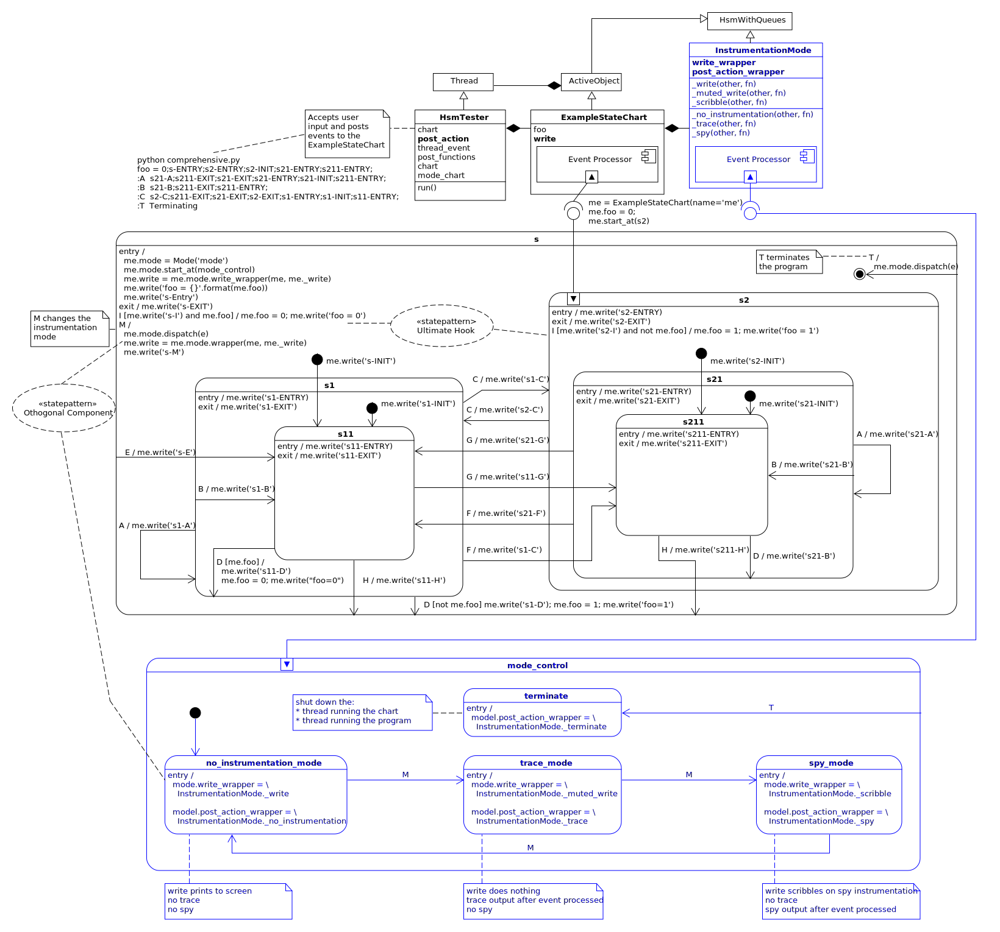

.. _comprehensive-comprehensive:

Comprehensive
=============

Here is a statechart you can play with.  Click on the diagram to see a bigger
version of it.

It hasn't been instrumented, but ``write`` statements have been placed all over
its HSM so you can see when events activate its different parts.

.. image:: _static/comprehensive_no_instrumentation.svg
    :target: _static/comprehensive_no_instrumentation.pdf
    :class: scale-to-fit

The `code to interact with this design can be found here
<https://github.com/aleph2c/miros/blob/master/examples/comprehensive_no_instrumentation.py>`_,
and to run it, type:

.. code-block:: shell

   python comprehensive_no_instrumentation.py
   foo = 0;s-ENTRY;s2-ENTRY;s2-INIT;s21-ENTRY;s211-ENTRY;
   :C  s2-C;s211-EXIT;s21-EXIT;s2-EXIT;s1-ENTRY;s1-INIT;s11-ENTRY;
   :C  s1-C;s11-EXIT;s1-EXIT;s2-ENTRY;s2-INIT;s21-ENTRY;s211-ENTRY;
   :G  s21-G;s211-EXIT;s21-EXIT;s2-EXIT;s1-ENTRY;s11-ENTRY;
   :E  s-E;s11-EXIT;s1-EXIT;s1-ENTRY;s11-ENTRY;
   :D  s1-D;foo = 1;s11-EXIT;s1-EXIT;s-INIT;s1-ENTRY;s11-ENTRY;
   :D  s11-D;foo = 0;s11-EXIT;s1-INIT;s11-ENTRY;
   :T
   Terminating

Comprehensive with Instrumentation
==================================

It's inconvenient to leave ``write`` statements all over your code while you
troubleshoot it, so miros comes with two different types of instrumentation
built in.  The instrumentation allows you to query the chart as if the write
statements were written on every transition and hook.

To enable this instrumentation, you place the ``spy_on`` decorator above your
state call back functions.

Here is another design (click on it to see a bigger version of it), containing
the same comprehensive chart described in the previous section, but with an
additional ``M`` signal.  The ``M`` signal causes the chart to switch from
``normal`` to ``trace`` to ``spy`` and back to ``normal`` mode.

In ``normal`` mode, the write statements work as they did in the previous
un-instrumented design.  In ``trace`` mode the trace instrumentation is shown
after your chart reacts to an event and the ``write`` methods are muted, so
nothing is printed to the screen.  In ``spy`` mode the ``write`` methods write
their contents into the ``spy`` stream then the full ``spy`` instrumentation is
shown after the chart reacts to an event.

The design was also adjusted to include the ``T``, terminate event within the
``model_control`` statemachine managing the instrumentation mode of the chart.
At any time you can terminate the program by sending a ``T`` event.

The `code to interact with this design can be found here
<https://github.com/aleph2c/miros/blob/master/examples/comprehensive.py>`_, and
to run it, type:

.. code-block:: shell
  :emphasize-lines: 7, 10

   python comprehensive.py

   foo = 0;s-ENTRY;s2-ENTRY;s2-INIT;s21-ENTRY;s211-ENTRY;
   n:C  s2-C;s211-EXIT;s21-EXIT;s2-EXIT;s1-ENTRY;s1-INIT;s11-ENTRY;
   n:D  s1-D;foo = 1;s11-EXIT;s1-EXIT;s-INIT;s1-ENTRY;s11-ENTRY;
   n:D  s11-D;foo = 0;s11-EXIT;s1-INIT;s11-ENTRY;
   n:M
   t:C  [2019-02-26 07:05:02.937057] [me] e->C() s11->s211
   t:C  [2019-02-26 07:05:04.933100] [me] e->C() s211->s11
   t:M
   - - - - - - - - - - - - - - - - - - - - - - - - - - - - - - - - - - -
   M:s11
   M:s1
   M:s
   write('s-M')
   M:s:HOOK
   <- Queued:(0) Deferred:(0)
   - - - - - - - - - - - - - - - - - - - - - - - - - - - - - - - - - - -
   s:I
   - - - - - - - - - - - - - - - - - - - - - - - - - - - - - - - - - - -
   I:s11
   I:s1
   I:s
   write('s-I')
   I:s:HOOK
   <- Queued:(0) Deferred:(0)
   - - - - - - - - - - - - - - - - - - - - - - - - - - - - - - - - - - -
   s:T  Terminating

.. note::

  Mode changes are highlighted.

The design uses the orthogonal component pattern to build an HSM within an HSM;
the ``mode_control`` is built in the entry condition of the ``s`` state, and its
events are dispatched to it using the ``M`` and ``T`` hooks of the ``s`` state.

The ``post_action`` method of the HsmTester thread is controlled by the
``mode_control`` state, as is the ``write`` method of the ExampleStateChart.

The ``I`` event is an example of the ultimate hook pattern, and pay special
attention to how ``D`` behaves while in the ``s11`` state.
