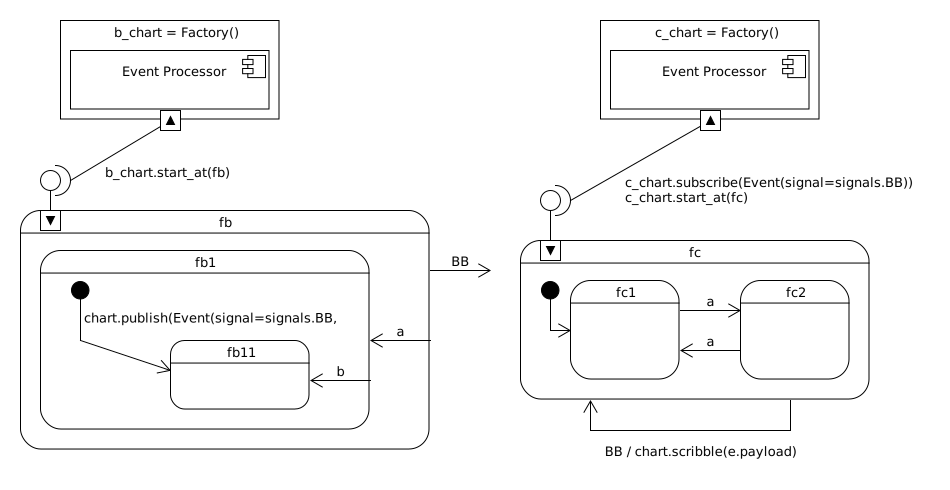

.. epigraph::

   A prophet is not someone with special visions, just someone blind to most of what others see.

   -- Nassim Nicholas Taleb

.. _interactingcharts-interacting-statecharts:

Interacting Statecharts (Same Machine)
======================================

.. _interactingcharts-a-simple-example:

A Simple Example
----------------
The Miros library makes concurrency trivial.  You build up an active object,
provide it with a starting state (with its connected map).  Then you post
events to it.

If it needs to communicate with other active objects it publishes an event with
a payload containing its information.  If an active object is interested in
information published by another active object, it would subscribe to that
event.  That's it.

Everything is managed in the background with threads and queues.  There are no
shared variables.  It is up to you not to busy wait within your state methods
or callback methods.

Here is a very simple example:

Let's begin by importing the required libraries:

.. code-block:: python
  :emphasize-lines: 1

  from miros import Factory
  from miros import signals, Event, return_status
  import time

We will build up these charts using a :ref:`factory<recipes-creating-a-state-method-from-a-factory>` (which is a type of active object).  Now let's work on the ``b_chart``, I like to start with a picture:

.. code-block:: python
  :emphasize-lines: 5-17

  from miros import Factory
  from miros import signals, Event, return_status
  import time

  #
  #
  #
  #  +------- fb --------------s-----+
  #  |  +---- fb1 -------t-------+   |
  #  |  | i/pub(BB)              |   l --> BB
  #  |  |  +- fb11---------+     |   |
  #  |  |  |               |     |   |
  #  |  |  |               <-b-+ <-a-+
  #  |  |  +---------------+   +-+   |
  #  |  +------------------------+   |
  #  +-------------------------------+
  #

Since we are using a factory, we write up some callback functions which will be
placed on the diagram as we build it out:

.. code-block:: python
  :emphasize-lines: 19-20, 22-23, 25-26, 28-31
  :linenos:

  from miros import Factory
  from miros import signals, Event, return_status
  import time

  #
  #
  #
  #  +------- fb --------------s-----+
  #  |  +---- fb1 -------t-------+   |
  #  |  | i/pub(BB)              |   l --> BB
  #  |  |  +- fb11---------+     |   |
  #  |  |  |               |     |   |
  #  |  |  |               <-b-+ <-a-+
  #  |  |  +---------------+   +-+   |
  #  |  +------------------------+   |
  #  +-------------------------------+
  #

  def trans_to_fb(chart, e):
    return chart.trans(fb)

  def trans_to_fb1(chart, e):
    return chart.trans(fb1)

  def trans_to_fb11(chart, e):
    return chart.trans(fb11)

  def publish_BB(chart, e):
    chart.publish(Event(signal=signals.BB,
      payload="information from b_chart riding within the BB signal"))
    return return_status.HANDLED

The highlighted code describes the callback signal methods that will be linked
into ``b_chart``.  Pay special attention to lines 29-31.  It is here that we
will :ref:`publish<recipes-publishing-event-to-other-active-objects>` a ``BB``
signal to the active fabric which connects all of the active objects in the
system.  If another active object has subscribed to this ``BB`` signal it will
receive this event with this payload.

Now let's use the factory and build the ``b_chart``.

.. code-block:: python
  :emphasize-lines: 33-36, 38-41, 43-44, 46-48

  from miros import Factory
  from miros import signals, Event, return_status
  import time

  #
  #
  #
  #  +------- fb --------------s-----+
  #  |  +---- fb1 -------t-------+   |
  #  |  | i/pub(BB)              |   l --> BB
  #  |  |  +- fb11---------+     |   |
  #  |  |  |               |     |   |
  #  |  |  |               <-b-+ <-a-+
  #  |  |  +---------------+   +-+   |
  #  |  +------------------------+   |
  #  +-------------------------------+
  #

  def trans_to_fb(chart, e):
    return chart.trans(fb)

  def trans_to_fb1(chart, e):
    return chart.trans(fb1)

  def trans_to_fb11(chart, e):
    return chart.trans(fb11)

  def publish_BB(chart, e):
    chart.publish(Event(signal=signals.BB,
      payload="information from b_chart riding within the BB signal"))
    return return_status.HANDLED

  b_chart = Factory('b_chart')
  fb = b_chart.create(state='fb'). \
          catch(signal=signals.a, handler=trans_to_fb1). \
          to_method()

  fb1 = b_chart.create(state='fb1'). \
          catch(signal=signals.b, handler=trans_to_fb11). \
          catch(signal=signals.INIT_SIGNAL, handler=publish_BB). \
          to_method()

  fb11 = b_chart.create(state='fb11'). \
          to_method()

  b_chart.nest(fb, parent=None). \
          nest(fb1, parent=fb). \
          nest(fb11, parent=fb1)

Now that we have built the ``b_chart`` let's build out the ``c_chart``:

.. code-block:: python
  :emphasize-lines: 51-100
  :linenos:

  from miros import Factory
  from miros import signals, Event, return_status
  import time

  #
  #
  #
  #  +------- fb --------------s-----+
  #  |  +---- fb1 -------t-------+   |
  #  |  | i/pub(BB)              |   l --> BB
  #  |  |  +- fb11---------+     |   |
  #  |  |  |               |     |   |
  #  |  |  |               <-b-+ <-a-+
  #  |  |  +---------------+   +-+   |
  #  |  +------------------------+   |
  #  +-------------------------------+
  #

  def trans_to_fb(chart, e):
    return chart.trans(fb)

  def trans_to_fb1(chart, e):
    return chart.trans(fb1)

  def trans_to_fb11(chart, e):
    return chart.trans(fb11)

  def publish_BB(chart, e):
    chart.publish(Event(
      signal=signals.BB,
        payload="information from b_chart riding within the BB signal"))
    return return_status.HANDLED

  b_chart = Factory('b_chart')
  fb = b_chart.create(state='fb'). \
          catch(signal=signals.a, handler=trans_to_fb1). \
          to_method()

  fb1 = b_chart.create(state='fb1'). \
          catch(signal=signals.b, handler=trans_to_fb11). \
          catch(signal=signals.INIT_SIGNAL, handler=publish_BB). \
          to_method()

  fb11 = b_chart.create(state='fb11'). \
          to_method()

  b_chart.nest(fb, parent=None). \
          nest(fb1, parent=fb). \
          nest(fb11, parent=fb1)

  def trans_to_fc(chart, e):
    return chart.trans(fc)

  def trans_to_fc1(chart, e):
    return chart.trans(fc1)

  def bb_handler(chart, e):
    status = return_status.UNHANDLED
    if(e.signal == signals.BB):
      chart.scribble(e.payload)
      status = chart.trans(fc)
    return status

  def trans_to_fc2(chart, e):
    return chart.trans(fc2)

  #
  #
  #
  #        +------------------ fc ---------------+
  #        |   +----- fc1----+   +-----fc2-----+ |
  #        | * |             |   |             | +----+
  #        | | |             +-a->             | |    |
  #        | +->             <-a-+             | |    BB
  #        |   |             |   |             | |    |
  #        |   |             |   |             | <----+
  #        |   +-------------+   +-------------+ |
  #        +-------------------------------------+
  #

  c_chart = Factory('c_chart')
  fc = c_chart.create(state='fc'). \
        catch(signal=signals.INIT_SIGNAL, handler=trans_to_fc1). \
        catch(signal=signals.BB, handler=bb_handler). \
        to_method()

  fc1 = c_chart.create(state='fc1'). \
        catch(signal=signals.a, handler=trans_to_fc2). \
        to_method()

  fc2 = c_chart.create(state='fc2'). \
        catch(signal=signals.a, handler=trans_to_fc1). \
        to_method()

  c_chart.nest(fc,  parent=None). \
          nest(fc1, parent=fc). \
          nest(fc2, parent=fc)

  # subscribe to BB signals sent to the active fabric
  c_chart.subscribe(Event(signal=signals.BB))

Pay special attention to the last line.  This is where the ``c_chart`` is
:ref:`subscribing<recipes-subscribing-to-an-event-posted-by-another-active-object>`
to the ``BB`` signal.  I forgot to add this in the example and it took me a
long time to figure out why the statechart was not working. :)

The actual ``BB`` event handler for this signal is described on lines 57-62.
We see there that we follow the typical rules for structuring a state method.
It did not have to be written this way, it could have been written more
concisely as:

.. code-block:: python

  def bb_handler(chart, e):
    chart.scribble(e.payload)
    return chart.trans(fc)

How you write it is up to you, just ensure that you return the correct
:ref:`return_status<recipes-what-a-state-does-and-how-to-structure-it>` type.
In both examples we use the :ref:`scribble method<recipes-scribble-on-the-spy>`
so that we can write the ``BB`` event's payload directly onto the
:ref:`spy<recipes-using-the-spy>`.

Now that the charts are written, let's turn them on and see what happens:

.. code-block:: python
  :emphasize-lines: 101-104, 106-110

  from miros import Factory
  from miros import signals, Event, return_status
  import time

  #
  #
  #
  #  +------- fb --------------s-----+
  #  |  +---- fb1 -------t-------+   |
  #  |  | i/pub(BB)              |   l --> BB
  #  |  |  +- fb11---------+     |   |
  #  |  |  |               |     |   |
  #  |  |  |               <-b-+ <-a-+
  #  |  |  +---------------+   +-+   |
  #  |  +------------------------+   |
  #  +-------------------------------+
  #

  def trans_to_fb(chart, e):
    return chart.trans(fb)

  def trans_to_fb1(chart, e):
    return chart.trans(fb1)

  def trans_to_fb11(chart, e):
    return chart.trans(fb11)

  def publish_BB(chart, e):
    chart.publish(Event(signal=signals.BB,
      payload="information from b_chart riding within the BB signal"))
    return return_status.HANDLED

  b_chart = Factory('b_chart')
  fb = b_chart.create(state='fb'). \
          catch(signal=signals.a, handler=trans_to_fb1). \
          to_method()

  fb1 = b_chart.create(state='fb1'). \
          catch(signal=signals.b, handler=trans_to_fb11). \
          catch(signal=signals.INIT_SIGNAL, handler=publish_BB). \
          to_method()

  fb11 = b_chart.create(state='fb11'). \
          to_method()

  b_chart.nest(fb, parent=None). \
          nest(fb1, parent=fb). \
          nest(fb11, parent=fb1)

  def trans_to_fc(chart, e):
    return chart.trans(fc)

  def trans_to_fc1(chart, e):
    return chart.trans(fc1)

  def bb_handler(chart, e):
    status = return_status.UNHANDLED
    if(e.signal == signals.BB):
      chart.scribble(e.payload)
      status = chart.trans(fc)
    return status

  def trans_to_fc2(chart, e):
    return chart.trans(fc2)

  #
  #
  #
  #        +------------------ fc ---------------+
  #        |   +----- fc1----+   +-----fc2-----+ |
  #        | * |             |   |             | +----+
  #        | | |             +-a->             | |    |
  #        | +->             <-a-+             | |    BB
  #        |   |             |   |             | |    |
  #        |   |             |   |             | <----+
  #        |   +-------------+   +-------------+ |
  #        +-------------------------------------+
  #

  c_chart = Factory('c_chart')
  fc = c_chart.create(state='fc'). \
        catch(signal=signals.INIT_SIGNAL, handler=trans_to_fc1). \
        catch(signal=signals.BB, handler=bb_handler). \
        to_method()

  fc1 = c_chart.create(state='fc1'). \
        catch(signal=signals.a, handler=trans_to_fc2). \
        to_method()

  fc2 = c_chart.create(state='fc2'). \
        catch(signal=signals.a, handler=trans_to_fc1). \
        to_method()

  c_chart.nest(fc,  parent=None). \
          nest(fc1, parent=fc). \
          nest(fc2, parent=fc)

  # subscribe to BB signals sent to the active fabric
  c_chart.subscribe(Event(signal=signals.BB))

  # Start up the charts and post an event to see # how they interact
  c_chart.start_at(fc)
  b_chart.start_at(fb)
  b_chart.post_fifo(Event(signal=signals.a))

  time.sleep(0.01)
  print(c_chart.trace())
  pp(c_chart.spy())
  print(b_chart.trace())
  pp(b_chart.spy())

Here start the ``c_chart`` at its ``fc`` state and start the ``b_chart`` on
its ``fb`` state, then we post an event with an ``a`` signal to ``chart_b``.
Let's look at the picture again so we can see what should happen.

From visual inspection of the ``b_chart`` we would expect an ``a`` signal to
cause a transition into the ``fb1`` state, then run its ``init`` signal.  This
would cause the ``chart.publish(Event(signal=signals.BB, payload="information
from b_chart riding within the BB signals"))`` code to run.  Then it would
transition into state ``fb11``.

Looking at the other ``c_chart`` and knowing it started in ``fc``, we could
expect the ``BB`` signal would cause an exit from ``fc1``, and exit from ``fc``
and then an entry into ``fc``.  As for when it would run the code on the ``BB``
signal is not obvious.  Upon entering the ``fc`` state it would run its
``init`` signal and enter ``fc1``.  That's a lot of behavioral complexity packed
into a little bit of code; all mapped and easy to understand.

Let's look at the output of our instrumentation:

.. code-block:: shell
  :emphasize-lines: 15

  [2017-12-07 12:15:53.521431] [c_chart] e->start_at() top->fc1
  [2017-12-07 12:15:53.503913] [c_chart] e->BB() fc1->fc1

  ['SUBSCRIBING TO:(BB, TYPE:fifo)',
   'START',
   'SEARCH_FOR_SUPER_SIGNAL:fc',
   'ENTRY_SIGNAL:fc',
   'INIT_SIGNAL:fc',
   'SEARCH_FOR_SUPER_SIGNAL:fc1',
   'ENTRY_SIGNAL:fc1',
   'INIT_SIGNAL:fc1',
   '<- Queued:(0) Deferred:(0)',
   'BB:fc1',
   'BB:fc',
   'information from b_chart riding within the BB signal',
   'EXIT_SIGNAL:fc1',
   'EXIT_SIGNAL:fc',
   'ENTRY_SIGNAL:fc',
   'INIT_SIGNAL:fc',
   'SEARCH_FOR_SUPER_SIGNAL:fc1',
   'ENTRY_SIGNAL:fc1',
   'INIT_SIGNAL:fc1',
   '<- Queued:(0) Deferred:(0)']

  [2017-12-07 12:15:53.521431] [b_chart] e->start_at() top->fb
  [2017-12-07 12:15:53.503913] [b_chart] e->a() fb->fb1

  ['START',
   'SEARCH_FOR_SUPER_SIGNAL:fb',
   'ENTRY_SIGNAL:fb',
   'INIT_SIGNAL:fb',
   '<- Queued:(0) Deferred:(0)',
   'a:fb',
   'SEARCH_FOR_SUPER_SIGNAL:fb1',
   'ENTRY_SIGNAL:fb1',
   'INIT_SIGNAL:fb1',
   'PUBLISH:(BB, PRIORITY:1000)',
   '<- Queued:(0) Deferred:(0)']

We see the ``c_chart`` trace followed by its spy.  The highlighted line
shows us where the call on ``BB`` was made prior to the chart responding to the
signal.  This is explained in greate detail in :ref:`hacking to
learn<scribbleexample-hacking-to-learn-the-deeper-dynamics>`.

Other than that, the chart's are interacting exactly as we expect them to.  If
I was working within a team and had to explain this behavior to someone not
directly involved in the software, I would use the traces and the
:ref:`sequence<recipes-drawing-a-sequence-diagram>` tool and draw my collegue a
sequence diagram:

.. code-block:: shell
  :emphasize-lines: 1

  # hot key in vim draws the pictures below
  [2017-12-07 12:15:53.521431] [c_chart] e->start_at() top->fc1
  [2017-12-07 12:15:53.503913] [c_chart] e->BB() fc1->fc1
  [2017-12-07 12:15:53.521431] [b_chart] e->start_at() top->fb
  [2017-12-07 12:15:53.503913] [b_chart] e->a() fb->fb1

  [ Chart: c_chart ] (?)
       top          fc1
        +start_at()->|
        |    (?)     |
        |            +
        |             \ (?)
        |             BB()
        |             /
        |            <

  [ Chart: b_chart ] (?)
       top          fb           fb1
        +start_at()->|            |
        |    (?)     |            |
        |            +----a()---->|
        |            |    (?)     |

Then I would over-write the question marks with numbers and reference those
numbers in my documentation.

.. _Javascript The good Parts: http://shop.oreilly.com/product/9780596517748.do
.. _Douglas Crockford: https://www.crockford.com/
.. _Lint: http://www.jslint.com/
.. _Evaluating Weapons Sorting the Good from the Bad: http://pogoarchives.org/labyrinth/09-sprey-w-covers.pdf
.. [1] Pierre M. Sprey `Evaluating Weapons Sorting the Good from the Bad`_
.. [#f1] They are named ``b`` and ``c`` because these are the topological names given to them on page 178 of "Practical UML STATECHARTS in C/C++"
