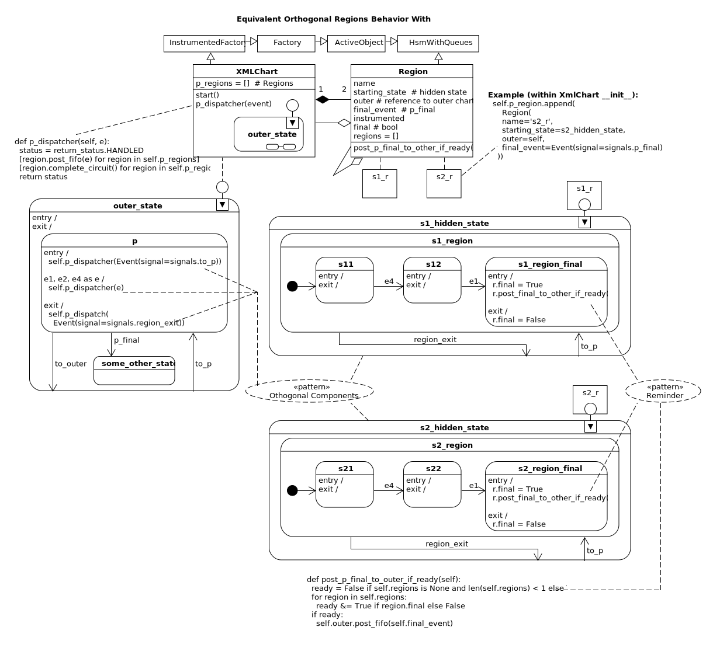

.. _othogonalregions-othogonal-regions-with-miros:

Orthogonal Regions
==================

The `code for this example <https://github.com/aleph2c/miros/blob/master/examples/xml_chart.py>`_ can be found here.

As your products scale and your designs get more complicated you will experience
`State space explosion
<https://www.coursera.org/lecture/system-validation-software-protocols/guidelines-to-avoid-the-state-space-explosion-problem-O5jEd>`_.
The number of states that are needed to make your system combinatorially mix so
that it becomes impractical to test all paths of possible behaviour.

**State space explosion** also describes a situation where you can no longer
*comprehend* your design because it has become too complicated. Your chosen
design abstraction has been outpaced by the size of your problem, and you can't
compress the picture of your system into a small enough diagram to understand
it.

This scale-to-bafflement rate is dependent upon your choice of abstraction.  It
will happen quickly if you use finite state machines as your primary design
tool.  You can hold it off a bit longer by switching to a hierarchical state
machine design approach; common behaviours are mapped into outer states, but
this can only take you so far.  At some point, you must chunk your design into
concurrent pieces that interact.

Concurrent state machines mix combinatorially, giving you an abstraction which
scales without needing pages and pages to draw out your idea.  Concurrent
statecharts give you **state space compression**.

David Harel's original statechart paper addressed state space explosion by
inventing the **orthogonal region**.  Orthogonal regions pictorially describe
concurrency *within* an HSM.

But the orthogonal region abstraction was not supported in Miro Samek's
statechart algorithm (used by this library), for performance
reasons.  Instead he offered up :ref:`orthogonal components
<patterns-orthogonal-component>`; HSMs acting as variables within other HSMs.

In this example, I will show you what an orthogonal region is and why you would
use it. Then we will map the orthogonal region behaviour into a Python program
using existing miros features.  We will be using the :ref:`orthogonal components
<patterns-orthogonal-component>` mixed with a Factory to satisfy an "orthogonal
regions" behavioural description written as part of the `SCXML standard
<https://www.w3.org/TR/scxml/>`_.

Our example will be instrumented so we can see it working as it runs.

The SCXML standard describes an orthogonal region statechart similar to this:

.. image:: _static/xml_chart_1.svg
    :target: _static/xml_chart_1.pdf
    :class: scale-to-fit

.. note::

  Click the above diagram to see a larger version.

  The parallel `CSXML parallel regions document
  <https://www.w3.org/TR/scxml/#CoreIntroduction>`_ is full of mistakes, but
  written well enough to describe how orthogonal regions should behave.

Let's break the above UML diagram away from its supporting `XML
<https://github.com/aleph2c/miros/blob/master/examples/xml_chart.xml>`_:

.. image:: _static/xml_chart_2.svg
    :target: _static/xml_chart_2.pdf
    :class: noscale-center

The dotted line describes two orthogonal regions within the ``p`` state which
will both become active when the ``p`` state is entered.  This means that when
the ``p`` state is entered, the init events will ensure that both ``S11`` and
``S21`` will *both* become active states.  In the case that the statechart
receives a ``to_outer`` event while in the ``p`` state, the exit behaviour in
both orthogonal regions will be followed until the ``p`` state is exited:
``S11`` exit code will run, the ``S1 Region`` exit code will run, then the
``S21`` exit code will run and the ``S2 Region`` exit code will run.

.. note::

  David Harel's statechart paper does not describe regions as having entry and
  exit conditions.  If you do not want to support such a thing (because they may
  not appear in a standard), don't add them to your design.

The power of the orthogonal region comes from its multiplicative feature.  The
number of state combinations within ``p`` is the product of the number of states
in each region: ``3*3 = 9`` (counting the final pseudostates):

.. note::

  The Active State combinations within ``p`` are:

  (S11, S21)
  (S11, S22)
  (S11, S2_final)
  (S12, S21)
  (S12, S22)
  (S12, S2_final)
  (S1_final, S21)
  (S1_final, S22)
  (S1_final, S2_final)

  This multiplicative property holds true for any concurrency mechanism,
  whether it be concurrent statecharts (with publish/subscribe) or with the
  orthogonal component pattern.

David Harel's way of drawing concurrency fits nicely onto a diagram.  Moreover,
to have concurrency (with its multiplicative ability to compact design
complexity) in part of the design while having it go away in another part of the
design is a beautiful form of **state space compression**.

If you take the time to read the `expected behaviour for orthogonal regions in
the CSXML standard <https://www.w3.org/TR/scxml/#CoreIntroduction>`_ you will
see that a "final" event can be defined when all of the regions within ``p``
have entered their final state (the circle with the black dot).  The diagram's
``p_final`` arrow describes what should happen when both the ``S1`` and ``S2``
regions have finished.

.. _othogonalregions-using-orthogonal-regions-with-miros:

Constructing Orthogonal Regions with Miros
^^^^^^^^^^^^^^^^^^^^^^^^^^^^^^^^^^^^^^^^^^

We will write some Python code which maps the miros feature set onto this design
such that its behaviours match those described in the SCXML standard.

.. image:: _static/xml_chart_2.svg
    :target: _static/xml_chart_2.pdf
    :class: noscale-center

We will verify that our design works by:

* starting the statechart and confirming it has moved into the ``outer_state``
* posting a ``to_p`` event and confirm that both ``S11`` and ``S21``
  are eventually entered.
* posting an ``e4`` and confirming that ``S11`` transitions into ``S12`` but that the
  other active region remains in the ``S21`` state.
* posting an ``e1`` and confirming that ``S12`` transitions into the S1 Region final
  state and that ``S12`` transitions into ``S22`` in the S2 Region.
* posting a ``to_outer`` and confirming that the two active states collapse into
  one active state, and that all of the expected exit conditions are run;  In
  Region S1, the S1 region exit condition is run and in Region S2, the exit
  condition for ``S22`` is run then the exit condition for Region S2 is run.
  After the ``p`` region has been exited, the statechart will ultimately land in
  the ``outer_state``.
* re-posting ``e4`` and then ``e1`` with the same expected behaviour listed above.
* posting an ``e2`` event which while S1 Region is in its final state and the S2
  region is in its ``S22`` state.  This ``e2`` event will cause the S2 Region
  to enter its final state too.  Since both final states have been entered, the
  chart should post a ``p_final`` to itself.  This will cause the exit
  conditions of the S1 Region and S2 Region to trigger, the two active states
  will collapse into one.  The ``p_final`` event will cause a transition into
  the ``some_other_state`` who's entry condition should trigger.

We would like the statechart to describe its behaviour in a log file, so that we can
confirm it is working.

The design should be sub-classable in the case that we want to change its
behaviour.

As far as I know there is no UML shorthand for two final states in a orthogonal
region conspiring to post an event to itself, so our design diagram will
explicitly describe this behaviour in code.

.. _othogonalregions-high-level-strategy-to-build-orthogonal-regions-with-miros:

High Level Strategy to Build Orthogonal Regions with miros
^^^^^^^^^^^^^^^^^^^^^^^^^^^^^^^^^^^^^^^^^^^^^^^^^^^^^^^^^^

.. image:: _static/xml_chart_2.svg
    :target: _static/xml_chart_2.pdf
    :class: noscale-center

The statechart will have one thread, and the orthogonal regions described within
``p`` will be driven by this thread using the orthogonal component pattern.
Each region will be an object derived from the ``HsmWithQueues`` class, which
provides all of the HSM dynamics and access to the ``post_fifo`` and
``complete_circuit`` methods.  While in the ``p`` state, the outer statechart
will dispatch ``e1``, ``e2`` and ``e4`` by posting into the queues of the S1
Region and the S2 Region.

Each Region will be given an ``outer`` and a ``regions`` attribute.  The
``outer`` attribute will be a reference to the outer statechart running the
thread, which will be an object derived from the Factory class.  Using this
``outer`` attribute, either region can post an event back into its outer
statechartThis will be needed for the ``p_final`` signal to work.  The
``regions`` attribute will contain references to the other regions sharing the
same orthogonal region area of the chart.  Information about the other region's
final state will be needed to determine if it is time to post the ``p_final``
event into the ``outer`` statechart.  The ``outer`` attribute will also be used
by a region to channel its instrumentation stream back into the main
statechart's instrumentation stream.

Two hidden states will be constructed, one for each region.  This is needed so
that the regions can exit without re-triggering their ``init`` signals.  For
instance if Region S2 was in ``S22`` when outer chart received a ``to_outer``
event, we would expect this region to run its ``S22`` exit condition, then run
the Region S2 exit condition then *stop*.  However, if we only caused a
transition into the Region S2 state, the region's init signal would re-fire and
the region would enter the ``S21`` state.  This is not what we want, so we
invent a hidden outer state for the region.  To get the desired exit behaviours
resulting from the ``to_outer`` event we trigger a second, hidden-event which
will cause a transition into the hidden outer state for the region.  By doing
this the exit conditions for a region will work as expected.

To make the instrumentation legible, we will wrap some code around the
``spy_on`` decorator used to instrument the S1 and S2 regions. This code will
route a region's spy instrumentation into the main statechart's spy instrumentation
stream.  Since we are doing this we can remove any references to hidden outer
states to avoid cluttering up our spy stream.  The instrumentation will be written
to a log file by registering a spy function handler with the main state chart.

The code used to start the chart, and its regions will be written as a method
of the main statechart.  Each of the regions will be pre-started in their hidden
states to keep the code needed to enter the ``p`` state as simple as possible.
By pulling the start code out of the ``__init__`` method of the main chart, we
can subclass the main chart without starting its thread when ``super`` is called
within the subclass' ``__init__`` method.

.. _othogonalregions-miros-design:

Orthogonal Regions Using Orthogonal Components
^^^^^^^^^^^^^^^^^^^^^^^^^^^^^^^^^^^^^^^^^^^^^^

The behaviour described with this diagram:

.. image:: _static/xml_chart_2.svg
    :target: _static/xml_chart_2.pdf
    :class: noscale-center

Can be manifested this way using miros:

If you would like to compare the diagram to the code, the `code is
available here <https://github.com/aleph2c/miros/blob/master/examples/xml_chart.py>`_.

To run the code:

.. code-block:: shell

  python3 ./examples/xml_chart.py

This will generate an instrumentation stream in ``xml_chart.log``.

To view the instrumentation as the code is running:

.. code-block:: shell

  tail -f ./examaples/xml_chart.log.

Now I will do a walk through of the code starting from the orthogonal regions
then I will talk about the XMLChart (right to left on the diagram).

.. _othogonalregions-orthogonal-components-as-regions:

Orthogonal Components As Regions
--------------------------------

The ``Regions`` class will be derived from the ``HsmWithQueues`` class.

.. image:: _static/xml_chart_4.svg
    :target: _static/xml_chart_4.pdf
    :class: scale-to-fit

The two region orthogonal components will be constructed in the ``__init__`` method of the
``XMLChart`` like so:

.. code-block:: python
  :emphasize-lines: 5-24

   class XmlChart(InstrumentedFactory):
     def __init__(self, name, live_trace=None, live_spy=None):
     super().__init__(name, live_trace=live_trace, live_spy=live_spy)

     self.p_regions = []
     self.p_regions.append(
       Region(
         name='s1_r',
         starting_state=s1_hidden_region,
         outer=self,
         final_event=Event(signal=signals.p_final),
       )
     )
     self.p_regions.append(
       Region(
         name='s2_r',
         starting_state=s2_hidden_region,
         outer=self,
         final_event=Event(signal=signals.p_final),
       )
     )
     for region in self.p_regions:
       for _region in self.p_regions:
         region.regions.append(_region)
     # ...

Each region will have to have a reference to its outer state chart and a
reference to all regions.  You can see this in the UML diagram as white-diamond
arrows (Aggregation arrows in UML-speak).  The white diamond arrow describes a
"has a" relationship:  A region "has many" other regions and "has an" outer
state chart.  These relationships are established in the ``__init__`` code of
the ``XMLChart`` which constructs each region object (see the above listing).

The reference to the other regions is needed to determine if all regions are in
their final state.  If they are, then ``p_final`` event must be placed in the
outer statechart's event queue.  To do this a reference to the outer statechart
is required.

A region's state machine will be defined in the flat method style and will be
instrumented with the ``@instrumented`` decorator which will be :ref:`described
shortly <othogonalregions-instrumentation>`.

.. image:: _static/xml_chart_5.svg
    :target: _static/xml_chart_5.pdf
    :class: noscale-center

Here is the S1 Region's HSM code:

.. code-block:: python

   @instrumented
   def s1_hidden_region(r, e):
     '''A hidden state which permits the exit feature of the
        s1_region to work.

       **Note**:
          This will not appear in the spy instrumentation

       **Args**:
          | ``p`` (HsmWithQueues): Hsm with queues with no thread
          | ``e`` (Event): event

       **Returns**:
          (type): return_status
     '''
     status = return_status.UNHANDLED
     if(e.signal == signals.to_p):
       status = r.trans(s1_region)
     else:
       r.temp.fun = r.top
       status = return_status.SUPER
     return status

   @instrumented
   def s1_region(r, e):
     status = return_status.UNHANDLED
     if(e.signal == signals.ENTRY_SIGNAL):
       status = return_status.HANDLED
     elif(e.signal == signals.INIT_SIGNAL):
       status = r.trans(s11)
     elif(e.signal == signals.region_exit):
       status = r.trans(s1_hidden_region)
     else:
       r.temp.fun = s1_hidden_region
       status = return_status.SUPER
     return status

   @instrumented
   def s11(r, e):
     status = return_status.UNHANDLED
     if(e.signal == signals.ENTRY_SIGNAL):
       status = return_status.HANDLED
     elif(e.signal == signals.e4):
       status = r.trans(s12)
     elif(e.signal == signals.EXIT_SIGNAL):
       status = return_status.HANDLED
     else:
       r.temp.fun = s1_region
       status = return_status.SUPER
     return status

   @instrumented
   def s12(r, e):
     status = return_status.UNHANDLED
     if(e.signal == signals.ENTRY_SIGNAL):
       status = return_status.HANDLED
     elif(e.signal == signals.INIT_SIGNAL):
       status = return_status.HANDLED
     elif(e.signal == signals.e1):
       status = r.trans(s1_region_final)
     elif(e.signal == signals.EXIT_SIGNAL):
       status = return_status.HANDLED
     else:
       r.temp.fun = s1_region
       status = return_status.SUPER
     return status

   @instrumented
   def s1_region_final(r, e):
     status = return_status.UNHANDLED
     if(e.signal == signals.ENTRY_SIGNAL):
       r.final = True
       r.post_p_final_to_outer_if_ready()
     elif(e.signal == signals.ENTRY_SIGNAL):
       r.final = False
     else:
       r.temp.fun = s1_region
       status = return_status.SUPER
     return status

The S2 Region state machine will be very similar to the above listing.

To start the regions, code will be added to the ``start`` method of the
``XMLChart`` class such that the ``XMLChart`` can be instantiated, *then* started like
this:

.. code-block:: python

  example = XmlChart(
    'parallel', live_spy=True, live_trace=True
  ).start()

The ``XMLChart`` ``start`` method will look like this:

.. code-block:: python

  def start(self):
    for region in self.p_regions:
      region.start_at(region.starting_state)

    super().start_at(self.outer_state)
    return self

The reason that the ``start_at`` methods are broken out of the ``__init__`` call
is to make the ``XMLChart`` subclassable.  It is important to tease apart the
class definition from code that starts a thread, otherwise the ``super`` keyword
can become :ref:`very dangerous later on <recipes-inheritance-and-starting-(factories)>`.
We don't want to call the ``start_at`` method from within the main function,
since we are trying to data-hide how the state machine works.

As previously mentioned, we pre-start the orthogonal regions into their hidden
states before they are needed to keep the ``p`` entry state code simple within
the ``XMLChart`` state machine.

The ``Regions`` class contains a name, a starting state so that a subclass
can change how it is used, a final_event so that the ``XMLChart`` class can
tell its components what event to fire when they are done.   It has an
instrumented attribute which can be set to False once we know the chart works
and we want to speed up the code and a ``final`` bool used to track if the
component is in its final state.  The regions list will contain a list to all
regions within ``p``, including a reference to itself.

.. image:: _static/xml_chart_4.svg
    :target: _static/xml_chart_4.pdf
    :class: scale-to-fit

Here is the ``Region`` class code:

.. code-block:: python

   class Region(HsmWithQueues):

     def __init__(self,
       name, starting_state, outer, final_event, instrumented=True):
       '''Region management for othogonal regions

       **Args**:
          | ``name`` (str): name of the region
          | ``starting_state`` (str): name of the starting
          |   state of the region
          | ``outer`` (Factory): The statechart which will be
          |   using this region.
          | ``final_event`` (Event): The event used to finalize
          |   the region.
          | ``instrumented=True`` (bool): Need if you want to
          |   view the spy instrumention

       **Returns**:
          (Region): a region in the statechart

       **Example(s)**:

       .. code-block:: python

         self.s1_region = Region(
           's1_r',
           outer=self,
           final_event=Event(signal=signals.p_final),
         )
         self.p_regions.append(self.s1_region)

       '''
       super().__init__()
       self.name = name
       self.starting_state = starting_state
       self.outer = outer
       self.final_event = final_event
       self.instrumented = instrumented

       self.final = False
       self.regions = []

     def post_p_final_to_outer_if_ready(self):
       ready = False if self.regions is None and len(self.regions) < 1 else True
       for region in self.regions:
         ready &= True if region.final else False
       if ready:
         self.outer.post_fifo(self.final_event)

The ``post_p_final_to_outer_if_ready`` worker function, iterates through all of
the regions and if they are all in a final state will post the final_event,
``p_final`` provided by an argument to the ``__init__`` function.  It is within
this worker function that we see how a region references other regions and uses
its reference to the outer statechart to post events to it.

.. _othogonalregions-the-instrumentedfactory:

The InstrumentedFactory
-----------------------

The ``XMLChart`` subclasses from the ``InstrumentedFactory``.

.. image:: _static/xml_chart_8.svg
    :target: _static/xml_chart_8.pdf
    :class: noscale-center

The ``InstrumentedFactory`` instruments a miros factory class.  It creates an
``xml_chart.log`` file then registers a spy and trace callback handler for the
statechart to use.

.. code-block:: python

   class InstrumentedFactory(Factory):
     def __init__(self, name, *, log_file=None, live_trace=None, live_spy=None):
       super().__init__(name)
       self.live_trace = False if live_trace == None else live_trace
       self.live_spy = False if live_spy == None else live_spy
       self.log_file = 'xml_chart.log' if log_file == None else log_file

       self.clear_log()

       logging.basicConfig(
         format='%(asctime)s %(levelname)s:%(message)s',
         filename=self.log_file,
         level=logging.DEBUG)

       self.register_live_spy_callback(partial(self.spy_callback))
       self.register_live_trace_callback(partial(self.trace_callback))

     def trace_callback(self, trace):
       '''trace without datetimestamp'''
       trace_without_datetime = re.search(r'(\[.+\]) (\[.+\].+)', trace).group(2)
       logging.debug("T: " + trace_without_datetime)

     def spy_callback(self, spy):
       '''spy with machine name pre-pending'''
       print(spy)
       logging.debug("S: [{}] {}".format(self.name, spy))

     def clear_log(self):
       with open(self.log_file, "w") as fp:
         fp.write("")

.. _othogonalregions-main-statechart-as-xmlchart:

Main Statechart as XMLChart
---------------------------

We call our main chart the ``XMLChart`` because we are deriving its behaviour
from the SCXML specification.  It doesn't actually consume or produce any XML.

The ``XMLChart`` has two ``Region`` orthogonal components which it defines in
its ``__init__`` method.

Here is the XMLChart written as Python:

.. code-block:: python
  :emphasize-lines: 100, 101

  class XmlChart(InstrumentedFactory):
    def __init__(self, name, live_trace=None, live_spy=None):
      '''Example of othogonal regions described in the CSXML
         standard

      **Args**:
         | ``name`` (type1):
         | ``live_trace=None``: enable live_trace feature?
         | ``live_spy=None``: enable live_spy feature?

      **Returns**:
         (type):

      **Example(s)**:

      .. code-block:: python

          example = XmlChart(
            'parallel', live_spy=True, live_trace=True
          ).start()

      '''
      super().__init__(name, live_trace=live_trace, live_spy=live_spy)

      self.p_regions = []
      self.p_regions.append(
        Region(
          name='s1_r',
          starting_state=s1_hidden_region,
          outer=self,
          final_event=Event(signal=signals.p_final),
        )
      )
      self.p_regions.append(
        Region(
          name='s2_r',
          starting_state=s2_hidden_region,
          outer=self,
          final_event=Event(signal=signals.p_final),
        )
      )
      for region in self.p_regions:
        for _region in self.p_regions:
          region.regions.append(_region)

      self.outer_state = self.create(state="outer_state"). \
        catch(signal=signals.ENTRY_SIGNAL,
          handler=self.outer_state_entry_signal). \
        catch(signal=signals.to_p,
          handler=self.outer_state_to_p). \
        to_method()

      self.p = self.create(state="p"). \
        catch(signal=signals.ENTRY_SIGNAL,
          handler=self.p_entry_signal). \
        catch(signal=signals.e1,
          handler=self.p_dispatcher). \
        catch(signal=signals.e2,
          handler=self.p_dispatcher). \
        catch(signal=signals.e4,
          handler=self.p_dispatcher). \
        catch(signal=signals.p_final,
          handler=self.p_p_final). \
        catch(signal=signals.EXIT_SIGNAL,
          handler=self.p_exit_signal). \
        catch(signal=signals.to_outer,
          handler=self.p_to_outer). \
        to_method()

      self.some_other_state = self.create(state="some_other_state"). \
        catch(signal=signals.ENTRY_SIGNAL,
          handler=self.some_other_state_entry_signal). \
        to_method()

      self.nest(self.outer_state, parent=None). \
        nest(self.p, parent=self.outer_state). \
        nest(self.some_other_state, parent=self.outer_state)

    def start(self):
      for region in self.p_regions:
        region.start_at(region.starting_state)
      super().start_at(self.outer_state)
      return self

    def outer_state_entry_signal(self, e):
      status = return_status.HANDLED
      return status

    def outer_state_to_p(self, e):
      status = self.trans(self.p)
      return status

    def p_entry_signal(self, e):
      status = return_status.HANDLED
      self.p_dispatcher(Event(signal=signals.to_p))
      return status

    def p_dispatcher(self, e):
      status = return_status.HANDLED
      [region.post_fifo(e) for region in self.p_regions]
      [region.complete_circuit() for region in self.p_regions]
      return status

    def p_p_final(self, e):
      status = self.trans(self.some_other_state)
      return status

    def p_exit_signal(self, e):
      status = return_status.HANDLED
      self.p_dispatcher(Event(signal=signals.region_exit))
      return status

    def p_to_outer(self, e):
      self.live_spy_callback("to_outer:p")
      status = self.trans(self.outer_state)
      return status

    def some_other_state_entry_signal(self, e):
      status = return_status.HANDLED
      return status

I have highlighted the two lines that will post events to the two orthogonal regions, then drive
those events through their respective HSMs.

Now that we see how the three HSMs are initialized and how they work, let's compare them
to the orthogonal regions design presented at the beginning of this essay:

.. image:: _static/xml_chart_7.svg
    :target: _static/xml_chart_7.pdf
    :class: scale-to-fit

We can mentally verify that the bottom design matches the top design by:

* starting the statechart and confirming it has moved into the ``outer_state``
* posting a ``to_p`` event and confirm that both ``S11`` and ``S21``
  are eventually entered.
* posting an ``e4`` and confirming that ``S11`` transitions into ``S12`` but that the
  other active region remains in the ``S21`` state.
* posting an ``e1`` and confirming that ``S12`` transitions into the S1 Region final
  state and that ``S12`` transitions into ``S22`` in the S2 Region.
* posting a ``to_outer`` and confirming that the two active states collapse into
  one active state, and that all of the expected exit conditions are run;  In
  Region S1, the S1 region exit condition is run and in Region S2, the exit
  condition for ``S22`` is run then the exit condition for Region S2 is run.
  After the ``p`` region has been exited, the statechart will ultimately land in
  the ``outer_state``.
* re-posting ``e4`` and then ``e1`` with the same expected behaviour listed above.
* posting an ``e2`` event which while S1 Region is in its final state and the S2
  region is in its ``S22`` state.  This ``e2`` event will cause the S2 Region
  to enter its final state too.  Since both final states have been entered, the
  chart should post a ``p_final`` to itself.  This will cause the exit
  conditions of the S1 Region and S2 Region to trigger, the two active states
  will collapse into one.  The ``p_final`` event will cause a transition into
  the ``some_other_state`` who's entry condition should trigger.

.. _othogonalregions-instrumentation:

Instrumentation: Hacking the spy_on Decorator
---------------------------------------------

We are mashing together a ``Factory`` and two ``HsmWithQueues`` derived-objects.
All of these objects can leave bread crumbs (spy streams) about what they have
done and when they did it.  We want these spy streams to be merged into one file
as all three objects are run together.

The :ref:`InstrumentedFactory <othogonalregions-the-instrumentedfactory>`
defines a ``spy_callback``, which will be used by the ``XMLChart`` to write its
spy stream into a log file.  Our goal is to have each region write its spy
stream to this same log file.  Each region has a reference back to the
``XMLChart`` object, and the ``XMLChart`` is derived from the
``InstrumentedFactory`` which means each region has a reference to the
``spy_callback``, which was defined by the ``InstrumentedFactory``.  So we
should be able to grab information out of a region's spy stream, adjust it, then
send it into the ``XMLChart`` spy stream as that information is being generated.
This way, the order of events will be preserved and we can retroactively confirm
our miros version of orthogonal regions is working as we would expect it to
work.

State methods used by an ``HsmWithQueues`` derived object (our regions) can be
instrumented by decorating them with the ``spy_on`` decorator provided by the
miros library.  The ``spy_on`` decorator is just a function wrapper.  So why
don't we wrap this wrapper with another wrapper, and force it to write its spy
information back into its outer chart like so:

.. code-block:: python
  :linenos:

  # ..
  from functools import wraps

  def instrumented(fn):
    @wraps(fn)
    def _pspy_on(chart, *args):
      if chart.instrumented:
        status = spy_on(fn)(chart, *args)
        for line in list(chart.rtc.spy):
          m = re.search(r'hidden_region', str(line))
          if not m:
            chart.outer.live_spy_callback(
              "{}::{}".format(chart.name, line))
        chart.rtc.spy.clear()
      else:
        e = args[0] if len(args) == 1 else args[-1]
        status = fn(chart, e)
      return status
    return _pspy_on

The above decorator accepts a function as an argument, then returns a new
function that uses the original function within it.  This decorator will be used
to wrap flat-state functions used by our regions.

In our case, we wrap the original function with a ``spy_on`` call so that its
instrumentation data structures are filled (line 8).  Then we iterate over this
instrumentation information and send it to the ``live_spy_callback`` that we
registered by the ``InstrumentedFactory`` (lines 9-13).  The hidden states are
added to make exit features work in our version of the orthogonal regions, but
we don't want to see anything about this in our spy stream, so we filter it out
with a regular expression (line 9-11).  When we are finished using the spy
information, we clear the list holding the instrumentation so that we don't
write it out the next time this decorator is called (line 14).

Once we know our chart is working, we can improve its performance by turning off
its instrumentation (line 7 and lines 15-17).

.. note::

  The miros library will only instrument decorators with a ``spy_on`` as part of
  their name, for this reason the ``_pspy_on`` inner function is called this.
  This "feature" was added so that user defined decorators can be placed around
  state functions (line 6, line 19).

Now that we have a new decorator that can route the instrumentation information
from our flat state methods back to our main statechart we can use them like
this:

.. code-block:: python
  :emphasize-lines: 3, 17

  # ..

  @instrumented
  def s1_region(r, e):
    status = return_status.UNHANDLED
    if(e.signal == signals.ENTRY_SIGNAL):
      status = return_status.HANDLED
    elif(e.signal == signals.INIT_SIGNAL):
      status = r.trans(s11)
    elif(e.signal == signals.region_exit):
      status = r.trans(s1_hidden_region)
    else:
      r.temp.fun = s1_hidden_region
      status = return_status.SUPER
    return status

  @instrumented
  def s11(r, e):
    status = return_status.UNHANDLED
    if(e.signal == signals.ENTRY_SIGNAL):
      status = return_status.HANDLED
    elif(e.signal == signals.e4):
      status = r.trans(s12)
    elif(e.signal == signals.EXIT_SIGNAL):
      status = return_status.HANDLED
    else:
      r.temp.fun = s1_region
      status = return_status.SUPER
    return status

  # ..

Any flat method decorated with the ``@instrumented`` will route its
instrumentation information back into our main chart, and it will appear in the
``xml_chart.log`` in the correct sequence.  Well, almost...

The instrumentation stream coming from the orthogonal components will arrive in
the log file before the event, which initiates from the ``XMLChart``.  This is
because the instrumentation code for a ``XMLChart`` runs after an event has been
processed.   The ``@instrumented`` decorate doesn't wait; it just writes what it
sees immediately into the ``live_spy_callback``.

Having the region events write themselves to the log before the event which
triggered them in the first place, will make the log file a bit confusing to
read.

To make it easier to read, you will use the ``scribble`` feature, and pound a
note into the spy stream before a region is run, like so:

.. code-block:: python
  :emphasize-lines: 3

  def p_dispatcher(self, e):
    status = return_status.HANDLED
    self.live_spy_callback("{}:p".format(e.signal_name))
    [region.post_fifo(e) for region in self.p_regions]
    [region.complete_circuit() for region in self.p_regions]
    return status

Let's build and run the chart, then look at the resulting log file:

.. image:: _static/xml_chart_7.svg
    :target: _static/.pdf
    :class: scale-to-fit

.. code-block:: python

   if __name__ == '__main__':

     # lines 1-7 in log file
     example = XmlChart(
       name='parallel',
       live_spy=True
     ).start()

     # lines 8-26
     example.post_fifo(Event(signal=signals.to_p))

     # lines 27-38
     example.post_fifo(Event(signal=signals.e4))

     # lines 39-54
     example.post_fifo(Event(signal=signals.e1))

     # lines 55-73
     example.post_fifo(Event(signal=signals.to_outer))

     # lines 74-92
     example.post_fifo(Event(signal=signals.to_p))

     # lines 93-104
     example.post_fifo(Event(signal=signals.e4))

     # lines 105-120
     example.post_fifo(Event(signal=signals.e1))

     # lines 121-151, and causes chart to post p_final to itself
     example.post_fifo(Event(signal=signals.e2))
     time.sleep(0.10)

log:

.. code-block:: shell
  :emphasize-lines: 1, 8, 27, 39, 55, 74, 93, 105, 121
  :linenos:

   2019-12-06 09:39:43,431 DEBUG:S: [parallel] s1_r::START
   2019-12-06 09:39:43,432 DEBUG:S: [parallel] s2_r::START
   2019-12-06 09:39:43,433 DEBUG:S: [parallel] START
   2019-12-06 09:39:43,433 DEBUG:S: [parallel] SEARCH_FOR_SUPER_SIGNAL:outer_state
   2019-12-06 09:39:43,433 DEBUG:S: [parallel] ENTRY_SIGNAL:outer_state
   2019-12-06 09:39:43,434 DEBUG:S: [parallel] INIT_SIGNAL:outer_state
   2019-12-06 09:39:43,434 DEBUG:S: [parallel] <- Queued:(0) Deferred:(0)
   2019-12-06 09:39:43,435 DEBUG:S: [parallel] to_p:outer_state
   2019-12-06 09:39:43,435 DEBUG:S: [parallel] to_p:p
   2019-12-06 09:39:43,436 DEBUG:S: [parallel] s1_r::SEARCH_FOR_SUPER_SIGNAL:s1_region
   2019-12-06 09:39:43,436 DEBUG:S: [parallel] s1_r::ENTRY_SIGNAL:s1_region
   2019-12-06 09:39:43,436 DEBUG:S: [parallel] s1_r::INIT_SIGNAL:s1_region
   2019-12-06 09:39:43,437 DEBUG:S: [parallel] s1_r::SEARCH_FOR_SUPER_SIGNAL:s11
   2019-12-06 09:39:43,437 DEBUG:S: [parallel] s1_r::ENTRY_SIGNAL:s11
   2019-12-06 09:39:43,437 DEBUG:S: [parallel] s1_r::INIT_SIGNAL:s11
   2019-12-06 09:39:43,438 DEBUG:S: [parallel] s2_r::SEARCH_FOR_SUPER_SIGNAL:s2_region
   2019-12-06 09:39:43,438 DEBUG:S: [parallel] s2_r::ENTRY_SIGNAL:s2_region
   2019-12-06 09:39:43,438 DEBUG:S: [parallel] s2_r::INIT_SIGNAL:s2_region
   2019-12-06 09:39:43,439 DEBUG:S: [parallel] s2_r::SEARCH_FOR_SUPER_SIGNAL:s21
   2019-12-06 09:39:43,439 DEBUG:S: [parallel] s2_r::ENTRY_SIGNAL:s21
   2019-12-06 09:39:43,439 DEBUG:S: [parallel] s2_r::INIT_SIGNAL:s21
   2019-12-06 09:39:43,440 DEBUG:S: [parallel] to_p:outer_state
   2019-12-06 09:39:43,440 DEBUG:S: [parallel] SEARCH_FOR_SUPER_SIGNAL:p
   2019-12-06 09:39:43,440 DEBUG:S: [parallel] ENTRY_SIGNAL:p
   2019-12-06 09:39:43,440 DEBUG:S: [parallel] INIT_SIGNAL:p
   2019-12-06 09:39:43,440 DEBUG:S: [parallel] <- Queued:(7) Deferred:(0)
   2019-12-06 09:39:43,440 DEBUG:S: [parallel] e4:p
   2019-12-06 09:39:43,441 DEBUG:S: [parallel] s1_r::e4:s11
   2019-12-06 09:39:43,441 DEBUG:S: [parallel] s1_r::SEARCH_FOR_SUPER_SIGNAL:s12
   2019-12-06 09:39:43,441 DEBUG:S: [parallel] s1_r::SEARCH_FOR_SUPER_SIGNAL:s11
   2019-12-06 09:39:43,442 DEBUG:S: [parallel] s1_r::EXIT_SIGNAL:s11
   2019-12-06 09:39:43,442 DEBUG:S: [parallel] s1_r::ENTRY_SIGNAL:s12
   2019-12-06 09:39:43,442 DEBUG:S: [parallel] s1_r::INIT_SIGNAL:s12
   2019-12-06 09:39:43,443 DEBUG:S: [parallel] s2_r::e4:s21
   2019-12-06 09:39:43,443 DEBUG:S: [parallel] s2_r::e4:s2_region
   2019-12-06 09:39:43,443 DEBUG:S: [parallel] e4:p
   2019-12-06 09:39:43,444 DEBUG:S: [parallel] e4:p:HOOK
   2019-12-06 09:39:43,444 DEBUG:S: [parallel] <- Queued:(6) Deferred:(0)
   2019-12-06 09:39:43,444 DEBUG:S: [parallel] e1:p
   2019-12-06 09:39:43,444 DEBUG:S: [parallel] s1_r::e1:s12
   2019-12-06 09:39:43,444 DEBUG:S: [parallel] s1_r::SEARCH_FOR_SUPER_SIGNAL:s1_region_final
   2019-12-06 09:39:43,445 DEBUG:S: [parallel] s1_r::SEARCH_FOR_SUPER_SIGNAL:s12
   2019-12-06 09:39:43,445 DEBUG:S: [parallel] s1_r::EXIT_SIGNAL:s12
   2019-12-06 09:39:43,445 DEBUG:S: [parallel] s1_r::ENTRY_SIGNAL:s1_region_final
   2019-12-06 09:39:43,446 DEBUG:S: [parallel] s1_r::INIT_SIGNAL:s1_region_final
   2019-12-06 09:39:43,446 DEBUG:S: [parallel] s2_r::e1:s21
   2019-12-06 09:39:43,446 DEBUG:S: [parallel] s2_r::SEARCH_FOR_SUPER_SIGNAL:s22
   2019-12-06 09:39:43,447 DEBUG:S: [parallel] s2_r::SEARCH_FOR_SUPER_SIGNAL:s21
   2019-12-06 09:39:43,447 DEBUG:S: [parallel] s2_r::EXIT_SIGNAL:s21
   2019-12-06 09:39:43,447 DEBUG:S: [parallel] s2_r::ENTRY_SIGNAL:s22
   2019-12-06 09:39:43,447 DEBUG:S: [parallel] s2_r::INIT_SIGNAL:s22
   2019-12-06 09:39:43,448 DEBUG:S: [parallel] e1:p
   2019-12-06 09:39:43,448 DEBUG:S: [parallel] e1:p:HOOK
   2019-12-06 09:39:43,448 DEBUG:S: [parallel] <- Queued:(5) Deferred:(0)
   2019-12-06 09:39:43,448 DEBUG:S: [parallel] to_outer:p
   2019-12-06 09:39:43,449 DEBUG:S: [parallel] region_exit:p
   2019-12-06 09:39:43,449 DEBUG:S: [parallel] s1_r::region_exit:s1_region_final
   2019-12-06 09:39:43,449 DEBUG:S: [parallel] s1_r::region_exit:s1_region
   2019-12-06 09:39:43,450 DEBUG:S: [parallel] s1_r::EXIT_SIGNAL:s1_region_final
   2019-12-06 09:39:43,450 DEBUG:S: [parallel] s1_r::SEARCH_FOR_SUPER_SIGNAL:s1_region
   2019-12-06 09:39:43,450 DEBUG:S: [parallel] s1_r::EXIT_SIGNAL:s1_region
   2019-12-06 09:39:43,451 DEBUG:S: [parallel] s2_r::region_exit:s22
   2019-12-06 09:39:43,451 DEBUG:S: [parallel] s2_r::region_exit:s2_region
   2019-12-06 09:39:43,452 DEBUG:S: [parallel] s2_r::EXIT_SIGNAL:s22
   2019-12-06 09:39:43,452 DEBUG:S: [parallel] s2_r::SEARCH_FOR_SUPER_SIGNAL:s22
   2019-12-06 09:39:43,452 DEBUG:S: [parallel] s2_r::SEARCH_FOR_SUPER_SIGNAL:s2_region
   2019-12-06 09:39:43,453 DEBUG:S: [parallel] s2_r::EXIT_SIGNAL:s2_region
   2019-12-06 09:39:43,453 DEBUG:S: [parallel] to_outer:p
   2019-12-06 09:39:43,453 DEBUG:S: [parallel] SEARCH_FOR_SUPER_SIGNAL:outer_state
   2019-12-06 09:39:43,453 DEBUG:S: [parallel] SEARCH_FOR_SUPER_SIGNAL:p
   2019-12-06 09:39:43,454 DEBUG:S: [parallel] EXIT_SIGNAL:p
   2019-12-06 09:39:43,454 DEBUG:S: [parallel] INIT_SIGNAL:outer_state
   2019-12-06 09:39:43,454 DEBUG:S: [parallel] <- Queued:(4) Deferred:(0)
   2019-12-06 09:39:43,454 DEBUG:S: [parallel] to_p:outer_state
   2019-12-06 09:39:43,454 DEBUG:S: [parallel] to_p:p
   2019-12-06 09:39:43,455 DEBUG:S: [parallel] s1_r::SEARCH_FOR_SUPER_SIGNAL:s1_region
   2019-12-06 09:39:43,455 DEBUG:S: [parallel] s1_r::ENTRY_SIGNAL:s1_region
   2019-12-06 09:39:43,455 DEBUG:S: [parallel] s1_r::INIT_SIGNAL:s1_region
   2019-12-06 09:39:43,456 DEBUG:S: [parallel] s1_r::SEARCH_FOR_SUPER_SIGNAL:s11
   2019-12-06 09:39:43,456 DEBUG:S: [parallel] s1_r::ENTRY_SIGNAL:s11
   2019-12-06 09:39:43,456 DEBUG:S: [parallel] s1_r::INIT_SIGNAL:s11
   2019-12-06 09:39:43,457 DEBUG:S: [parallel] s2_r::SEARCH_FOR_SUPER_SIGNAL:s2_region
   2019-12-06 09:39:43,457 DEBUG:S: [parallel] s2_r::ENTRY_SIGNAL:s2_region
   2019-12-06 09:39:43,457 DEBUG:S: [parallel] s2_r::INIT_SIGNAL:s2_region
   2019-12-06 09:39:43,458 DEBUG:S: [parallel] s2_r::SEARCH_FOR_SUPER_SIGNAL:s21
   2019-12-06 09:39:43,458 DEBUG:S: [parallel] s2_r::ENTRY_SIGNAL:s21
   2019-12-06 09:39:43,458 DEBUG:S: [parallel] s2_r::INIT_SIGNAL:s21
   2019-12-06 09:39:43,459 DEBUG:S: [parallel] to_p:outer_state
   2019-12-06 09:39:43,459 DEBUG:S: [parallel] SEARCH_FOR_SUPER_SIGNAL:p
   2019-12-06 09:39:43,459 DEBUG:S: [parallel] ENTRY_SIGNAL:p
   2019-12-06 09:39:43,459 DEBUG:S: [parallel] INIT_SIGNAL:p
   2019-12-06 09:39:43,459 DEBUG:S: [parallel] <- Queued:(3) Deferred:(0)
   2019-12-06 09:39:43,459 DEBUG:S: [parallel] e4:p
   2019-12-06 09:39:43,460 DEBUG:S: [parallel] s1_r::e4:s11
   2019-12-06 09:39:43,460 DEBUG:S: [parallel] s1_r::SEARCH_FOR_SUPER_SIGNAL:s12
   2019-12-06 09:39:43,460 DEBUG:S: [parallel] s1_r::SEARCH_FOR_SUPER_SIGNAL:s11
   2019-12-06 09:39:43,461 DEBUG:S: [parallel] s1_r::EXIT_SIGNAL:s11
   2019-12-06 09:39:43,461 DEBUG:S: [parallel] s1_r::ENTRY_SIGNAL:s12
   2019-12-06 09:39:43,461 DEBUG:S: [parallel] s1_r::INIT_SIGNAL:s12
   2019-12-06 09:39:43,462 DEBUG:S: [parallel] s2_r::e4:s21
   2019-12-06 09:39:43,462 DEBUG:S: [parallel] s2_r::e4:s2_region
   2019-12-06 09:39:43,462 DEBUG:S: [parallel] e4:p
   2019-12-06 09:39:43,463 DEBUG:S: [parallel] e4:p:HOOK
   2019-12-06 09:39:43,463 DEBUG:S: [parallel] <- Queued:(2) Deferred:(0)
   2019-12-06 09:39:43,463 DEBUG:S: [parallel] e1:p
   2019-12-06 09:39:43,463 DEBUG:S: [parallel] s1_r::e1:s12
   2019-12-06 09:39:43,464 DEBUG:S: [parallel] s1_r::SEARCH_FOR_SUPER_SIGNAL:s1_region_final
   2019-12-06 09:39:43,464 DEBUG:S: [parallel] s1_r::SEARCH_FOR_SUPER_SIGNAL:s12
   2019-12-06 09:39:43,464 DEBUG:S: [parallel] s1_r::EXIT_SIGNAL:s12
   2019-12-06 09:39:43,464 DEBUG:S: [parallel] s1_r::ENTRY_SIGNAL:s1_region_final
   2019-12-06 09:39:43,465 DEBUG:S: [parallel] s1_r::INIT_SIGNAL:s1_region_final
   2019-12-06 09:39:43,465 DEBUG:S: [parallel] s2_r::e1:s21
   2019-12-06 09:39:43,465 DEBUG:S: [parallel] s2_r::SEARCH_FOR_SUPER_SIGNAL:s22
   2019-12-06 09:39:43,466 DEBUG:S: [parallel] s2_r::SEARCH_FOR_SUPER_SIGNAL:s21
   2019-12-06 09:39:43,466 DEBUG:S: [parallel] s2_r::EXIT_SIGNAL:s21
   2019-12-06 09:39:43,466 DEBUG:S: [parallel] s2_r::ENTRY_SIGNAL:s22
   2019-12-06 09:39:43,467 DEBUG:S: [parallel] s2_r::INIT_SIGNAL:s22
   2019-12-06 09:39:43,467 DEBUG:S: [parallel] e1:p
   2019-12-06 09:39:43,467 DEBUG:S: [parallel] e1:p:HOOK
   2019-12-06 09:39:43,467 DEBUG:S: [parallel] <- Queued:(1) Deferred:(0)
   2019-12-06 09:39:43,467 DEBUG:S: [parallel] e2:p
   2019-12-06 09:39:43,468 DEBUG:S: [parallel] s1_r::e2:s1_region_final
   2019-12-06 09:39:43,468 DEBUG:S: [parallel] s1_r::e2:s1_region
   2019-12-06 09:39:43,468 DEBUG:S: [parallel] s2_r::e2:s22
   2019-12-06 09:39:43,469 DEBUG:S: [parallel] s2_r::SEARCH_FOR_SUPER_SIGNAL:s2_region_final
   2019-12-06 09:39:43,469 DEBUG:S: [parallel] s2_r::SEARCH_FOR_SUPER_SIGNAL:s22
   2019-12-06 09:39:43,469 DEBUG:S: [parallel] s2_r::EXIT_SIGNAL:s22
   2019-12-06 09:39:43,470 DEBUG:S: [parallel] s2_r::ENTRY_SIGNAL:s2_region_final
   2019-12-06 09:39:43,470 DEBUG:S: [parallel] s2_r::INIT_SIGNAL:s2_region_final
   2019-12-06 09:39:43,470 DEBUG:S: [parallel] e2:p
   2019-12-06 09:39:43,470 DEBUG:S: [parallel] POST_FIFO:p_final
   2019-12-06 09:39:43,470 DEBUG:S: [parallel] e2:p:HOOK
   2019-12-06 09:39:43,471 DEBUG:S: [parallel] <- Queued:(1) Deferred:(0)
   2019-12-06 09:39:43,471 DEBUG:S: [parallel] region_exit:p
   2019-12-06 09:39:43,472 DEBUG:S: [parallel] s1_r::region_exit:s1_region_final
   2019-12-06 09:39:43,472 DEBUG:S: [parallel] s1_r::region_exit:s1_region
   2019-12-06 09:39:43,472 DEBUG:S: [parallel] s1_r::EXIT_SIGNAL:s1_region_final
   2019-12-06 09:39:43,473 DEBUG:S: [parallel] s1_r::SEARCH_FOR_SUPER_SIGNAL:s1_region
   2019-12-06 09:39:43,473 DEBUG:S: [parallel] s1_r::EXIT_SIGNAL:s1_region
   2019-12-06 09:39:43,473 DEBUG:S: [parallel] s2_r::region_exit:s2_region_final
   2019-12-06 09:39:43,474 DEBUG:S: [parallel] s2_r::region_exit:s2_region
   2019-12-06 09:39:43,474 DEBUG:S: [parallel] s2_r::EXIT_SIGNAL:s2_region_final
   2019-12-06 09:39:43,474 DEBUG:S: [parallel] s2_r::SEARCH_FOR_SUPER_SIGNAL:s2_region
   2019-12-06 09:39:43,475 DEBUG:S: [parallel] s2_r::EXIT_SIGNAL:s2_region
   2019-12-06 09:39:43,475 DEBUG:S: [parallel] p_final:p
   2019-12-06 09:39:43,476 DEBUG:S: [parallel] SEARCH_FOR_SUPER_SIGNAL:some_other_state
   2019-12-06 09:39:43,476 DEBUG:S: [parallel] SEARCH_FOR_SUPER_SIGNAL:p
   2019-12-06 09:39:43,476 DEBUG:S: [parallel] EXIT_SIGNAL:p
   2019-12-06 09:39:43,476 DEBUG:S: [parallel] ENTRY_SIGNAL:some_other_state
   2019-12-06 09:39:43,476 DEBUG:S: [parallel] INIT_SIGNAL:some_other_state
   2019-12-06 09:39:43,476 DEBUG:S: [parallel] <- Queued:(0) Deferred:(0)
